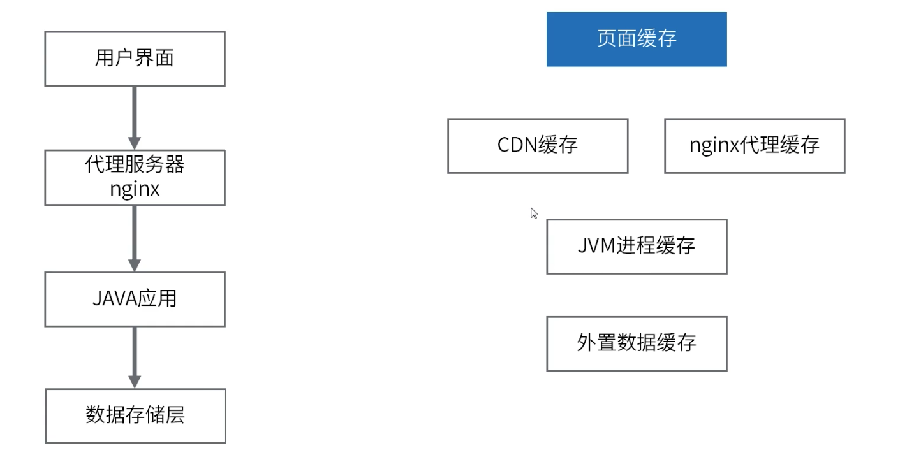
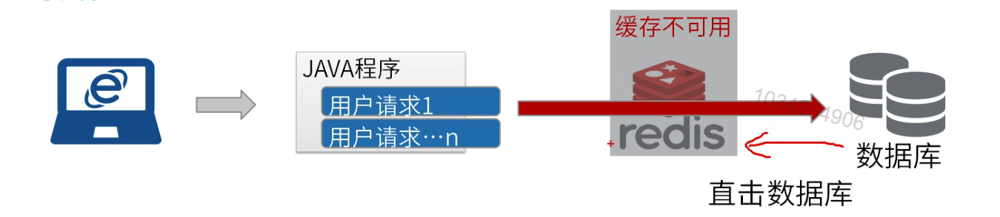

[TOC]

# 缓存架构分析

### 缓存架构



### 缓存雪崩



因为缓存服务挂掉或者热点缓存失效，从而导致所有请求都去查数据库，导致数据库连接不够用或者数据库处理不过来，从而导致整个系统不可用。

1. 缓存数据的过期时间设置随机，防止同一时间大量数据过期现象发生。
2. 缓存降级。
3. 加锁实现防止大量请求堆到数据库。
4. 设置热点数据永远不过期。

### 缓存击穿

查询必然不存在的数据，请求透过Redis，直击数据库。

1. 用户内容预生成。
2. 访问频率限制。
3. 缓存中无数据，也不要查询数据库。

### Java应用层-自定义缓存注解

元注解

Retention：定义注解的生命周期，可选值为：source，class，runtime。

Documented：文档化注解，会被Javadoc工具文档化。

Inherited：注解是自动继承，想让一个类和它的子类都包含某个注解，就可以使用它来修饰这个注解。

Target：说明了被修饰的注解的应用范围，包括：

Type：表示用来修饰类，接口，注解类型或枚举类型；

METHOD：可以用来修饰方法；

FIELD：可以用来修饰属性(包括枚举常量)；

CONSTRUCTOR：可以用来修饰构造器；

LOCAL_VARIABLE：可以用来修饰局部变量。

自定义缓存注解。

```java
/**
 * cache注解
 */
@Target(ElementType.METHOD)
@Retention(RetentionPolicy.RUNTIME)
public @interface Cache {
    /**
     * key的规则，可以使用springEL表达式，可以使用方法执行的一些参数
     */
    String key();
}
```

创建配置Bean。

```java
@Configuration
@Profile("custom")
// 开启AOP
@EnableAspectJAutoProxy
class CustomRedisAppConfig {
    @Bean
    public LettuceConnectionFactory redisConnectionFactory() {
        System.out.println("使用自定义注解版本");
        return new LettuceConnectionFactory(new RedisStandaloneConfiguration("127.0.0.1", 6379));
    }

    @Bean
    public RedisTemplate redisTemplate(RedisConnectionFactory redisConnectionFactory) {
        RedisTemplate redisTemplate = new RedisTemplate();
        redisTemplate.setConnectionFactory(redisConnectionFactory);
        // 可以配置对象的转换规则，比如使用json格式对object进行存储。
        // Object --> 序列化 --> 二进制流 --> redis-server存储
        redisTemplate.setKeySerializer(new StringRedisSerializer());
        redisTemplate.setValueSerializer(new JdkSerializationRedisSerializer());
        return redisTemplate;
    }
}
```

定义缓存切面。

```java
@Component
@Aspect
public class CacheAspect {

    @Autowired
    private RedisTemplate redisTemplate;

    @Pointcut("@annotation(com.study.cache.redis.a8_custom.annotations.Cache)")
    public void cachePointcut() {
    }

    // 定义相应的事件
    @Around("cachePointcut()")
    public Object doCache(ProceedingJoinPoint joinPoint) {
        Object value = null;
        try {
            // 0-1、 当前方法上注解的内容
            MethodSignature signature = (MethodSignature) joinPoint.getSignature();
            Method method = joinPoint.getTarget().getClass().getMethod(signature.getName(), signature.getMethod().getParameterTypes());
            Cache cacheAnnotation = method.getAnnotation(Cache.class);
            String keyEl = cacheAnnotation.key();
            // 0-2、 前提条件：拿到作为key的依据  - 解析springEL表达式
            // 创建解析器
            ExpressionParser parser = new SpelExpressionParser();
            Expression expression = parser.parseExpression(keyEl);
            EvaluationContext context = new StandardEvaluationContext(); // 参数
            // 添加参数
            Object[] args = joinPoint.getArgs();
            DefaultParameterNameDiscoverer discover = new DefaultParameterNameDiscoverer();
            String[] parameterNames = discover.getParameterNames(method);
            for (int i = 0; i < parameterNames.length; i++) {
                context.setVariable(parameterNames[i], args[i].toString());
            }
            // 解析
            String key = expression.getValue(context).toString();

            // 1、 判定缓存中是否存在
            value = redisTemplate.opsForValue().get(key);
            if (value != null) {
                System.out.println("从缓存中读取到值：" + value);
                return value;
            }

            // 2、不存在则执行方法
            value = joinPoint.proceed();

            // 3、 同步存储value到缓存。
            redisTemplate.opsForValue().set(key, value);

        } catch (Throwable throwable) {
            throwable.printStackTrace();
        }
        return value;
    }
}
```

定义Service。

```java
@Service
@Profile("custom")
public class CustomExampleService {
    // 直接注入StringRedisTemplate，则代表每一个操作参数都是字符串
    @Autowired
    private StringRedisTemplate stringRedisTemplate;

    @Cache(key = "#userId")
    public User findUserById(String userId) throws Exception {
        User user = null;
        user = new User(userId, "张三");
        System.out.println("从数据库中读取到值：" + user);
        return user;
    }
}
```

单元测试。

```java
@RunWith(SpringJUnit4ClassRunner.class)
@ContextConfiguration("classpath:applicationContext.xml")
@ActiveProfiles("custom") // 设置profile
public class CustomCacheTests {

    @Autowired
    CustomExampleService customExampleService;

    // get
    @Test
    public void springCacheTest() throws Exception {
        User user = customExampleService.findUserById("tony");
        System.out.println(user);
    }
}
```

这种基于AOP缓存注解的方法减少了重复的缓存管理操作，简化了缓存代码的编写，将缓存的处理写在一处，便于维护。