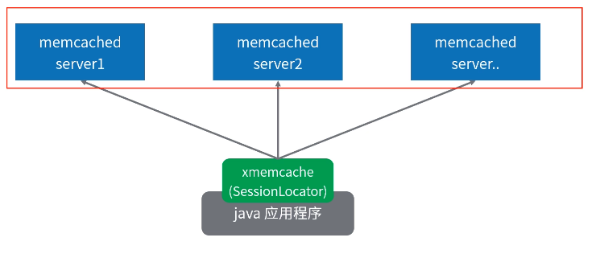
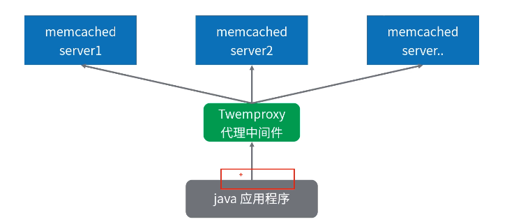

[TOC]

# Memcached集群方案

### 客户端支持

1. Java客户端根据key，通过hash取模或者其他一致性算法，最终选择一个server进行连接。

   

2. 启动三个memcached实例。

   ```java
   /usr/local/memcached/bin/memcached -m 64 -p 11211 -u root -vv
   /usr/local/memcached/bin/memcached -m 64 -p 11212 -u root -vv
   /usr/local/memcached/bin/memcached -m 64 -p 11213 -u root -vv
   ```

   * 自己实现

     ```java
     public class ClusterClientFactory {
     
         /**
          * 根据key选择客户端
          */
         public static MemcachedClient getClient(String key) throws IOException {
             ArrayList<XMemcachedClient> servers = new ArrayList<>();
             servers.add(new XMemcachedClient("192.168.1.120", 11211));
             servers.add(new XMemcachedClient("192.168.1.120", 11212));
             servers.add(new XMemcachedClient("192.168.1.120", 11213));
     
             // 计算key的hash值
             int hashCode = Math.abs(key.hashCode());
             // 计算对应的位置(直接和服务器数量取模)
             int slot = hashCode % servers.size();
     
             return servers.get(slot);
         }
     }
     
     /** 使用自己写的的客户端集群方案 */
     @Service
     @Profile("cluster")
     public class UserServiceByCustom {
     
         /**
          * 带缓存
          */
         public User findUser(String userId) throws Exception {
             // 每次根据情况进行选择
             MemcachedClient memcachedClient = ClusterClientFactory.getClient(userId);
             User user = null;
             // 1、 判定缓存中是否存在
             user = memcachedClient.get(userId);
             if (user != null) {
                 System.out.println("从缓存中读取到值：" + user);
                 return user;
             }
     
             // TODO 2、不存在则读取数据库或者其他地方的值
             user = new User(userId, "张三");
             System.out.println("从数据库中读取到值：" + user);
             // 3、 同步存储value到memcached，缓存超时为1小时，3600秒。
             memcachedClient.set(userId, 3600, user);
             return user;
         }
     }
     
     @RunWith(SpringJUnit4ClassRunner.class)
     @ContextConfiguration("classpath:applicationContext.xml")
     @ActiveProfiles("cluster") // 设置profile
     public class ClientClusterTests {
     
         @Autowired
         UserServiceByCustom userServiceByCustom;
     
         @Test
         public void customClientClusterTest() throws Exception {
             userServiceByCustom.findUser("tony");
             userServiceByCustom.findUser("mengmeng");
             userServiceByCustom.findUser("jack");
             userServiceByCustom.findUser("tony2");
             userServiceByCustom.findUser("mengmeng2");
             userServiceByCustom.findUser("jack2");
         }
     }
     
     [root@spark ~]# telnet 127.0.0.1 11211
     Trying 127.0.0.1...
     Connected to 127.0.0.1.
     Escape character is '^]'.
     get tony
     END
     get mengmeng
     VALUE mengmeng 1 118
     ¬첲com.study.cache.redis.pojo.User΀|Q嘗LuserIdtLjava/lang/String;userNameq~xpt张三mengmeng
     END
     get jack       
     END
     get mengment2
     END
     get tony2
     END
     get jack2
     VALUE jack2 1 115
     ¬첲com.study.cache.redis.pojo.User΀|Q嘗LuserIdtLjava/lang/String;userNameq~xpt张三tjack2
     END
     
     [root@spark ~]# telent 127.0.0.1 11212
     -bash: telent: command not found
     [root@spark ~]# telnet 127.0.0.1 11212
     Trying 127.0.0.1...
     Connected to 127.0.0.1.
     Escape character is '^]'.
     get tony
     END
     get tony2
     VALUE tony2 1 115
     ¬첲com.study.cache.redis.pojo.User΀|Q嘗LuserIdtLjava/lang/String;userNameq~xpt张三ttony2
     END
     get jack         
     VALUE jack 1 114
     ¬첲com.study.cache.redis.pojo.User΀|Q嘗LuserIdtLjava/lang/String;userNameq~xpt张三tjack
     END
     
     [root@spark ~]# telnet 127.0.0.1 11213
     Trying 127.0.0.1...
     Connected to 127.0.0.1.
     Escape character is '^]'.
     get tony
     VALUE tony 1 114
     ¬첲com.study.cache.redis.pojo.User΀|Q嘗LuserIdtLjava/lang/String;userNameq~xpt张三ttony
     END
     get mengmeng2  
     END
     ```

   * 第三方客户端

     ```java
     @Configuration
     @Profile("cluster")
     public class ClusterAppConfig {
         @Bean
         public MemcachedClient memcachedClient() throws IOException {
             String servers = "192.168.1.120:11211 192.168.1.120:11212 192.168.1.120:11213";
             MemcachedClientBuilder builder = new XMemcachedClientBuilder(AddrUtil
                     .getAddresses(servers));
             // 默认的客户端计算就是 key的哈希值模以连接数
             // KetamaMemcachedSessionLocator 一致性hash算法
             builder.setSessionLocator(new KetamaMemcachedSessionLocator());
             MemcachedClient client = builder.build();
             return client;
         }
     }
     
     @Service
     @Profile("cluster")
     public class UserService {
     
         @Autowired
         MemcachedClient memcachedClient;
     
         /**
          * 带缓存
          */
         public User findUser(String userId) throws Exception {
             // 每次根据情况进行选择
             User user = null;
             // 1、 判定缓存中是否存在
             user = memcachedClient.get(userId);
             if (user != null) {
                 System.out.println("从缓存中读取到值：" + user);
                 return user;
             }
     
             // TODO 2、不存在则读取数据库或者其他地方的值
             user = new User(userId, "张三");
             System.out.println("从数据库中读取到值：" + user);
             // 3、 同步存储value到memcached，缓存超时为1小时，3600秒。
             memcachedClient.set(userId, 3600, user);
             return user;
         }
     }
     
     @RunWith(SpringJUnit4ClassRunner.class)
     @ContextConfiguration("classpath:applicationContext.xml")
     @ActiveProfiles("cluster") // 设置profile
     public class ClientClusterTests {
     
         @Autowired
         UserService userService;
     
         @Test
         public void xmemcachedclientClusterTest() throws Exception {
             // 每次都向上面这么写一段获取client的代码，太麻烦，memcacheclient已经内置了这样的功能
             // 在调用set和其他方法时，自动帮我们进行选择
             userService.findUser("tony33");
             userService.findUser("mengmeng33");
             userService.findUser("jack33");
             userService.findUser("tony44");
             userService.findUser("mengmeng44");
             userService.findUser("jack44");
     
         }
     }
     ```

### Twemproxy方案

1. 推特开源的中间件，实现memcached代理。对于Java应用程序就像使用一个普通的memcached一样。

   

2. twemproxy(nutcracker)是推特开源的轻量级memcached/redis服务器，本质就是一个集群管理工具，主要用来弥补Redis和Memcached对集群管理的不足，其完成的最大功劳就是通过在后端减少通缓存服务器的连接数从而增加吞吐量。

3. 环境准备

   ```java
   192.168.1.120:11211 node1
   192.168.1.120:11212 node2
   192.168.1.120:11213 node3
   192.168.1.120:22121 proxy
   ```

4. 安装依赖

   ```java
   yum install -y autoconf
   yum install -y automake
   yum install -y libtool
   ```

5. 安装twemproxy代理

   ```java
   wget --no-check-certificate https://github.com/twitter/twemproxy/archive/master.zip
   unzip master.zip
   cd twemproxy‐master
   # 可能报错[root@spark twemproxy-master]# autoreconf -fvi
   autoreconf: Entering directory `.'
   autoreconf: configure.ac: not using Gettext
   autoreconf: running: aclocal --force -I m4
   configure.ac:8: error: Autoconf version 2.64 or higher is required
   configure.ac:8: the top level
   autom4te: /usr/bin/m4 failed with exit status: 63
   aclocal: autom4te failed with exit status: 63
   autoreconf: aclocal failed with exit status: 63
   解决方法参考：https://blog.csdn.net/prettyshuang/article/details/51395095
       
   autoreconf ‐fvi
   ./configure ‐‐prefix=/usr/local/twemproxy
   make
   make install
   ```

6. 准备twemproxy配置文件

   ```java
   mkdir /usr/local/twemproxy/conf/
   vim /usr/local/twemproxy/conf/nutcracker.yml
   
   memcached:
     listen: 127.0.0.1:22121
     hash: fnv1a_64
     distribution: ketama
     timeout: 400
     backlog: 1024
     preconnect: true
     auto_eject_hosts: true
     server_retry_timeout: 30000
     server_failure_limit: 3
     servers:
      - 127.0.0.1:11211:1
      - 127.0.0.1:11212:1
      - 127.0.0.1:11213:1
       
   # 检查语法
   /usr/local/twemproxy/sbin/nutcracker -t
   ```

7. 启动

   ```java
   /usr/local/twemproxy/sbin/nutcracker
   # 后台启动
   /usr/local/twemproxy/sbin/nutcracker -d
   ```

8. Java代码测试

   ```java
   @RunWith(SpringJUnit4ClassRunner.class)
   @ContextConfiguration("classpath:applicationContext.xml")
   @ActiveProfiles("cluster") // 设置profile
   public class ClientClusterTests {
   
       // 使用推特中间件代码memcached
       @Test
       public void twemproxyClusterTest() throws IOException, InterruptedException, MemcachedException, TimeoutException {
           // 和代理直接连接即可，客户端无感知
           XMemcachedClient xMemcachedClient = new XMemcachedClient("192.168.1.120", 22121);
           xMemcachedClient.set("uid10001", 0, "{uname:tony,age:18}");
           xMemcachedClient.set("uid10003", 0, "{uname:jack,age:17}");
           xMemcachedClient.set("uid10002", 0, "{uname:mengmeng,age:19}");
       }
   }
   执行后，查看memcached结果，可以看出通过代理屏蔽了后端多个实例的存在
   [root@spark ~]# telnet 127.0.0.1 22121
   Trying 127.0.0.1...
   telnet: connect to address 127.0.0.1: Connection refused
   [root@spark ~]# telnet 192.168.1.120 22121
   Trying 192.168.1.120...
   Connected to 192.168.1.120.
   Escape character is '^]'.
   get uid10001
   VALUE uid10001 0 19
   {uname:tony,age:18}
   END
   get uid10003   
   VALUE uid10003 0 19
   {uname:jack,age:17}
   END
   get uid10002
   VALUE uid10002 0 23
   {uname:mengmeng,age:19}
   END
   
   [root@spark ~]# telnet 192.168.1.120 11212
   Trying 192.168.1.120...
   Connected to 192.168.1.120.
   Escape character is '^]'.
   get uid10001
   VALUE uid10001 0 19
   {uname:tony,age:18}
   END
   get uid10002
   VALUE uid10002 0 23
   {uname:mengmeng,age:19}
   END
   get uid10003
   VALUE uid10003 0 19
   {uname:jack,age:17}
   END
   ```

   

9. 可选的Hash算法

   ```java
   可以选择的key值的hash算法： one_at_a_time、md5、crc16、crc32 、crc32a
   、fnv1_64、fnv1a_64、fnv1_32、fnv1a_32、hsieh、murmur、jenkins ，如果没
   选择，默认是fnv1a_64。
   ```