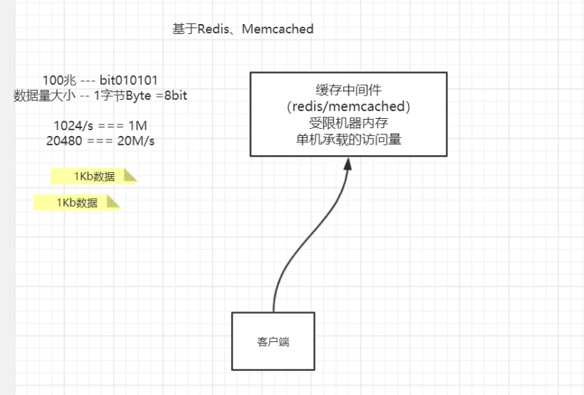
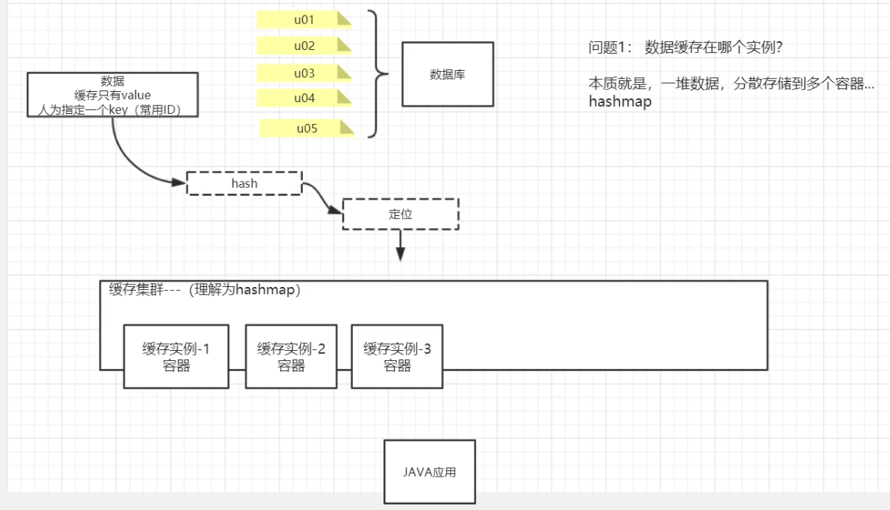
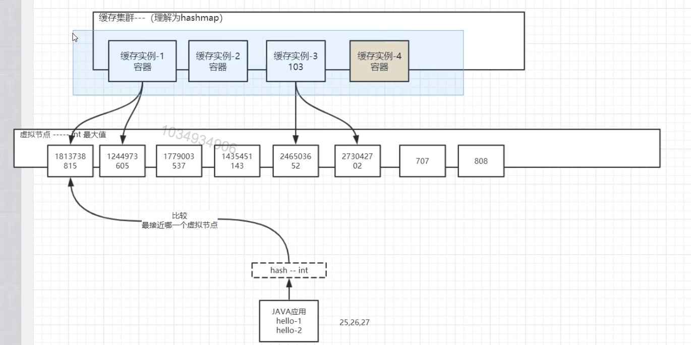
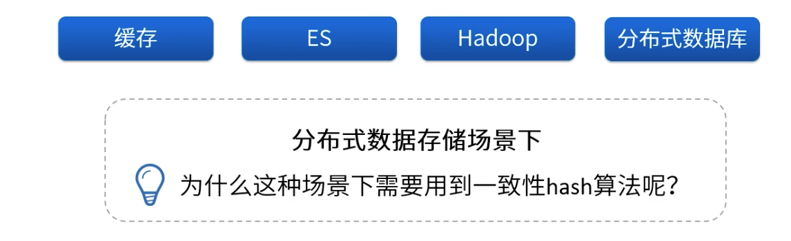
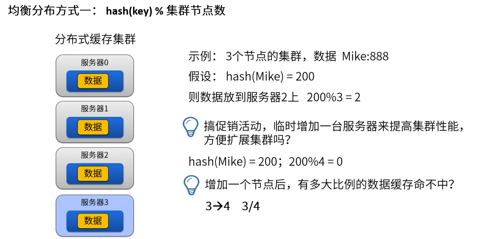
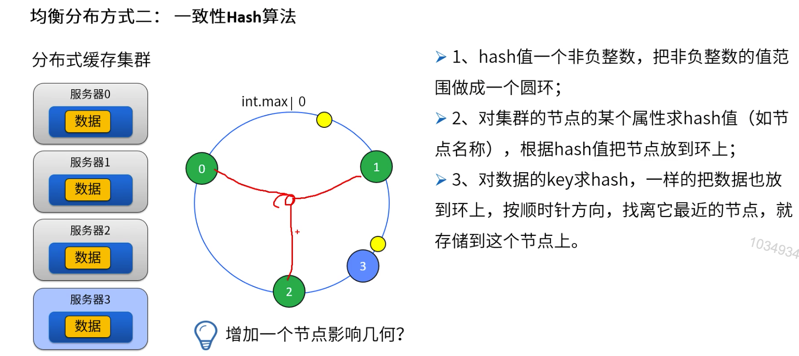
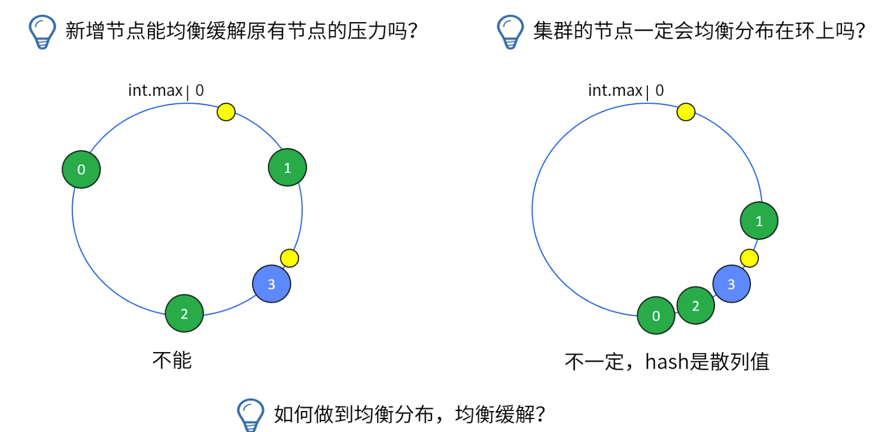
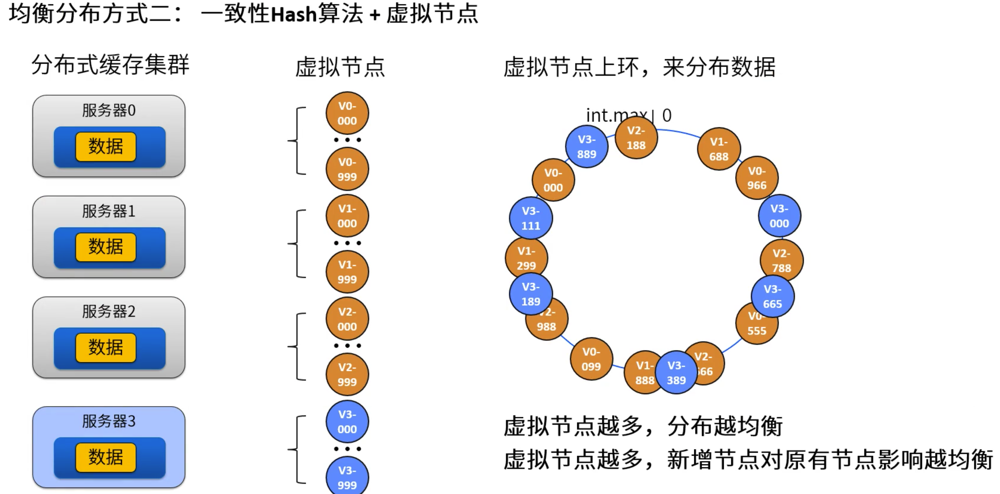

[TOC]

# 分布式一致性Hash算法

### 分布式架构的产生

单台机器受内存，网络等资源的限制，在高并发场景下会出现瓶颈，自然而然的就想到通过添加机器来突破瓶颈。



但是集群架构又会产生另外的一些问题。比如客户端该将数据存到那台机器，取的时候又怎么知道该从哪台机器上取得上次存储的数据。



### 最简单的解决方式

解决这个问题有种最简单的方法就是在存储数据时为每个数据的key的hash值和机器个数取模，取数据时做同样的操作。

```java
public class MemcachedClient {

    static List<String> memcachedServerList = new ArrayList<>();

    static {
        memcachedServerList.add("192.168.1.120");
        memcachedServerList.add("192.168.1.122");
        memcachedServerList.add("192.168.1.125");
    }

    public void set(String key, String value) {
        String server = null;
        int hash = Math.abs(key.hashCode());
        int index = hash % memcachedServerList.size();
        server = memcachedServerList.get(index);

        System.out.println("set-选择一个服务器: " + server + "设置值: " + value);
    }

    public void get(String key) {
        String server = null;
        int hash = Math.abs(key.hashCode());
        int index = hash % memcachedServerList.size();
        server = memcachedServerList.get(index);
        System.out.println("get-选择一个服务器: " + server + "获取值");
    }

    public static void main(String[] args) {
        MemcachedClient memcachedClient = new MemcachedClient();

        for (int i = 0; i < 10; i++) {
            memcachedClient.set("hello" + i, "test");
        }

        //memcachedServerList.add("192.168.1.127");
        System.out.println("########################");

        for (int i = 0; i < 10; i++) {
            memcachedClient.get("hello" + i);
        }
    }
}

set-选择一个服务器: 192.168.1.120设置值: test
set-选择一个服务器: 192.168.1.125设置值: test
set-选择一个服务器: 192.168.1.122设置值: test
set-选择一个服务器: 192.168.1.120设置值: test
set-选择一个服务器: 192.168.1.125设置值: test
set-选择一个服务器: 192.168.1.122设置值: test
set-选择一个服务器: 192.168.1.120设置值: test
set-选择一个服务器: 192.168.1.125设置值: test
set-选择一个服务器: 192.168.1.122设置值: test
set-选择一个服务器: 192.168.1.120设置值: test
########################
get-选择一个服务器: 192.168.1.120获取值
get-选择一个服务器: 192.168.1.125获取值
get-选择一个服务器: 192.168.1.122获取值
get-选择一个服务器: 192.168.1.120获取值
get-选择一个服务器: 192.168.1.125获取值
get-选择一个服务器: 192.168.1.122获取值
get-选择一个服务器: 192.168.1.120获取值
get-选择一个服务器: 192.168.1.125获取值
get-选择一个服务器: 192.168.1.122获取值
get-选择一个服务器: 192.168.1.120获取值
```

这样看貌似解决问题了，但是如果我们需要扩大集群，增加机器的数量，上面的方法就会出现问题了。放开上面代码被注释的行数，再次运行。

```java
set-选择一个服务器: 192.168.1.120设置值: test
set-选择一个服务器: 192.168.1.125设置值: test
set-选择一个服务器: 192.168.1.122设置值: test
set-选择一个服务器: 192.168.1.120设置值: test
set-选择一个服务器: 192.168.1.125设置值: test
set-选择一个服务器: 192.168.1.122设置值: test
set-选择一个服务器: 192.168.1.120设置值: test
set-选择一个服务器: 192.168.1.125设置值: test
set-选择一个服务器: 192.168.1.122设置值: test
set-选择一个服务器: 192.168.1.120设置值: test
########################
get-选择一个服务器: 192.168.1.125获取值
get-选择一个服务器: 192.168.1.122获取值
get-选择一个服务器: 192.168.1.120获取值
get-选择一个服务器: 192.168.1.127获取值
get-选择一个服务器: 192.168.1.125获取值
get-选择一个服务器: 192.168.1.122获取值
get-选择一个服务器: 192.168.1.120获取值
get-选择一个服务器: 192.168.1.127获取值
get-选择一个服务器: 192.168.1.125获取值
get-选择一个服务器: 192.168.1.122获取值
```

### 引入虚拟节点

我们发现获取数据时都不是在上次存储过的机器上去获取了，这回导致许多的缓存不命中，降低程序的性能。

为了解决这个问题，缓存一致性hash引入的虚拟节点的概念。



```java
public class MemcachedClient2 {

    static List<String> memcachedServerList = new ArrayList<>();

    static SortedMap<Integer, String> vServerMap = new TreeMap<>();

    static Map<String, List<Integer>> virtualServerMap = new HashMap<>();

    static {
        addServer("192.168.1.120");
        addServer("192.168.1.122");
        addServer("192.168.1.125");
    }

    public static void addServer(String hostInfo) {
        memcachedServerList.add(hostInfo);
        List<Integer> vNodes = new ArrayList<>();
        for (int i = 0; i < 2; i++) {
            String key = hostInfo + "&" + new Random().nextInt();
            int vHash = hash(key);
            vNodes.add(vHash);
            System.out.println("vhash: " + vHash);
            vServerMap.put(vHash, hostInfo);
        }

        virtualServerMap.put(hostInfo, vNodes);
    }

    public static int hash(String key) {
        return Math.abs(key.hashCode());
    }

    public void set(String key, String value) {
        String server = null;
        int hash = hash(key);
        SortedMap<Integer, String> subMap = vServerMap.tailMap(hash);
        if (subMap.isEmpty()) {
            server = vServerMap.get(vServerMap.firstKey());
        } else {
            Integer vHash = subMap.firstKey();
            server = subMap.get(vHash);
        }

        System.out.println("set-选择一个服务器: " + server + "设置值: " + value);
    }

    public void get(String key) {
        String server = null;
        int hash = hash(key);
        System.out.println("hash: " + hash);
        SortedMap<Integer, String> subMap = vServerMap.tailMap(hash);
        if (subMap.isEmpty()) {
            server = vServerMap.get(vServerMap.firstKey());
        } else {
            Integer vHash = subMap.firstKey();
            server = subMap.get(vHash);
        }

        System.out.println("get-选择一个服务器: " + server + "获取值");
    }

    public static void main(String[] args) {
        MemcachedClient2 memcachedClient = new MemcachedClient2();

        for (int i = 0; i < 10; i++) {
            memcachedClient.set("hello" + i, "test");
        }

        memcachedServerList.add("192.168.1.127");
        System.out.println("########################");

        for (int i = 0; i < 10; i++) {
            memcachedClient.get("hello" + i);
        }
    }
}

vhash: 922624618
vhash: 954392912
vhash: 61065518
vhash: 936877355
vhash: 1835977743
vhash: 1343592395
set-选择一个服务器: 192.168.1.125设置值: test
set-选择一个服务器: 192.168.1.125设置值: test
set-选择一个服务器: 192.168.1.125设置值: test
set-选择一个服务器: 192.168.1.125设置值: test
set-选择一个服务器: 192.168.1.125设置值: test
set-选择一个服务器: 192.168.1.125设置值: test
set-选择一个服务器: 192.168.1.125设置值: test
set-选择一个服务器: 192.168.1.125设置值: test
set-选择一个服务器: 192.168.1.125设置值: test
set-选择一个服务器: 192.168.1.125设置值: test
########################
hash: 1220935266
get-选择一个服务器: 192.168.1.125获取值
hash: 1220935265
get-选择一个服务器: 192.168.1.125获取值
hash: 1220935264
get-选择一个服务器: 192.168.1.125获取值
hash: 1220935263
get-选择一个服务器: 192.168.1.125获取值
hash: 1220935262
get-选择一个服务器: 192.168.1.125获取值
hash: 1220935261
get-选择一个服务器: 192.168.1.125获取值
hash: 1220935260
get-选择一个服务器: 192.168.1.125获取值
hash: 1220935259
get-选择一个服务器: 192.168.1.125获取值
hash: 1220935258
get-选择一个服务器: 192.168.1.125获取值
hash: 1220935257
get-选择一个服务器: 192.168.1.125获取值
```

用一般的hash算法导致hash值不够分散，并且虚拟机节点的个数不够多会导致数据倾斜。

换一种更分散的散列算法，增加虚拟节点的个数可以有效减少数据倾斜。下面是当每个真实节点对应200个虚拟节点，并选择MurmurHash的数据。

```java
set-选择一个服务器: 192.168.1.120设置值: test
set-选择一个服务器: 192.168.1.125设置值: test
set-选择一个服务器: 192.168.1.125设置值: test
set-选择一个服务器: 192.168.1.120设置值: test
set-选择一个服务器: 192.168.1.125设置值: test
set-选择一个服务器: 192.168.1.125设置值: test
set-选择一个服务器: 192.168.1.125设置值: test
set-选择一个服务器: 192.168.1.125设置值: test
set-选择一个服务器: 192.168.1.122设置值: test
set-选择一个服务器: 192.168.1.120设置值: test
########################
hash: 511062609
get-选择一个服务器: 192.168.1.120获取值
hash: 1264771874
get-选择一个服务器: 192.168.1.125获取值
hash: 418527632
get-选择一个服务器: 192.168.1.125获取值
hash: 1925576137
get-选择一个服务器: 192.168.1.120获取值
hash: 1000103308
get-选择一个服务器: 192.168.1.125获取值
hash: 1332015780
get-选择一个服务器: 192.168.1.125获取值
hash: 1505275775
get-选择一个服务器: 192.168.1.125获取值
hash: 1806473939
get-选择一个服务器: 192.168.1.125获取值
hash: 347346934
get-选择一个服务器: 192.168.1.122获取值
hash: 803007612
get-选择一个服务器: 192.168.1.120获取值
```

### 一致性hash算法应用领域



### 均衡分布方式一：hash(key) % 集群节点数



### 均衡分布方式二：一致性Hash算法





### 均衡分布方式三：一致性Hash算法+虚拟节点




