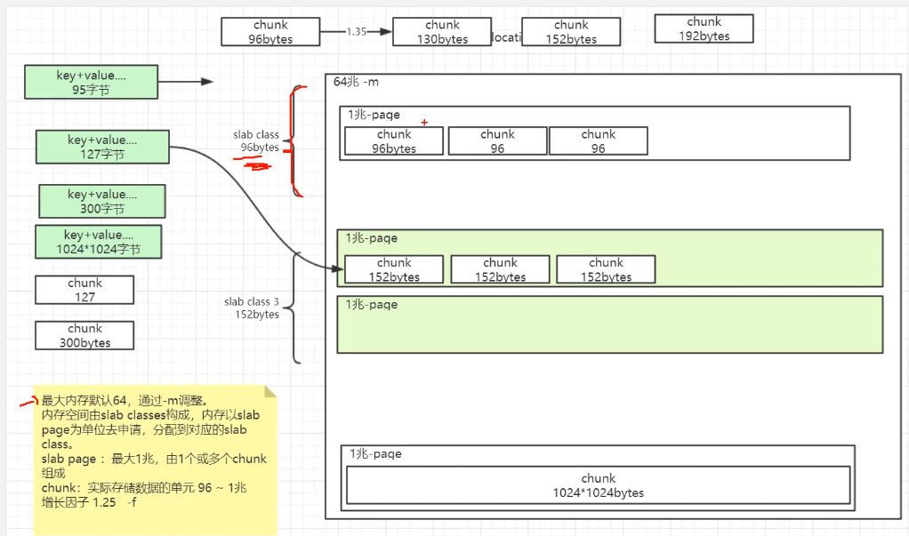
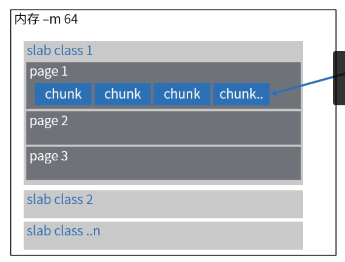
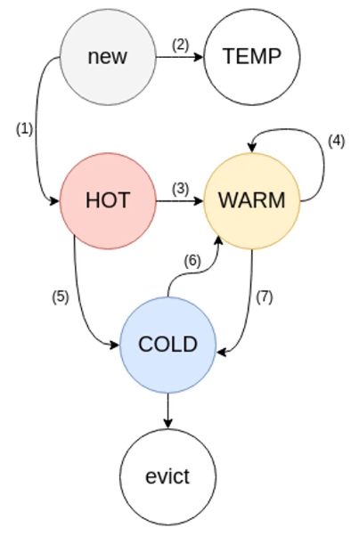
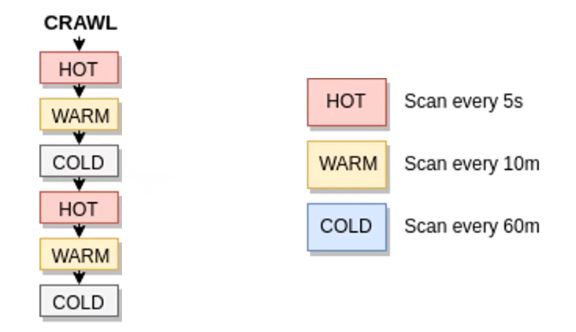

[TOC]

# Memcached内存管理

### Memcached内存分配

1. 启动Memcached时，-m指定内存大小，将信息保存到缓存中后才开始分配和保留物理内存。通过Slab allocation机制堆内存进行管理。

2. 最大内存默认64，通过-m调整。内存空间由slab classes构成，内存以slab page为单位去申请，分配到对应的slab class。

   * slab page：最大1兆，由1个或多个chunk组成。
   * chunk：实际存储数据的单元。

   

   

### Memcached缓存策略-LRU

1. 在1.4x及更早的版本中，memecached中的LRU是标准的双向链表：有头部和尾部。将新数据插入头部，从尾部弹出驱逐物。如果访问某个项目，则将其从其位置取消链接，然后重新链接到头部(此处称为“碰撞”)，返回到LRU的顶部。
2. 下面这些情况，带有超时时间的记录会被删除。
   * 被人为删除。
   * 被set覆盖。
   * 被动删除：过期后，被get，add等命令访问。
   * 主动清除：LRU机制。
3. 此方法碰撞几率太高，对同一个链表的修改导致大量的互斥锁争抢，导致CPU使用率过高或者响应变慢。

### Memcached缓存策略-分段LRU

1. 每个Slab-class安排一个LRU，每个LRU拆分为4个子LRU类型。每个存储的数据都有两个标志位：FETCHED，ACTIVE。FETCHED，该数据曾经被请求过。ACTIVE，该数据有两次或以上被请求，当数据被移动时移除。

2. 四种子LRU。

   * TEMP：该队列中的item的TTL通常只有几秒，不会被挪动。具体时间可配置stats settings temporary_ttl选项。
   * HOT：使用队列，数据不会长久存在该链表，一旦数据到达队列的尾部，则开始移动。如果数据处于活动状态，它将被移动到WARM，非活动状态，它将被移动到COLD。
   * WARM：访问量不大的数据。如果数据处于活动状态，它将被移动到warm头部，非活动状态，它将被移动到COLD。
   * COLD：最不活跃的数据，回收时如果处于active状态，则移动到warm，否则删除。

   碰撞率变小了，提高了性能。

   

### Memcached缓存策略-LRU Crawler

1. LRU爬虫是一个单独的后台线程，专门用来处理时效的数据，检查每个slab class中每个子LRU链表。

