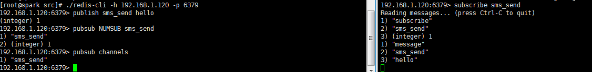
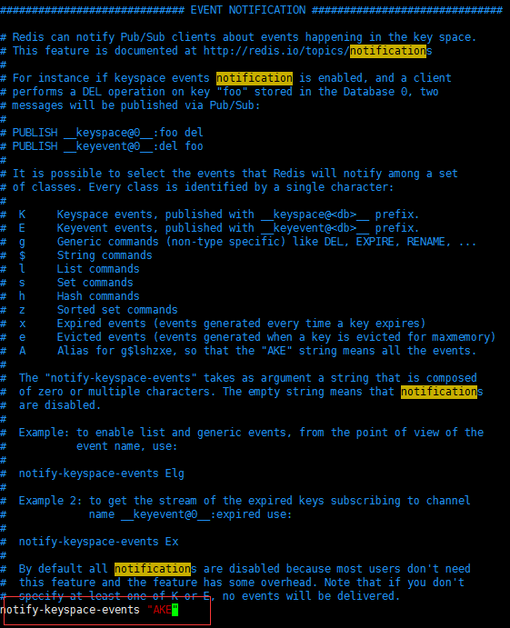
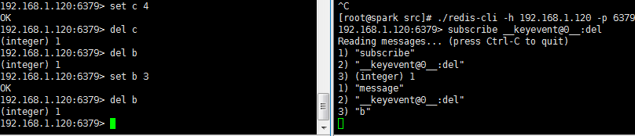
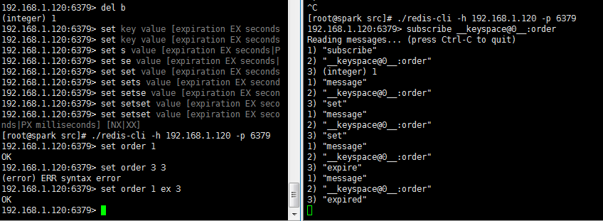
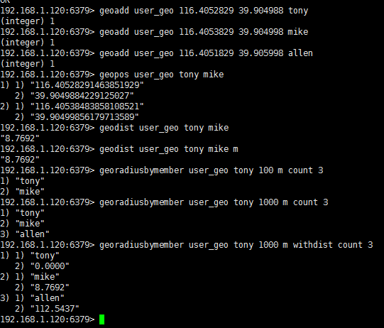
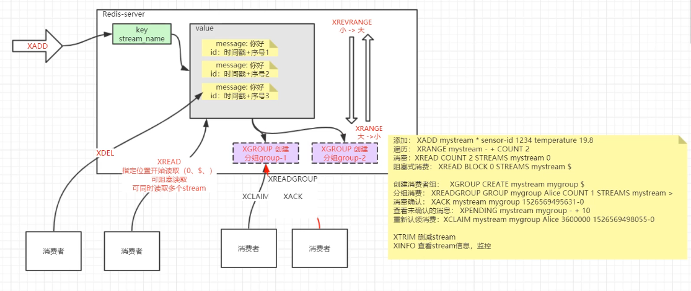

[TOC]

# Redis常用数据结构使用示例

### Redis缓存

1. 使用Java配置bean。

   ```java
   @Configuration
   @Profile("single")
   // 开启spring cache注解功能
   @EnableCaching
   class SingleRedisAppConfig {
       @Bean
       public LettuceConnectionFactory redisConnectionFactory() {
           System.out.println("使用单机版本");
           return new LettuceConnectionFactory(new RedisStandaloneConfiguration("192.168.1.120", 6379));
       }
   
       @Bean
       public RedisTemplate redisTemplate(RedisConnectionFactory redisConnectionFactory) {
           RedisTemplate redisTemplate = new RedisTemplate();
           redisTemplate.setConnectionFactory(redisConnectionFactory);
           // 可以配置对象的转换规则，比如使用json格式对object进行存储。
           // Object --> 序列化 --> 二进制流 --> redis-server存储
           redisTemplate.setKeySerializer(new StringRedisSerializer());
           redisTemplate.setValueSerializer(new JdkSerializationRedisSerializer());
           return redisTemplate;
       }
   
       // 配置Spring Cache注解功能
       @Bean
       public CacheManager cacheManager(RedisConnectionFactory redisConnectionFactory) {
           RedisCacheWriter redisCacheWriter = RedisCacheWriter.nonLockingRedisCacheWriter(redisConnectionFactory);
           RedisCacheConfiguration redisCacheConfiguration = RedisCacheConfiguration.defaultCacheConfig();
           RedisCacheManager cacheManager = new RedisCacheManager(redisCacheWriter, redisCacheConfiguration);
           return cacheManager;
       }
   }
   ```

   2.配置常规使用cache的service。

   ```java
   @Service
   @Profile("single")
   public class SingleExampleService {
       // 直接注入StringRedisTemplate，则代表每一个操作参数都是字符串
       @Autowired
       private StringRedisTemplate stringRedisTemplate;
   
       // 参数可以是任何对象，默认由JDK序列化
       @Autowired
       private RedisTemplate redisTemplate;
   
       /**
        * 简单的缓存插入功能
        */
       public void setByCache(String userId, String userInfo) {
           stringRedisTemplate.opsForValue().set(userId, userInfo);
       }
   
       /**
        * 对象缓存功能
        */
       public User findUser(String userId) throws Exception {
           User user = null;
           // 1、 判定缓存中是否存在
           user = (User) redisTemplate.opsForValue().get(userId);
           if (user != null) {
               System.out.println("从缓存中读取到值：" + user);
               return user;
           }
   
           // TODO 2、不存在则读取数据库或者其他地方的值
           user = new User(userId, "张三");
           System.out.println("从数据库中读取到值：" + user);
           // 3、 同步存储value到缓存。
           redisTemplate.opsForValue().set(userId, user);
           return user;
       }
   
   }
   ```

   3.使用CacheManager完成无侵入式的cahce功能。

   ```java
   @Service
   @Profile("single")
   public class SpringCacheService {
   
       /**
        * springcache注解版本（官方大部分资料开始往springboot方向引导，实际上不用springboot，也是差不多的方式）
        */
       // value~单独的缓存前缀
       // key缓存key 可以用springEL表达式
       @Cacheable(cacheManager = "cacheManager", value = "cache-1", key = "#userId")
       public User findUserById(String userId) throws Exception {
           // 读取数据库
           User user = new User(userId, "张三");
           System.out.println("从数据库中读取到数据：" + user);
           return user;
       }
   
       @CacheEvict(cacheManager = "cacheManager", value = "cache-1", key = "#userId")
       public void deleteUserById(String userId) throws Exception {
           System.out.println("用户从数据库删除成功，请检查缓存是否清除~~" + userId);
       }
   
       // 如果数据库更新成功，更新redis缓存
       @CachePut(cacheManager = "cacheManager", value = "cache-1", key = "#user.userId", condition = "#result ne null")
       public User updateUser(User user) throws Exception {
           // 读取数据库
           System.out.println("数据库进行了更新，检查缓存是否一致");
           return user; // 返回最新内容，代表更新成功
       }
   }
   ```

   4.测试常用cache功能。

   ```java
   @RunWith(SpringJUnit4ClassRunner.class)
   @ContextConfiguration("classpath:applicationContext.xml")
   @ActiveProfiles("single") // 设置profile
   public class SingleTests {
       @Autowired
       SingleExampleService exampleService;
   
       @Test
       public void getTest() throws Exception {
           User user = exampleService.findUser("tony");
           System.out.println(user);
       }
   }
   第一次运行因为缓存中没有值所以从数据库中读取：
   从数据库中读取到值：张三 --- tony
   张三 --- tony
   
   第二次缓存中已经存在所以从缓存中读取：
   从缓存中读取到值：张三 --- tony
   张三 --- tony
   ```

   5.测试cachemanager。

   ```java
   @RunWith(SpringJUnit4ClassRunner.class)
   @ContextConfiguration("classpath:applicationContext.xml")
   @ActiveProfiles("single") // 设置profile
   public class SpringCacheTests {
   
       @Autowired
       SpringCacheService springCacheService;
   
       // ---------------spring cache注解演示
       // get
       @Test
       public void springCacheTest() throws Exception {
           User user = springCacheService.findUserById("tony");
           System.out.println(user);
       }
   
       // update
       @Test
       public void springCacheTest2() throws Exception {
           springCacheService.updateUser(new User("hhhhhhh-2", "tony"));
           User user = springCacheService.findUserById("tony");
           System.out.println(user);
       }
   
       // delete
       @Test
       public void springCacheTest3() throws Exception {
           springCacheService.deleteUserById("tony");
       }
   }
   运行springCacheTest方法：
   从数据库中读取到数据：张三 --- tony
   张三 --- tony
   
   运行springCacheTest2方法，可以发现CacheManager帮我们完成了缓存更新操作：
   tony --- hhhhhhh-2
       
   当前redis中存在的key：
   1) "tony"
   2) "cache-1::tony"
   运行springCacheTest3方法：
   用户从数据库删除成功，请检查缓存是否清除~~tony
   再次查看redis中的key：
   1) "tony"
   ```

   由上面的例子，我们可以总结出，使用CacheManager可以帮助我们非侵入式的进行缓存管理，使得我们可以关注业务实现，真正的缓存管理交给代理来完成。

2. jedis客户端的使用。

   ```java
   @RunWith(SpringJUnit4ClassRunner.class)
   @ContextConfiguration("classpath:applicationContext.xml")
   @ActiveProfiles("single") // 设置profile
   public class JedisTests {
   
       // ------------------------ jedis 工具直连演示
       // jedis和redis命令名称匹配度最高，最为简洁，学习难度最低
   
       // 列表~ 集合数据存储~ java.util.List，java.util.Stack
       // 生产者消费者（简单MQ）
       @Test
       public void list() {
           Jedis jedis = new Jedis("192.168.1.120", 6379);
           // 插入数据1 --- 2 --- 3
           jedis.rpush("queue_1", "1");
           jedis.rpush("queue_1", "2", "3");
   
           List<String> strings = jedis.lrange("queue_1", 0, -1);
           for (String string : strings) {
               System.out.println(string);
           }
   
           // 消费者线程简例
           while (true) {
               String item = jedis.lpop("queue_1");
               if (item == null) break;
               System.out.println(item);
           }
   
           jedis.close();
       }
   
       // 类似：在redis里面存储一个hashmap
       // 推荐的方式，无特殊需求是，一般的缓存都用这个
       @Test
       public void hashTest() {
           HashMap<String, Object> user = new HashMap<>();
           user.put("name", "tony");
           user.put("age", 18);
           user.put("userId", 10001);
           System.out.println(user);
   
           Jedis jedis = new Jedis("192.168.1.120", 6379);
           jedis.hset("user_10001", "name", "tony");
           jedis.hset("user_10001", "age", "18");
           jedis.hset("user_10001", "userId", "10001");
           System.out.println("redis版本~~~~~");
           // jedis.hget("user_10001", "name");
           System.out.println(jedis.hgetAll("user_10001"));
           jedis.close();
       }
   
       // 用set实现（交集 并集）
       // 交集示例： 共同关注的好友
       // 并集示例：
       @Test
       public void setTest() {
           // 取出两个人共同关注的好友
           Jedis jedis = new Jedis("192.168.1.120", 6379);
           // 每个人维护一个set
           jedis.sadd("user_A", "userC", "userD", "userE");
           jedis.sadd("user_B", "userC", "userE", "userF");
           // 取出共同关注
           Set<String> sinter = jedis.sinter("user_A", "user_B");
           System.out.println(sinter);
   
           // 检索给某一个帖子点赞/转发的
           jedis.sadd("trs_tp_1001", "userC", "userD", "userE");
           jedis.sadd("star_tp_1001", "userE", "userF");
           // 取出共同人群
           Set<String> union = jedis.sunion("star_tp_1001", "trs_tp_1001");
           System.out.println(union);
   
           jedis.close();
       }
   
       // 游戏排行榜
       @Test
       public void zsetTest() {
           Jedis jedis = new Jedis("192.168.1.120", 6379);
           String ranksKeyName = "exam_rank";
           jedis.zadd(ranksKeyName, 100.0, "tony");
           jedis.zadd(ranksKeyName, 82.0, "allen");
           jedis.zadd(ranksKeyName, 90, "mengmeng");
           jedis.zadd(ranksKeyName, 96, "netease");
           jedis.zadd(ranksKeyName, 89, "ali");
   
           Set<String> stringSet = jedis.zrevrange(ranksKeyName, 0, 2);
           System.out.println("返回前三名:");
           for (String s : stringSet) {
               System.out.println(s);
           }
   
           Long zcount = jedis.zcount(ranksKeyName, 85, 100);
           System.out.println("超过85分的数量 " + zcount);
   
           jedis.close();
       }
   }
   运行list的结果：
   1
   2
   3
   1
   2
   3
   
   运行hashTest的结果：
   {name=tony, userId=10001, age=18}
   redis版本~~~~~
   {name=tony, userId=10001, age=18}
   
   运行setTest的结果：
   [userC, userE]
   [userC, userD, userE, userF]
   
   运行zsetTest的结果：
   返回前三名:
   tony
   netease
   mengmeng
   超过85分的数量 4
   ```

### Redis pipeline模式。

1. 配置相关的bean。

   ```java
   @Configuration
   @Profile("pipeline")
   class PipelineRedisAppConfig {
   
       @Bean
       public LettuceConnectionFactory redisConnectionFactory() {
           System.out.println("使用单机版本");
           return new LettuceConnectionFactory(new RedisStandaloneConfiguration("192.168.1.120", 6379));
       }
   
       @Bean
       public RedisTemplate redisTemplate(RedisConnectionFactory redisConnectionFactory) {
           RedisTemplate redisTemplate = new RedisTemplate();
           redisTemplate.setConnectionFactory(redisConnectionFactory);
           // 可以配置对象的转换规则，比如使用json格式对object进行存储。
           // Object --> 序列化 --> 二进制流 --> redis-server存储
           redisTemplate.setKeySerializer(new StringRedisSerializer());
           redisTemplate.setValueSerializer(new JdkSerializationRedisSerializer());
           return redisTemplate;
       }
   }
   ```

   2.测试pipeline。

   ```java
   @RunWith(SpringJUnit4ClassRunner.class)
   @ContextConfiguration("classpath:applicationContext.xml")
   @ActiveProfiles("pipeline") // 设置profile
   public class PipelineTests {
       @Autowired
       RedisTemplate redisTemplate;
   
       @Test
       public void test1() throws InterruptedException {
           // 普通模式和pipeline模式
           long time = System.currentTimeMillis();
           for (int i = 0; i < 10000; i++) {
               redisTemplate.opsForList().leftPush("queue_1", i);
           }
           System.out.println("操作完毕：" + redisTemplate.opsForList().size("queue_1"));
           System.out.println("普通模式一万次操作耗时：" + (System.currentTimeMillis() - time));
   
           time = System.currentTimeMillis();
           redisTemplate.executePipelined(new RedisCallback<String>() {
               @Override
               public String doInRedis(RedisConnection connection) throws DataAccessException {
                   for (int i = 0; i < 10000; i++) {
                       connection.lPush("queue_2".getBytes(), String.valueOf(i).getBytes());
                   }
                   return null;
               }
           });
           System.out.println("操作完毕：" + redisTemplate.opsForList().size("queue_2"));
           System.out.println("pipeline一万次操作耗时：" + (System.currentTimeMillis() - time));
   
   
       }
   }
   运行结果：
   操作完毕：10000
   普通模式一万次操作耗时：57942
   操作完毕：10000
   pipeline一万次操作耗时：1048
   ```

   redis的pipeline操作类似与数据库的批量插入，可以在一个连接上进行多次数据操作，因此pipeline的性能要比单次操作高得多。

### 发布订阅



我们开启两个redis客户端，一个客户端订阅sms_send通道，一个通过publish向通道发消息，使用pubsub NUMSUB sms_send查看订阅通道的客户端数量，使用pubsub channels查看当前客户端订阅的通道。

1. 配置相关bean。

   ```java
   @Configuration
   @Profile("pubsub")
   class PubsubRedisAppConfig {
       /** 用于测试的通道名称 */
       public final static String TEST_CHANNEL_NAME = "sms_send";
   
       @Bean
       public LettuceConnectionFactory redisConnectionFactory() {
           System.out.println("使用单机版本");
           return new LettuceConnectionFactory(new RedisStandaloneConfiguration("192.168.1.120", 6379));
       }
   
       @Bean
       public RedisTemplate redisTemplate(RedisConnectionFactory redisConnectionFactory) {
           RedisTemplate redisTemplate = new RedisTemplate();
           redisTemplate.setConnectionFactory(redisConnectionFactory);
           // 可以配置对象的转换规则，比如使用json格式对object进行存储。
           // Object --> 序列化 --> 二进制流 --> redis-server存储
           redisTemplate.setKeySerializer(new StringRedisSerializer());
           redisTemplate.setValueSerializer(new JdkSerializationRedisSerializer());
           return redisTemplate;
       }
   
   }
   ```

2. 定义监听器。

   ```java
   @Component
   @Profile("pubsub")
   public class SmsChannelListener {
       @Autowired
       RedisTemplate redisTemplate;
   
       @PostConstruct
       public void setup() {
           redisTemplate.execute(new RedisCallback() {
               @Override
               public Object doInRedis(RedisConnection connection) throws DataAccessException {
                   connection.subscribe((message, pattern) -> {
                       System.out.println("收到消息，使用redisTemplate收到的：" + message);
                   }, PubsubRedisAppConfig.TEST_CHANNEL_NAME.getBytes());
                   return null;
               }
           });
       }
   }
   ```

3. 定义spring容器监听器。

   ```java
   @Component
   @Profile("pubsub")
   @Configuration
   public class SmsChannelListenerBySpring {
       // 定义监听器
       @Bean
       public RedisMessageListenerContainer smsMessageListener(RedisConnectionFactory redisConnectionFactory) {
           RedisMessageListenerContainer container = new RedisMessageListenerContainer();
           container.setConnectionFactory(redisConnectionFactory);
           SmsSendListener smsSendListener = new SmsSendListener();
           container.addMessageListener(smsSendListener, Arrays.asList(new ChannelTopic(PubsubRedisAppConfig.TEST_CHANNEL_NAME)));
           return container;
       }
   
       // 定义触发的方法
       class SmsSendListener implements MessageListener {
           @Override
           public void onMessage(Message message, byte[] pattern) {
               System.out.println("借助spring容器收到消息：" + message);
           }
       }
   }
   ```

4. Java代码测试。

   ```java
   @RunWith(SpringJUnit4ClassRunner.class)
   @ContextConfiguration("classpath:applicationContext.xml")
   @ActiveProfiles("pubsub") // 设置profile
   public class PubSubTests {
       @Autowired
       RedisTemplate redisTemplate;
   
       @Test
       public void test1() throws InterruptedException {
           System.out.println("开始测试发布订阅机制，5秒后发布一条消息");
           Thread.sleep(5000L);
           redisTemplate.execute(new RedisCallback<Long>() {
               @Override
               public Long doInRedis(RedisConnection connection) throws DataAccessException {
                   // 发送通知
                   Long received = connection.publish(PubsubRedisAppConfig.TEST_CHANNEL_NAME.getBytes(), "{手机号码10086~短信内容~~}".getBytes());
                   return received;
               }
           });
       }
   }
   
   运行test1结果：
   开始测试发布订阅机制，5秒后发布一条消息
   收到消息，使用redisTemplate收到的：{手机号码10086~短信内容~~}
   借助spring容器收到消息：{手机号码10086~短信内容~~}
   
   因为定义了两个消费者，所以输出了两次。
   ```

5. 监听redis内部事件。

   * 配置监听所有redis散布的事件。

     

   * 监听redis删除key事件。

     

     监听某个key的事件。

     

     利用redis的这种特性可以实现订单超时未支付。

   * Java代码测试。

     ```java
     @RunWith(SpringJUnit4ClassRunner.class)
     @ContextConfiguration("classpath:applicationContext.xml")
     @ActiveProfiles("pubsub") // 设置profile
     public class PubSubTests {
         @Autowired
         RedisTemplate redisTemplate;
     
         // 隐藏功能~~黑科技~~当key被删除，或者key过期之后，也会有通知~
         @Test
         public void test2() throws InterruptedException {
             redisTemplate.execute(new RedisCallback<Long>() {
                 @Override
                 public Long doInRedis(RedisConnection connection) throws DataAccessException {
                     connection.subscribe((message, pattern) -> {
                         System.out.println("收到消息，使用redisTemplate收到的：" + message);
                     }, "__keyevent@0__:del".getBytes());
                     return null;
                 }
             });
     
             redisTemplate.opsForValue().set("hkkkk", "tony");
             Thread.sleep(1000L);
             redisTemplate.delete("hkkkk");
         }
     }
     
     运行结果：
     收到消息，使用redisTemplate收到的：
     kkkk
     
     可以看出，监听到了对应key的删除事件。
     ```

### GEO地理位置信息

1. 命令行演示。

   

   首先我们添加了三个用户的经度和纬度信息。然后查询了tony和mike的位置信息，tony和mike的距离，以及距离tony方圆100米的附近的人，1000米内附近的人。

   2. Java代码，首先配置Redis相关bean。

      ```java
      @Configuration
      @Profile("geo")
      class GeoRedisAppConfig {
      
          @Bean
          public LettuceConnectionFactory redisConnectionFactory() {
              System.out.println("使用单机版本");
              return new LettuceConnectionFactory(new RedisStandaloneConfiguration("192.168.1.120", 6379));
          }
      
          @Bean
          public RedisTemplate redisTemplate(RedisConnectionFactory redisConnectionFactory) {
              RedisTemplate redisTemplate = new RedisTemplate();
              redisTemplate.setConnectionFactory(redisConnectionFactory);
              // 可以配置对象的转换规则，比如使用json格式对object进行存储。
              // Object --> 序列化 --> 二进制流 --> redis-server存储
              redisTemplate.setKeySerializer(new StringRedisSerializer());
              redisTemplate.setValueSerializer(new JdkSerializationRedisSerializer());
              return redisTemplate;
          }
      }
      ```

   3. 创建geo服务类。

      ```java
      @Service
      @Profile("geo")
      public class GeoExampleService {
      
          // 参数可以是任何对象，默认由JDK序列化
          @Autowired
          private RedisTemplate redisTemplate;
      
          /**
           * 上传位置
           */
          public void add(Point point, String userId) {
              redisTemplate.opsForGeo().add("user_geo", new RedisGeoCommands.GeoLocation<>(userId, point));
          }
      
          /**
           * 附近的人
           *
           * @param point 用户自己的位置
           */
          public GeoResults<RedisGeoCommands.GeoLocation> near(Point point) {
              // 半径 100米
              Distance distance = new Distance(100, RedisGeoCommands.DistanceUnit.METERS);
              Circle circle = new Circle(point, distance);
              // 附近5个人
              RedisGeoCommands.GeoRadiusCommandArgs geoRadiusCommandArgs = RedisGeoCommands.GeoRadiusCommandArgs.newGeoRadiusArgs().includeDistance().limit(5);
              GeoResults<RedisGeoCommands.GeoLocation> user_geo = redisTemplate.opsForGeo().radius("user_geo", circle, geoRadiusCommandArgs);
              return user_geo;
          }
      }
      ```

   4. 单元测试类。

      ```java
      @RunWith(SpringJUnit4ClassRunner.class)
      @ContextConfiguration("classpath:applicationContext.xml")
      @ActiveProfiles("geo") // 设置profile
      public class GeoTests {
      
          @Autowired
          GeoExampleService geoExampleService;
      
          @Test
          public void test1() throws InterruptedException {
              // 模拟三个人位置上报
              geoExampleService.add(new Point(116.405285, 39.904989), "allen");
              geoExampleService.add(new Point(116.405265, 39.904969), "mike");
              geoExampleService.add(new Point(116.405315, 39.904999), "tony");
      
              // tony查找附近的人
              GeoResults<RedisGeoCommands.GeoLocation> geoResults = geoExampleService.near(new Point(116.405315, 39.904999));
              for (GeoResult<RedisGeoCommands.GeoLocation> geoResult : geoResults) {
                  RedisGeoCommands.GeoLocation content = geoResult.getContent();
                  System.out.println(content.getName() + " :" + geoResult.getDistance().getValue());
              }
          }
      }
      运行结果：
      tony :0.0495
      allen :2.9797
      mike :5.355
      ```

### Stream

1. 

2. 配置客户端bean。

   ```java
   @Configuration
   @Profile("stream")
   class StreamRedisAppConfig {
   
       @Bean
       public LettuceConnectionFactory redisConnectionFactory() {
           System.out.println("使用单机版本");
           return new LettuceConnectionFactory(new RedisStandaloneConfiguration("192.168.1.120", 6381));
       }
   }
   ```

3. 单元测试。

   ```java
   @RunWith(SpringJUnit4ClassRunner.class)
   @ContextConfiguration("classpath:applicationContext.xml")
   @ActiveProfiles("stream") // 设置profile
   public class StreamTests {
       // stream 流，5.0新特性，redisTemplate、jedis还没有支持,Redisson和Lettuce支持了
       // 我们使用springboot中默认的redis客户端Lettuce
       // 添加： XADD mystream * sensor-id 1234 temperature 19.8
       // 遍历： XRANGE mystream - + COUNT 2
       // 消费：XREAD COUNT 2 STREAMS mystream 0
       // 阻塞式消费： XREAD BLOCK 0 STREAMS mystream $
       // 创建消费者组：   XGROUP CREATE mystream mygroup $
       // 分组消费： XREADGROUP GROUP mygroup Alice COUNT 1 STREAMS mystream >
       // 消费确认： XACK mystream mygroup 1526569495631-0
       // 查看未确认的消息： XPENDING mystream mygroup - + 10
       // 重新认领消费：XCLAIM mystream mygroup Alice 3600000 1526569498055-0
       // XINFO 查看stream信息，监控
       @Test
       public void producer() throws InterruptedException {
           RedisClient redisClient = RedisClient.create("redis://192.168.1.120:6381");
           StatefulRedisConnection<String, String> connect = redisClient.connect();
           RedisCommands<String, String> redisSyncCommands = connect.sync();
           redisSyncCommands.xadd("stream_sms_send", "smsid", "10001", "content", "收到短信请回复");
       }
   
       // 普通消费 -- 最后一条消息
       @Test
       public void consumer() {
           RedisClient redisClient = RedisClient.create("redis://192.168.1.120:6381");
           StatefulRedisConnection<String, String> connect = redisClient.connect();
           RedisCommands<String, String> redisSyncCommands = connect.sync();
           List<StreamMessage<String, String>> stream_sms_send = redisSyncCommands.xread(XReadArgs.StreamOffset.from("stream_sms_send", "0"));
           for (StreamMessage<String, String> stringStringStreamMessage : stream_sms_send) {
               System.out.println(stringStringStreamMessage);
           }
       }
   
       @Test
       public void createGroup() {
           RedisClient redisClient = RedisClient.create("redis://192.168.1.120:6381");
           StatefulRedisConnection<String, String> connect = redisClient.connect();
           RedisCommands<String, String> redisSyncCommands = connect.sync();
           // 创建分组
           redisSyncCommands.xgroupCreate(XReadArgs.StreamOffset.from("stream_sms_send", "0"), "group_1");
       }
   
       @Test
       public void consumerGroup() {
           RedisClient redisClient = RedisClient.create("redis://192.168.1.120:6381");
           StatefulRedisConnection<String, String> connect = redisClient.connect();
           RedisCommands<String, String> redisSyncCommands = connect.sync();
           // 按组消费
           List<StreamMessage<String, String>> xreadgroup = redisSyncCommands.xreadgroup(Consumer.from("group_1", "consumer_1"), XReadArgs.StreamOffset.lastConsumed("stream_sms_send"));
           for (StreamMessage<String, String> message : xreadgroup) {
               System.out.println(message);
               // 告知redis，消息已经完成了消费
               redisSyncCommands.xack("stream_sms_send", "group_1", message.getId());
           }
       }
   
   运行producer查看redis上的流信息：
       192.168.1.120:6381> xinfo stream stream_sms_send
    1) "length"
    2) (integer) 1
    3) "radix-tree-keys"
    4) (integer) 1
    5) "radix-tree-nodes"
    6) (integer) 2
    7) "groups"
    8) (integer) 0
    9) "last-generated-id"
   10) "1561449058292-0"
   11) "first-entry"
   12) 1) "1561449058292-0"
       2) 1) "smsid"
          2) "10001"
          3) "content"
          4) "\xe6\x94\xb6\xe5\x88\xb0\xe7\x9f\xad\xe4\xbf\xa1\xe8\xaf\xb7\xe5\x9b\x9e\xe5\xa4\x8d"
   13) "last-entry"
   14) 1) "1561449058292-0"
       2) 1) "smsid"
          2) "10001"
          3) "content"
          4) "\xe6\x94\xb6\xe5\x88\xb0\xe7\x9f\xad\xe4\xbf\xa1\xe8\xaf\xb7\xe5\x9b\x9e\xe5\xa4\x8d"
   192.168.1.120:6381> 
   
   运行consumer结果：
   StreamMessage[stream_sms_send:1561449058292-0]{smsid=10001, content=收到短信请回复}
   
   运行createGroup查看goup信息：
   192.168.1.120:6381> xinfo groups stream_sms_send
1) 1) "name"
      2) "group_1"
      3) "consumers"
      4) (integer) 1
      5) "pending"
      6) (integer) 0
      7) "last-delivered-id"
      8) "1561449058292-0"
   192.168.1.120:6381>
       
   运行consumerGroup查看消费者信息：
   192.168.1.120:6381> xinfo consumers stream_sms_send group_1
   1) 1) "name"
      2) "consumer_1"
      3) "pending"
      4) (integer) 0
      5) "idle"
      6) (integer) 1282813
   192.168.1.120:6381> 
   ```
   
   

