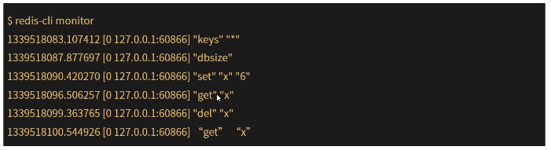
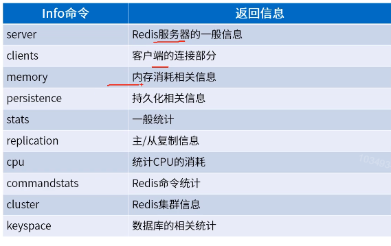

[TOC]

# redis监控

### Monitor命令

1. monitor是一个调试命令，返回服务器处理的每个命令。对于发现程序的错误非常有用。出于安全考虑，某些特殊命令CONFIG不会记录到MONITOR输出。

   

2. 运行一个MONITOR命令能够降低50%的吞吐量，运行多个MONITOR命令降低的吞吐量更多。

   ```java
   192.168.1.120:6379> set a b
   (error) MOVED 15495 192.168.1.125:6379
   192.168.1.120:6379> set b 0
   OK
   192.168.1.120:6379> 
   
   # 开启monitor，会监控每条命令
   192.168.1.120:6379> monitor
   OK
   1561429952.215462 [0 192.168.1.120:57690] "COMMAND"
   1561429963.305824 [0 192.168.1.120:57690] "set" "b" "0"
   ```

### info命令

info 命令以一种易于理解和阅读的格式，返回关于redis服务器的各种信息和统计数值。

可以通过section返回部分信息，如果没有使用任何参数，默认为default。



```java
192.168.1.120:6379> info cpu
# CPU
used_cpu_sys:44.626215
used_cpu_user:16.830441
used_cpu_sys_children:0.000000
used_cpu_user_children:0.000000
192.168.1.120:6379> 
```

### 图形化监控工具-RedisLive(监控集群)

1. 环境需要

   ```java
   centos6 python 2.7
   ```

2. 安装pip

   ```java
   # 首先安装epel扩展源：
   yum -y install epel-release
   # 更新完成之后，就可安装pip：
   yum -y install python-pip
   # 安装完之后清除cache：
   yum clean all
   
   出现Cannot retrieve metalink for repository: epel. Please verify its path and try again错误
   参考https://www.cnblogs.com/dadong616/p/5062727.html
   ```

3. 安装redisLive依赖

   ```java
   # tornado 由于centos的默认python版本是2.6，后面的依赖安装可能会有问题，所以还是先升级
   # python 可以参考
   # https://www.cnblogs.com/harrymore/p/9024287.html
   # 建议使用    pip install lightgbm -i http://pypi.douban.com/simple --trusted-host pypi.douban.com的方式，如果直接使用pip isntall可能会由于网络原因出现sslerror。
   pip install tornado
   # redis.py,注意redis版本
   pip install redis==2.10.6
   # python-dateutil
pip install python-dateutil
   ```
   
4. 下载redislive

   ```java
   wget --no-check-certificate https://github.com/nkrode/RedisLive/archive/master.zip
   mv master.zip /var/redisLive.zip
   # 解压
   unzip redisLive.zip -d /var/redisLive/
   ```

5. 配置

   ```java
   cd /var/redisLive/RedisLive-master/src
   cp  redis-live.conf.example redis-live.conf
   # redis-live.conf配置文件示例内容如下 
   # RedisServers 要监控的节点，里面可以配置密码 "password" : "some-password"
   # RedisStatsServer redis方式存储监控数据，建议是独立的redis
   # 启动redis：/usr/local/redis/bin/redis-server --protected-mode no 默认端口6379
   # SqliteStatsStore sqlite方式存储监控数据
   # "DataStoreType" : "sqlite" 切换监控数据的存储模式
   {
           "RedisServers":
           [ 
                   {
                           "server": "192.168.1.120",
                           "port" :6379
                   },
                   {
                           "server": "192.168.1.120",
                           "port" : 6380
                   },
                    {
                           "server": "192.168.1.122",
                           "port" :6379
                   },
                   {
                           "server": "192.168.1.122
                           "port" : 6380
                   },
                    {
                           "server": "192.168.1.125
                           "port" :6379
                   },
                   {
                           "server": "192.168.1.125
                           "port" : 6380
                   }
           ],
   
           "DataStoreType" : "redis",
   
           "RedisStatsServer":
           {
                   "server" : "192.168.1.120
                   "port" :6381
           },
   
           "SqliteStatsStore" :
           {
                   "path": "to your sql lite file"
           }
   }
   ```

6. 运行redisLive

   ```java
   cd /var/redisLive/RedisLive-master/src
   
   # 进行数据采集
   /var/redisLive/RedisLive-master/src/redis-monitor.py --duration=120
   # 运行web控制台
   /var/redisLive/RedisLive-master/src/redis-live.py
   # web gui页面
   http://192.168.1.120:8888/index.html
   ```

7. 运行时可能会出现的异常。

   ```java
   # ImportError: No module named _sqlite3
   解决办法：
   yum install sqlite-devel
   # 重新编译python
   ```

   