[TOC]

# Redis主从复制

### 主从复制介绍

1. 什么是主从复制。

   

2. 为什么要使用主从复制。
   * redis-server单点故障。
   * 单节点QPS有限。

3. 主从复制应用场景分析。
   * 读写分离场景，规避redis单机瓶颈。
   * 故障切换，master出问题后还有slave节点可以使用。

### 搭建主从复制

主Redis Server以普通模式启动，主要是启动从服务器的方式。

1. 第一种 方式：命令行。

   slaveof [ip] [port] 连接需要实现从节点的redis，执行此命令(新版本中还可以使用replicaof [ip] [port]命令)。

2. 第二种方式：redis.conf配置文件。

   slaveof [ip] [port] 配置文件中增加

   slave-read-only yes 从服务器是否只读(默认yes)

   退出主从集群的方式：

   slave no one

3. 搭建演示

   * 我这里以192.168.1.120:6379作为master，以192.168.1.125:6379作为slave。

   * 首先以正常模式启动Master。
   
     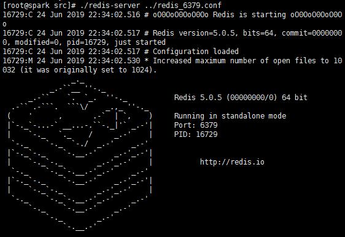
     
   * 启动slave。
   
     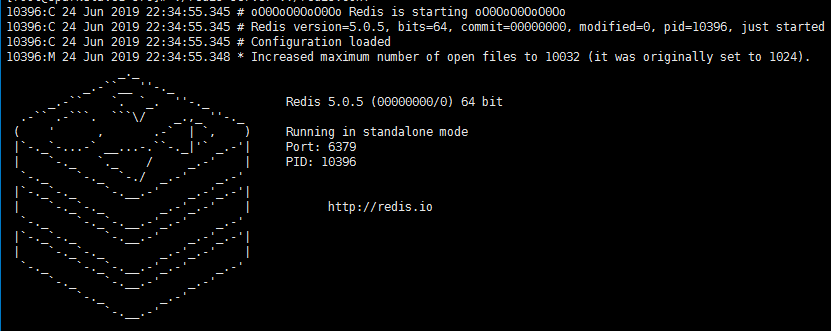
   
   * 命令行方式：在slave的客户端上执行slaveof 192.168.1.120 6379命令。此步骤可能会报出一些链接master的socket异常，此时需要检查机器防火墙是否关闭，如果已经关闭还是访问不了，则检查redis配置文件中bind的ip是否是对外暴露的ip。
   
   * 命令执行后，在redis server的控制台上会输出一些主从建立的信息。
   
     master:
   
     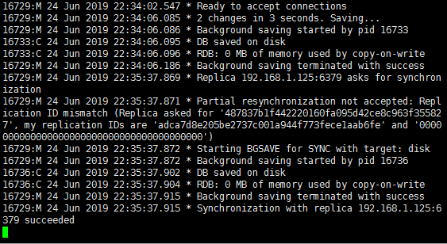
   
     slave:
   
     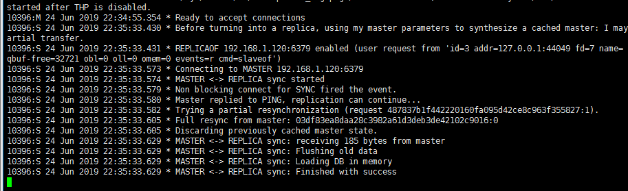
     
   * 配置参数方式就是在redis.conf配置文件中增加一行slaveof 192.168.1.120 6379再正常启动即可。
   
   * 在master执行set a 1，在slave执行get a，可以拿到master的结果。
   
     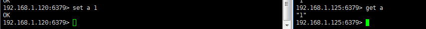
     
   * 可以使用info命令查看集群信息。
   
     

### 主从复制流程


1. 从服务器通过psync命令发送服务器已有的同步进度(同步源id，同步进度offset)。
2. master收到请求，同步源为当前master，则根据偏移量增量同步。
3. 同步源非当前master，则进入全量同步：master生成rdb，传输到slave，加载到slave内存。

### 主从复制核心知识

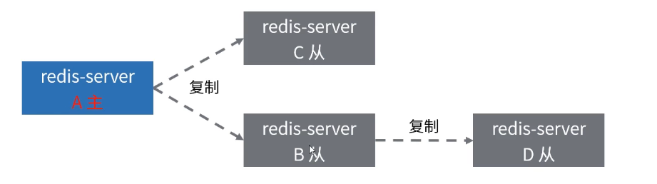

1. Redis默认使用异步复制，slave和master之间异步地确认处理的数据量。
2. 一个master可以拥有多个slave。
3. slave可以接受其他slave的连接。slave可以有下级sub slave。
4. 主从同步过程在master侧是非阻塞的。
5. slave初次同步需要删除旧数据，加载新数据，会阻塞到来的连接请求。

### 主从复制应用场景

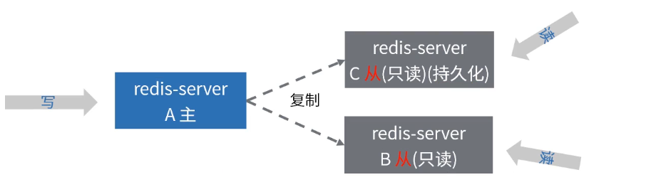

1. 主从复制可以用来支持读写分离。
2. slave服务器设定为只读，可以用在数据安全的场景下。
3. 可以使用主从复制来避免master持久化造成的开销。master关闭持久化，slave配置为不定期保存或是启用AOF。(注意：重新启动的master程序将从一个空数据集开始，如果一个slave试图与它同步，那么这个slave也会被清空)。

### 主从复制的注意事项

1. 读写分离场景：

   * 数据复制延时导致读到过期数据或者读不到数据(网络原因，slave阻塞)。

   * 从节点故障(多个client如何迁移)。

   * Java代码示例

     spring bean配置。

     ```java
     @Configuration
     @Profile("replication-rw") // 主从 - 读写分离模式
     class ReplicationRWRedisAppConfig {
         @Bean
         public LettuceConnectionFactory redisConnectionFactory() {
             System.out.println("使用读写分离版本");
             LettuceClientConfiguration clientConfig = LettuceClientConfiguration.builder()
                     .readFrom(ReadFrom.SLAVE_PREFERRED)
                     .build();
             // 此处
             RedisStandaloneConfiguration serverConfig = new RedisStandaloneConfiguration("192.168.1.125", 6379);
             return new LettuceConnectionFactory(serverConfig, clientConfig);
         }
     }
     ```

     定义service。

     ```java
     @Service
     public class ReplicationExampleService {
         @Autowired
         private StringRedisTemplate template;
     
         public void setByCache(String userId, String userInfo) {
             template.opsForValue().set(userId, userInfo);
         }
     
         public String getByCache(String userId) {
             return template.opsForValue().get(userId);
         }
     }
     ```

     运行单元测试。

     ```java
     @RunWith(SpringJUnit4ClassRunner.class)
     @ContextConfiguration("classpath:applicationContext.xml")
     @ActiveProfiles("replication-rw") // 激活主从集群-读写分离的配置
     public class ReplicationRWTests {
         @Autowired
         ReplicationExampleService replicationExampleService;
     
         @Test
         public void setTest() {
             replicationExampleService.setByCache("tony", "xxxx");
             String result = replicationExampleService.getByCache("tony");
             System.out.println("从缓存中读取到数据：" + result);
         }
     }
     ```

     查看master和slave监控命令输出情况。

     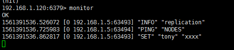

     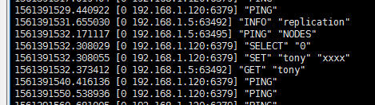

     从中可以看出get请求是到了slave，set请求是在master上执行的，为什么slave也会有set命令，是因为同步数据要用到的。

     

2. 全量复制情况下：

   * 第一次建立主从关系或者runid不匹配会导致全量复制。
   * 故障转移的时候也会出现全量复制。

3. 复制风暴：

   * master故障重启，如果slave节点较多，所有slave都要复制，对服务器的性能，网络的压力都有很大影响。
   * 如果一个机器部署了多个master。

4. 写能力有限：

   * 主从复制还是只有一台master，提供的写服务能力有限。

5. master故障情况下：

   * 如果是master无持久化，slave开启持久化来保留数据的场景，建议不要配置redis自动重启。

   * 启动redis自动重启，master启动后，无备份数据，可能导致集群数据丢失的情况。

   * 示例

     我们在master上执行几条写入命令，可以看到slave会做同步操作。

     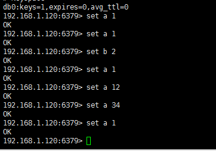

     

     但是如果master宕机后，我们配置了master自动重启就会导致数据丢失。

     

     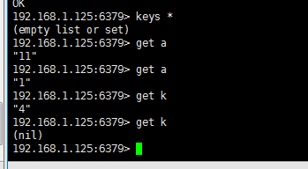

     我们在执行完set k 4命令后，重启master服务，此时再去get k在master和slave上都拿不到数据。如何避免这种数据丢失呢？可以关闭到master的自动重启，因为salve开启的持久化功能，所以我们可以使得之前的slave变成master，之前的master变成salve，然后去同步master的数据。或者我们手动启动之前的master后，然后把salve上的持久化文件传输到master进行数据恢复。

     

6. 带有效期的key：

   * slave不会让key过期，而是等待master让key过期。
   * 在Lua脚本执行期间，不执行任何key过期操作。

   
