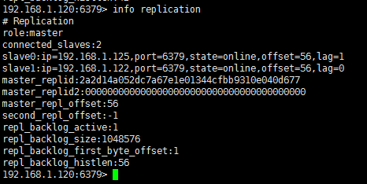
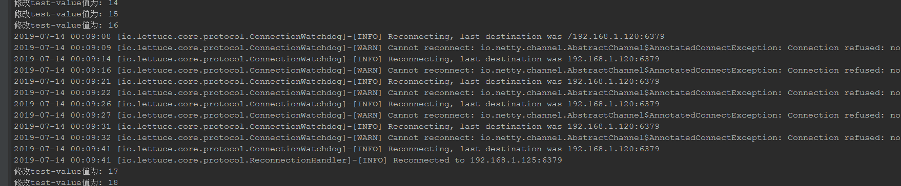
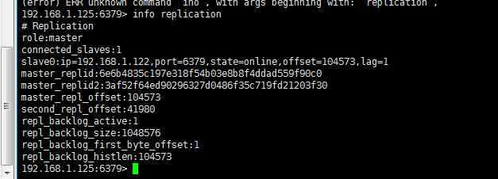
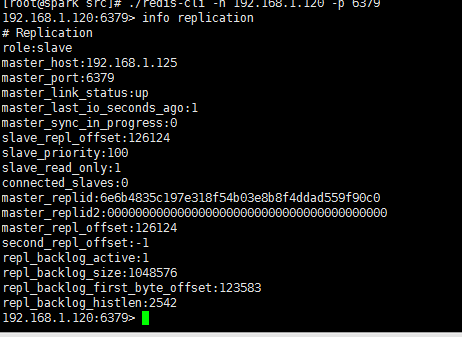
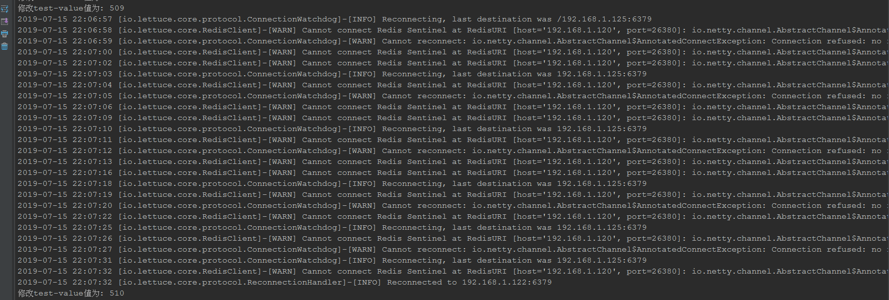
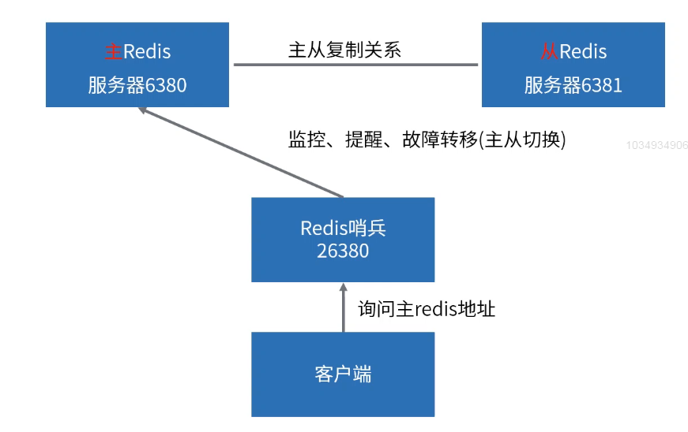
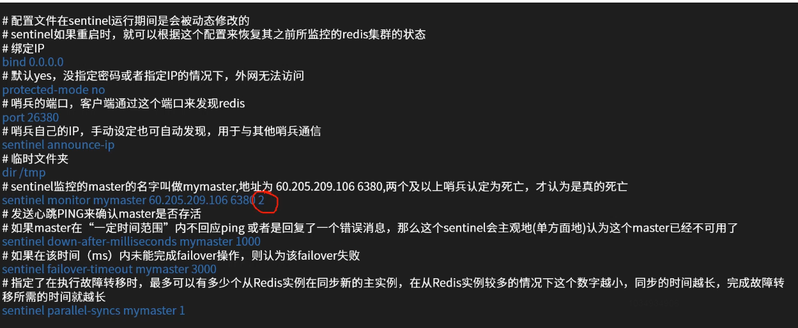
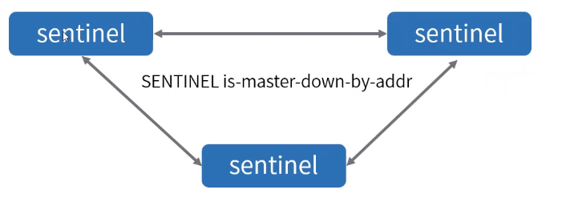
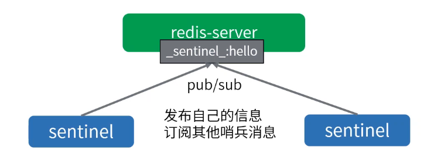

[TOC]

# 哨兵高可用机制

### 哨兵高可用集群搭建

1. 首先，准备好三台安装好的redsi服务器，我这里分别是192.168.1.120，192.168.1.122,192.188.1.125。

2. 在三台机器上的redis安装目录分别运行src/redis-server redis.conf命令，启动三个redis服务。

3. 配置一主两从，在192.168.1.122和192.168.1.125的redis客户端分别执行slaveof 192.168.1.120 6379命令。

4. 检查集群信息。

   

5. 准备哨兵配置文件。

   ```java
   # 配置文件：sentinel.conf，在sentinel运行期间是会被动态修改的
   # sentinel如果重启时，根据这个配置来恢复其之前所监控的redis集群的状态
   # 绑定IP
   bind 0.0.0.0
   # 后台运行
   daemonize yes
   # 默认yes，没指定密码或者指定IP的情况下，外网无法访问
   protected-mode no
   # 哨兵的端口，客户端通过这个端口来发现redis
   port 26380
   # 哨兵自己的IP，手动设定也可自动发现，用于与其他哨兵通信
   # sentinel announce-ip
   # 临时文件夹
   dir /tmp
   # 日志
   logfile "/usr/local/redis/logs/sentinel.log"
   # sentinel监控的master的名字叫做mymaster,初始地址为 192.168.100.241 6380,2代表两个及以上哨兵认定为死亡，才认为是真的死亡
   sentinel monitor mymaster 192.168.1.120 6379 2
   # 发送心跳PING来确认master是否存活
   # 如果master在“一定时间范围”内不回应PONG 或者是回复了一个错误消息，那么这个sentinel会主观地(单方面地)认为这个master已经不可用了
   sentinel down-after-milliseconds mymaster 1000
   # 如果在该时间（ms）内未能完成failover操作，则认为该failover失败
   sentinel failover-timeout mymaster 3000
   # 指定了在执行故障转移时，最多可以有多少个从Redis实例在同步新的主实例，在从Redis实例较多的情况下这个数字越小，同步的时间越长，完成故障转移所需的时间就越长
   sentinel parallel-syncs mymaster 1
   ```

6. 启动哨兵集群。

   在三台服务器上的redsi安装目录执行src/redis-server sentinel.conf --sentinel命令。

7. Java代码测试

   * redis bean相关配置。

     ```java
     @Configuration
     @Profile("sentinel")
     class SentinelRedisAppConfig {
         @Bean
         public LettuceConnectionFactory redisConnectionFactory() {
             System.out.println("使用哨兵版本");
             RedisSentinelConfiguration sentinelConfig = new RedisSentinelConfiguration()
                     .master("mymaster")
                     // 哨兵地址
                     .sentinel("192.168.1.120", 26380)
                     .sentinel("192.168.1.122", 26380)
                     .sentinel("192.168.1.125", 26380);
             return new LettuceConnectionFactory(sentinelConfig);
         }
     }
     ```

   * 测试类。

     ```java
     @RunWith(SpringJUnit4ClassRunner.class)
     @ContextConfiguration("classpath:applicationContext.xml")
     @ActiveProfiles("sentinel") // 设置profile
     public class SentinelTests {
     
         @Autowired
         StringRedisTemplate stringRedisTemplate;
     
         @Test
         public void test() throws InterruptedException {
             // 每个一秒钟，操作一下redis，看看最终效果
             int i = 0;
             while (true) {
                 i++;
                 stringRedisTemplate.opsForValue().set("test-value", String.valueOf(i));
                 System.out.println("修改test-value值为: " + i);
                 Thread.sleep(1000L);
             }
         }
     }
     ```
   
   * 运行test方法一段时间后，我停掉192.168.1.120这台master的redis服务，console有如下输出。
   
     使用info查看集群信息发现master已经为192.168.1.125这台机器了。
   
     
   
     重新启动192.168.1.120这台机器上的redis服务，它将以slave的身份加入集群。
   
     
   
   * 下面我们在看一下当哨兵和master同时挂掉时会发生什么。
   
     
   
     从日志中看出，当客户端发现master连接不上式，会去找配置中的第一个哨兵，但是第一个哨兵也挂了，询问几次后，会去尝试配置的下一个哨兵来进行master选举。

### 哨兵机制核心作用



### 核心运作流程

1. 服务发现和健康检查流程
   * 搭建redis主从集群。
   * 启动哨兵(客户端通过哨兵发现Redis实例信息info replication)。
   * 哨兵通过连接master发现主从集群内的所有实例信息。
   * 哨兵监控redis实例的健康状况。
2. 故障切换流程
   * 哨兵一旦发现master不能正常提供服务，则通知给其他哨兵。
   * 当一定数量的哨兵都认为master挂了。
   * 选举一个哨兵作为故障转移的执行者。
   * 执行者在slave中选取一个作为新的master。
   * 将其他salve重新设定为新master的从属。

### 哨兵启动和配置

1. 启动命令：redis-server sentinel.conf --sentinel，配置文件启动时指定，运行过程中会自动变更，记录哨兵的监测结果。

   

   

### 哨兵如何知道Redis主从信息

1. 哨兵配置文件中，保存着主从集群中master的信息，可以通过info命令，进行主从信息自动发现。

   

### 什么是主观下线

1. 主观下线：单个哨兵自身认为redis实例已经不能提供服务了。

2. 检测机制：哨兵向redis发送ping请求，+PONG，-LOADING，-MASTERDOWN这三种情况视为正常，其他回复均视为无效。

3. 对应配置文件配置项：sentinel down-after-milliseconds mymaster 1000

   

### 什么是客观下线

1. 客观下线：一定数量值的哨兵认为master已经下线。

2. 检测机制：当哨兵主观认为master下线后，则会通过SENTINEL is-master-down-by-addr命令询问其它哨兵是否认为master已经下线，如果达成共识(达到quorum个数)，就会认为master节点客观下线，开始故障转移流程。

3. 对应配置文件的配置项：sentinel monitor mymaster 192.168.1.120 6379 2

   

### 哨兵之间如何通信

1. 哨兵之间的自动发现。

   

2. 哨兵之间通过命令进行通信。

   

3. 哨兵之间通过订阅发布进行通信。

   

   

### 哨兵领导选举机制

基于Raft算法实现的选举机制。

1. 拉票阶段：每个哨兵节点希望自己成为领导者。
2. sentinel节点收到拉票命令后，如果没有收到或同意过其他sentinel节点的请求，就同意该sentinel节点的请求(每个sentinel支持有一个同意票数)。
3. 如果sentinel节点发现自己的票数已经超过一半的数值，那么它将成为领导者，去执行故障转移。
4. 投票结束后，如果超过failover-timeout时间内，没有进行实际的故障转移操作，则重新拉票选举。
5. 可以参考：https://raft.gihub.io，http://thesecretlivesofdata.com。

### slave选举方案

1. 节点状态，非S_DOWN，O_DOWN，DISCONNECTED。判断规则：(down-after-millseconds * 10) + milliseconds_since_master_is_in_SDOWN_state SENTINEL slaves mymaster。

2. 优先级，redis.conf中有一个配置项：slave-priority值越小，优先级越高。

3. 数据同步情况，Replication offset processed。

4. 最小的run id，run id比较方案，字典顺序，ASCII码。
### 最终主从切换过程

1. 针对即将成为master的salve节点，将其撤出主从集群，自动执行：slaveof no one。

2. 针对其他slave节点，使它们成为新的master的从属，自动执行：slaveof new_master_host new_master_port。
### 哨兵同步pubsub发出来的消息

```java
# https://redis.io/topics/sentinel#pubsub-messages
+reset-master <instance details> -- 当master被重置时.
+slave <instance details> -- 当检测到一个slave并添加进slave列表时.
+failover-state-reconf-slaves <instance details> -- Failover状态变为reconf-slaves状态时
+failover-detected <instance details> -- 当failover发生时
+slave-reconf-sent <instance details> -- sentinel发送SLAVEOF命令把它重新配置时
+slave-reconf-inprog <instance details> -- slave被重新配置为另外一个master的slave，但数据复制还未发生时。
+slave-reconf-done <instance details> -- slave被重新配置为另外一个master的slave并且数据复制已经与master同步时。
-dup-sentinel <instance details> -- 删除指定master上的冗余sentinel时 (当一个sentinel重新启动时，可能会发生这个事件).
+sentinel <instance details> -- 当master增加了一个sentinel时。
+sdown <instance details> -- 进入SDOWN状态时;
-sdown <instance details> -- 离开SDOWN状态时。
+odown <instance details> -- 进入ODOWN状态时。
-odown <instance details> -- 离开ODOWN状态时。
+new-epoch <instance details> -- 当前配置版本被更新时。
+try-failover <instance details> -- 达到failover条件，正等待其他sentinel的选举。
+elected-leader <instance details> -- 被选举为去执行failover的时候。
+failover-state-select-slave <instance details> -- 开始要选择一个slave当选新master时。
+no-good-slave <instance details> -- 没有合适的slave来担当新master
+selected-slave <instance details> -- 找到了一个适合的slave来担当新master
+promoted-slave -- 确认成功
+failover-state-reconf-slaves -- 开始对slaves进行reconfig操作
+slave-reconf-sent -- 向指定的slave发送“slaveof”指令，告知此slave跟随新的master
+slave-reconf-inprog -- 此slave正在执行slaveof + SYNC过程，slave收到“+slave-reconf-sent”之后将会执行slaveof操作
+slave-reconf-done -- 此slave同步完成，此后leader可以继续下一个slave的reconfig操作
failover-state-send-slaveof-noone <instance details> -- 当把选择为新master的slave的身份进行切换的时候。
failover-end-for-timeout <instance details> -- failover由于超时而失败时。
failover-end <instance details> -- failover成功完成,故障转移结束
switch-master <master name> <oldip> <oldport> <newip> <newport> -- 当master的地址发生变化时。通常这是客户端最感兴趣的消息了。
+tilt -- 进入Tilt模式。
-tilt -- 退出Tilt模式。
```

