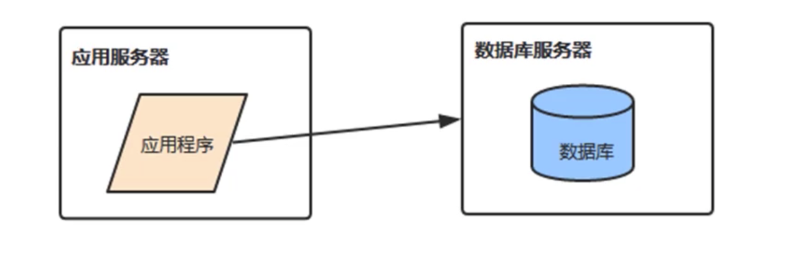
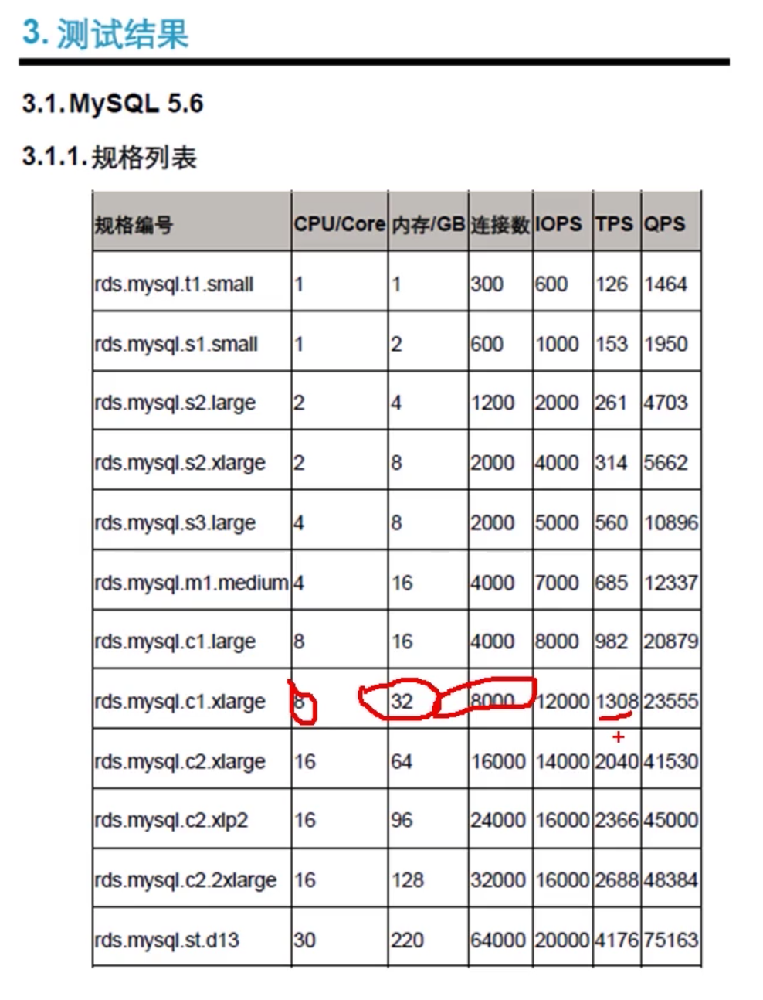
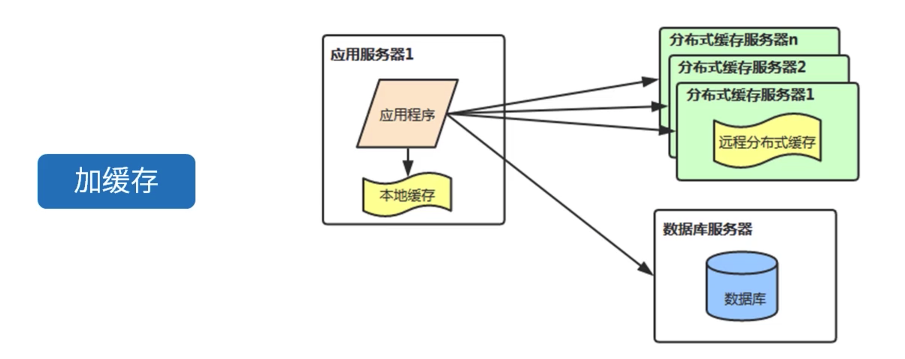
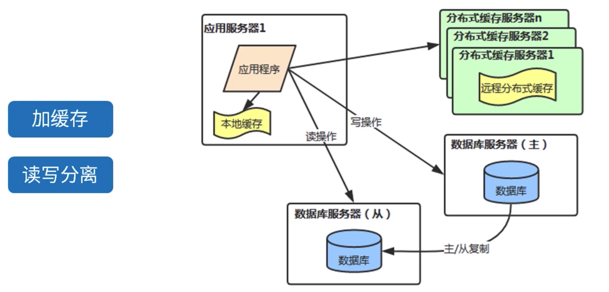
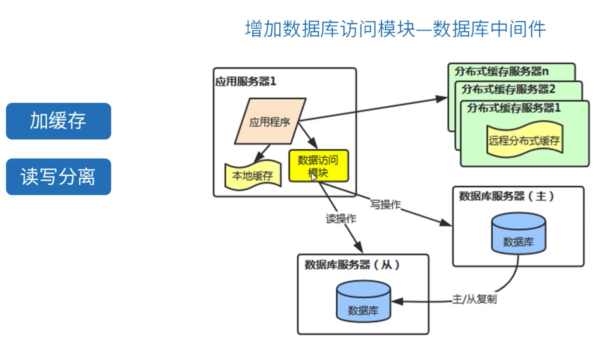
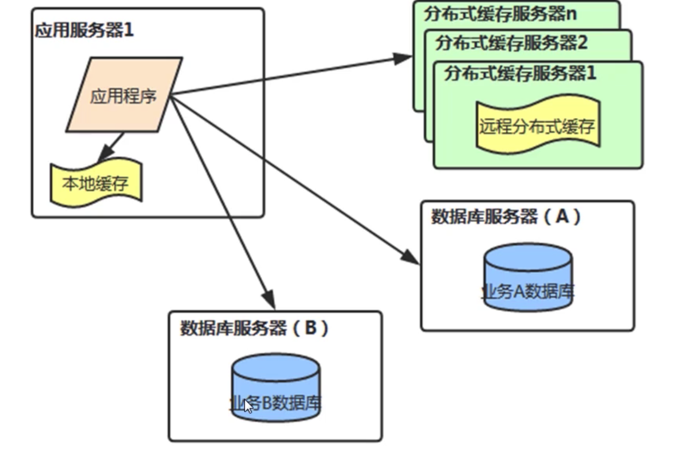
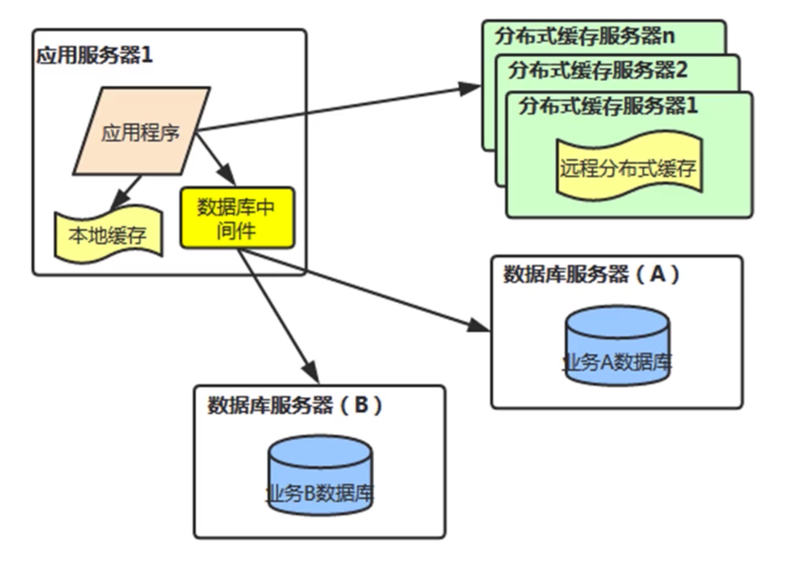
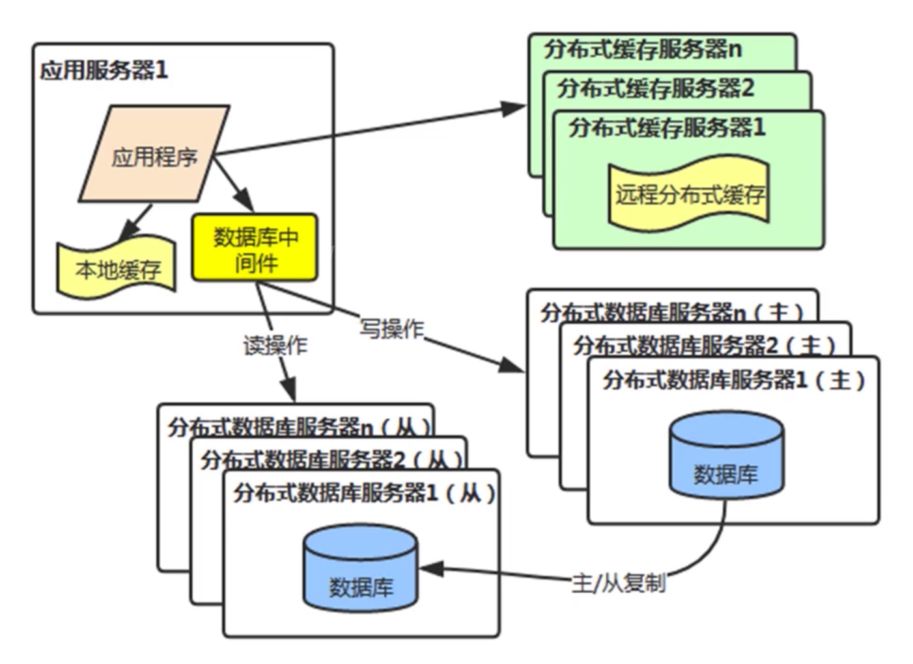

[TOC]

# 数据库中间件设计理论

### 为什么需要数据库中间件

1. 如果遇到数据库存储的数据量不是很大，但并发的读写操作都很大，超过数据库服务器的处理能力这种情况，我们要如何处理。

2. 

   

   数据量不大，但并发读写超数据库服务器的处理能力我们可以通过加缓存来处理。

   

3. 那么问题又来了，缓存会有过期不命中，还是会有大量的读和全部的写操作将请求数据库，如果数据库支持不起，怎么办？

   可以通过加缓存和读写分离来解决。

   

4. 那么读写要分别操作不同的数据库，对DAO层代码有影响吗？我们如何去隔离这种变化呢？

   通过引入数据库访问模块-数据库中间件来隔离这种变化。

   

5. 应用的业务模块很多，总的数据量很大，并发读写操作均超过单个数据库服务器的处理能力。

   * 对于读压力，我们可以做集群，多个从库。此时数据库中间件需要能够负载均衡。

   * 对于写压力，能集群，多个主库吗？

   * 不能，因为多个主库间数据同步，难保证数据一致性，并且数据量大单库存不下来。

   * 此时，可以按照业务模块进行分库。

     

     

6. 分库后，我们要操作多个库，对DAO层代码有影响吗？如果要跨库关联查询，怎么办？

   需要数据库中间件来做处理。

   

7. 如果单个表的数量很大，超出了单表的上限，如电商的商品表，订单表等。

   * 根据一定规则将数据分到多个表中存储。

   * 分表的情况下，如何决定数据存储到哪个表，如何查询多个表，如何做到对DAO层透明。

   * 交给中间件处理。

     

8. 高并发，海量数据的情况下：

   * 数据库存储的数据量不是很大，但并发的读写操作都很大，超过数据库服务器的处理能力。

   * 应用的业务模块很多，总的数据量很大，并发读写操作均超过单个数据库服务器的处理能力。

   * 如果单个表的数量很大，超出了单表的存储上限，如电商往回走哪的商品表，订单表等。

     为解决数据存储，访问性能问题我们需要引入数据库中间件。数据库中间件让我们可以在应用程序中快速应用读写分离，分库分表。