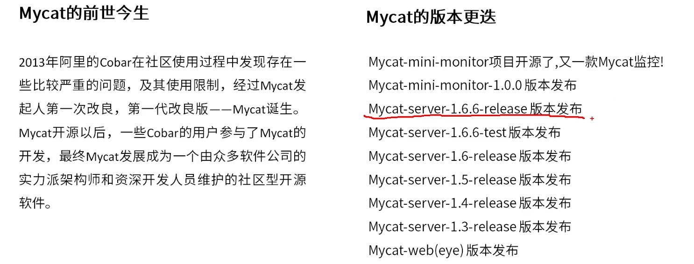
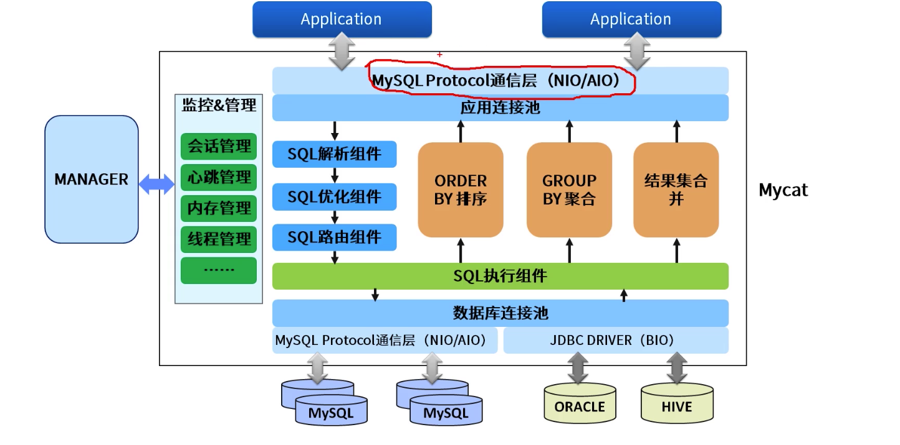

[TOC]

# MyCat入门

### MyCat是什么

MyCat数据库分库分表中间件，是国内最活跃，性能最好的开源数据库中间件。

1. 一个彻底开源的，面向企业应用开发的大数据库集群。
2. 支持事务，ACID，可以替代MySQL的加强版数据库。
3. 一个可以视为MySQL集群的企业级数据库，用来替代昂贵的Oracle集群。
4. 一个融合内存缓存技术，NoSQL技术，HDFS大数据的新型SQLServer。
5. 结合传统数据库和新型分布式数据仓库的新一代企业级数据库产品。
6. 一个新颖的数据库中间件产品。

### MyCat应用场景

1. 单纯的读写分离，此时配置最为简单，支持读写分离，主从切换。
2. 分库分表，对于超过1000万的表进行分片，最大支持1000亿的单表分片。
3. 多租户应用，每个应用一个库，单应用程序只连接MyCat，从而不改造程序本身，实现多租户化。
4. 报表系统，借助MyCat的分表能力，处理大规模报表的统计。
5. 替代Hbase，分析大数据。
6. 作为海量数据实时查询的一种简单有效方案，比如100亿条频繁查询的记录需要在3秒内查询出来结果，除了基于主键的查询，还可能存在范围查询或者其他属性查询，此时MyCat可能是最简单有效的选择。

### MyCat工作原理

它拦截了用户发送过来的SQL语句，首先解析SQL语句，做一些特定的分析，如分片分析，路由分析，读写分离分析，缓存分析等。然后将此SQL发往后端的真实数据库，并将返回的结果做适当的处理，最终再返回给用户。

### MyCat架构

### MyCat关键特性

1. 支持SQL92标准。
2. 支持MySQL，Oracle，DB2，SQL Server，PostgreSQL等DB的常见SQL语法。
3. 遵循MySQL原生协议，跨语言，跨平台，跨数据库的通用中间件代理。
4. 基于心跳的自动故障切换，支持读写分离，支持MySQL主从，以及galera cluster集群。
5. 支持Galera for MySQL集群，Percona Cluster或者MariaDB Cluster。
6. 基于Nio实现，有效管理线程，解决高并发问题。
7. 支持数据的多片路由与聚合，支持sum，count，max等常用的聚合函数，支持跨库分页。
8. 支持单库内部任意join，支持跨库2表join，甚至基于caltle的多表join。
9. 支持通过全局表，ER关系的分片策略，实现了高效的多表join查询。
10. 支持多租户方案。
11. 支持分布式事务(弱xa)。
12. 支持XA分布式事务(1.6.5)。
13. 支持全局序列号，解决分布式下的主键生成问题。
14. 分片规则丰富，插件化开发，易于扩展。
15. 强大的web，命令行监控。
16. 支持前端作为MySQL通用代理，后端JDBC方式支持Oracle，DB2，SQL Server，mongoldb，巨杉。
17. 支持密码加密。
18. 支持服务降级。
19. 支持IP白名单。
20. 支持SQL黑明单，sql注入攻击拦截。
21. 支持prepare预编译指令。
22. 支持非堆内存聚合计算(1.6)。
23. 支持PostgreSQL的native协议(1.6)。
24. 支持MySQL和Oracle存储过程，out参数，多结果集返回(1.6)。
25. 支持zookeeper协调主从切换，zk序列，配置zk化(1.6)。
26. 支持库内分表(1.6)。
27. 集群基于ZooKeeper管理，在线升级，扩容，智能化，大数据处理(2.0开发版)。

### MyCat2.0规划

1. 完全实现分布式事务，完全的支持分布式。
2. 通过MyCat web完成可视化配置，及智能监控，自动运维。
3. 通过MySQL本地节点，完整地解决数据扩容难度，实现自动扩容机制，解决扩容难点。
4. 支持基于zookeeper的主从切换及MyCat集群化管理。
5. 通过MyCat Balance替代第三方的Haproxy，LVS等第三方高可用，完整地兼容MyCat集群节点的动态上下线。
6. 接入Spark等第三方工具，解决数据分析及大数据聚合的业务场景。
7. 通过MyCat智能优化，分析分片热点，提供合理的分片建议，索引建议，及数据切分实时业务建议。

### 安装MyCat

参考Centos7上MyCat安装。