[TOC]

# MyCat读写分离

数据库中间件：对应用，MyCat就是数据库服务，MyCat是后端数据库集群的代理。

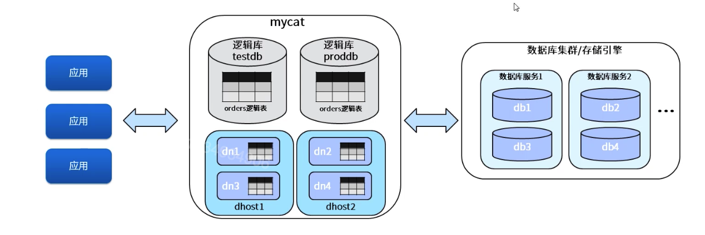

1. 逻辑概念。

   * 逻辑库：MyCat数据库服务中定义，管理的数据库。
   * 逻辑表：逻辑库中包含的需要分库分表存储的表。
   * dataNode：数据节点(分片节点)，逻辑表分片的存放节点。
   * dataHost：数据主机(节点主机)，数据节点所在的主机。
   * writeHost：写主机，真实的数据库服务主机描述。
   * readHost：读主机，真实的数据库服务主机描述。

   ```xm
   <mycat:schema>
   <schema name="testdb">
   	<table name="orders" primaryKey="ID" type="global" dataNode="dn1, dn2"/>
   </schema>
   <dataNode name="dn1" dataHost="dhost1" database="db1"/>
   <dataHost name="dhost1">
   	<heartbeat>select user()</heartbeat>
   	<writeHost host="hostM1" url="localhost:3306">
   		<readHost host="host2" url="192.168.1.2:3306"/>
   	</writeHost>
   </dataHost>
   </mycat:schema>
   ```

### schema配置-schema

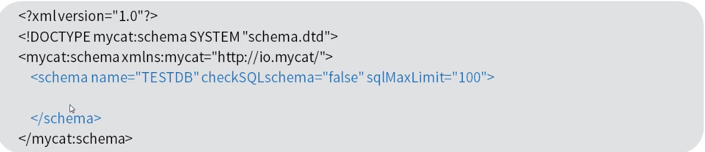

MyCat可以有多个逻辑库，每个逻辑库都有自己的相关配置。

如果不配置schema标签，所有的表配置，会属于同一个默认的逻辑库。

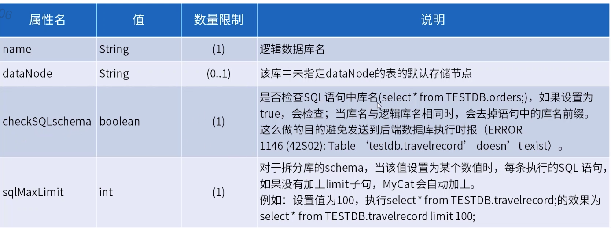

### schema配置-table

逻辑表。

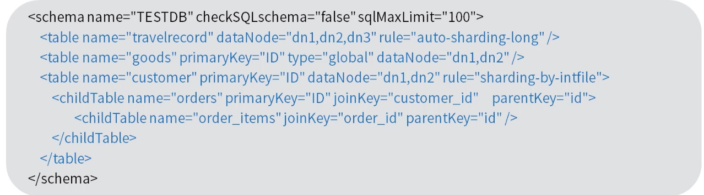

table标签定义了MyCat中的逻辑表，所有需要拆分的表都需要通过这个标签定义。

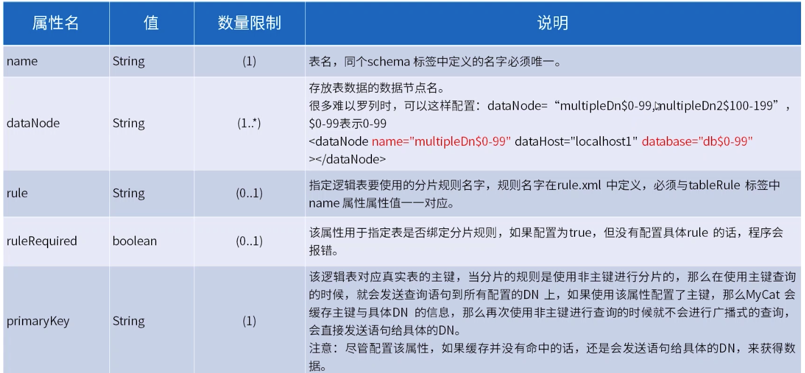

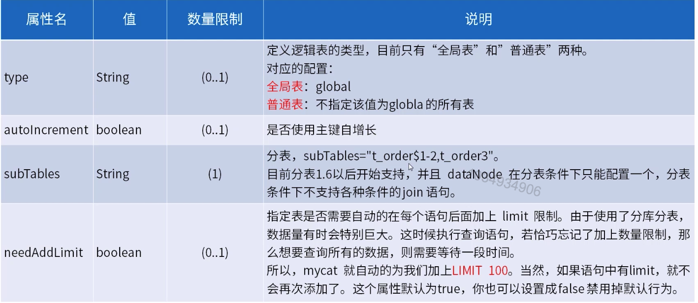

### schema配置-childTable标签

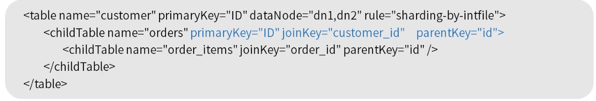

childTable标签用于定义E-R分片的子表，通过比标签上的属性与父表进行关联。

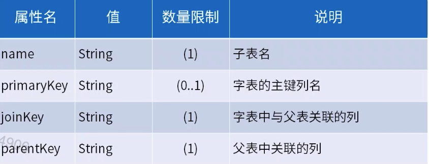

### shema配置-dataHost

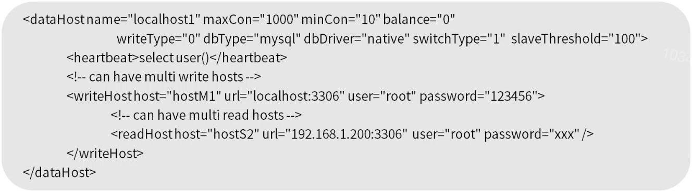

dataHost定义MyCat中的数据主机，数据主机定义中定义了具体的数据库服务，读写分离配置和心跳语句。这是与物理数据库服务关联的地方。


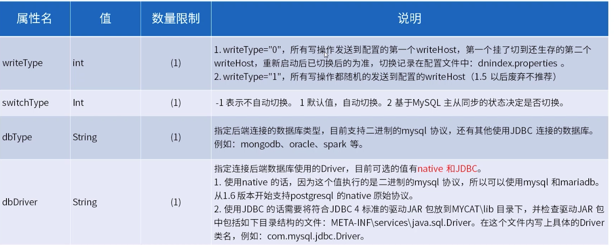

### schema配置-heartbeat

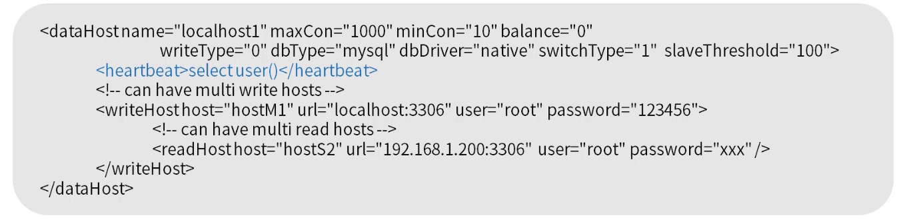

1. 这个标签内指明用于和后端数据库进行心跳的语句。

   MySQL可以使用select user()，Oracle可以使用select 1 from dual等。

2. 这个标签还有一个connectionInitSql属性，主要是当使用Oracle数据库时，需要执行的初始化SQL语句就放在这里。

   例如：alter session set xls_date_format=`yyyy-mm-ddhh24:mi:ss`

   1.4主从切换的语句必须是：show slave status。

### schema配置-writeHost readHost

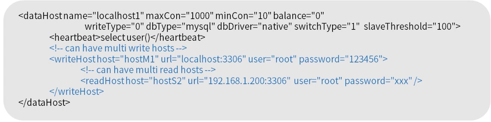

这两个标签都指定后端数据库的相关配置给MyCat，用于实例化后端连接池。writeHost指定写实例，readHost指定读实例。在一个dataHost内可以定义多个writeHost和readHost。但是，如果writeHost指定的后端数据库宕机，那么这个writeHost绑定的所有readHost都将不可用。另一方面，由于这个writeHost宕机系统会自动的检测到，并切换到备用的writeHost上去。

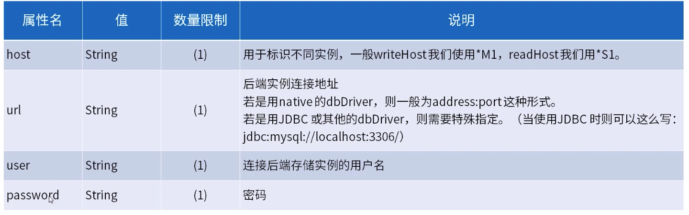

加密密码，执行mycat jar程序(1.4.1以后)。

java -cp Mcat-server-1.4.1-dev.jar io.mycat.util.DecryptUtil 1:host:user:password

Mycat-server-1.4.1.jar为mycat download下载目录的jar。

1:host:user:password中1为db端加密标志，host为dataHost的host名称。

### MyCat读写分离

1. 配置MySQL端主从的数据自动同步，MyCat不负责任和的数据同步问题。

2. MyCat配置读写分离，具体参数参考文章上面。

   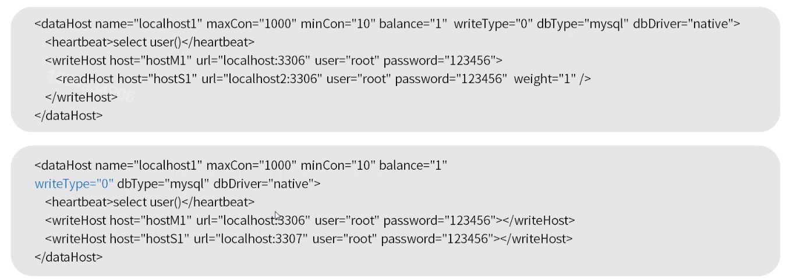

   第一种当写挂了读不可用，第二种可以继续使用。事务内部的一切操作都会走写节点，所以读操作不要加事务。

3. Schema.xml中配置逻辑库，数据节点，数据主机。

   ```java
   <?xml version="1.0"?>
   <!DOCTYPE mycat:schema SYSTEM "schema.dtd">
   <mycat:schema xmlns:mycat="http://io.mycat/">
   <!-- 注意:里面的元素一定要按 schema 、dataNode 、 dataHost的顺序配置 -->
       <schema name="mydb1" checkSQLschema="false" sqlMaxLimit="100"
   dataNode="mydn1">
   </schema>
   <dataNode name="mydn1" dataHost="dhost1" database="orders" /> <dataNode name="mydn2" dataHost="dhost2" database="orders" /> <!-- 读写分离第二种配置方式 -->
   <dataHost name="dhost1" maxCon="1000" minCon="10" balance="1"
    writeType="0" dbType="mysql" dbDriver="native">
           <heartbeat>select user()</heartbeat>
           <writeHost host="myhostM1" url="192.168.100.218:3306" user="mike"
   password="Mike666!">
               <readHost host="myhostS1" url="192.168.100.219:3306"
   user="mike" password="Mike666!"  weight="1" />
           </writeHost>
   </dataHost>
   <!-- 读写分离第二种配置方式 -->
   <dataHost name="dhost2" maxCon="1000" minCon="10" balance="1"
           writeType="0" dbType="mysql" dbDriver="native">
           <heartbeat>select user()</heartbeat>
           <writeHost host="myhostM2" url="192.168.100.218:3306" user="mike"
   password="Mike666!"></writeHost>
           <writeHost host="myhostS2" url="192.168.100.219:3306" user="mike"
   password="Mike666!"></writeHost>
       </dataHost>
   </mycat:schema>
   ```

   server.xml中用户数据库权限配置。

   ```java
   <user name="root" defaultAccount="true">
       <property name="password">123456</property>
       <property name="schemas">mydb1</property>
   </user>
   ```

   