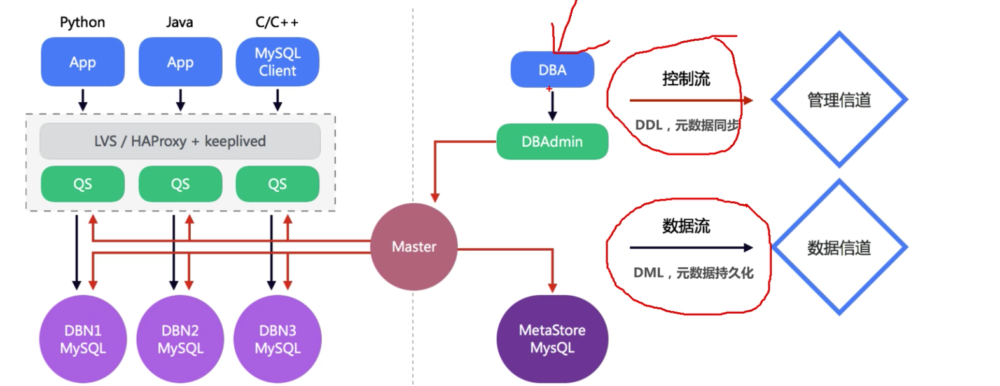
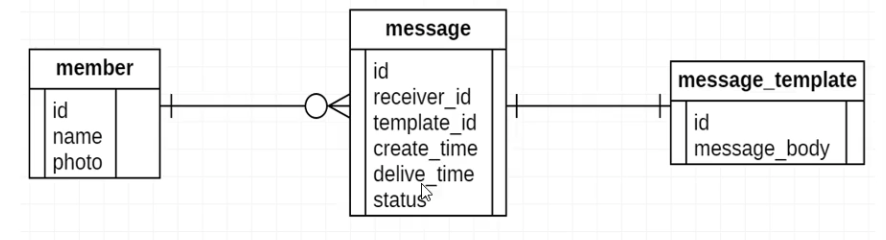
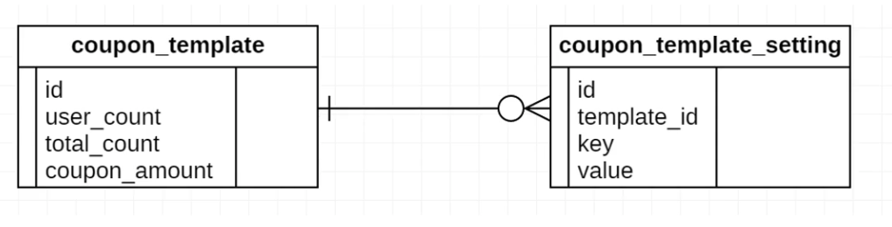

[TOC]

# 数据库中间件最佳实践

### 分布式数据库DDB

网易DDB采用服务端代理模式，提供透明分库分表服务。

### 实践

使用DDB分表中，需要选择合适的字段来进行水平拆分，这个用来分表的字段叫做均衡字段，在实践中，均衡字段的选取非常重要，以下是均衡字段选择的节点建议：

1. 经常作为等值条件的字段适合作为均衡字段。
2. 经常作为多表联合查询等值条件的字段(类似外键)适合作为均衡字段，这些表使用相同均衡策略。
3. 均衡字段尽量使用数字。
4. 均衡字段上根据需要建立索引。

### 基础规范

1. 表必须有主键，建议使用整型作为主键。
2. 禁止使用外键，表之间的关联性和完整性通过控制层控制。
3. 表在设计之初，应考虑到大致的数量级，若表的记录数低于1000w，尽量使用单表，不建议分表。
4. 建议将大字段，访问频率低及不需要筛选的字段拆分到拓展表中。
5. 控制单实例中表的总数，单个分表表个数控制在1024以内。

### 列设计规范

1. 合理使用字段类型，如：
   * 正确区分tinyint，int，bigint的范围。
   * 使用varchar(20)存储手机号，不要使用整数。
   * 使用INT存储IPV4，不要用char(15)。
   * 涉及金额使用decimal，并制定精度。
2. 所有字段定义为NOT NULL，并设置默认值。
   * 存储NULL需要更多的空间，并且使得索引和统计变得更复杂。

### 索引规范

1. 唯一索引使用unig_[字段名]来命名。
2. 非唯一索引使用idx_[字段名]来命名。
3. 不建议在频繁更新的字段上建立索引。
4. 非必要不要进行JOIN查询，如果要进行JOIN查询，被JOIN的字段必须类型相同，并建立索引，否则可能因为隐式类型转换而缓存失效。
5. 单张表索引数量建议控制在5个以内，索引过多，不仅会导致插入更新性能下降，还可能导致MySQL使用错误的索引，可在语句中加上force index来强制使用某个索引。
   1. 组合索引字段数不建议超过5个，理解组合索引最左前缀原则，避免重复建设索引，如果建立了(a，b,	c)，相当于建立了(a)，(a，b)，(a，b，c)。

### SQL规范

1. 禁止使用select *，只获取必要字段，select *会增加cpu/io/内存/宽带的消耗，指定字段能有效利用索引覆盖指定字段查询，在表结构变更时，能保证对程序无影响。
2. insert必须指定字段，禁止使用insert into T values()，指定字段插入，在表结构变更时，能保证对应用程序无影响。
3. 隐式类型转换会使索引失效，导致全表扫描(例如通过手机号搜索时未转成字符串)。
4. 禁止在where条件列使用函数或者表达式，导致不能命中索引，全表扫描。
5. 禁止负向查询以及%开头的模糊查询，导致不能命中索引，全表扫描，数据量在1亿左右建议全文检索，否则建议搜索引擎。
6. 避免直接返回大结果集造成内存溢出，可采用分段和游标方式。
7. 返回结果集时尽量使用limit分页显示。
8. 避免出现较大的limit和offset值。
9. 使用group by或order by的语句，即使用了limit offset，如果没有合适的索引做排序操作，也会遍历所有满足where条件的结果。
10. 大表扫描操作尽量放到景象库上做。
11. 禁止大表JOIN和子查询。
12. 同一个字段上的OR必须改写为IN，IN的值必须小于1024个。
13. 应用程序必须捕获SQL异常，方便定位线上问题。

### 对表进行垂直拆分

将一个属性较多的表，一行数据较大的表，将不同的属性拆分到不同的数据库表中，以降低单库中表的大小。

1. 特点：

   * 每个表的结构不一致。

   * 每个表的数据都是全量。

   * 表直接有至少一列的关联数据，一般是主键。

   * 所有表的并集是全量数据。

2. 原则：

   * 将长度较短，访问频率较高的放入一张表，如主表。
   * 将长度较长，访问频率较低的字段放入拓展表。
   * 将经常一起访问的字段放入一张表。

### 水平拆分

场景：云课堂消息系统，主要涉及3张表，用户表，消息模版表，消息表。

1. 业务需求：
   * 用户查看最近收到的消息(99%)。
   * 用户查看历史消息(0.5%)。
   * 后台查询单个消息模版发给哪些用户。
2. 表设计：
   * 结合业务需求，大部分场景都是通过用户id查看消息，因此用户表，消息表均以user_id作为均衡字段分表，消息模版表则以id作为均衡字段，便于组装消息。
   * 消息表会随着时间逐渐增大，继而难以维护并降低数据库性能，因此根据创建时间进行分区，分隔最近消息和历史消息，便于热冷分离。

### 如何平滑添加字段

场景：在开发时，有时需要给表加个字段，在大数据量且分表的情况下，怎样平滑添加。

1. 直接alter table add column，数据量大时不建议(写锁)。
2. 提前预留字段，不优雅，造成空间浪费，预留多少很难控制，拓展性差。
3. 新增一张表，迁移原数据，再重新命名新表为原表。
4. 放入extInfo，无法使用索引。
5. 提前设计，使用key-value方式存储，新增字段时，直接加一个key就好了。

案例：在设计优惠系统时，优惠券存在适用范围，比如拼团，秒杀活动的互斥，使用端的限制等，这些信息如何设计。

设计：这种场景适合采用方案5进行拓展，将拼团是否可用，秒杀是否可用，ios是否可用等作为一个key，而不是一个属性挂在优惠表上，以后添加android是否可用，会员是否可以用时，直接增加key即可完成扩展(优惠设置表以优惠券模版id进行水平分表)。

