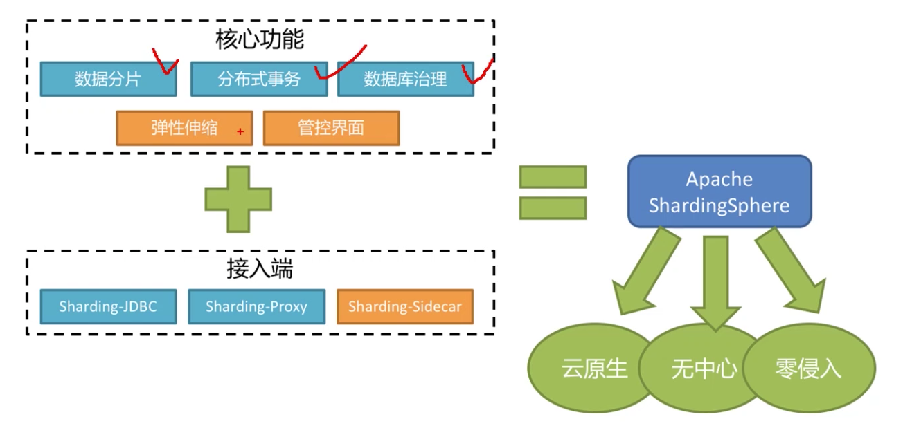
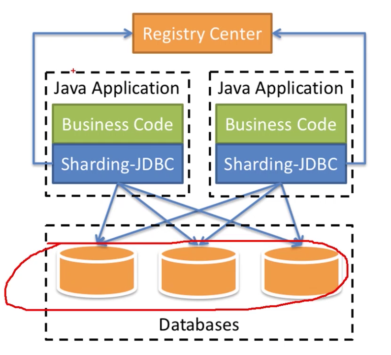
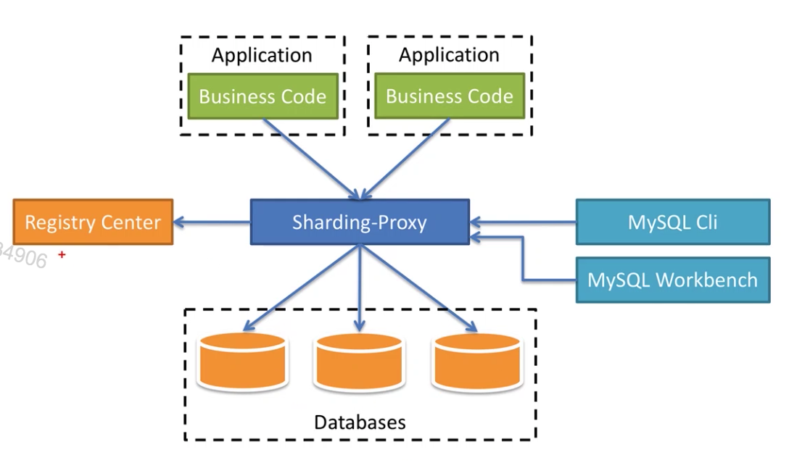
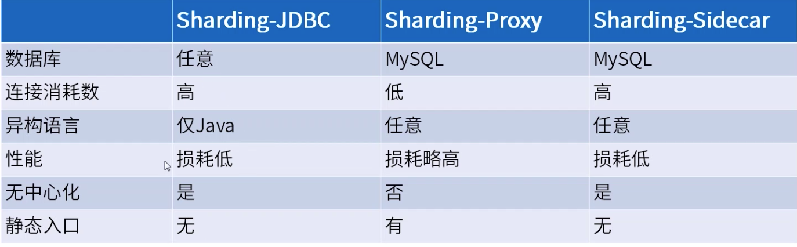
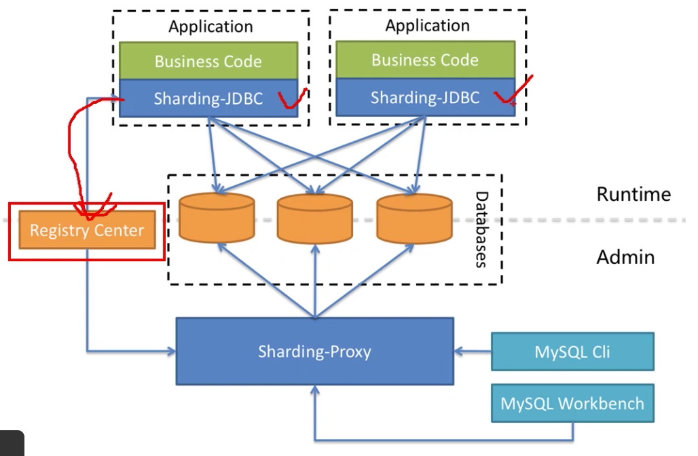
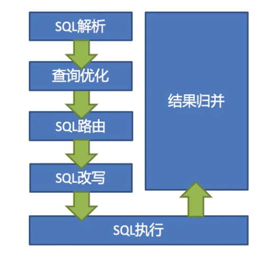
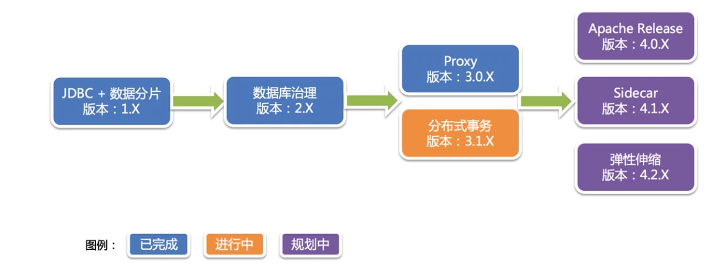

[TOC]

# sharding-jdbc概览

### 认识ShardingSphere

1. ShardingSphere是一套开源的分布式数据库中间件解决方案组成的生态圈，它由Sharding-JDBC，Sharding-Proxy和Sharding-Sidecar这3款相互独立的产品组成。他们均提供标准化的数据分片，分布式事务和数据库治理功能，可适用于如Java同构、异构语言、容器、云原生等各种多样化的应用场景。

### 认识Sharding-JDBC

1. Sharding-JDBC：定位为轻量级Java框架，在Java的JDBC层提供额外的服务。它使用客户端直连数据库，以jar包形式提供服务，无需额外部署和依赖，可理解为增强版的JDBC驱动，完全兼容JDBC和各种ORM框架。
2. 适合于任何基于Java的ORM框架，如：JPA，Hibernate，Mybatis，Spring，JDBC Template或直接使用JDBC。
3. 基于任何第三方的数据库连接池，如：DBCP，C3P0，BoneCP，Druid，HikariCP等。
4. 支持任意实现JDBC规范的数据库。目前支持MySQL，Oracle，SQLServer和PostgreSQL。

### 认识Sharding-Proxy

1. Sharding-Proxy：定位为透明的数据库代理端，提供封装了数据库二进制协议的服务端版本，用于完成对异构语言的支持。目前先提供MySQL版本，它可以使用任何兼容MySQL协议的访问客户端(MySQL Command Client，MySQL Workbench等)操作数据库，对DBA更加友好。
2. 向应用程序完全透明，可直接当作MySQL使用。
3. 适用于任何兼容MySQL协议的客户端。

### 三个组件的对比认识

### 混合架构

1. Sharding-JDBC采用无中心化架构，适用于Java开发的高性能的轻量级OLTP应用。Sharding-Proxy提供静态入口以及异构语言的支持，适用于OLAP应用以及对分片数据库进行管理和运维的场景。

2. ShardingSphere是多接入端共同组成的生态圈。通过混合使用Sharding-JDBC和Sharding-Proxy，并采用统一注册中心统一配置分片策略，能够灵活的搭建适用于各种场景的应用系统，架构师可以更加自由的调整适合于当前业务的最佳系统架构。

### ShardingSphere功能清单

1. 数据分片。
   * 分库&分表。
   * 读写分离。
   * 分布式主键。
2. 分布式事务。
   * XA强一致事务。
   * 柔性事务。
3. 数据库治理。
   * 配置动态化。
   * 熔断&禁用。
   * 调用链路追踪。
   * 弹性伸缩。

### ShardingSphere数据分片内核工作原理

ShardingSphere的3个产品的数据分片主要流程是完全一致的。核心由SQL解析，执行器优化，SQL路由，SQL改写，SQL执行，结果归并的流程组成。

### 规划路线图

