[TOC]

# Sharding-JDBC分库分表

### Sharding-JDBC分库分表概念

1. 逻辑表。

   水平拆分的数据库(表)的相同逻辑和数据结构表的总称。例如：订单数据根据主键%2拆分为2张表，分别是t_order0，t_order1，它们的逻辑表名为t_order。

2. 数据节点。

   数据分片的最小单位。由数据源名称和数据表组成，例如：ds0.t_order0。

   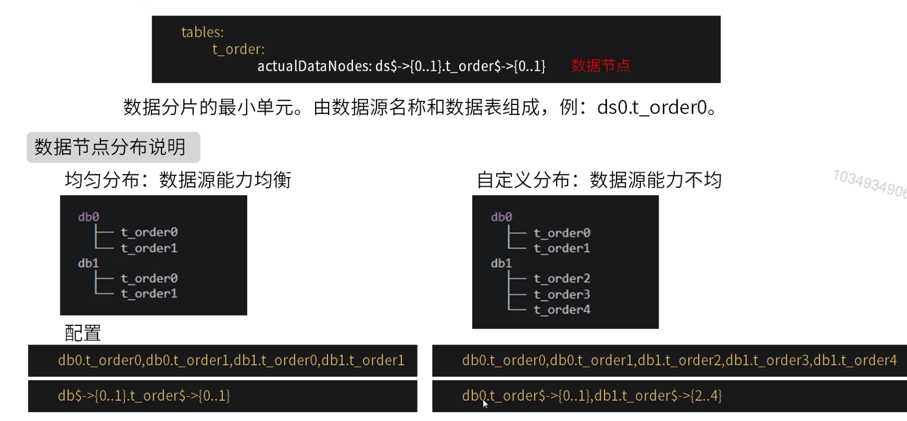

3. 真实表。

   在分片的数据库中真实存在的物理表。即上个示例中的t_order0到order1。

   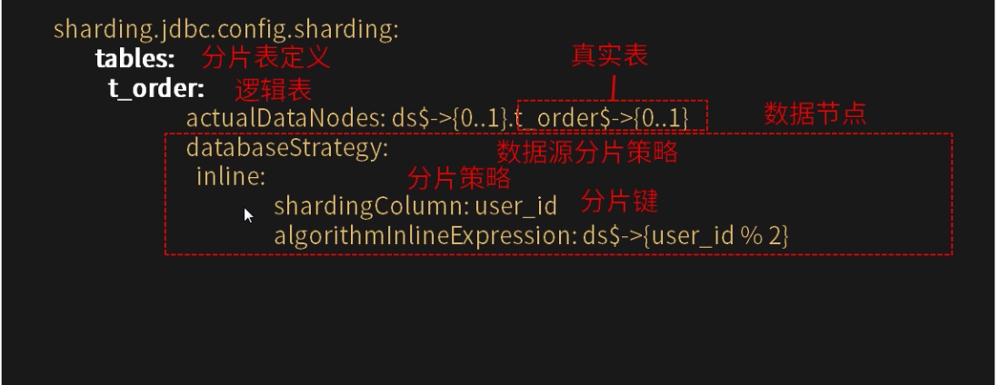
   
4. 分片策略

   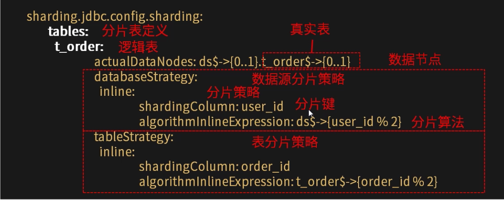

   数据源分片，表分片仅是两个不同维度的分片，它们能用的分片策略规则是一样的。Sharding-JDBC提供了常用的分片策略实现。分片策略由两部分构成：分片键，分片算法。

   * none 不分片策略。

     对应NoneShardingStrategy，不分片策略，SQL会被发给所有节点去执行，这个规则没有子项目可以配置。

   * inline 行表达式分片策略。

     对应InlineShardingStrategy。使用Groovy的表达式，提供对SQL语句中的=和IN的分片操作支持，只支持但分片键。对于简单的分片算法，可以通过简单的配置使用，从而避免繁琐的Java代码开发，如：t_user_$->{u_id % 8}表示t_user根据u_id模8，而分成8张表，表名称为t_user_0到t_user_7。

     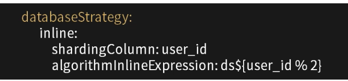

     行表达式语法：${begin…end}表示范围区间；

     `${[unit1，unit2，unitx]}`表示枚举值；行表达式中如果出现连续多个` ${expression}`或​`${expression}`表达式，整个表达式最终的结果将会根据每个字子表达式的结果进行笛卡尔组合。

   * Standard 标准分片策略。

     对应StandardShardingStrategy。提供对SQL语句中的=，IN和BETWEEN AND的分片操作支持。StandardShardingStrategy只支持但分片键，提供PreciseShardingAlgorithm和RangeShardingAlgorithm两个分片算法。PreciseShardingAlgorithm式必选的，用于处理=和IN的分片。RangeShardingAlgorithm是可选的，用于处理BETWEEN AND分片，如果不配置RangeShardingAlgorithm，SQL中的BETWEENT AND将按照全库路由处理。

     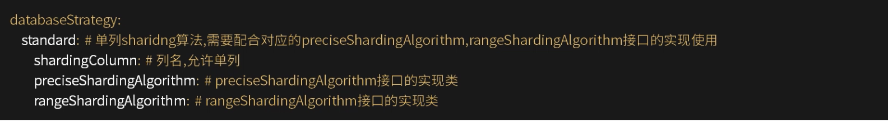

   * complex 复合分片策略。

     对应ComplexShardingStrategy。复合分片策略提供对SQL语句中的=，IN和BETWEEN AND的分片操作支持。ComplexShardingStrategy支持多分片键，由于多分片键之间的关系复杂，因此并未进行过多的封装，而是直接将分片键值组合以及分片操作符透传至分片算法，完全由应用开发者实现，提供最大的灵活度。

     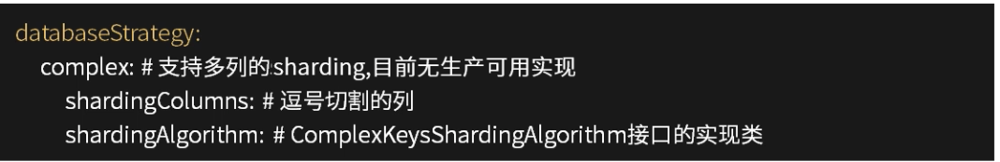

   * hint分片策略。

     对应HintShardingStrategy。通过Hint而非SQL解析的方式分片的策略。对于分片字段非SQL决定，而由其他外置条件决定的场景，可使用SQL Hint灵活的注入分片字段。例入：内部系统，按照员工登陆主键分库，而数据库中并无此字段。SQL Hint支持通过Java API和SQL注释(待实现)两种方式使用。

     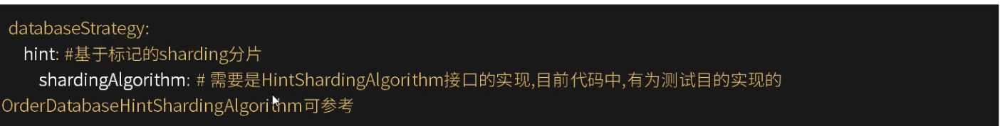

   * 默认数据源，分片策略。

     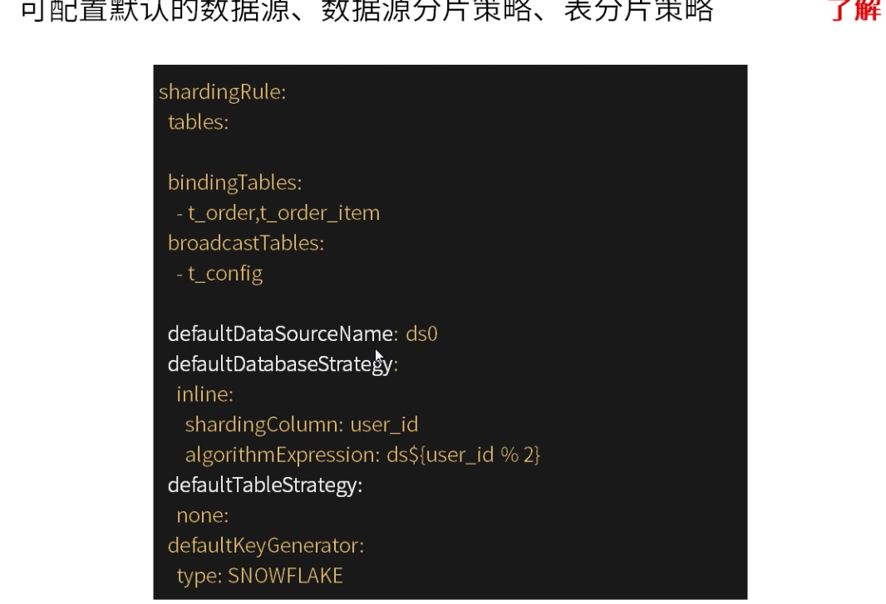

5. 分布式主键。

   ShardingSphere提供灵活的配置分布式主键生成策略方式。在分片规则配置模块可配置每个表的主键生成策略，默认使用雪花算法(snowflake)生成64bit的长整型数据。当前提供了SNOWFLAKE UUID两种方式。

   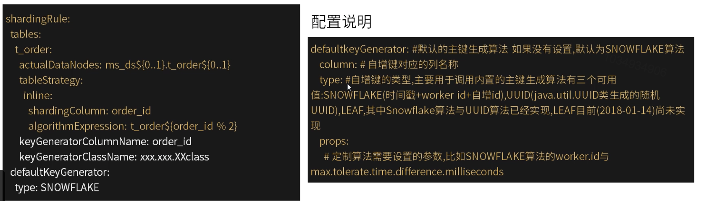

6. 绑定表。

   指分片规则一致的主表和子表。例如：t_order表和t_order_item表，均按照order_id分片，则两张表互为绑定表关系。绑定表之间的多表关联查询不会出现笛卡尔积关联，关联查询效率将大大提升。

   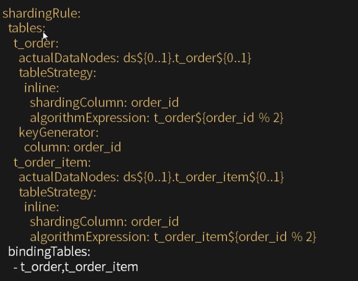

   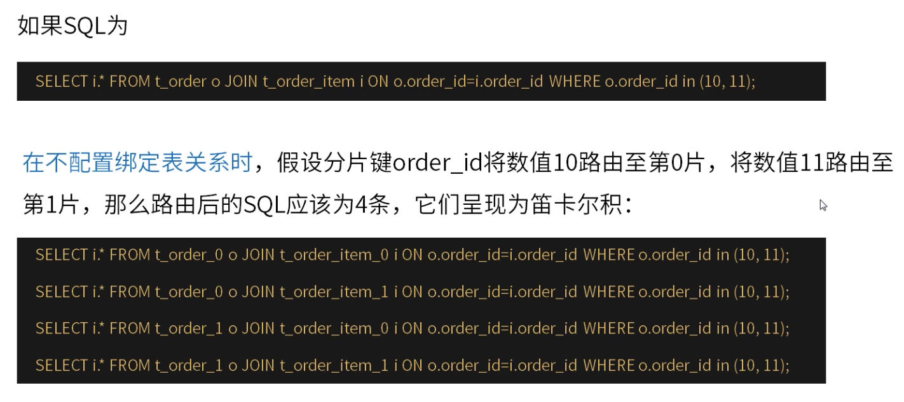

   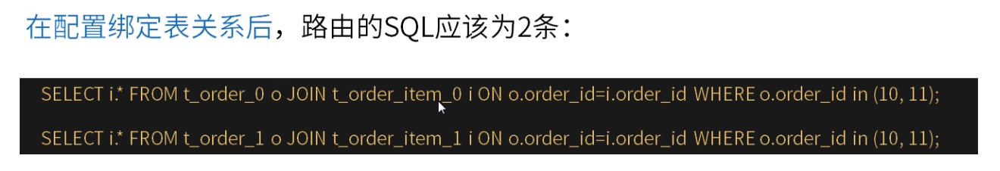

7. 广播表。

   指所有的分片数据源中都存在的表，表结构和表中的数据在每个数据库中均完全一致。适用于数据量不大且需要与海量数据的表进行关联查询的场景，例如：字典表。

   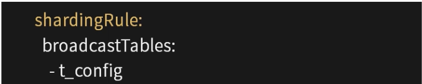

8. 分片加读写分离。

   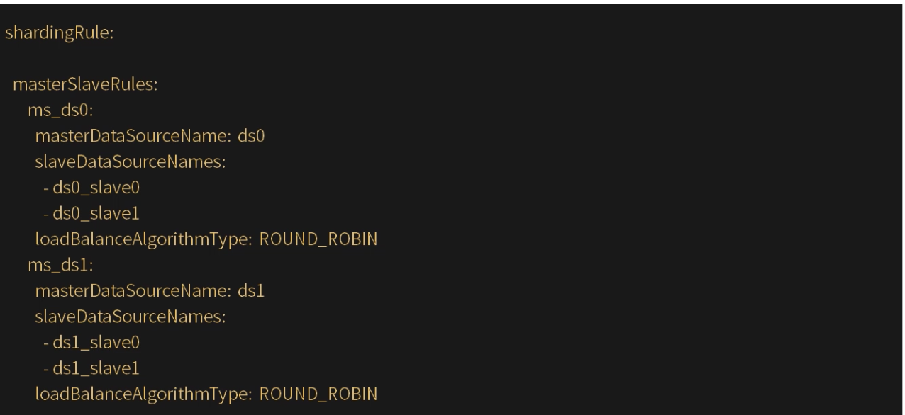

   

