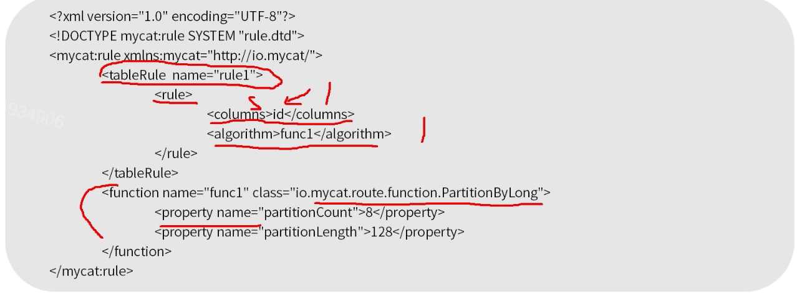

[TOC]

# 分库分表

### MyCat中表分类

1. 分片表。

   分片表是指那些有很大数据，需要且分到多个数据库的表，这样每个分片都有一部分数据，所有分片构成了完整的数据。

   

2. 非分片表。

   一个数据库中并不是所有的表都很大，某些表是可以不用进行切分的，非分片是相对分片表来说的，就是那些不需要进行数据切分的表。

   

3. ER表。

   MyCat中ER表是基于E-R关系的数据分片策略，子表的记录与所关联的父表记录存放在统一数据分片上，保证数据join不会跨库操作。

   ER分片是解决跨库分片数据join的一种很好的思路，也是数据切分规划的一条重要规则。

   

4. 全局表。

   一个真实的业务系统中，往往存在大量的类似字典表的表，这些表基本上很少变动。

   问题：业务表往往需要和字典表进行join查询，当业务表因为规模而进行分片以后，业务表与字典表之间的关联就跨库了。

   解决：MyCat中通过表冗余来解决这类表的join，即它的定义中指定的dataNode上都有一份该表的拷贝(将字典表或者符合字典表特性的表定义为全局表)。

   

### 分片规则

1. 在conf/rule.xml中定义分片规则。

   

   

·