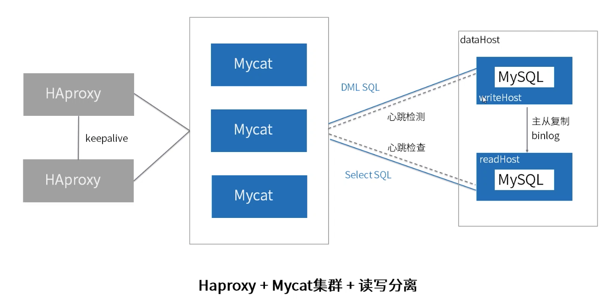
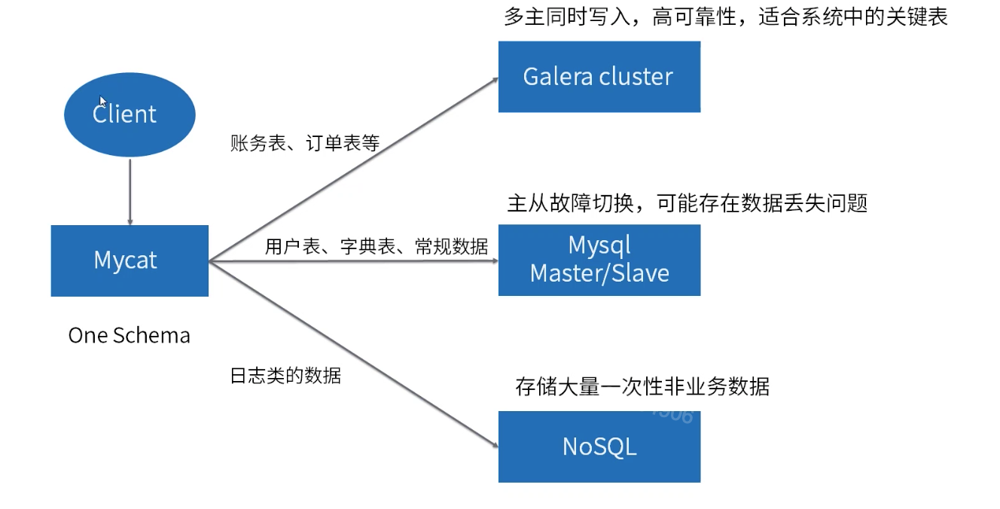
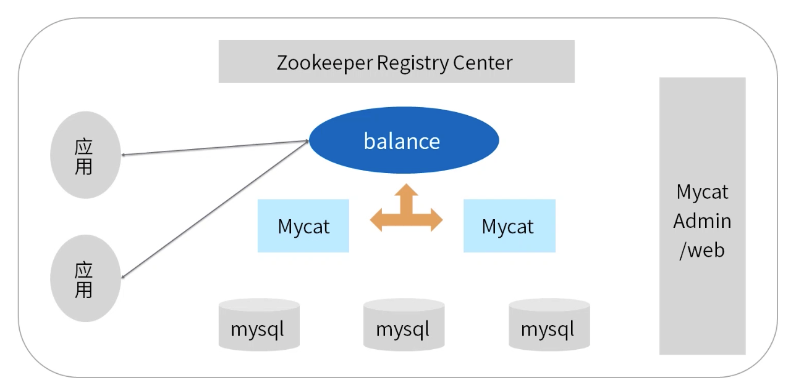

[TOC]

# MyCat架构实践

### MyCat高可用方案

### MyCat1.6架构

1. 集群处理。
2. 自动扩容。
3. 智能优化。
4. 大数据处理。

### MyCat监控介绍

MyCat-web

1. 支持对MyCat，MySQL性能监控。
2. 支持对MyCat的JVM内存提供监控服务。
3. 支持对线程的监控。
4. 支持对操作系统的CPU，内存，磁盘，网络的监控。

还有MyCat-mini-monitor。