[TOC]

# 后端整体架构分享

### 整体架构

#### 技术选型

1. 服务发现
   * Eureka
   * Dubbo
2. 动态配置
   * Spring-cloud-config
   * Spring-cloud-bus
   * Gitlab
3. 隔离容错
   * 基于Hystrix二次开发
4. 监控报警
   * 哨兵系统
   * 分布式追踪
5. 分布式事务
   * TCC
   * 事务消息
6. 其他组件
   * 持续集成平台
   * 延迟任务调度系统
   * 批处理任务调度系统

#### 技术架构

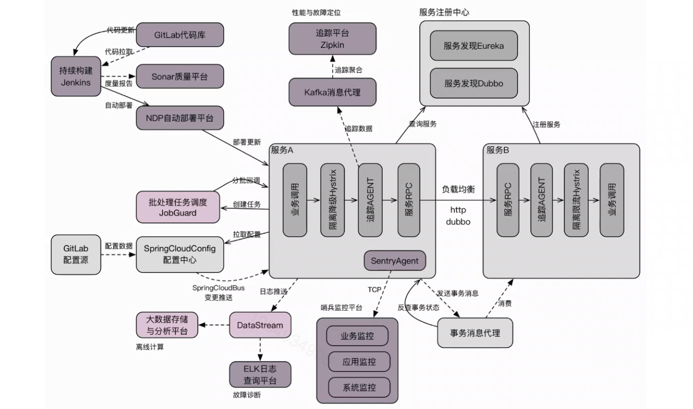

### 稳定性保障

#### 开发阶段

1. 开发人员的性能意识，如：SQL，内存读写，磁盘读写，网络等。
2. 持续集成，Code Review。

#### 运行阶段

1. 隔离，限流，熔断，降级。
2. 监控，报警，分布式追踪。
3. 性能优化：观察监控系统中的曲线毛刺，GC，负载，异常等。

#### 故障阶段

1. 故障预案恢复。
2. 线上故障排查工具：内存分析，mat，arthas，等。

#### 持续集成平台

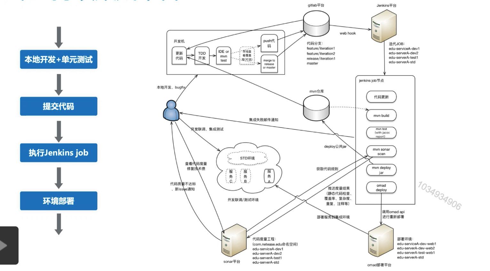

#### 为什么要隔离容错

1. 隔离资源，防止资源耗尽导致整体不可用。
2. 容忍错误，防止故障传递引发系统雪崩。

#### 隔离容错的手段

1. 隔离：隔离资源，如不同方法，不同调用来源使用单独线程池。
2. 限流：限制服务指定维度的并发数，tps。
3. 熔断：服务不可用或超时的情况下，暂时停止对该服务的调用，以防止系统雪崩。
4. 降级：熔断情况下，对非核心接口提供一个有损的服务，保证整个系统的可用性。

#### 设计要点

1. 基于hystrix实现限流，隔离，熔断，降级。
2. 基于动态代理，框架原生spi低侵入实现hystrix接入。
3. 提供自定义注解，方便接入，提供fallback支持。
4. 桥接spring environment，配置参数动态变更。
5. 接入监控平台，配置报警，及时反馈系统运行状态，为调整参数做数据支撑。

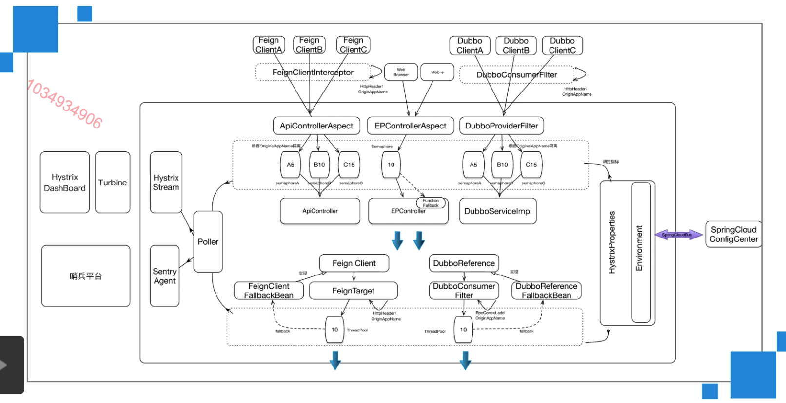

#### 云课堂ElK日志分析平台

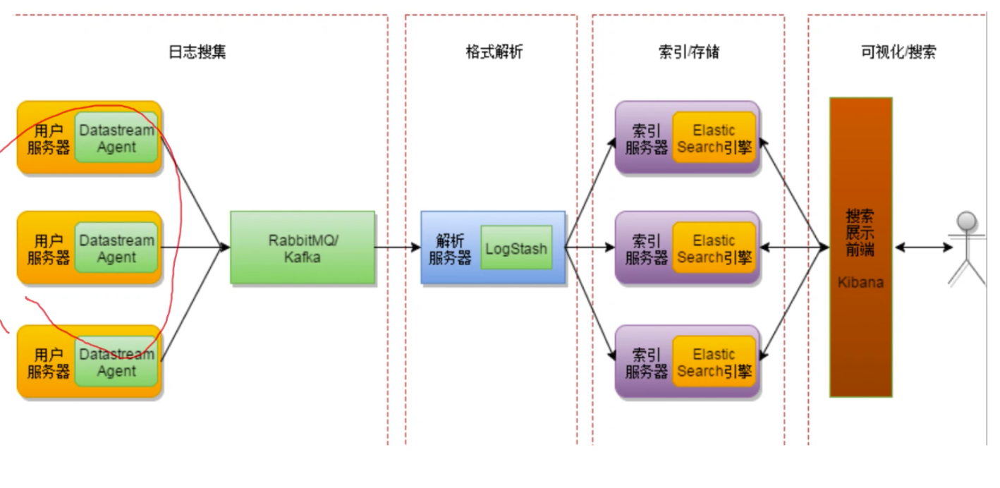

#### 分布式追踪框架

1. 背景

   * 微服务场景下，服务众多，服务调用链路错综复杂，出现问题难以快速定位。
   * 一次调用的信息分布在多台机器上，ELK无法将日志信息串联起来。

2. 实现目标

   * 串联单次请求的每一步调用信息，按顺序汇总生成调用链。
   * 记录每次调用的入参和返回值，便于问题重现。
   * 记录调用的时间消耗，为性能调优提供数字指标。
   * 调用信息统计，基于调用信息进行数据分析，如生成服务拓扑图。

3. 核心概念

   * Span，代表基本工作单元，比如一次rpc调用，span通过spanId和traceId唯一标识，span包含数据信息，比如摘要，时间戳事件，关键值注释等。

   * Trace，由一组有相同traceId和span串联形成一个树状结构。在分布式系统入口为请求创建唯一的跟踪标识，在调用过程中保持传递该唯一标识。

   * Annotation，用于记录一段时间内的事件，如：

     cs-Client Sent 客户端发起一个请求

     Sr-Server Received 服务端获得请求并准备开始处理它

     ss-Server Send 注解表明请求处理的完成

     Cr-Client Received 表明span的结束，客户端成功接收到服务器的回复。

   #### 如何构建分布式追踪框架

   1. 调用链路中传递traceId sleuth。
   2. 单次调用span信息生成 brave。
   3. 追踪数据存储 zipkin。
   4. 追踪数据展示 zipkin UI。

   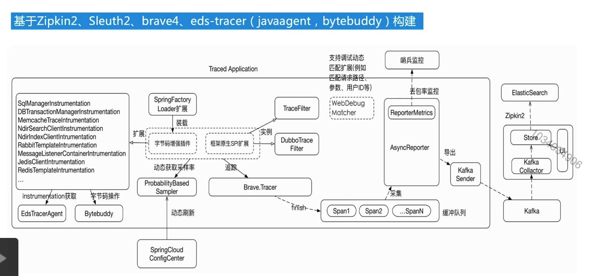

   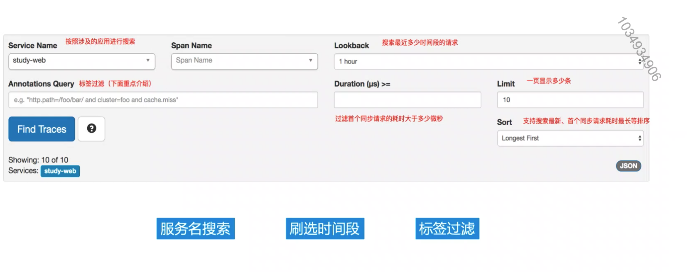

   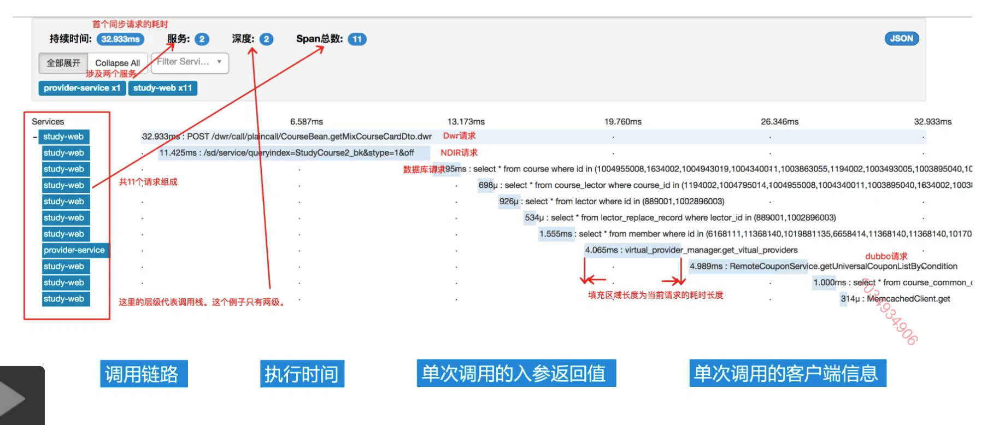

   

### 交易系统实践

   #### 课程到商品的抽象

   一般都是引入中间系统来进行解耦，把散落在各个系统的相同的业务逻辑抽取出来，在一个系统中进行维护。

   #### 交易流程优化

   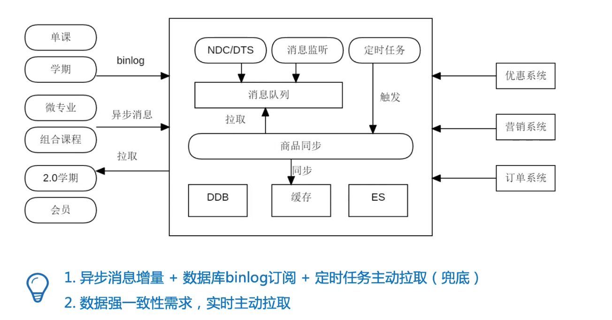

   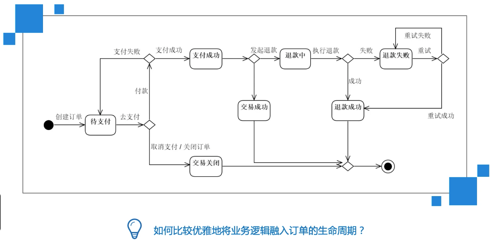

   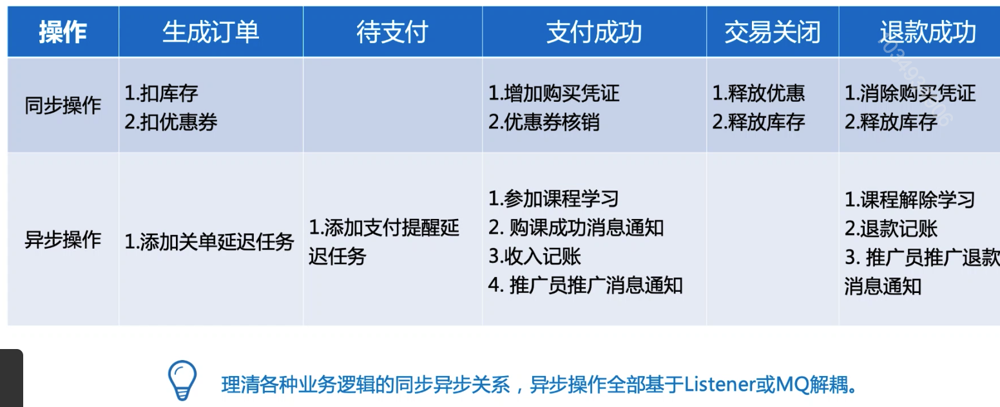

   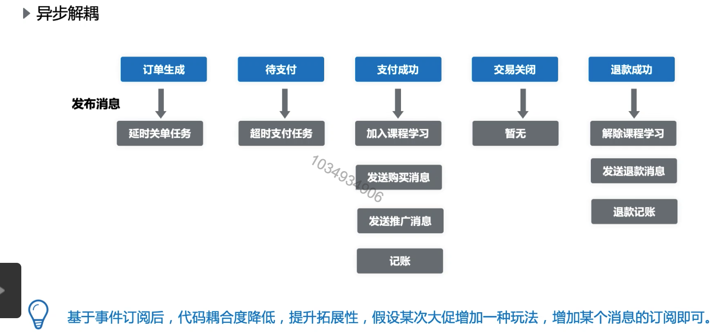

   #### 一致性问题

   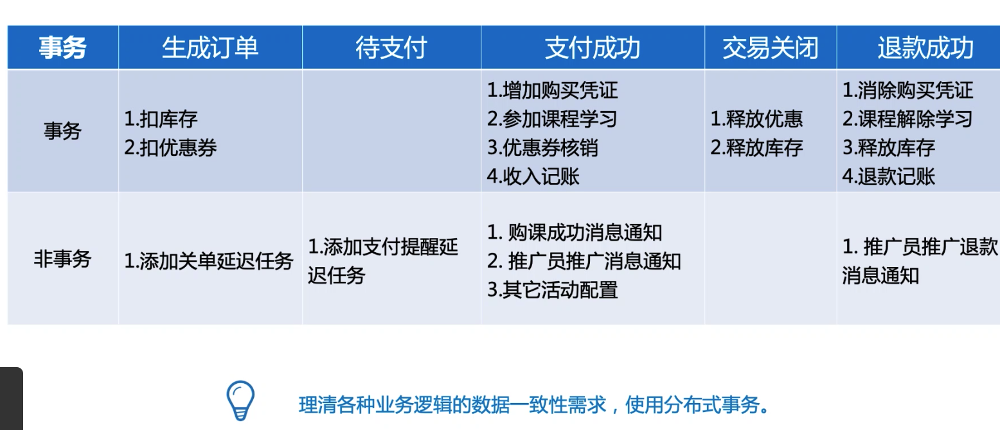

   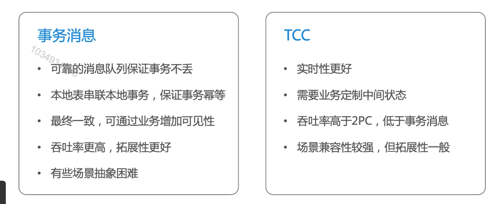

   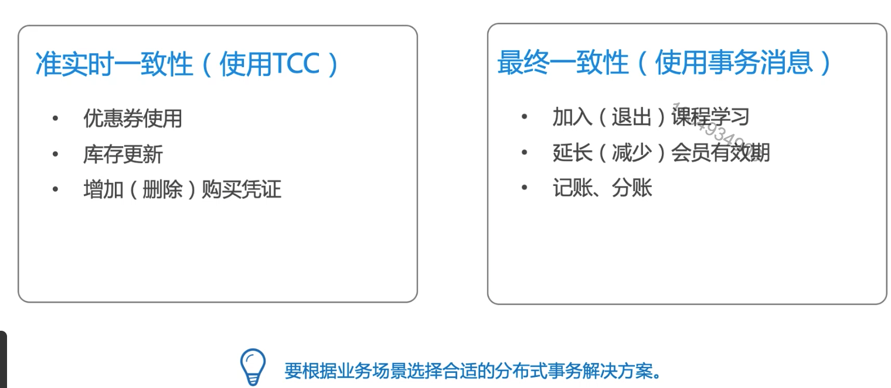

   #### 如何高效查询，搜索订单

   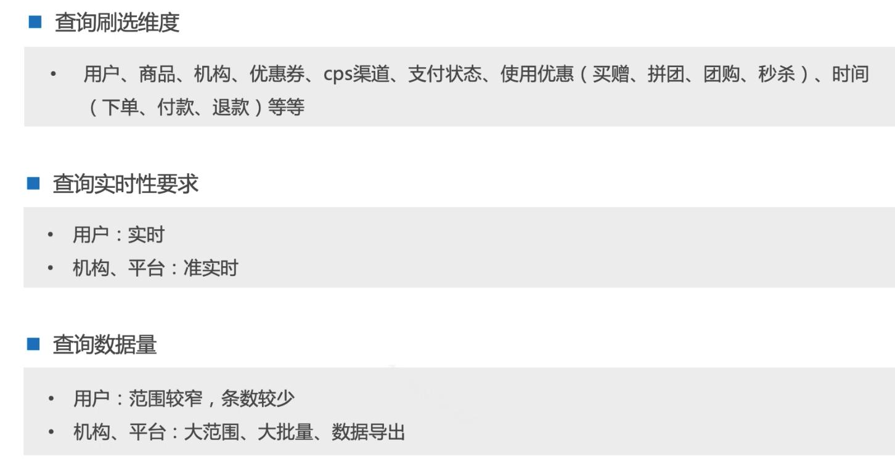

   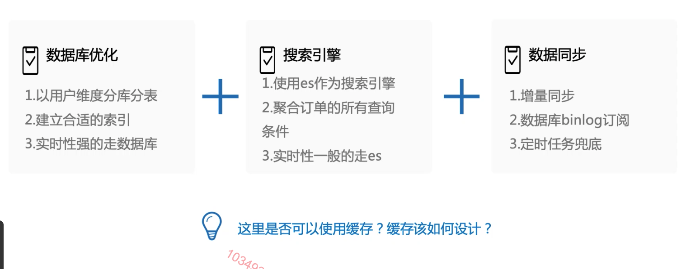

   