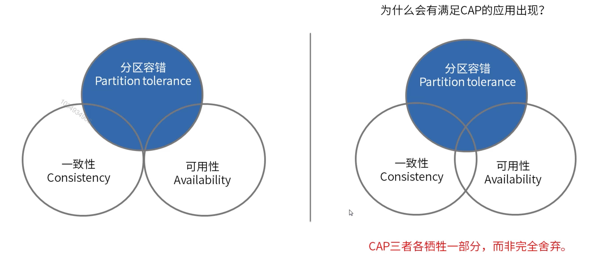

[TOC]

# 分布式系统设计重要理论

#### CAP定理

CAP定理，又被称作布鲁尔定理，1998年第一次提出。

最初提出是指分布式数据存储不可能同时提供以下三种保证中的两种以上。

- 一致性(Consistence)：每次读取收到的信息都是最新的。
- 可用性(Available)：每个请求都会收到(非错误)响应。
- 分区容错(Partition tolerance)：尽管节点之间的网络不通导致分区，系统仍继续运行。

事实上，不仅仅是分布式数据存储应用，所有分布书系统都必须在CAP这三点之间权衡。

#### 数据一致性模型

如果数据读取，写入，更新的结果是可预测的，我们说它遵循数据一致性模型。

1. 严格一致性(Strict Consistence)(强)：不论在哪个节点，看到的资源都是统一的结果。
2. 顺序一致性(Sequential Consistency)(弱)：节点的数据变动和操作顺序保持一致。
3. 最终一致性(Eventual consistency)(弱)：所有数据副本最终都会变得一致。

#### BASE理论

BASE是Basically Available(基本可用)，Soft sate(软状态)和Eventual consistency(最终一致性)三个短语的缩写。

1. 基本可用：可能是部分功能不可用或者是响应时间延长。
2. 软状态：不同系统/节点之间，数据存在过渡状态。
3. 最终一致：经过系统内部协调机制，最终所有节点保持一致(分布式系统中的一致并不一定指数据保持一样)。

#### 业务系统设计原则

##### 墨菲定律

墨菲定律是一种心理学效应，由爱德华 墨菲提出的，也称墨菲法则。

墨菲定律的原句是：如果有两种或两种以上的方式去做某件事情，而其中一种选择方式将导致灾难，则必定有人会做出这种选择。本质：如果事情有变坏的可能，不管这种可能性有多小，它总会发生。

系统设计和架构上的理解：

1. 人和事都没有表面看起来那么简单。
2. 所有的事都会比你预计的时间长。
3. 会出错的事总会出错。
4. 如果你担心某种情况发生，那么它就更有可能发生。

##### 康威定律

设计系统的架构受制于产生这些设计的组织的沟通结构。

在系统架构设计上的思考：

1. 系统架构是公司组织架构的反映。
2. 应该按照业务闭环进行系统拆分/组织架构划分，实现闭环/高内聚/低耦合，减少沟通成本。(在合适时机进行系统拆分，不要一开始就把系统/服务拆分的非常细，虽然闭环，但是每个人维护的系统多，维护成本高。)
3. 如果沟通出现问题，那么应该考虑进行系统和组织架构的调整。
4. 时间再多一件事情也不可能做的完美，但总有时间做完一件事情。