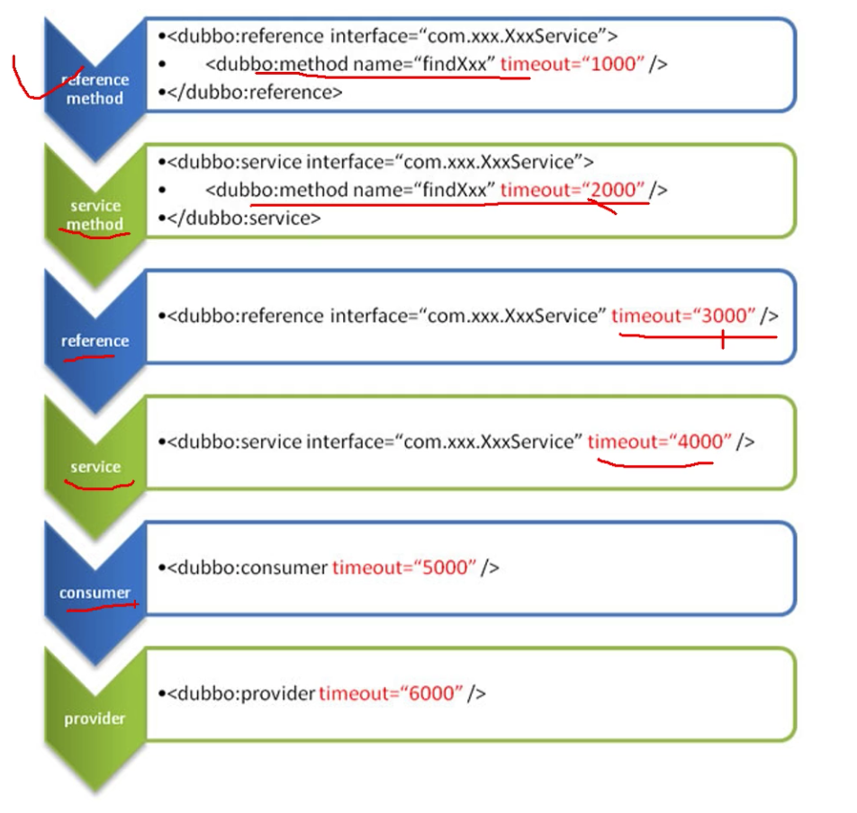
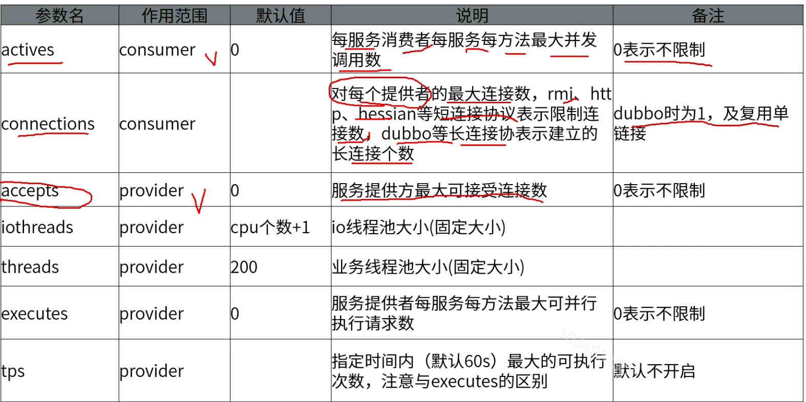
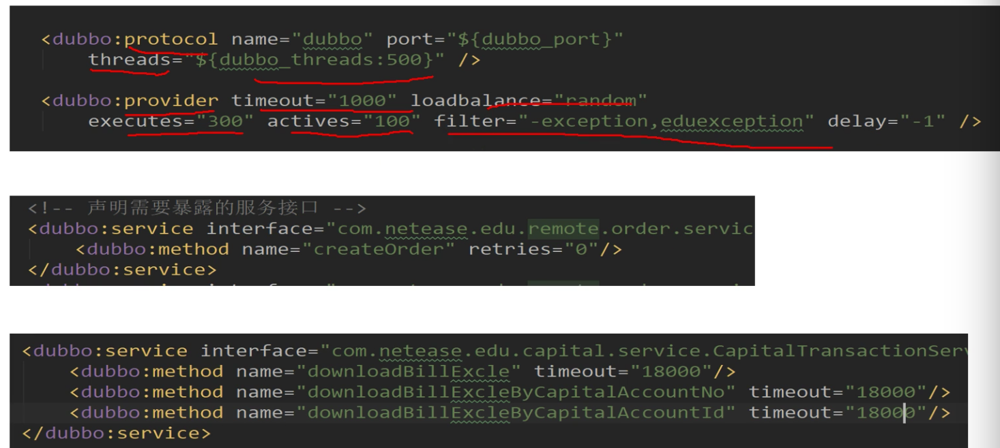

[TOC]

# Dubbo在网易内部应用

### dubbo参数调优

dubbo参数配置优先级

### dubbo中重要的调优参数

1. 参数默认在provider的provider节点配置，再结合业务场景对配置进行细化，总体原则时，服务提供者一定要为整个业务兜底，确保服务提供者端的稳定性。

2. 一般会针对接口中的新增方法设置retires="0"，这样就不会因为超时导致插入多条重复数据。

3. 对部分运行时间比较长的方法会增加超时时间。

   thread="500"

   timeout="1000"

   loadbalance="random"

   executes="300"

   actives="100"

   

   