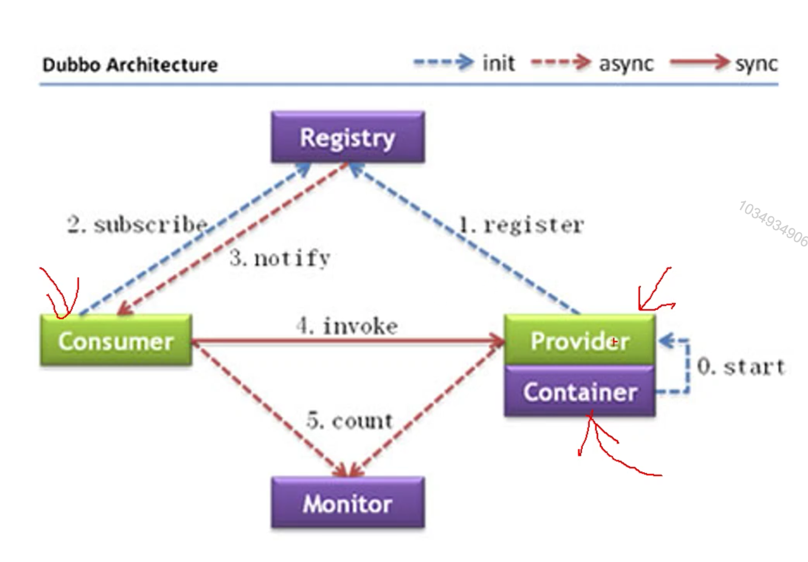
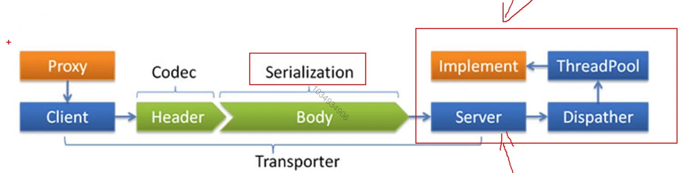
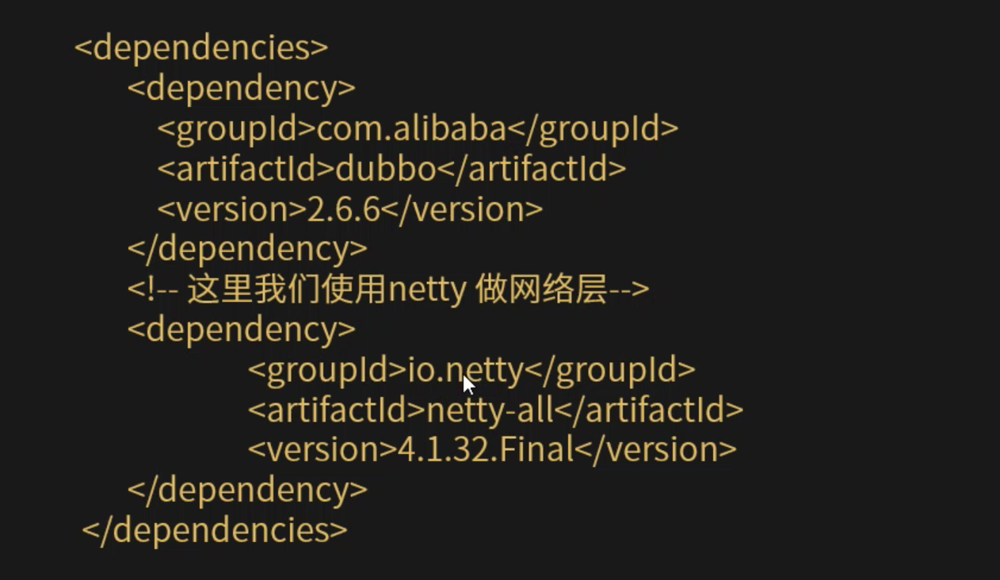
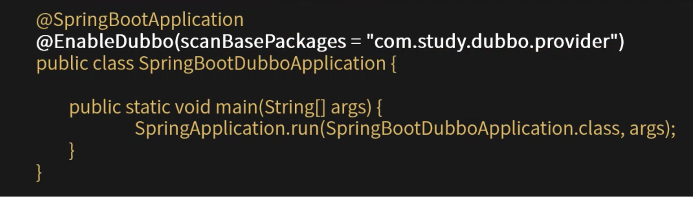
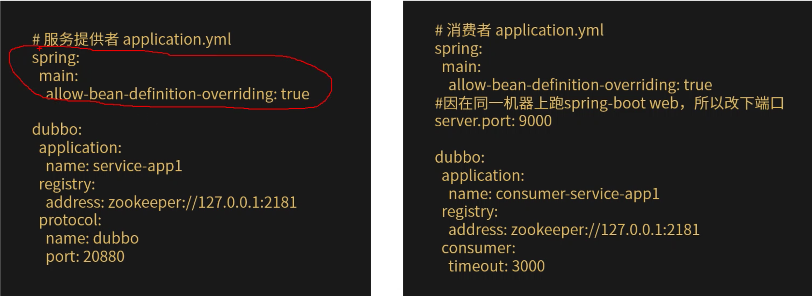
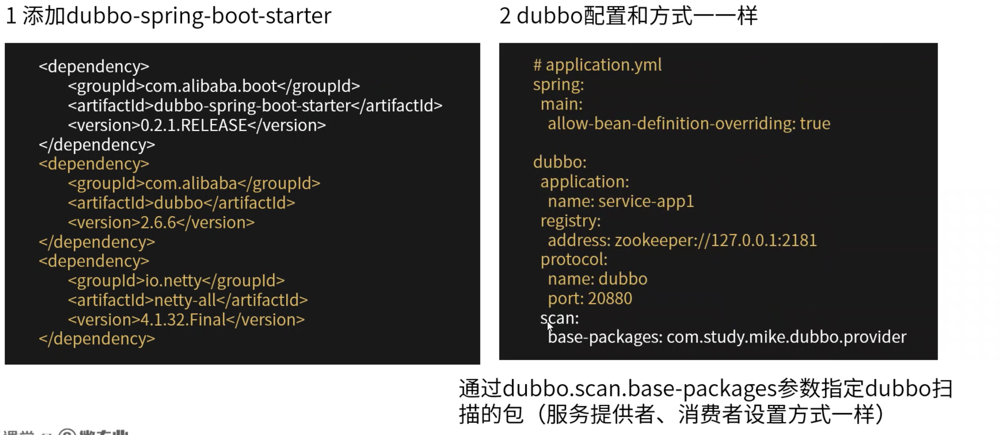

[TOC]

# dubbo入门

### dubbo是什么

1. 一款高性能的Java RPC框架。
2. 一款简单，易用的Java RPC框架。
3. 一款优秀的RPC服务治理框架。
4. 由阿里贡献的开源RPC框架。

### dubbo能做什么

1. 服务开发(rpc应用开发)。
2. 服务软负载均衡。
3. 服务依赖管理。
4. 服务监控。
5. 服务治理。

### dubbo的架构

|   节点    |                角色说明                |
| :-------: | :------------------------------------: |
| Provider  |          暴露服务的服务提供方          |
| Consumer  |        调用远程服务的服务消费方        |
| Registry  |      服务注册与服务发现的注册中心      |
|  Monitor  | 统计服务的调用次数和调用时间的监控中心 |
| Container |              服务运行容器              |

### dubbo架构的特点

1. 连通性。
   * 注册中心负责服务地址的注册与查找，相当于目录服务，服务提供者和消费者只在启动时与注册中心交互，注册中心不转发请求，压力较小。
   * 监控中心负责统计各服务调用次数，调用时间等，统计先在内存汇总后每一分钟一次发送到监控中心服务器，并以报表显示。
   * 服务提供者想注册中心注册其提供的服务，并汇报调用时间到监控中心，此时间不包含网络开销。
   * 服务消费者向注册中心获取服务提供者地址列表，并根据负载算法直接调用提供者，同时回报调用时间到监控中心，此时间包含网络开销。
   * 注册中心，服务提供者，服务消费者三者之间均为长连接，监控中心除外。
   * 注册中心通过长连接感知服务提供者的存在，服务提供者宕机，注册中心将立即推送事件通知给消费者。
   * 注册中心和监控中心全部宕机，不影响已运行的提供者和消费者，消费者再本地缓存了提供者列表。
   * 注册中心和监控中心都是可选的，服务消费者可以直连服务提供者。
2. 健壮性。
   * 监控中心宕掉不影响使用，只是丢失部分采样数据。
   * 数据库宕掉后，注册中心仍能通过缓存提供服务列表查询，但不能注册新服务。
   * 注册中心对等集群，任意一台宕掉后，将自动切换到另一台。
   * 注册中心全部宕掉后，服务提供者和服务消费者仍能通过本地缓存通讯。
   * 服务提供者无状态，任意一台宕掉后，不影响使用。
   * 服务提供者全部宕掉后，服务消费者应用将无法使用，并无限次重连等待服务提供者恢复。

### dubbo服务调用工作流程

### dubbo使用

1. 服务提供端：
   * 独立的服务(以普通的java程序形式)
   * 集成在应用中(在应用中增加服务能力)
2. 消费端：
   * 在应用中调用远程服务。
   * 也可以在服务提供者中调用远程服务。

### dubbo使用步骤

* 引入dubbo相关依赖。
* 配置dubbo框架。
* 开发服务。
* 配置服务。
* 启动，调用。

1. 引入dubbo相关依赖。

   

2. 配置dubbo框架。

   3中配置方式：

   * spring schema xml方式，适用于spring应用。
   * 注解方式，适用于spring应用，需要2.6.3及以上版本。
   * API方式，API方式使用范围说明：API仅采用OpenAPI，ESB，Test，Mock等系统集成。普通服务提供方或消费方，请采用XML配置方式使用dubbo。

### spring boot中集成

1. 方式一：@EnableDubbo集成。

   * 在Springboot的启动类上加@EnableDubbo注解开启dubbo(服务提供者，消费者的是一样的，扫描的包可能不一样)。

   

   * 配置dubbo。
   
     
   
2. 方式二：Dubbo-spring-boot-starter方式。

   * 添加dubbo-spring-boot-starter

     

     