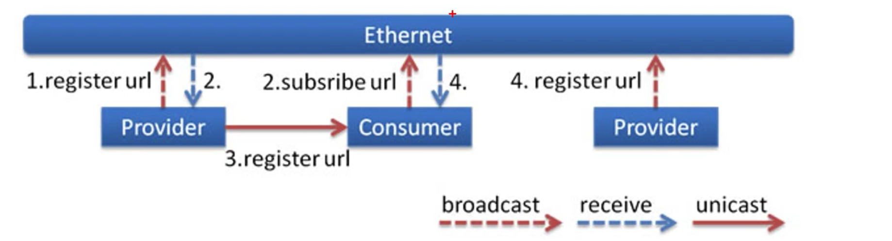
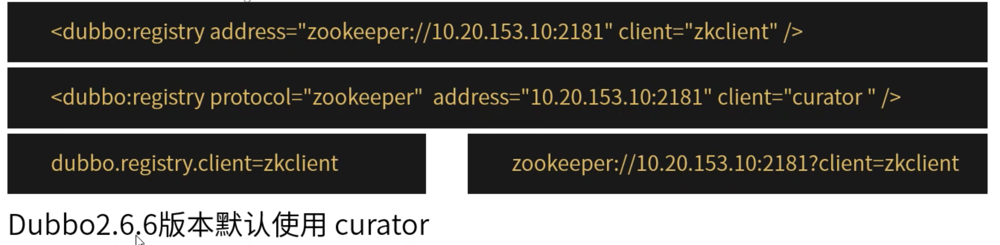
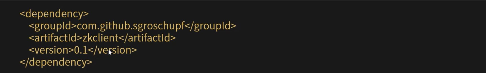
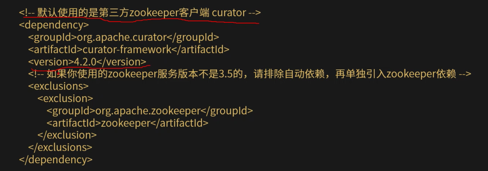
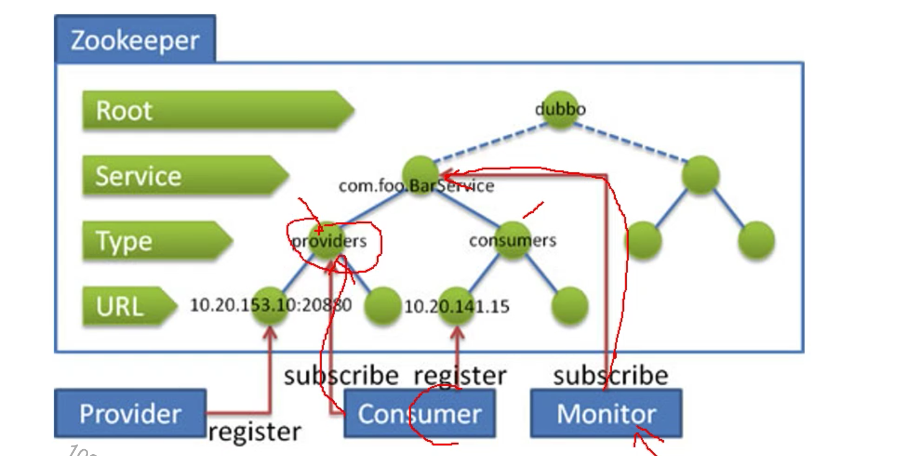
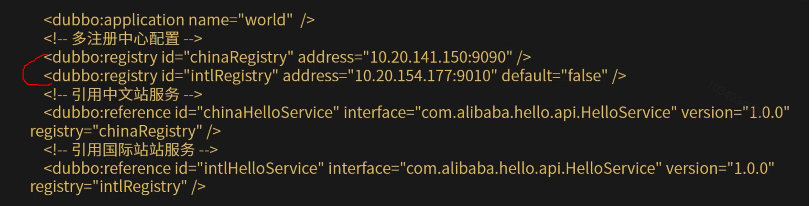

[TOC]

# dubbo特性详解

### dubbo支持多种注册中心

1. Mulitcast注册中心。

   

   为了减少广播量，Dubbo缺省使用单播发送提供者地址信息给消费者，如果一个机器上同时启了多个消费者进程，消费者需要声明unicast=false，否则只会有一个消费者能收到消息。

   

   注解方式参数配置：

   

2. 工作原理。

   

   * 提供方启动时广播自己的地址。
   * 消费方启动时广播订阅请求。
   * 提供方收到订阅请求时，单播自己的地址给订阅者，如果设置了unicast=false，则广播给订阅者。
   * 消费方收到提供方地址时，连接该地址进行RPC调用。

   特点：

   * Multicast注册中心不需要启动任何中心节点，只要组播地址一样，就可以相互发现。
   * 组播受网络结构限制，只适合小规模应用或开发阶段使用。组播地址段：224.0.0.0-s39.255.255.255。

### Zookeeper注册中心

1. 在provider和consumer中增加zookeeper客户端jar包依赖。

   

2. dubbo支持zkClient和cruator两种Zookeeper客户端实现。

   

3. 使用zkclient zookeeper客户端。

   

4. 使用curator zookeeper客户端。

   

5. zookeeper集群配置。

   

6. 工作原理。

   

   * 服务提供者启动时，向/dubbo/com.foo.BarService/providers目录下写入自己的URL地址。
   * 服务消费者启动时，订阅/dubbo/com.foo.BarService/providers目录下的提供者URL地址。并向/dubbo/com.foo.BarService/consumers目录下写入自己的URL地址。
   * 监控中心启动时：订阅/dubbo/com.foo.BarService目录下所有提供者和消费者URL地址。

7. zookeeper注册中心支持以下功能。

   * 当提供者出现断电等异常停机时，注册中心能自动删除提供者信息。
   * 当注册中心重启时，能自动恢复注册数据，以及订阅请求。
   * 当会话过期时，能自动恢复注册数据，以及订阅请求。
   * 当设置<dubbo:register check="false"/>时，记录是失败注册和订阅请求，后台定时重试。
   * 可通过<dubbo:register username="admin" password="1234"/>设置zookeeper登陆信息。
   * 可通过<dubbo:register group="dubbo"/>设置zookeeper的根节点，不设置将使用无根树。
   * 支持*号通配符<dubbo:reference group="*" version="*"/>，可订阅服务的所有分组和所有版本的提供者。

8. 同一Zookeeper，分成多组注册中心。

   

   适合作为dubbo服务的注册中心，工业强度高，可用于生产环境，并推荐使用。

### 支持多注册中心

dubbo支持同一服务向多注册中心注册，或者不同服务分别注册到不同的注册中心上去，甚至可以同时引用注册在不同注册中心上的同名服务。

比如：中文站有些服务来不及在青岛部署，只在杭州部署，而青岛的其它应用需要引用此服务，就可以将服务同时注册到两个注册中心。

不同服务使用不同注册中心。

比如：CRM有些服务时专门为国际站设计的，有些服务时专门为中文站设计的。

### 支持多种使用场景

1. 只订阅。
2. 只注册。
3. 直连提供者。
4. 静态服务。

