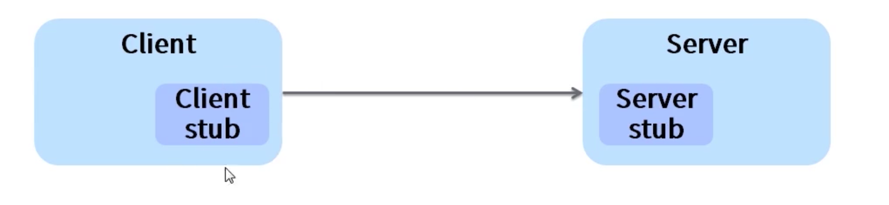
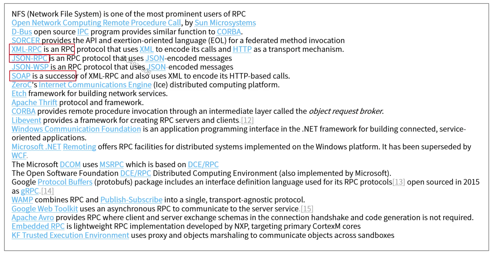

[TOC]

# RPC理论

#### RPC是什么

应用1->应用2

1. remote procedure call：远程过程调用。过程是什么？过程就是业务处理，计算任务，更直白理解就是程序(像调用本地方法一样调用远程的过程)。RPC采用Client-Server结构，通过request-response消息模式实现。

2. PRC和RMI有什么区别？

   RMI(remote method invocation)远程方法调用是oop领域中RPC的一种具体实现。

3. 我们熟悉的web service，restfully接口调用是RPC吗？

   都是RPC，仅消息组织方式及消息协议不同。

4. 远程过程调用较本地调用有何不同？

   速度相对慢，可靠性减弱。

#### RPC流程

1. 客户端处理过程中调用Client stub(就像调用本地方法一样)，传递参数。
2. Client stub将参数编组为消息，然后通过系统调用向服务端发送消息。
3. 客户端本地操作系统将消息从客户端机器发送到服务端机器。
4. 服务端操作系统将接收到的数据包传递给Server stub。
5. Server stub解组消息为参数。
6. Server stub再调用服务端的过程，过程执行结果以反方向的相同步骤响应给客户端。

#### RPC流程中需要处理的问题

1. Client stub，Server stub的开发。
2. 参数如何编组为消息，以及解组消息。
3. 消息如何发送。
4. 过程结果如何表示，异常情况如何处理。
5. 如何实现安全的访问控制。

#### RPC协议是什么

RPC调用过程中需要将参数编组为消息进行发送，接收方需要解组消息为参数，过程处理结果同样需要经编组，解组。消息由哪些部分构成及消息的表示形式就构成了消息协议。RPC调用过程中采用的消息协议成为RPC协议。

RPC协议规定请求，响应消息的格式在TCP(网络传输控制协议)上可选用或自定义消息协议来完成RPC消息交互。我们可以选用通用的标准(如：http，https)，也可根据自身的需要定义自己的消息协议。

#### 常见的RPC协议

#### RPC框架是什么

封装好参数编组，消息解组，底层网络通信的RPC程序开发框架，带来的便捷是可以直接在其基础上只需专注于过程代码编写。

Java领域：

1. 传统的webservice框架：Apache CXF，APACHE Axis2，java自带的JAX-WS等等。webService框架大多基于标准的SOAP协议。
2. 新兴的微服务框架：Dubbo，spring cloud，Apache Thrift等。

#### 为什么要用RPC

1. 服务化。
2. 可重用。
3. 系统间交互调用。

#### RPC核心概念术语

1. Client，Server，calls，replies，service，programs，procedures，version，marshaling，unmarshalling。
2. 一个网络服务由一个或多个远程程序集构成。
3. 一个远程程序实现一个或过个远程过程。
4. 过程，过程的参数，结果在程序协议说明书中定义说明。
5. 为兼容程序协议的变更，一个服务端可能支持多个版本的远程程序。

