[TOC]

# 手写RPC框架

###RPC的流程

1. 客户端处理过程中调用Client stub(就像调用本地方法一样)，传递参数。
2. Client stub将参数编组为消息，然后通过系统调用向服务端发送消息。
3. 客户端本地操作系统将消息从客户端机器发送到服务端机器。
4. 服务端操作系统将接收到的数据包传递给Server stub。
5. Server stub解组消息为参数。
6. Server stub再调用服务端过程，过程执行结果以反向的相同步骤响应给客户端。

### 从使用者角度开始

用户使用RPC框架开发过程中时需要做什么？

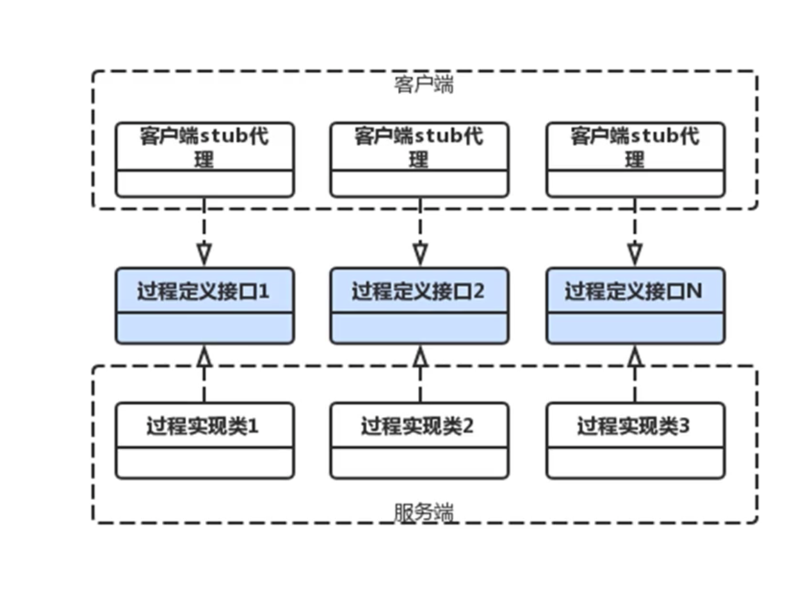

1. 定义过程定义接口。
2. 服务端实现过程。
3. 客户端使用生成的stub代理对象。

### 设计客户端

客户端生成过程接口的代理对象。

设计客户端代理工厂，用JDK动态代理即可生成接口的代理对象。

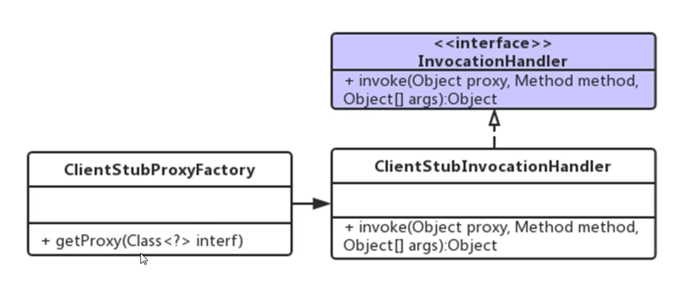

#### 思考

1. 在ClientStubInvocationHandler中需要完成哪些事情？

   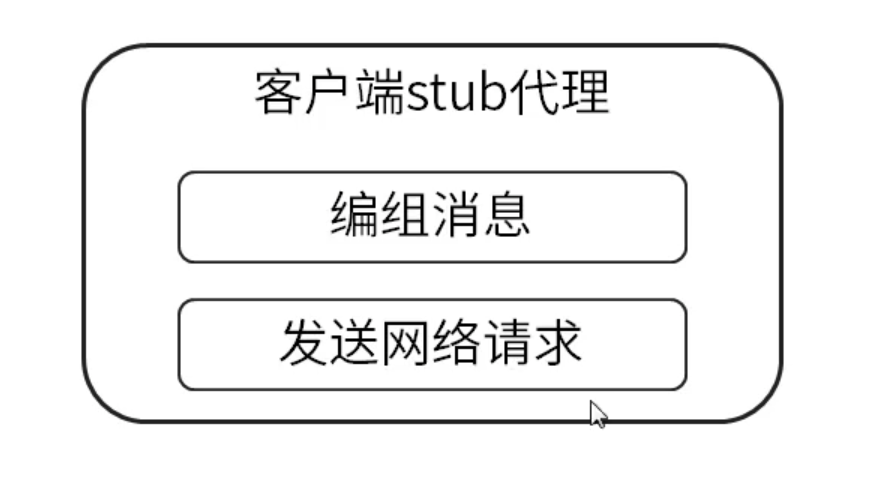

2. 将请求的内容编组为消息这件事由谁来做？

   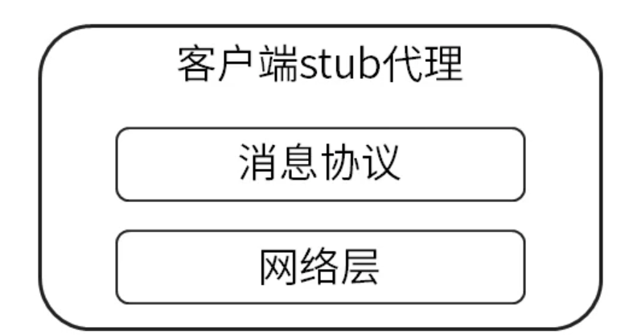
   
3. 消息协议是固定不变吗？它与什么有关？

   看框架对协议的支持广度，如果支持多种协议，就是会灵活变化的，它与具体的服务相关，A服务提供者可能选用的是协议1，B服务提供者可能选用协议2。

4. 某服务是用什么消息协议这个信息从哪来？

   从获取服务信息中来，因此需要一个服务信息发现者。把发现者设计出来，要求：可灵活支持多种发现机制。

   

   #### 发现者

   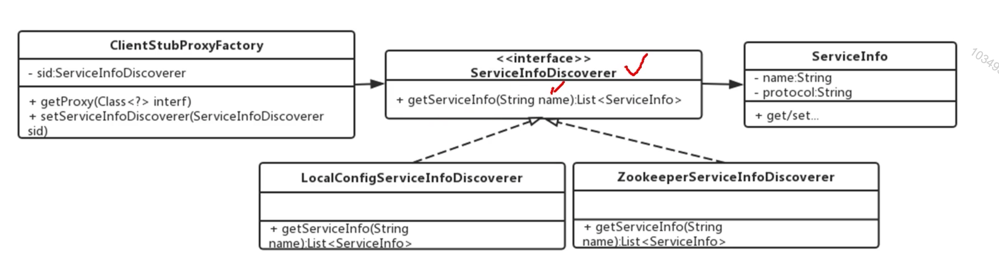

   5. 我们想要做到可以支持多种协议，我们的类该如何设计？

      面向接口，策略模式，组合。

      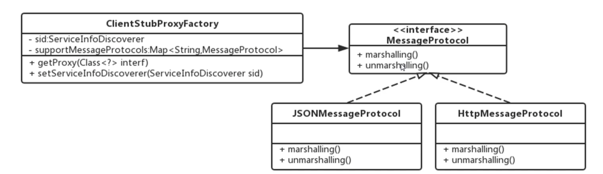

      问题：

      * marshalling和unmarshalling方法该定义怎样的参数与返回值？
      * 编组，解组的操作对象是请求，响应。请求，响应的内容是不同的。编组，解组两个方法是否满足？

   6. 定义框架标准的请求，响应类。

      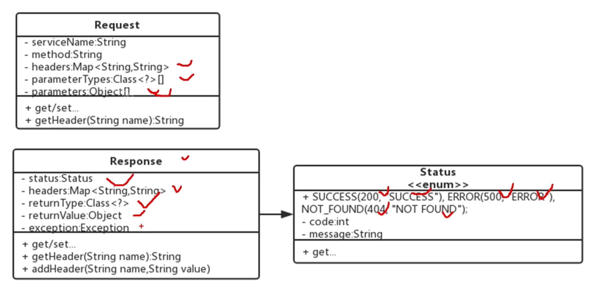

   7. 将协议层方法扩展为4个。

      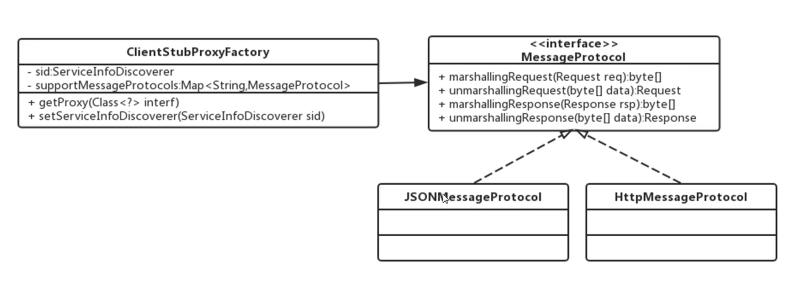

      消息协议独立为一层(客户端，服务端均需要)

   8. 网络层的工作是什么？

      发送请求，获得响应。要发起网络请求，则需知道服务地址。

      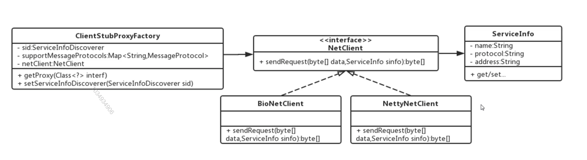

   ### 客户端完整类图

   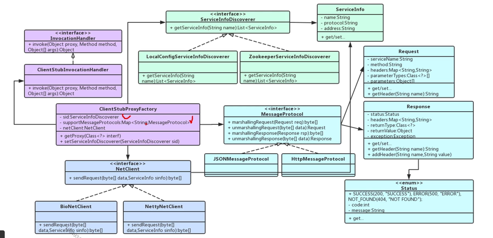

### 服务端设计

#### 思考

RPCServer接收到客户端请求后，还需要做哪些工作？

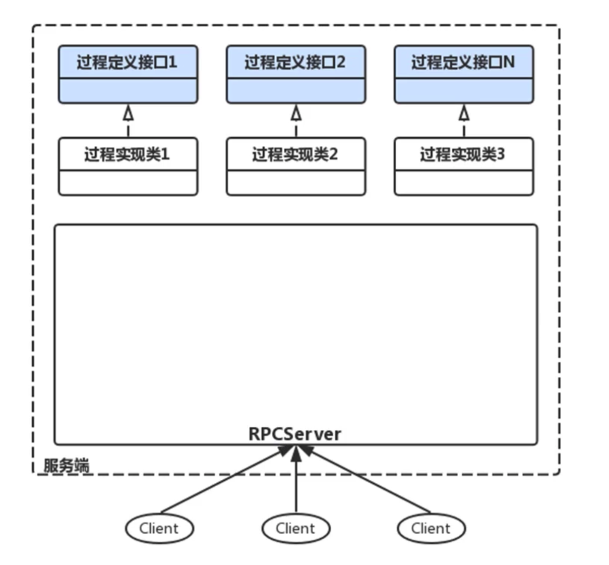

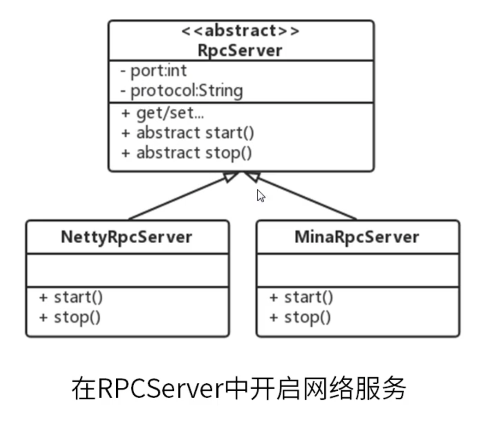

网络层再RPCServer中提供多线程来处理请求，消息协议层服用客户端设计的。(设计一个请求处理类，来完成网络层以上的事情)。

RPCServer接收到请求后，将请求交给RequetHandler来处理，RequestHandler调用协议层来解组请求消息为Request对象，然后调用过程。

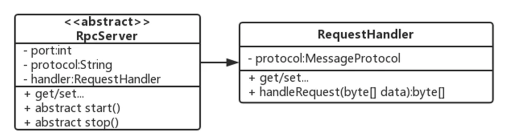

问题：

* RequestHandler如何得到过程对象。
* Request中有什么。
* 服务名，方法名，参数类型，参数值。
* 是否需要一个过程注册模块。

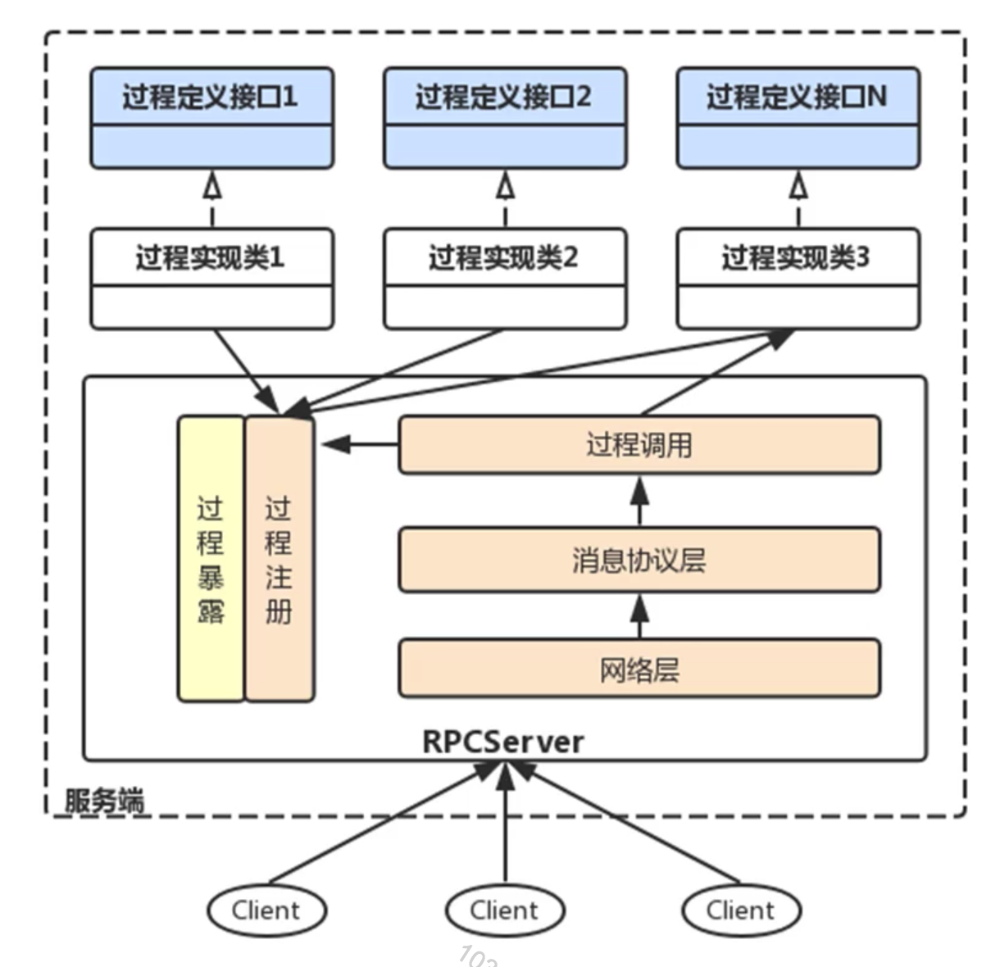

过程注册模块：让用户将他们的过程注册到RPC框架中来。

过程暴露模块：想对外发布服务注册，暴露可以由同一个类实现。

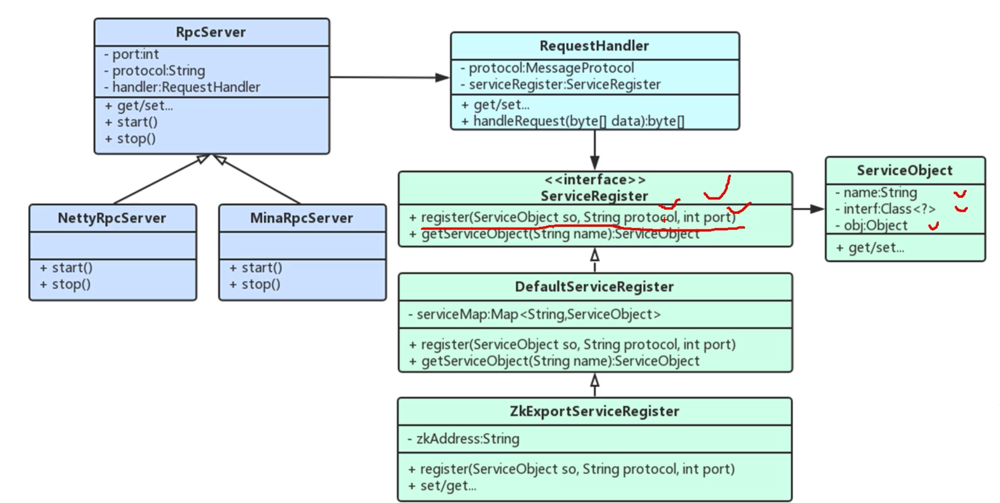

### 实现服务端

1. RPCServer中实现网络层：Netty，使用RequestHandler。
2. ServerRegister模块实现服务注册，发布。
3. RequestHandler中实现消息协议处理，过程调用。

   