[TOC]

# 使用Actuator管理Spring程序

### Actuator介绍

1. Spring Boot Actuator提供http(或JMX)端点来实现对应用程序的监视和管理，收集运行状况等功能。引入spring-boot-starter-actuator可启动这些功能。
2. 默认情况下，通过访问/actuator可以看到所有启用的端点，也可以通过配置修改这个路径地址。如修改为：management.endpoint.web.base-path=/manage

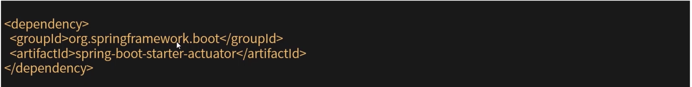

### 端点配置

Spring Boot包含了许多内置端点，允许添加自己的端点，可以配置端点是否对外开放或关闭。

1. 设置默认关闭所有端点(默认开放启用了"health"和"info")。

   managemant.endpoints.enabled-by-default=false

2. 启动指定的端点。

   management.endpoint.info.enabled=true。

3. 数据缓存。

   端点自动缓存不带任何参数的读取操作的响应。要配置端点缓存响应的时间量。

   management.endpoint.<name>.cache.time-to-live=10s。<name>需要使用对应的端点名称来替换。

### Http端点配置

1. Http配置。

   通过Http公开除了env和beans端点之外的所有内容。

   management.endpoint.web.exposure.include=*

   management.endpoint.web.exposure.exclude=env，beans

2. CORS跨域支持(默认情况下禁用CORS支持)。

   management.endpoint.web.cors.allowed-origins=http://example.com

   management.endpoint.web.cors.allowed-methods=GET，POST

3. 修改ManagerServer服务器配置。

   management.server.port=8081(如果设置为-1代表禁用http端点)

   management.server.address=127.0.0.1

   可以配置和web服务使用不同的端口，同时指定ip。(不同端口，代表启动多个tomcat容器)

### 端点讲解

#### Health健康检查

访问/actuator/health查看程序中组件检查项的运行状况信息，再出现故障时能及时发现。Spring Boot默认提供了对Redis，RabbitMQ，DataSource，MongoDB等组件的检查项。

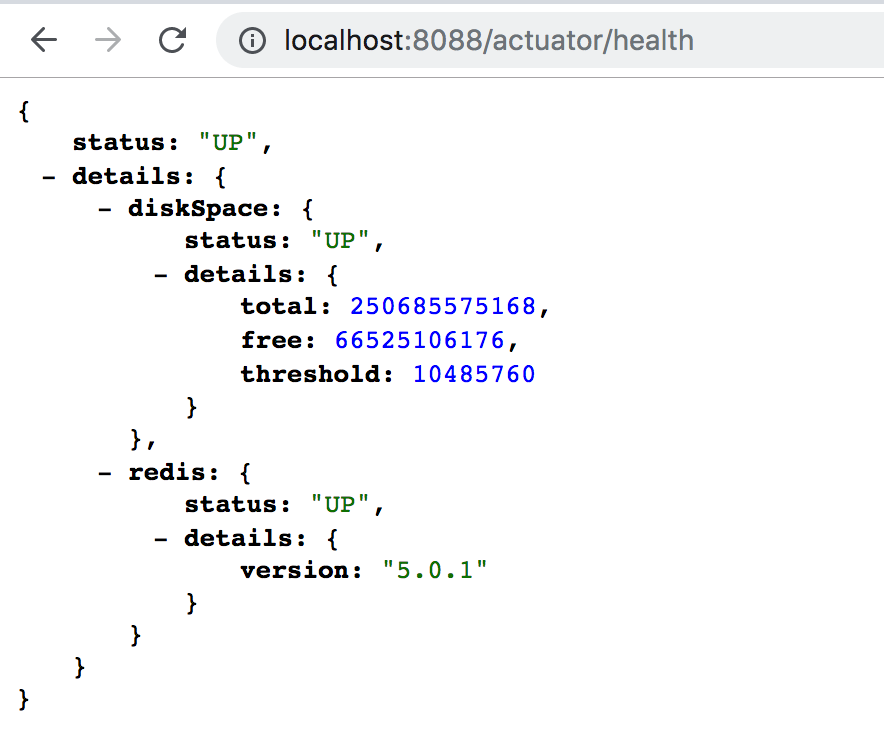

1. 展示更详细的内容(默认never)。

   management.endpoint.health.show-detail=never(或者when-authorized|always)

2. 返回结果。

   如果有检查项处于非检查状态，Http状态码为502，返回值为DOWN或者OUT_OF_SERVICE。如果没有检查出问题，返回Http状体码200，返回值为UP或者UNKNOWN。

3. 自定义健康检查项。

   实现HealthIndicator接口，通过spring实例化一个对象，Spring Boot会自动触发健康检查，并归入health结果。

   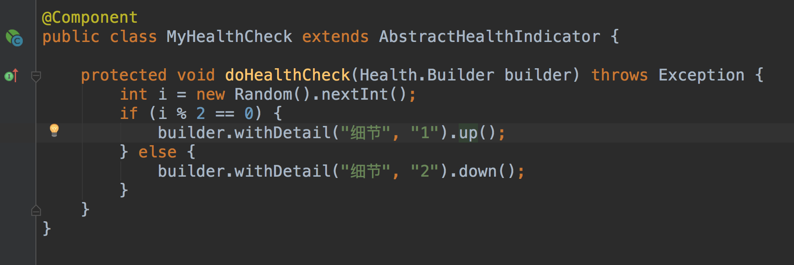

   

#### 日志配置

   1. Spring Boot日志配置。

      logging.level.root=WARN

      logging.level.org.spring.framework.web=DEBUG

      logging.leve.org.hibernate=ERROR

   2. 通过/actuator/loggers查看日志配置。

      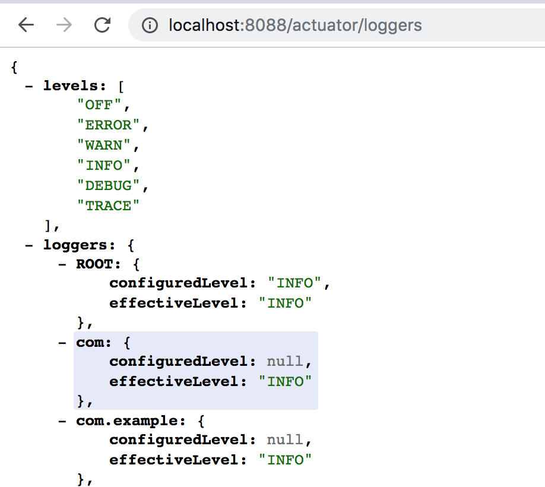

   3. 运行时修改配置。

      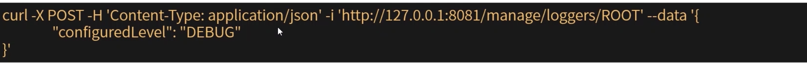

#### metrics

   Metrics是生产应用中很重要的功能，简单可理解为对运行时具体功能的监控。Spring Boot中集成micrometer实现。

   1. 支持查看哪些数据？

      通过/actuator/metrics查看所有支持的信息，/metrics/{requiredMetricName}查看指定某一项指标JVM内存，线程，GC信息，类加载情况，CPU指标，Http请求统计，Tomcat信息等。

   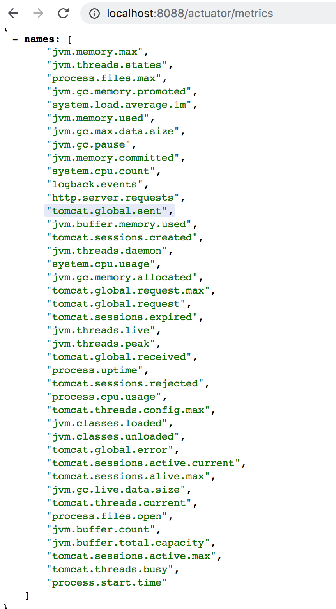

   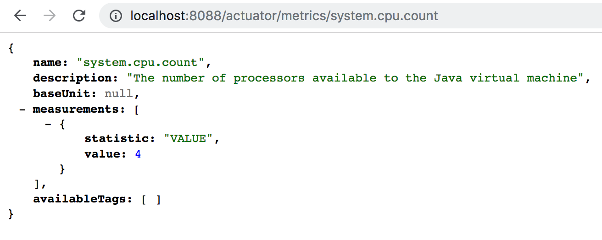

   2. 与监控系统的集成。

      支持将数据导出到：AppOptics，Atlas，Datadog，Donatrice，Elastic，Ganglia，Graphite，Humio，Influx，JMX，KairosDb，New Relic，Prometheus，SignalFx，Simple(I'm-memory)，StatsD，Wavefont。

   3. 自定义监控指标。

      代码中注入MeterRegistry对象，然后进行手动注册。

      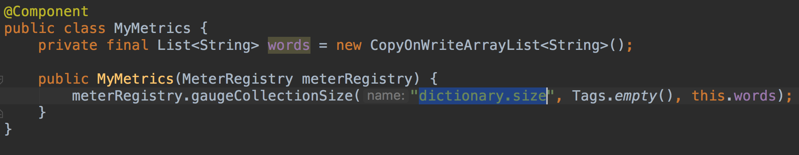

      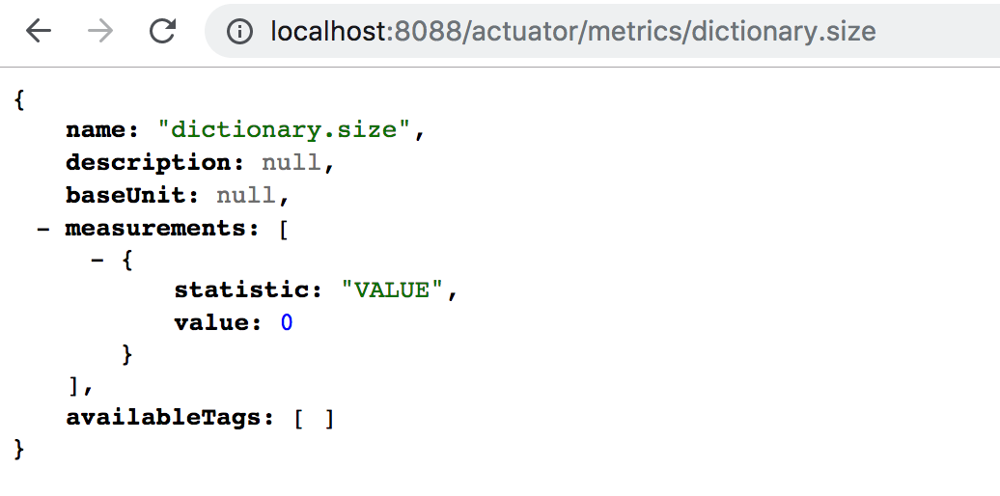

   ### 自定义端点

   可以理解为"概念上类似SpringMVC的controller写法，却又是完全不同的一套API"。

   1. 端点定义：@Endpoint或@WebEndpoint或@JmxEndpoint。
   2. 端点操作：@ReadOperation，@WriteOperation，@DeleteOperation。
   3. 参数接收：web环境下自动添加@Selector。

   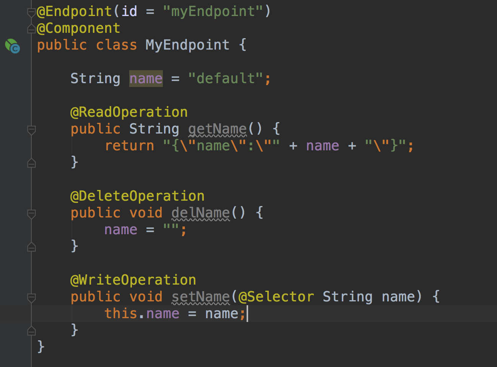

   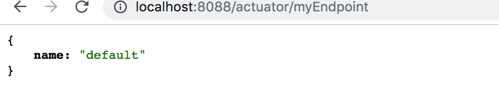

### 快速理解JMX机制

Java Management Extensions(JMX)提供了一种监视和管理应用程序的标准机制。tomcat，Kafka，druid都是使用的JMX技术来实现对外暴露管理接口和监控信息。

1. 如何使用Jconsole工具通过JMX技术实现对应用的监控和管理。

2. 通过Spring框架快速增加自定义Mbean，默认情况下，Spring Boot将管理端点公开为org.springframework.boot域下的JMX MBean。

3. 通过JMX公开所有端点并仅显示health和info端点。

   managment.endpoint.jmx.exposure.exclude=*

   management.endpoint.jmx.exposure.include=info，health

   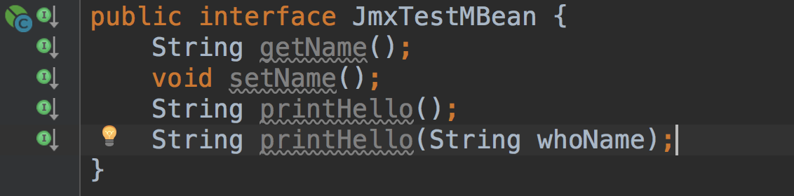

   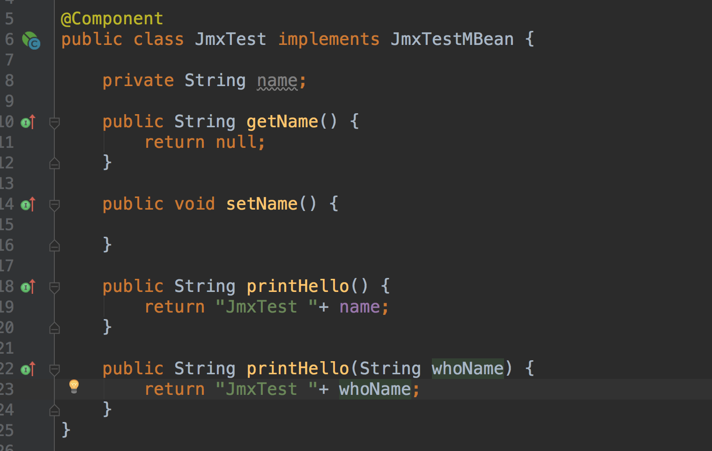

   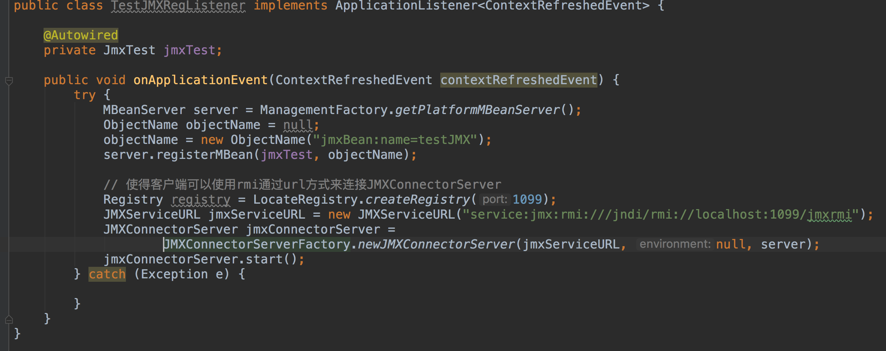

   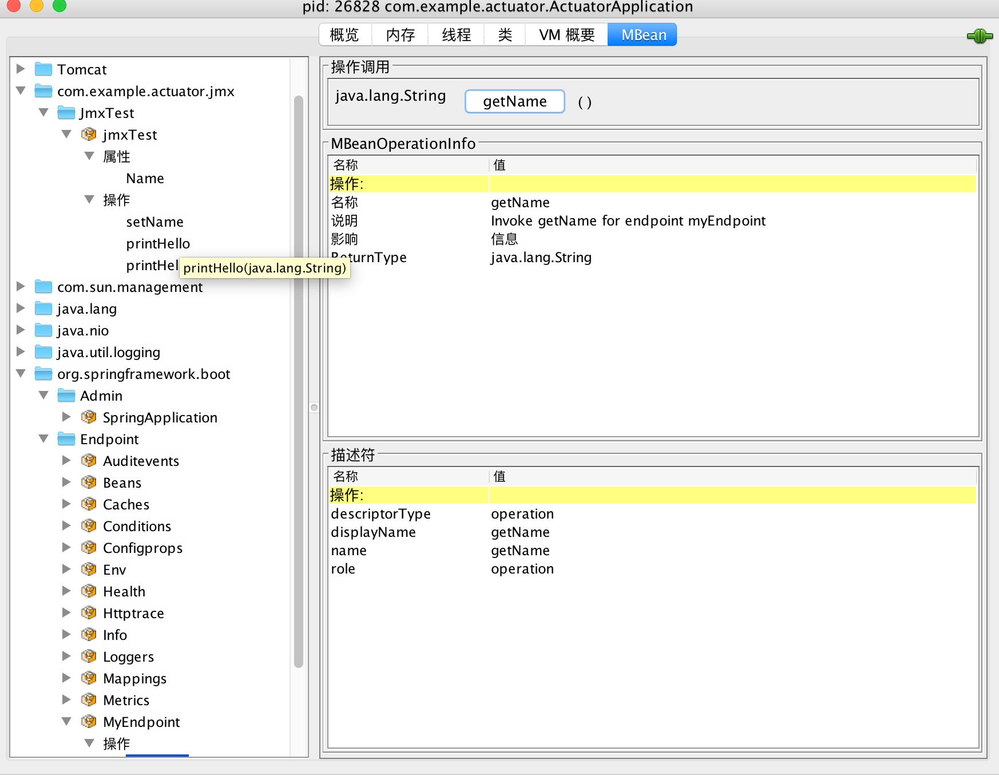

   **Spring Boot是如何使用JMX将Endpoint暴露出来的？**

