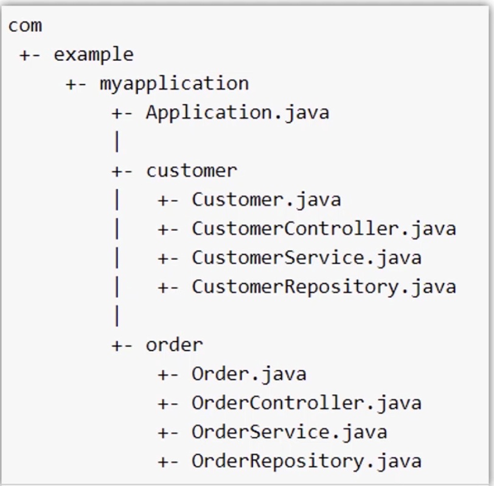
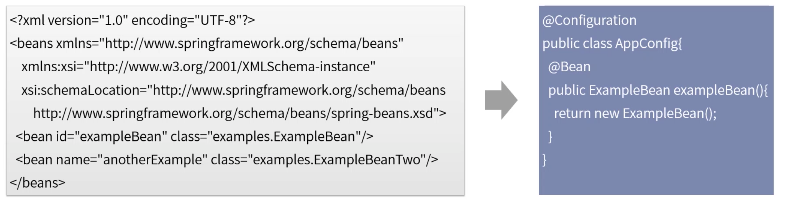
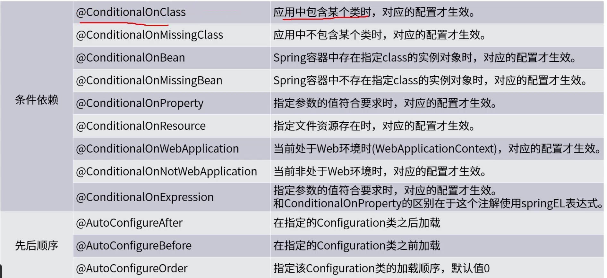

[TOC]

# 系统配置自动装载机制

### @SpringBootApplication注解

1. 这个注解相当于三个注解的功能集成。

   * @EnableAutoConfiguration：启用Spring Boot的自动Bean加载机制。
   * @ComponentScan：在应用程序所在的包上启用扫描。
   * @Configuration：允许在Spring中注册额外的bean或导入其他配置类。

   

### 代码包扫描

默认的包结构及其作用。

1. 主程序Application.java放在根包，在其他类之上。

2. @SpringBootApplication注解写在主程序上。

3. Spring对类的扫描默认仅覆盖主程序所在的包及子包。

### 零Spring配置文件

SpringBoot中建议放弃通过XML定义Spring应用程序，推荐在代码类上面通过@Configuration实现配置。如果有需要，还可以通过@ImportResource来导入xml配置文件。

注：要使@Configuration生效，需要将它写在SpringBoot入口程序类上面，或者使用@EnableAutoConfiguration或@SpringBootApplication这两个注解来开启自动加载功能。

### 个性化加载配置

### 外部参数配置信息加载

Spring应用程序可以通过属性文件，YAML文件，环境变量和命令行参数等方式来外部化参数配置。

1. 启动时命令行传参java -jar app.jar —name="test"。
2. SpringBoot配置信息中的特殊值：SPRING_APPLICATION_JSON='{"name":"test"}'。
3. 如果是web应用，可以读取ServletConfig init参数。
4. 如果是wen应用，可以读取ServletContext init参数。
5. JNDI属性来自java:comp/env。
6. Java系统属性(System.getProperties())。
7. 操作系统环境变量。
8. 配置文件：application.properties，application.yml，application-{profile}.properties，application-{profile}.yml。
9. @PropertySource注解导入的配置：@PropertySource(value={"person.properties"})。
10. 程序入口通过SpringApplication.setDefaultProperties方法设定的参数配置。

### 环境化配置-profile

1. profile是什么机制。

   * Spring配置文件提供的一种隔离应用程序配置的方法，使其仅在特定环境中可用。
   * 可通过profile指定Bean的应用环境(如开发，测试，生产等环境)。
   * 可通过profile指定不同环境的配置参数值。

2. 如何指定profile。

   通过配置参数spring.profiles.active来指定应用启用的profiles。默认default。

   * 在环境变量中指定：jvm参数，命令行参数，application.properties中都可以。
   * 代码中指定：springApplication.setAdditionalProfiles("dev，test")。

3. 如何在开发中使用。

   * Configuration类或Bean定义方法上，都可以通过添加@Profile("dev")注解，实现指定环境下生效。
   * 配置文件中：<beans profile="dev"><bean>。

### 配置文件

配置文件可以放在哪些位置。

1. 当前项目运行的盘符/config文件夹下面：file:./config/。
2. 当前项目运行的目录下面(命令执行所在的目录)：file:./。
3. classpath下面的config文件夹：classpath:/config。
4. classpath的根目录(我们平常就是用这种)：classpath:/。

上述配置文件的按优先级排列，排在上面的位置会覆盖优先级降低的配置。

自定义配置名称和存储路径。

1. spring.config.name(spring_config_name)=properties-file-name。
2. spring.config.location(spring_cofig_location)=classpath:/config/，file:./config/(注：从右到左反序搜索)，必须将它们定义为环境属性，通常是操作系统环境变量，JVM参数或命令行参数。

### 参数使用

1. 通过@Value("${my.name}")注解，将指定的参数配置注入到属性。

2. 注入Environment对象。

   

3. 通过注解@ConfigurationProperties(prefix="my")，将注解加载指定的类上，spring会为实例对象的属性进行赋值，属性需要有getters和setters方法。