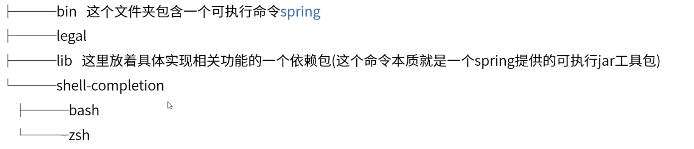
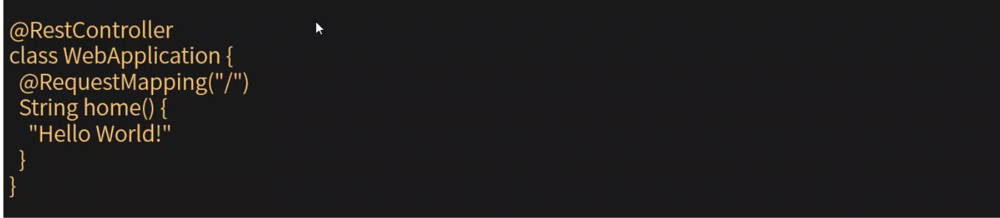
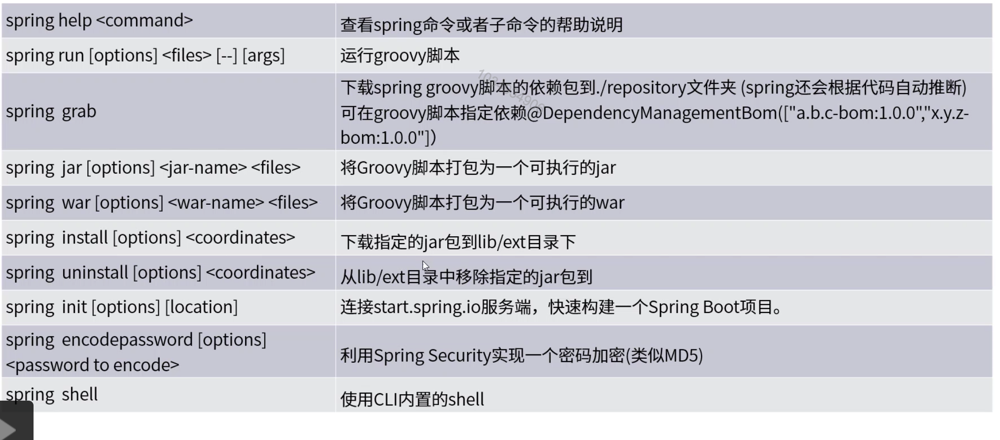
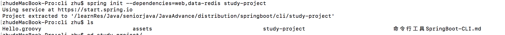
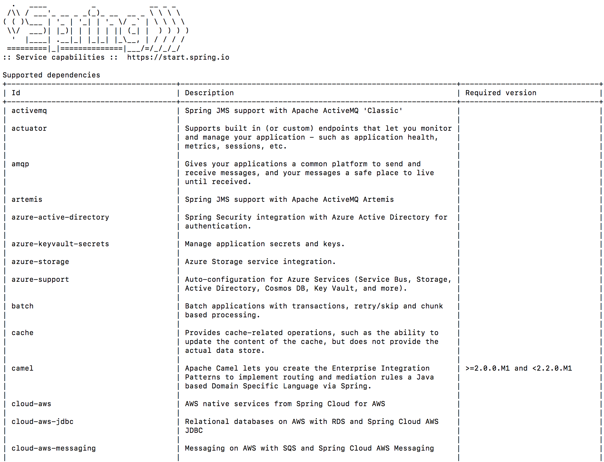

[TOC]

# 命令行工具SpringBoot-CLI

### CLI安装

1. 下载.

   https://repo.spring.io/release/org/springframework/boot/spring-boot-cli/2.1.9.RELEASE/spring-boot-cli-2.1.9.RELEASE.zip

2. 解压到指定文件夹。

   

3. 检查是否安装成功。

   spring version

4. mac运行依次运行这两条命令。

   * brew tap pivotal/tap
   * brew install springboot

### 通过Groovy快速开发

1. 通过Groovy快速构建一个Spring Boot Web应用，创建一个hello.groovy。

   

2. 运行程序。

   spring run hello.groovy - - - -server.port=8090

3. 打包程序。

   

### spring命令说明

### 项目构建

通过Spring Boot CLI快速构建一个Spring Boot项目。

1. 创建名为study-project的项目，添加spring-boot-starter-web和spring-boot-starter-data-redis的依赖。

   spring init - -dependencies=web,data-redis study-project

   

2. 查看所有可用依赖。

   spring init  - -list

   

3. 常用参数说明。

   build=maven指定源码管理工具

   package=war打包形式

   java-version=1.8指定JAVA版本