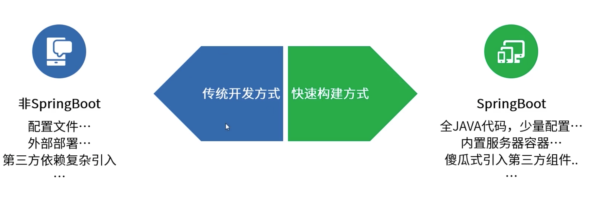
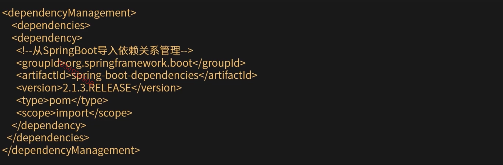
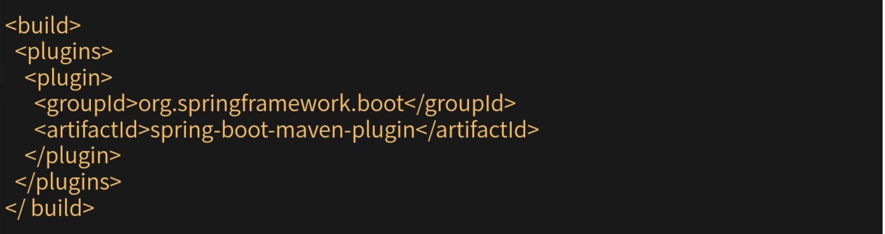

[TOC]

# SpringBoot

### SprintBoot介绍

Spring Boot对Spring平台和第三方类库进行了整合，可创建可以运行的，独立的，生产级的基于Spring的应用程序。(大多数Spring Boot应用只需要很少的Spring配置)。Spring Boot可以使用java -jar或更传统的war部署启动的Java应用程序进行创建，可以内嵌Tomcat，Jetty，Undertow容器，快速启动web程序。

1. 设计目标。
   * 为所有Spring开发提供更快且更通用的入门体验。
   * 开箱即用，可以根据需求快速调整默认值。
   * 提供大型项目(例如嵌入式服务器，运行状况检查和统一配置)通用的一系列非功能性功能。
   * 绝对没有代码生成，也不需要XML配置。

### Spring Boot优势快速预览

### 开发第一个SpringBoot应用

#### 依赖

Maven依赖管理-spring-boot-depecdencies提供了SB支持的依赖，以及相关的版本定义。

示例：引入web开发相关的依赖(无需在指定版本，由spring-boot-dependencies定义)

#### 运行你的SpringBoot程序

1. 通过IDEA运行main方法。
2. maven插件运行：man:spring-boot:run，需要添加spring-boot-maven-plugin到pom.xml文件中。
3. 创建可执行的jar，需要添加spring-boot-maven-plugin到pom.xml文件中。
   * 打包命令：mvn package
   * 执行命令：java -jar xxx.jar
   * 注意事项：jar文件生成在target目录下，"".jar.original这个文件一般很小，这时打包可执行jar文件之前的原始jar

#### 编写你的程序代码

程序入口：Main方法

SpringBoot中通用的约定：

1. 注解扫码的包目录basePackage为启动类Main函数入口所在的包路径。
2. 配置文件约定是classpath目录下的application.yml或者application.properties。
3. web开发的静态文件放在classpath，访问顺序依次是：/META-INF/resources->resources->static->public。
4. web开发中页面模版，约定放在classpath目录，/templates/目录下。

