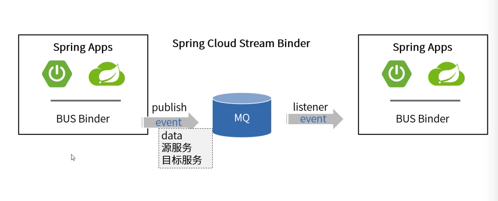

[TOC]

# bus事件机制

### 入门

快速理解：Spring事件机制的升级版(将事件传播给分布式系统中的每一个实例)。

内置功能1：访问/actuator/bus-refresh，清除RefreshScope作用域的对象及重新加载@ConfigurationProperties。

内置功能2：通过/actuator/bus-env实现对配置的更新。

### 自定义BUS事件

1. 继承RemoteApplicationEvent
2. 通过@RemoteApplicationEventScan注解定义新事件类型所在的代码包。
3. 定义相应的监听器。
4. 通过applicationContext.publishEvent发布事件。
5. 检查MQ对应消息通道是否有新消息。
6. 本地监听SentApplicationEvent和AckRemoteApplicationEvent者两个可用于触发消息发送完毕/ACK之后的逻辑处理。