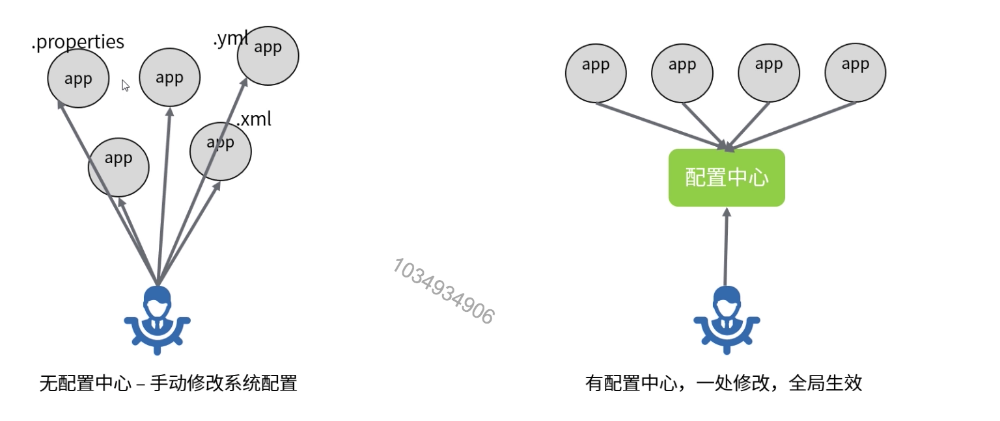
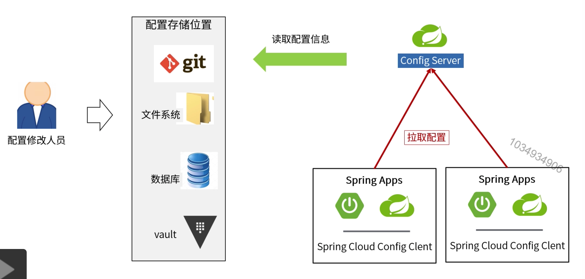

[TOC]

# Config分布式配置中心

### 配置中心架构示例

### Spring Cloud Config Server

### 安全机制

1. 访问控制(防止无权限人员查看到配置内容)

   引入spring-boot-starter-security，为config server服务的访问设置用户名和密码校验机制。

2. 配置内容加密(防止敏感信息被配置文件的修改人员看到)

   config server提供/encrypt和/decrypt两个接口来实现密文生成和解密的功能。

   配置文件中存储密码的时候使用：password={cipher}FFFFFKJLJLJKJKH

3. 密钥配置(加解密所用的密钥)

   对称加密的key配置：encrypt.key=change，非对称加密通过encrypt.keyStore.*进行相关配置。

4. 远程覆盖(客户端个性化配置)

   默认情况下，客户端自己的配置不能覆盖配置中心的配置，可以通过在远程配置文件中增加下面配置调整：

   开启所有参数的覆盖：spring.cloud.config.overrideNone=true

   覆盖指定参数：spring.cloud.config.server.overrieds.{key}={value}