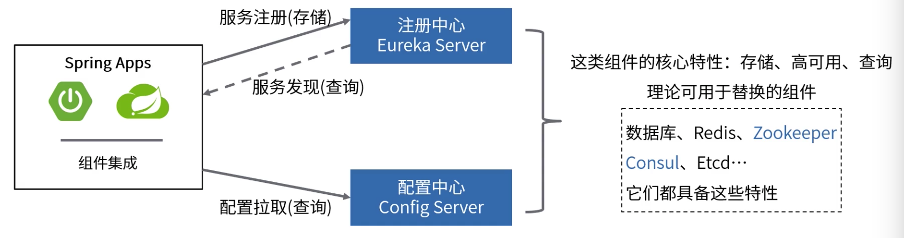
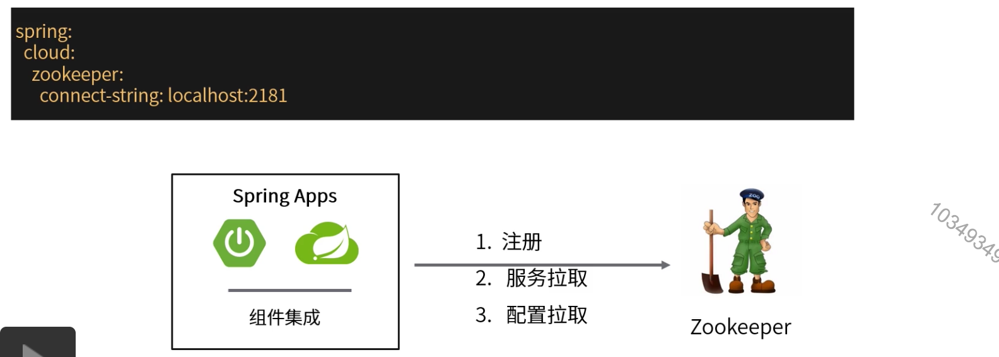
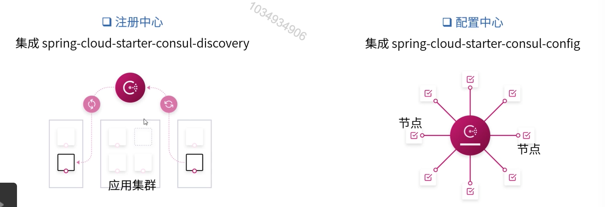

[TOC]

# 集成Consul和Zookeeper

### Spring Cloud组件的可替换性

理论上来说，Spring Cloud作为集成者，它的每一个组件都是可以有多种实现的。主要以配置注册中心和配置中心为例。

### Spring Cloud Zookeeper

1. 安装并启动Zookeeper。

2. 替换eureka，注册中心集成spring-cloud-starter-zookeeper-discovery。

3. 替换config server，配置中心集成spring-cloud-starter-zookeeper-config。

   

### Spring Cloud Consul

Consul时一个分布式服务网络，可以提供服务发现，配置等功能。

特点：K/V形式存储数据，可以搭建高可用集群，支持对节点的健康检查，支持TLS安全通信等。注：除了服务端和客户端这两个角色，在使用中还需要在客户端上运行一个Consul Agent代理。

