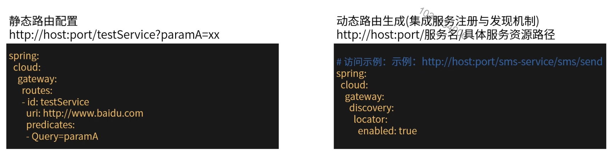
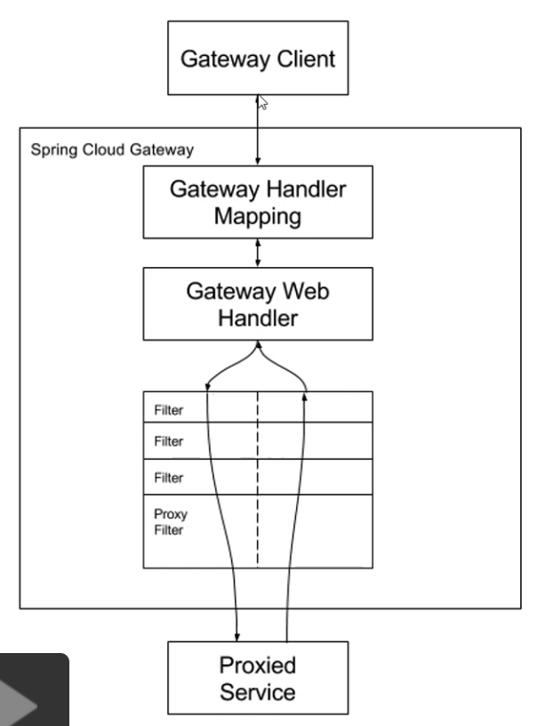
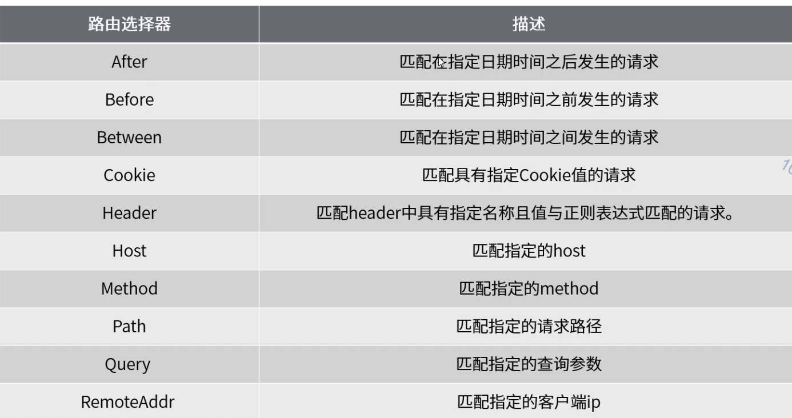
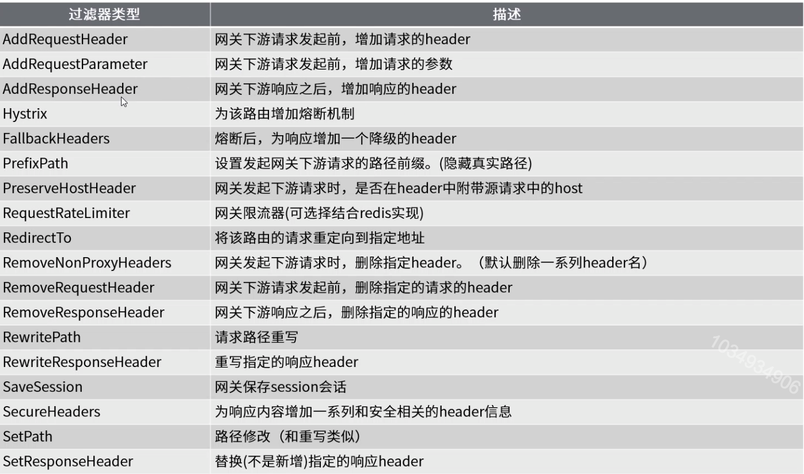
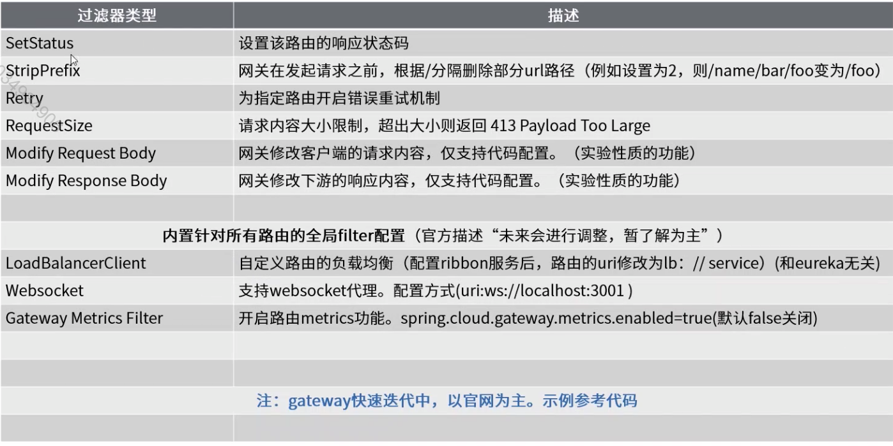
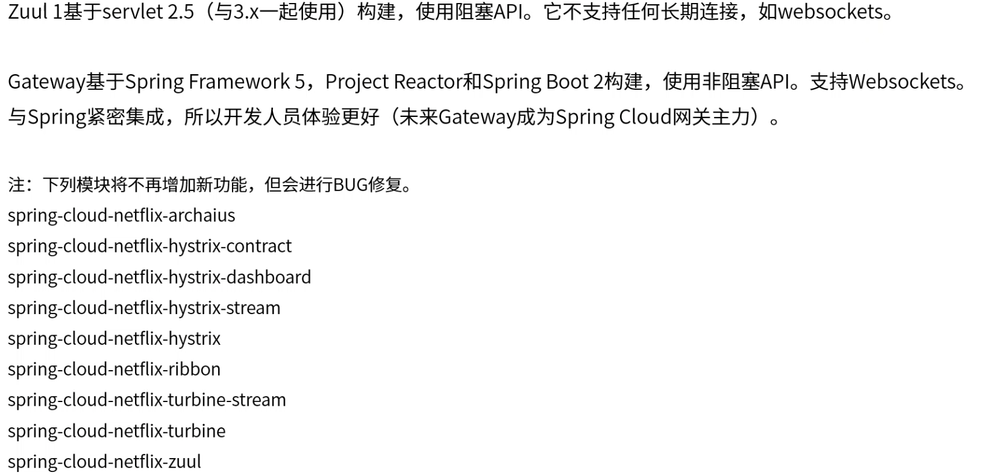

[TOC]

# Gateway网关组件

### 入门

旨在提供一种简单有效的方式路由到API，提供例如：安全性，监控指标等功能。

### 核心流程及概念

Route：网关的基本构建单元。它由ID，URI，匹配规则集合和过滤器集合定义。

Predicate：判断请求走哪条路由规则。匹配来自HTTP请求的任何内容，例如标头或参数。

Filter：用于在发送下游请求之前或之后修改请求和响应。

### 内置路由选择器

### 内置过滤器

### Spring生态与Netflix生态

