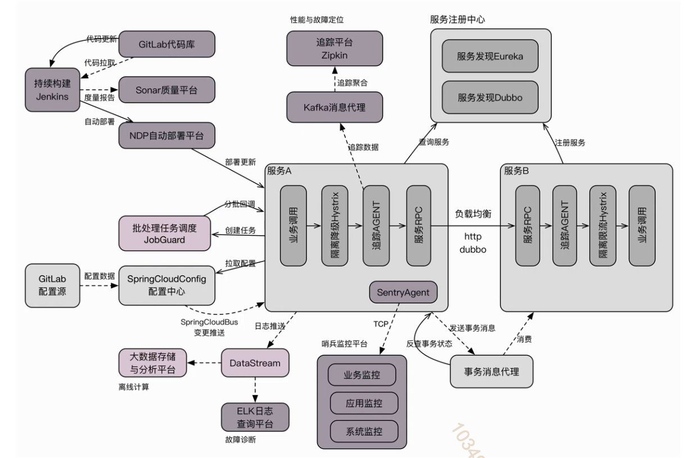
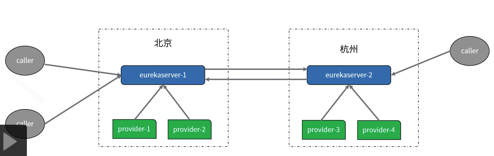
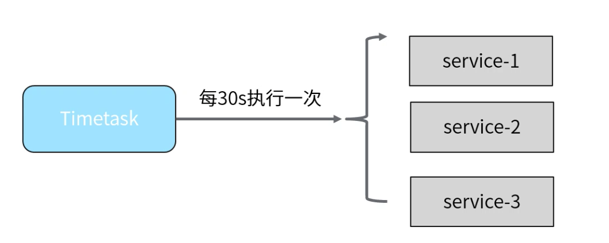
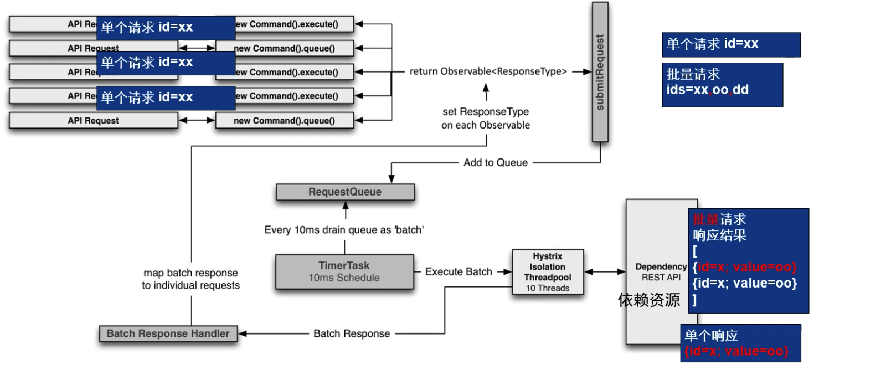
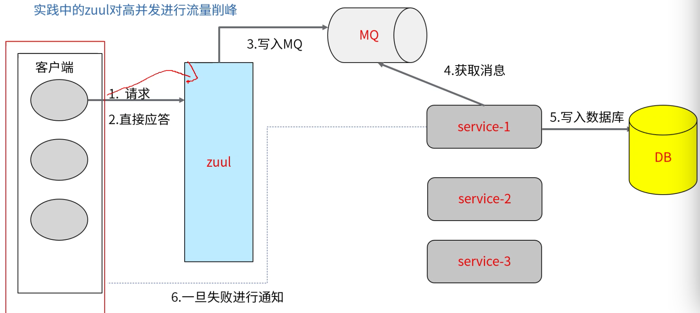

[TOC]

# Spring Cloud实践

### 架构

### eureka的区域概念

### eureka的服务上下线监控

在某些特定的需求下，我们会需要对某些个服务进行上下线的监控，上线或者下线都需要邮件来进行通知，在eureka下给我们提供响应的事件监听方式来进行扩展。

EurekaInstanceCanceledEvent-服务下线事件

EurekaInstanceRegisteredEvent-服务注册事件

EurekaRegistryAvailableEvent-注册中心启动事件

EurekaServerStartedEvent-eureka服务启动事件

### ribbon的WeightedResponseTimeRule

这个策略时对轮询策略的扩展，增加了根据实例的运行情况来计算权重，并根据权重来挑选实例，用以达到更好的分配结果。

计算权重：weightSoFar+总响应时长-平均响应时间

### Feign中的各种自定义配置：

1. 日志配置：用于遇到了bug，比如接口调用失败，参数未接收，查看调用实践等问题。
2. Basic认证配置：用于权限控制的接口，或者请求头传递认证信息，采用Basic认证方式。
3. 超时时间配置：用于特殊接口，需要长时间进行响应。
4. GZIP压缩配置：用来处理一些过大的response或者request请求。

### hystrix请求合并

### zuul对高并发进行流量削峰

