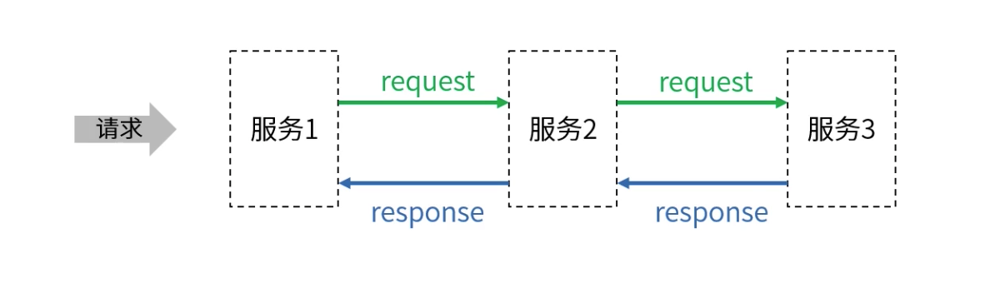
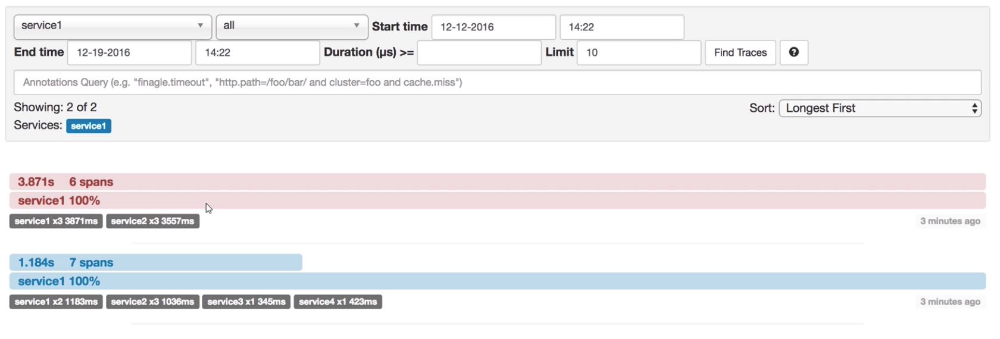
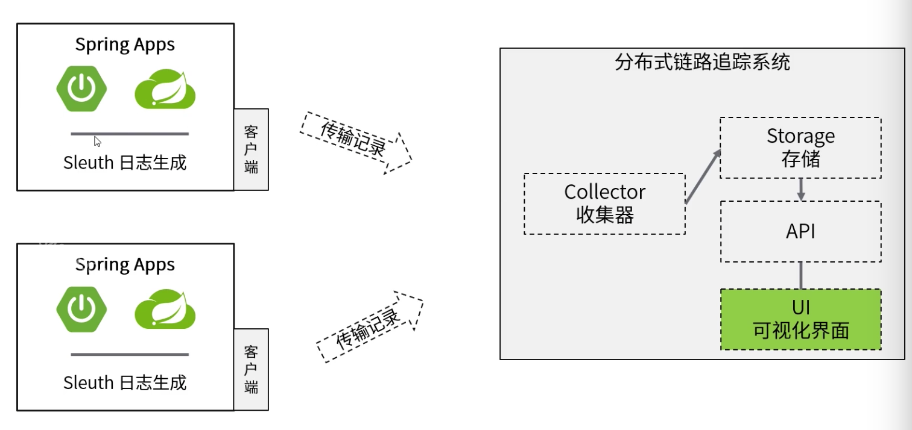
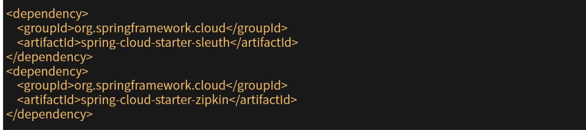
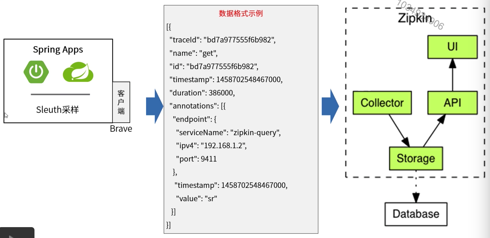
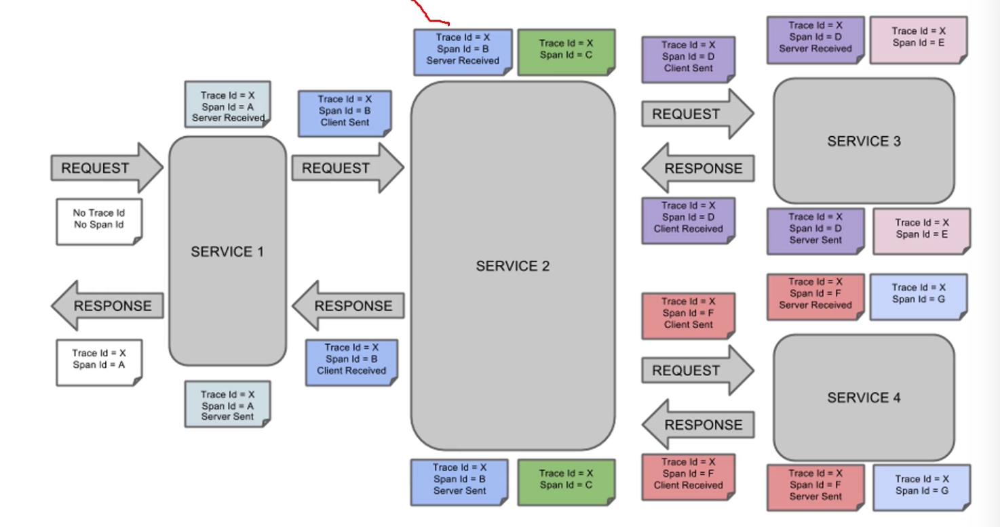
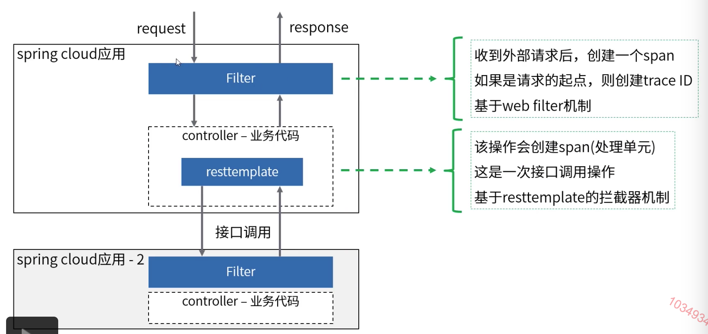
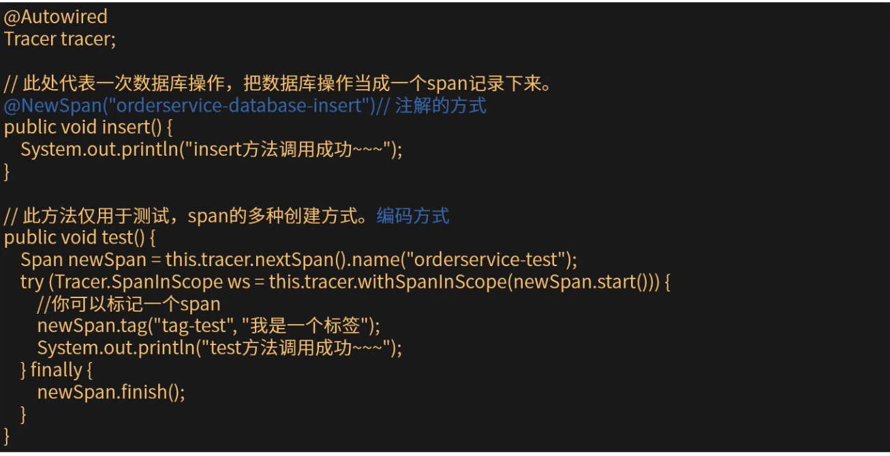

[TOC]

# 分布式链路追踪Sleuth

### 分布式链路追踪

调用链追踪最先由google在Dapper这篇论文中提出。主要为了解决的问题：收集一个请求经过多个服务处理的过程中，每一个服务处理的具体的执行情况。目前的开源相关实现有Zipkin，Dapper，HTrace，SkyWalking等，也有类似OpenTracing这样被大量支持的统一规范。

spring cloud sleuth为spring cloud系统实现了分布式追踪解决方案。

### 可视化查看Zipkin

### 分布式链路追踪核心架构

### 搭建

1. 启动分布式链路追踪系统zipkin(默认端口9411，数据存储在内存)。

   下载：curl -sSL https://zipkin.apache.org/quickstart.sh | bash -s

   启动：java -jar zipkin.jar

2. 应用程序中引入sleuth相关依赖。

   

3. 核心配置：spring.zipkin.baseUrl=http://localhost:9411

### 链路追踪核心概念

| 概念                  | 说明                                                         |
| --------------------- | ------------------------------------------------------------ |
| Traces                | 一个trace可以认为一次请求在分布式系统中的调用轨迹            |
| Spans                 | 一个请求的处理包含多个处理步骤。称为逻辑处理单元(包含执行开始事件，执行时长等信息) |
| Operation             | span对应的操作名称(比如数据库订单插入，用户信息查询接口调用) |
| Inter-Span References | 一个span可以和一个或者多个span间存在因果关系                 |
| Logs                  | 一个span可以记录多个log(时间戳，log内容)                     |
| Tags                  | 每个span可以有多个键值对K/V形式的Tags(无时间戳，简单的对span进行补充) |
| SpanContext           | SpanContext时所有span都能够访问的一个上下文(保存span间的关系) |
| Baggage               | 存储在SpanContext中的一个K/V数据                             |

### Sleuth和Zipkin搭配

### Sleuth数据采样

### Sleuth核心原理

以span的形式记录一个处理步骤。利用filter，拦截器，aop等机制针对具体的操作进行记录。

### 自定义Span

可以通过注解或者编码方式实现自定义span，并添加到当前tracer中。

