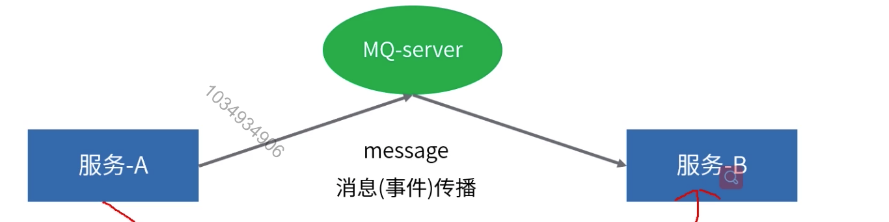
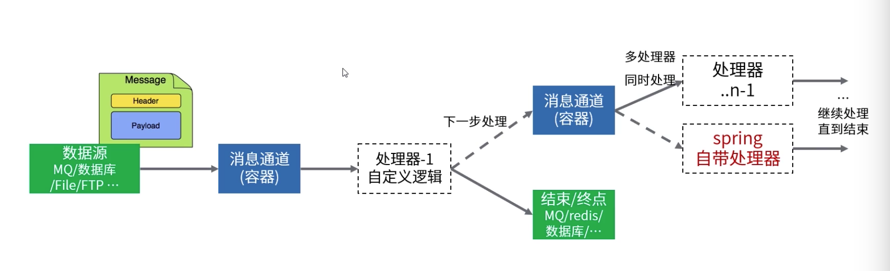
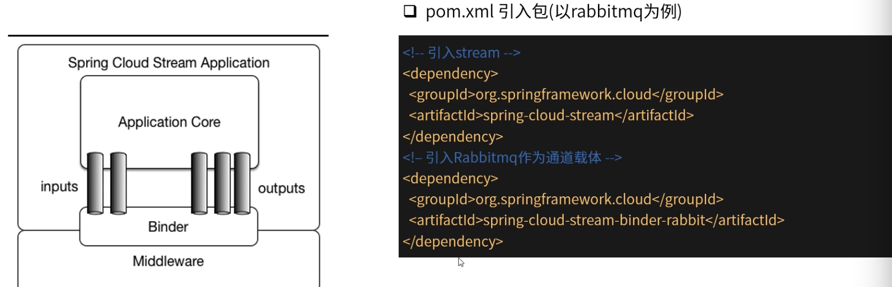
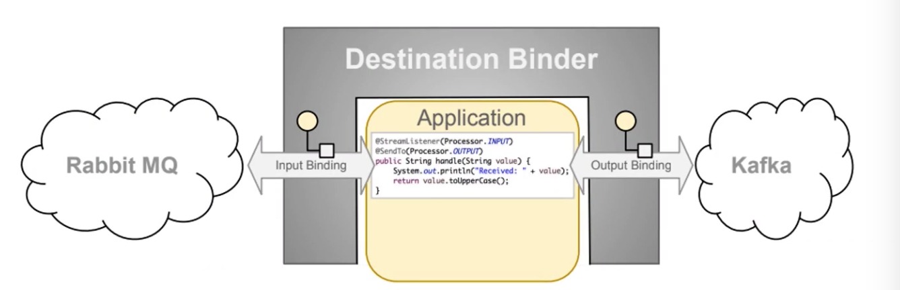

[TOC]

# Stream消息驱动编程

### Spring Cloud Stream介绍

Spring Cloud Stream是一个用于构建消息驱动的微服务应用程序框架，其中消息传递是借助了消息中间件。

具体的实现中用到了其它基于Spring拓展而来的框架：

1. Spring Boot专注快速开发。
2. Spring Integration专注数据集成。

### Spring Integration数据集成框架

基于Spring框架实现EIP(Enterprise Integration Patterns)企业集成模式的支持，通过消息传递通道与外部系统集成。一种多系统数据集成处理机制：数据源-读取-处理(过滤，路由，转换，适配，拆分和聚合)-结束(数据终点)。

### 快速入门

Stream针对Interation的重要改进，是将Channel内部的消息容器升级为分布式消息中间间来实现，而非之前的本地容器。

1. 通过@Input @Output定义通道。
2. Spring配置文件中配置通道与中间件的绑定关系。
3. @EnableBinding启用指定通道配置。

### binder机制

Binder：封装了与MQ组件的底层交互，对开发者暴露了一套用于配置的API。

1. 支持消息的消费和生产。
2. 同一个应用程序内可绑定多个不同的MQ实例。
3. 初始化入口：参考依赖包中META-INF/spring.binders文件。
4. 详细配置参考代码。

### 事件驱动编程模型

Binder(绑定器)：负责提供与消息中间件的集成。

Binding(绑定)：内部通道与消息中间件的绑定关系。

Message：生产者和使用者用于与目标绑定器通信的规范数据结构。

@StreamListener用于接收消息，@SendTo用于将方法返回值发送至指定通道。

Strean可以兼容Spring Integration的写法(如：@InboundChannelAdapter，MessageSource)。

### 特性

1. 消息格式转换-针对生产/消费过程中的消息格式处理。

   消息转换器：MessageConverter

   配置消息格式：spring.cloud.stream.bindings.<channelname>.content-type

2. 可靠消费(主要针对AMQP)

   内部通道重试：bindings配置中指定重试次数consumer.max-attempts=1。

   异常处理通道：stream为每个通道提供了一个异常通道<destination>.<group>.errors。

   死信队列：consumer.auto-bind-dlq=true(处理异常进入DLQ)，consumer.republish-to-dlq=true(带上异常信息)。

3. 可靠生产(主要针对AMQP)

   消息回执通道：producer.confirmAckChannel

4. 消费者分组(和kafka分组概念类似)

   配置方式：spring.cloud.stream.bindings.<channelName>.group=groupname

   同一条消息，每个组中只有一个成员会收到。

5. 数据分区。

   stream可以控制消息指定分区，并且同一分区数据将分发由同一个消费者实例处理。(这个分区是spring cloud stream的抽象概念，不能等同于MQ本身的分区)。

   spring.cloud.stream.bindings.input.consumer.partitioned=true # 开启消费者分区

   spring.cloud.stream.instanceCount=2 # 消费者实例总数

   spring.cloud.stream.instanceIndex=0 # 当前消费实例编号

   spring.cloud.stream.bindings.output.producer.partitionKeyExpression=payload # 分区键

   spring.cloud.stream.bindings.outputproducer.partitionCount=2 # 分区数量(消费者实例数量)