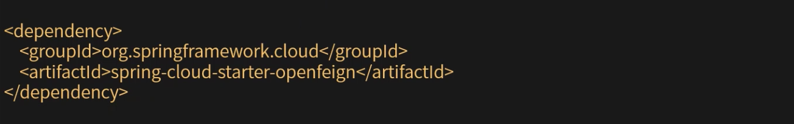
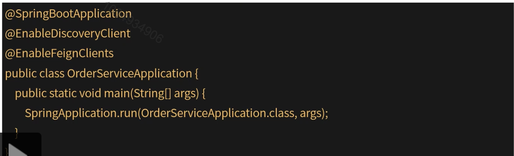
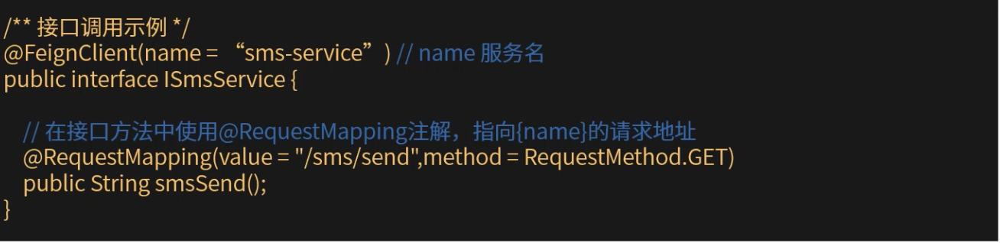
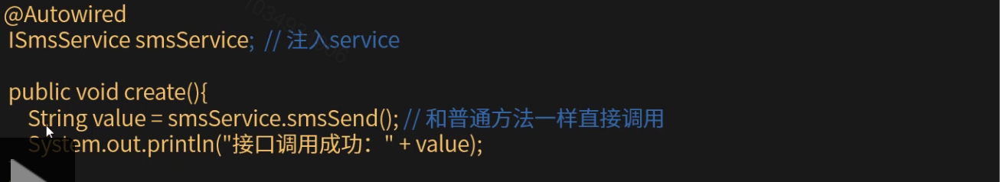
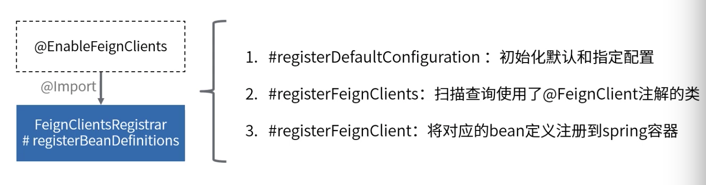
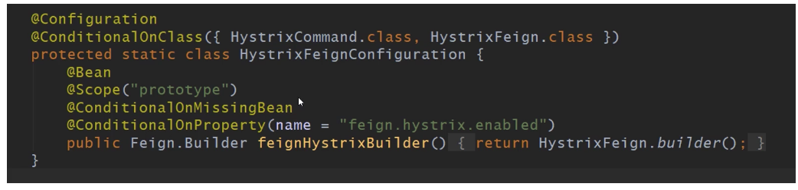
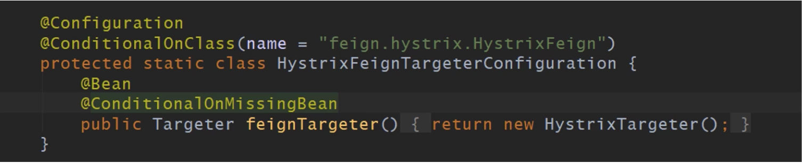

[TOC]

#  声明式接口调用客户端Feign

### Feign简介

Feign是一个声明式的web服务调用客户端工具，让web接口调用和普通java接口一样便捷。支持对请求参数和响应内容编码和解码，及自定义编解码器。支持与Ribbon和Eureka，Hystrix等组件的集成。

Spring Cloud对Feign的增强和改造：

1. 将Spring MVC的注解与Feign客户端的定义进行了结合。
2. 支持使用Spring Web中的HttpMessageConverts对请求和响应进行编码解码工作。

### Feign集成

1. 引入springcloud关于Feign的相关依赖。

2. 启动类上添加注解@EnableFeignClients。

   

3. 创建接口interface，并使用@FeignClient注解标注。

   

4. 接口调用示例。

   

### Feign的初始化

本质：使用FeignClientFactoryBean生成代理对象，并交给spring托管。

### Feign和Hystrix集成

开启条件

配置文件中加入：

Feign.hystrix.enabled=true开启hysterix。

在builder方法中会加载HystrixFeign。

自动装配FeignAutoConfiguration。

加载HystrixFeign之后，触发FeignAutoConfiguration下的feignTargeter()，创建一个HystrixTargeter。其使用HystrixInvocationHandler的invoke方法，使用HystrixCommand对SynchronousMethodHandler的invoke进行调用。