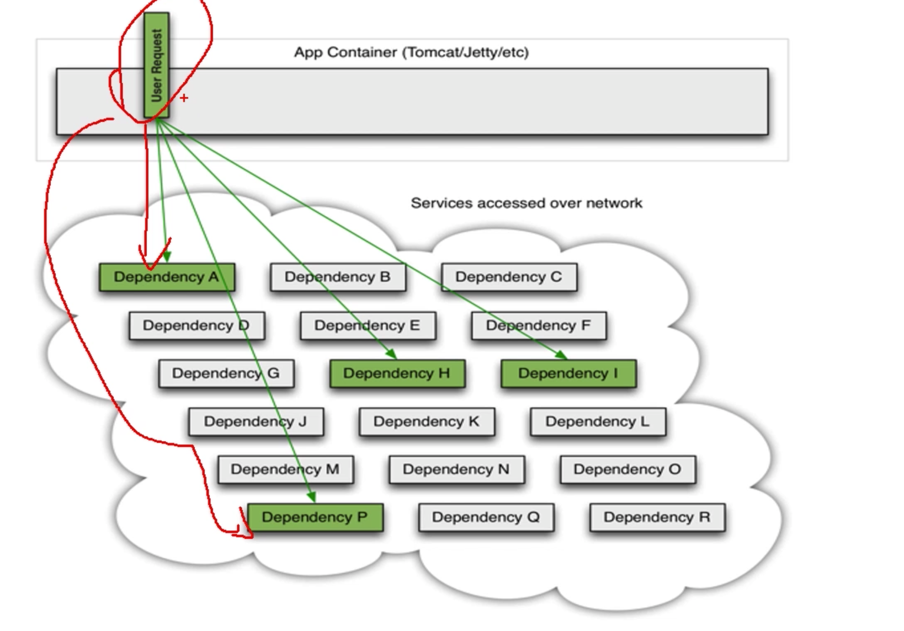
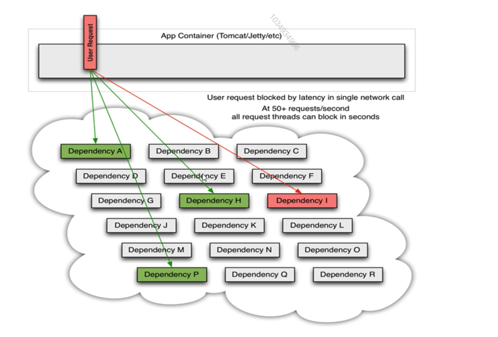
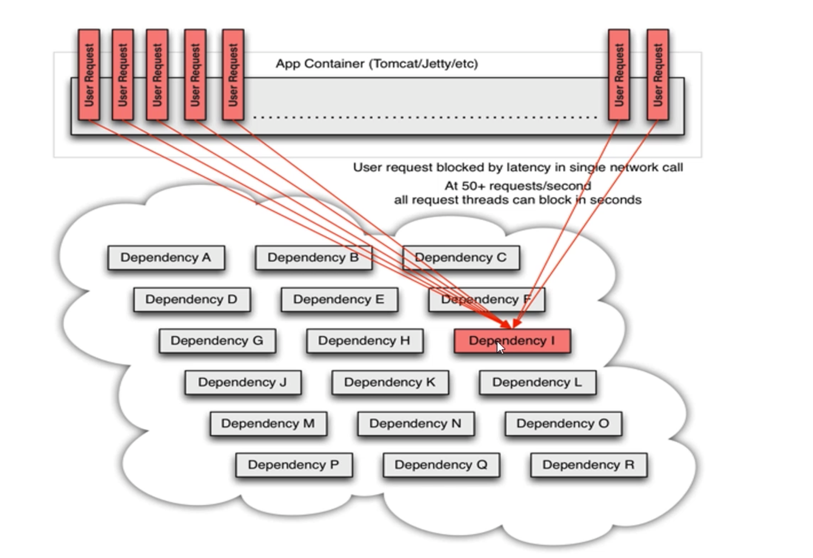
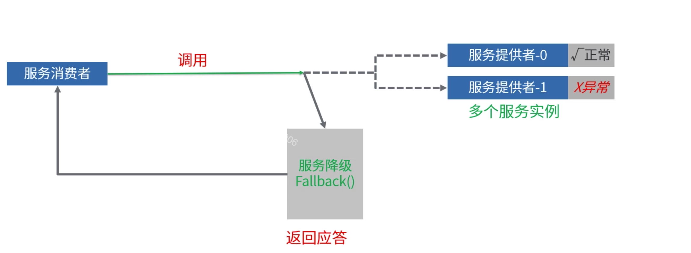
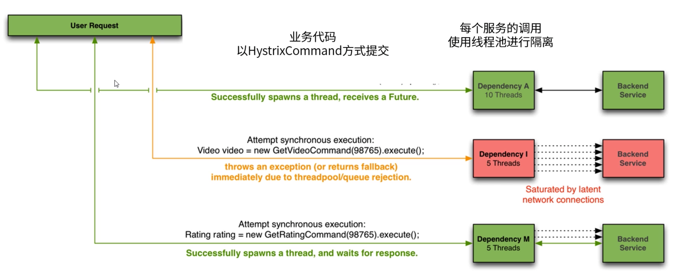
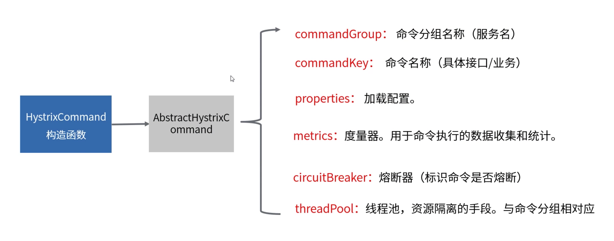
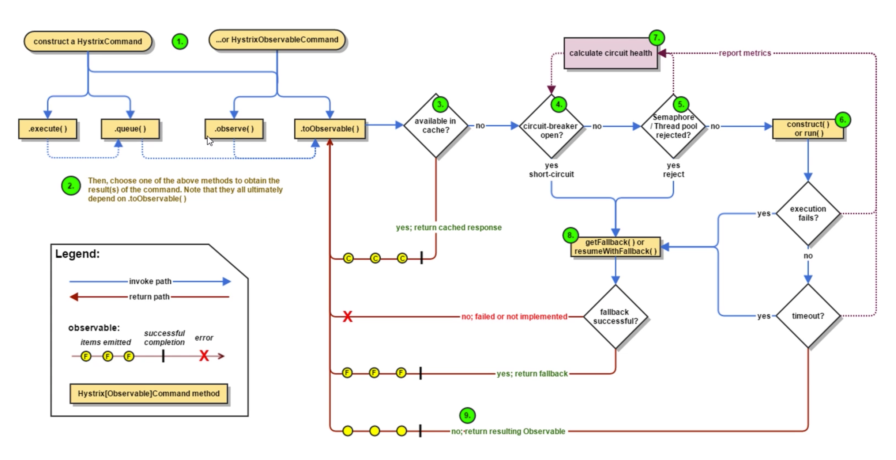

[TOC]

# 服务容错机制-hystrix

### 服务依赖

在微服务中，一个请求有可能是多个微服务协同处理的(相互依赖)。

### 服务异常

服务不可能永远健康，有可能超时，网络不通，导致调用者出现阻塞。

### 系统雪崩

请求一旦大量被阻塞，会占用大量资源，就可能导致整个系统雪崩。

### 构建弹性应用

1. 服务限流：服务消费者限制自身对某一服务能够发起的并发请求数量，超过数量则不调用。

2. 服务熔断：熔断状态下，服务消费者不会发起对某一服务的调用。

3. 服务降级：请求异常情况下，程序执行指定的降级策略。

   

   

### 集成Hystrix

配置spring-cloud-starter-netflix-hystrix包。

1. 引入springcloud关于hystrix的相关依赖。
2. 创建一个类继承HystrixCommand，重写fallback方法。
3. 通过这个类去代理相关请求。
4. 出现问题后执行fallback。

### Hystrix核心知识

1. Hystrix的资源隔离思想。

   

2. Hystrix的初始化流程。

   

3. Hystrix的执行流程。

   

4. 和springcloud的集成。

   * 启动类添加注解@EnableCircuitBreaker。
   * 在接口处添加注解@HystrixCommand。
   * 通过starter可以发现其定义切面点HyStrixCommandAspect。
   * 对带注解@HystrixCommand进行了切面处理。

5. Hystrix的监控dashboard。

   * 添加spring-cloud-starter-netflix-hystirx-dashboard依赖。
   * 添加注解@EnableHystrixDashboard。