[TOC]

# ribbon客户端负载均衡

### 什么是负载均衡

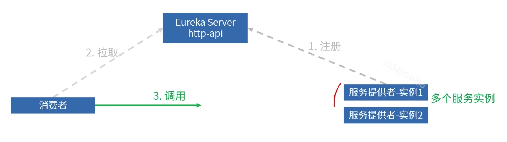

问题：

当服务提供者有多个实例的情况下，服务消费者根据什么规则选择其中一个实例进行调用？

1. 服务端负载均衡。

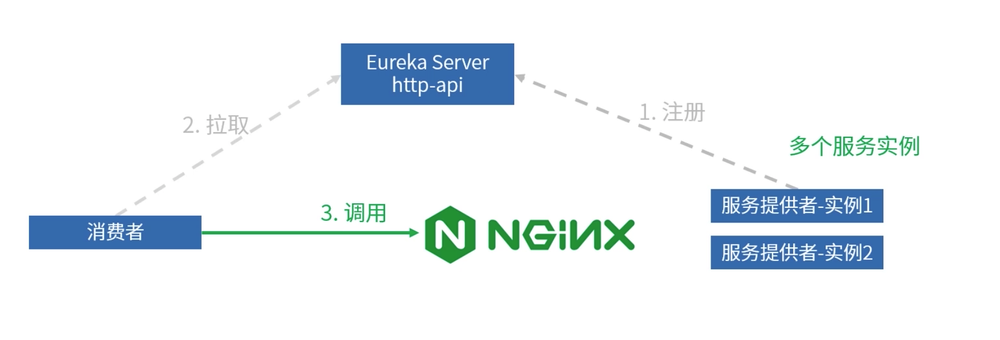

2. 客户端负载均衡。

   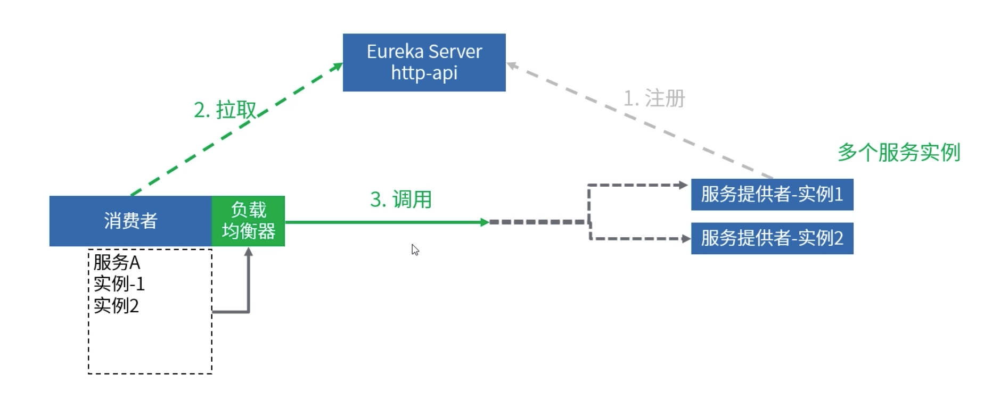

   

### Ribbon集成

1. 引入相关的jar。
2. 引入SpringCloud中的ribbon相关依赖。
3. 通过RibbonLoadBlanceClient的choose方法获取到服务实例。
4. 通过服务实例得到的ip+port去调用服务。

### Ribbon的核心知识

1. Ribbon客户端负载均衡器的构造和初始化过程。

   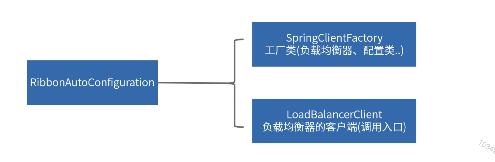

   RibbonAutoConfiguration：ribbon的自动装配类。

   LoadBalancerClient：定义了各种方法，如URI获取，服务实例选择等(默认RibbonLoadBalancerClient)。

   SpringClientFactory：内部包含了各种获取对象—如loadbalancer，instance等方法。

   服务启动时会根据RibbonAutoConfiguration自动装配SpringClientFactory和LoaderBalancerClient两个类。

   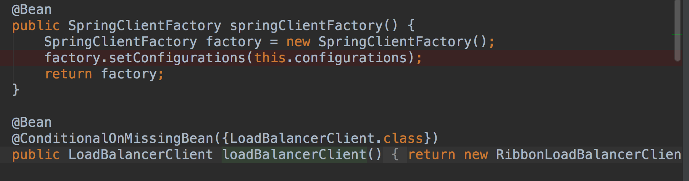

   实例化SpringClientFactory时，会根据默认的RibbonClientConfiguration资源创建出一个NamedContextFactory，用于后面接收到请求后创建子容器。

   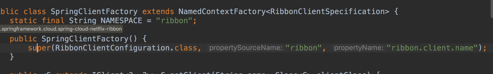

   在服务启动的时候并不会创建和IRule和ILoadBalancer等的实现类，而是再第一次请求时创建。

2. Ribbon如何发现有哪些服务实例。

   我们将断点打在客户端请求处。

   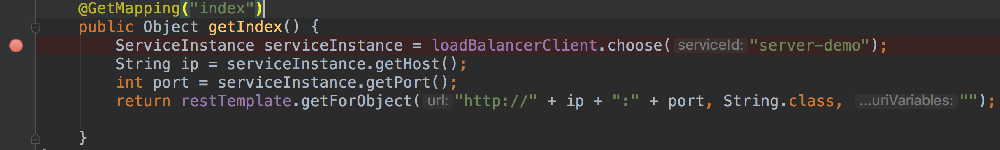

   然后再直接断点到NamedContextFactory的getContext方法上，之前调用链路都比较简单所以就略过了。

   在这里会先看context上下文中有没有以当前name为key的上下文，如果有则直接获取，如果没有则创建。

   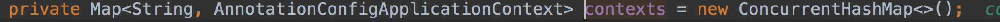

   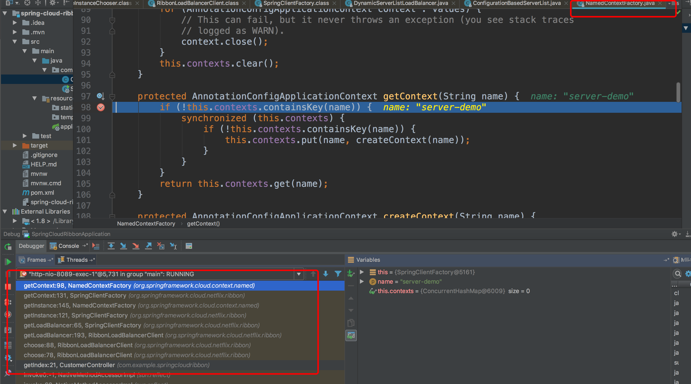

   创建的时候会首先看Ribbon客户端上有没有配置类，如果有的话注册到容器中。然后在将PropertyPlaceholderAutoConfiguration和以the.defaultConfigType表示的RibbonClientConfiguration注册到容器中，然后将当前容器设为此容器的父容器。刷新容器。

   

   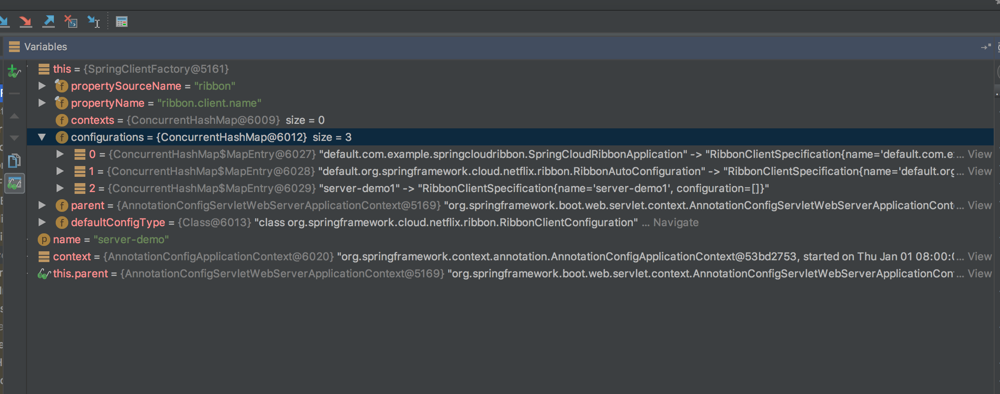

   在容器刷新的时候会去加载RibbonClientConfiguration配置资源，将IRule和ILoadBalancer等实现类托管到容器中。

   首先会去加载配置，我们在application.yaml中配置的listOfServers就是在这个时候加载的。

   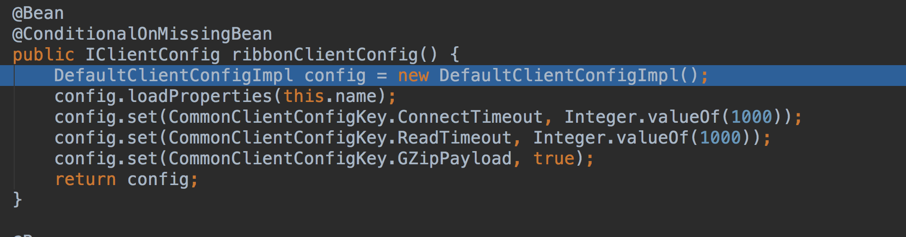

   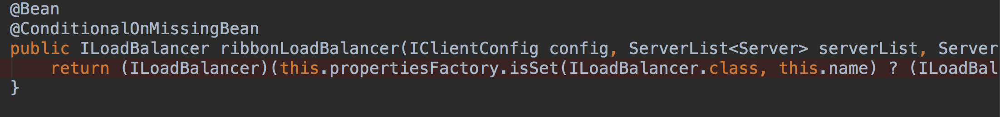

   等容器启动完成后，就可以从容器中获取ILoadBalancer实例了，默认实现是ZoneAwareLoadBalancer，它会根据配置发现可用的服务实例，然后再根据ILoadBalancer获取一个server。

   

3. Ribbon怎么实现负载均衡策略。

   ribbon通过IRule实现负载均衡策略，并提供了以下默认实现。

   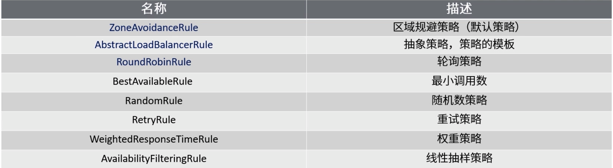

   在返回一个ILoadBalancer实例后，RibbonLoadBalancerClient调用getServer方法根据相应的LoadBalancer获取一个服务实例。

   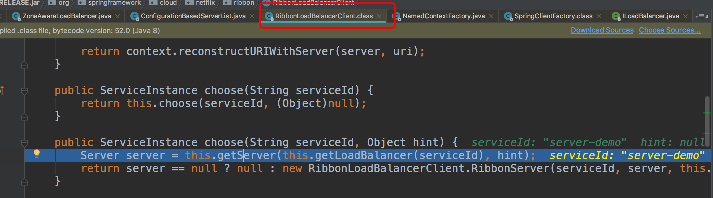

   默认会调用到ZoneAwareLoadBalancer的getServer方法，如果没有开启区域策略，则调用基类BaseLoadBalancer的chooseServer方法。

   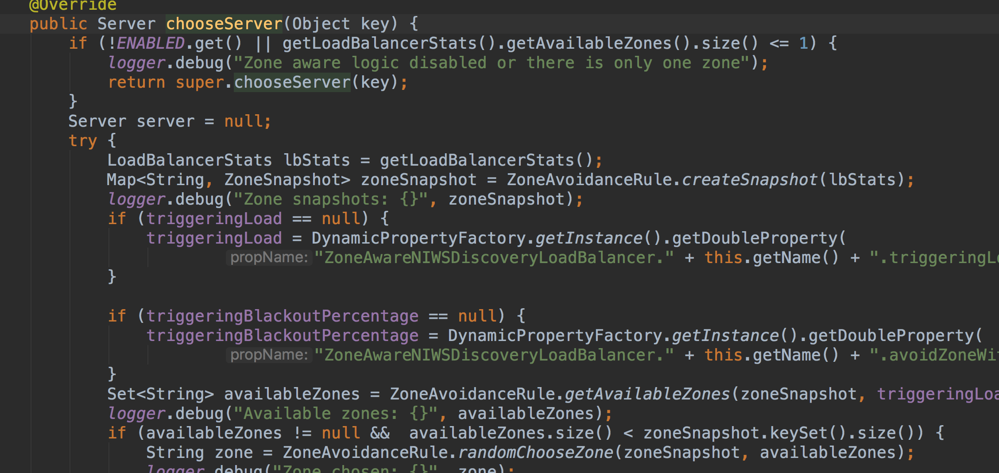

   然后会调用IRule的choose方法选出一个server，默认的是轮训规则。

   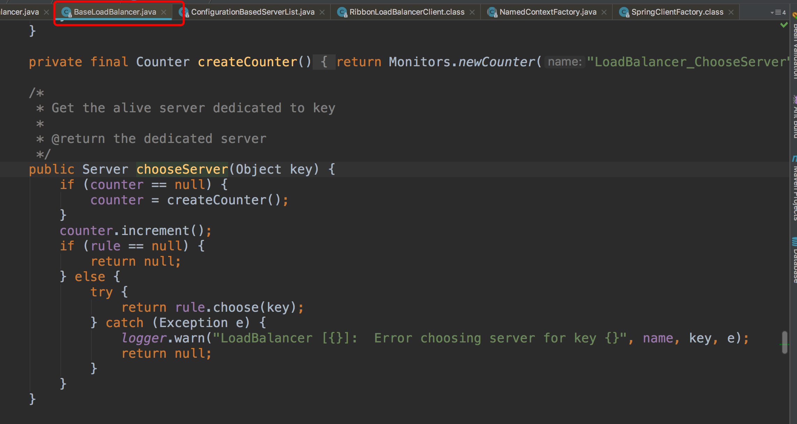

   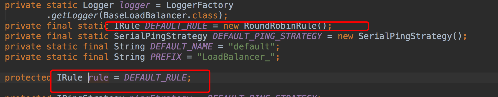

   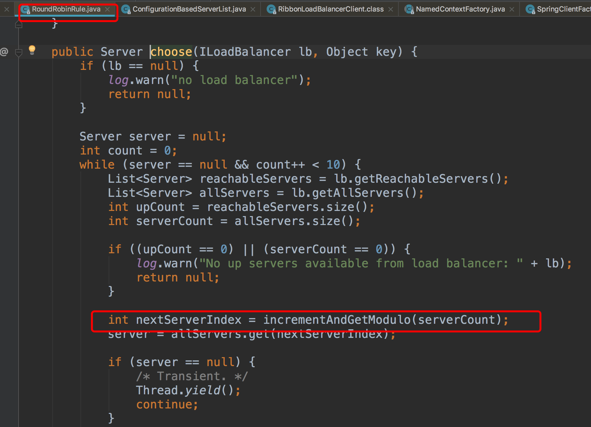

4. Ribbon的容错机制。

   * Iping机制：相当于心跳，每隔一段时间判断服务实例是否正常。

     返回服务实例前会先判断服务实例是否正常。

     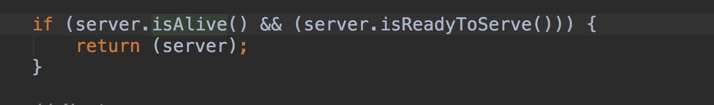

   * Iping机制的装载流程：未引入Eureka时，加载配置文件，一旦配置没有指定Iping，默认调用new DummyPing()，全部都返回true。引入Eureka时，加载EurekaRibbonClientConfiguration装载一个Iping，如果自定义配置Iping，默认使用NIWSDiscoveryPing，通过Eureka的状态返回服务是否正常。

     当我们没有自定义的IPing机制的时候，永远返回true。

     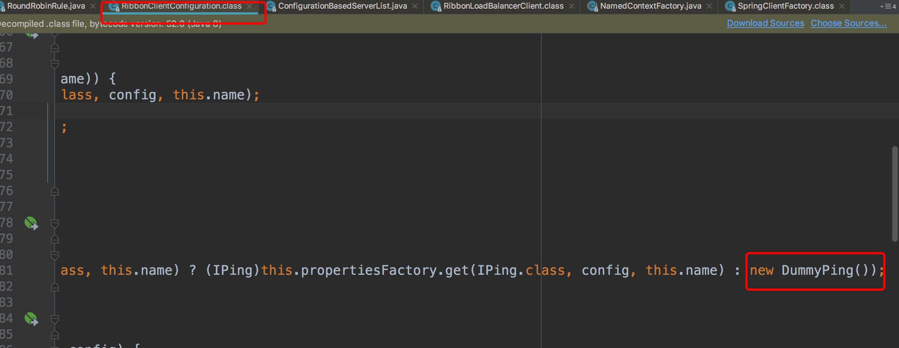

     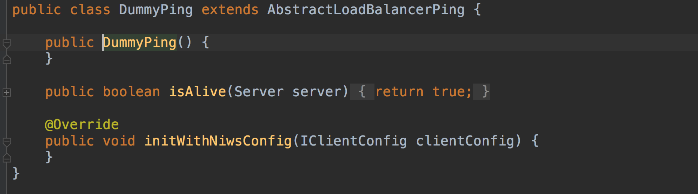

     而整合了Eureka后会装载一个RibbonEurekaAutoConfiguration配置，这个配置类又引入了EurekaRibbonClientConfiguration。在EurekaRibbonClientConfiguration中如果没有自定义的就使用NIWSDiscoverPing实现。

     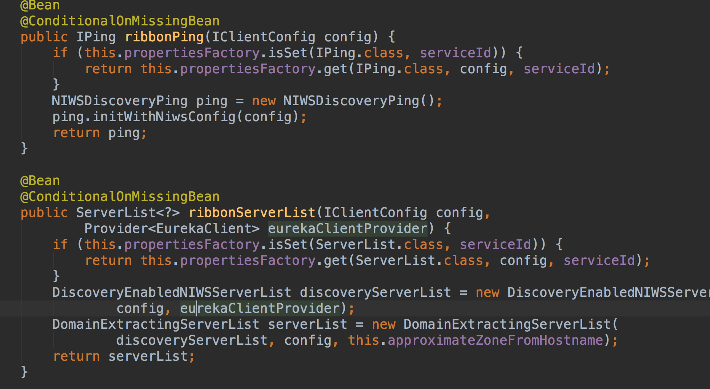

     该实现直接根据注册中心服务实例是否up来决定哪个服务实例正常。

     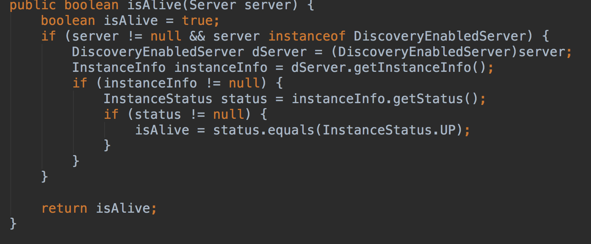

   * 重试机制，出现异常后，可以通过重试机制，发起重试。

     重试机制开启需要存在RetryTemplate类，所以我们引入spring-retry的jar包。

     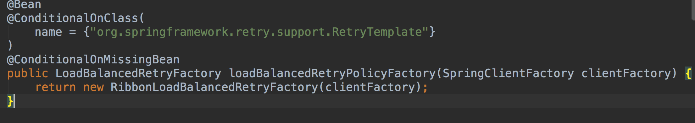

     请求后被RetryLoadBalancerInterceptor拦截器拦截执行，在其中获取到原始服务地址后，根据相应的LoadBanlancer规则进行重试调用。

     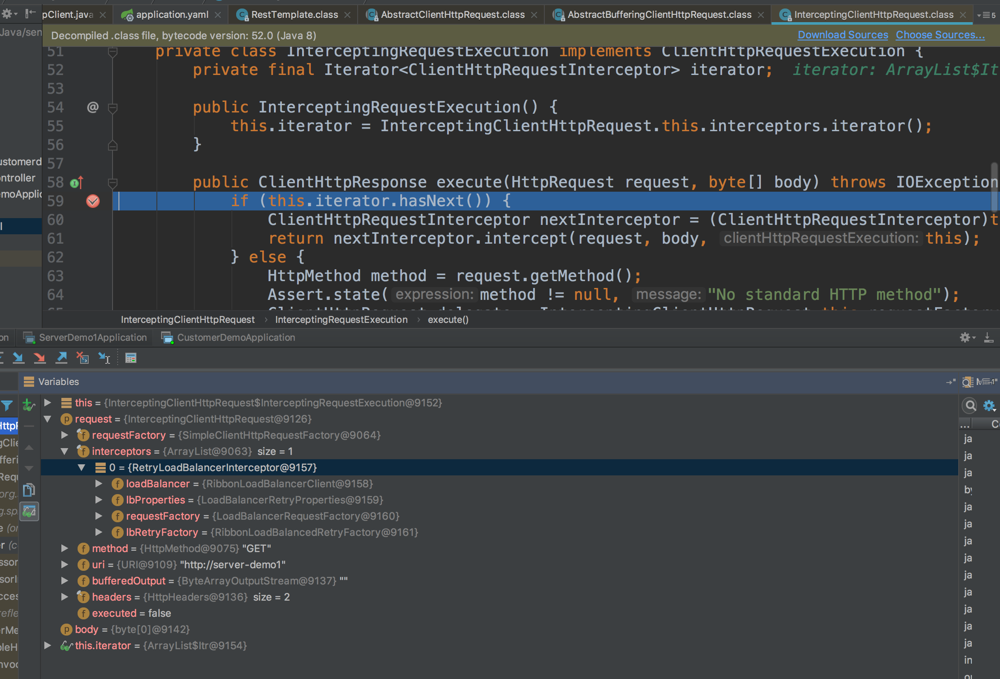

     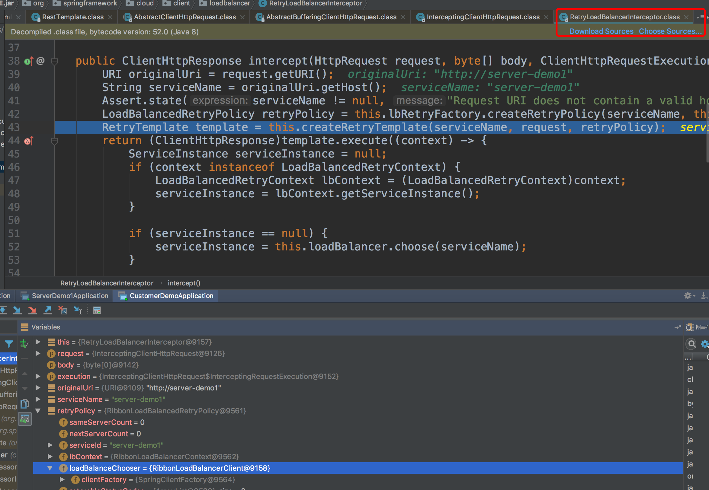

     不开启重试机制时请求被LoadBalancerInterceptor拦截。

   ### Ribbon和RestTemplate

   1. RestTemplate。

      RestTemplate是Spring提供的用于访问Rest服务的客户端。

      RestTemplate提供了多种便捷访问远程Http服务的方法，能够大大提高客户端的编写效率。

   2. Ribbon与RestTemplate。

      给RestTemplate加上@LoadBlanced注解。

      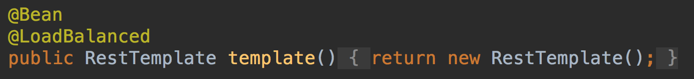

      使用RestTemplate通过服务名调用。

      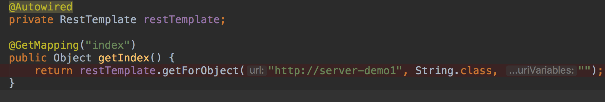

      

**疑问：在接入Eureka的情况下，存在EurekaRobbinClientConfiguration和RobbinClientConfiguration，怎么做到用Eureka的覆盖原生Robbin的？**

 