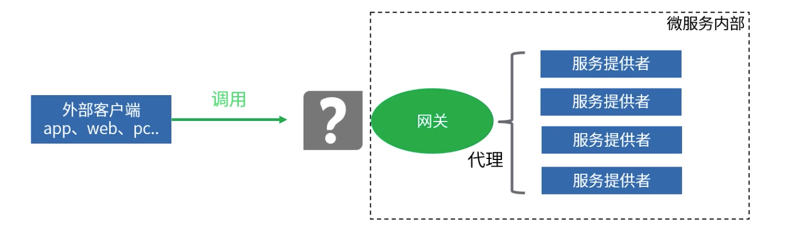
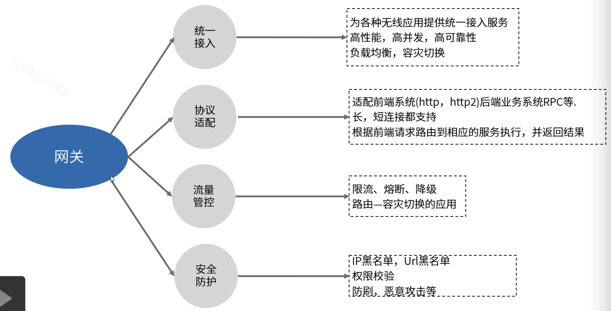
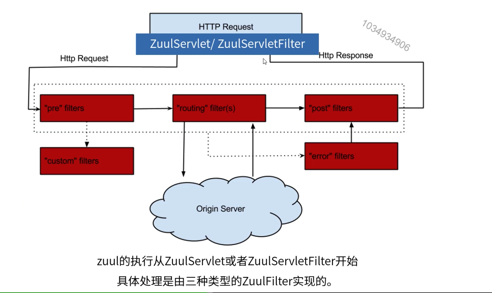
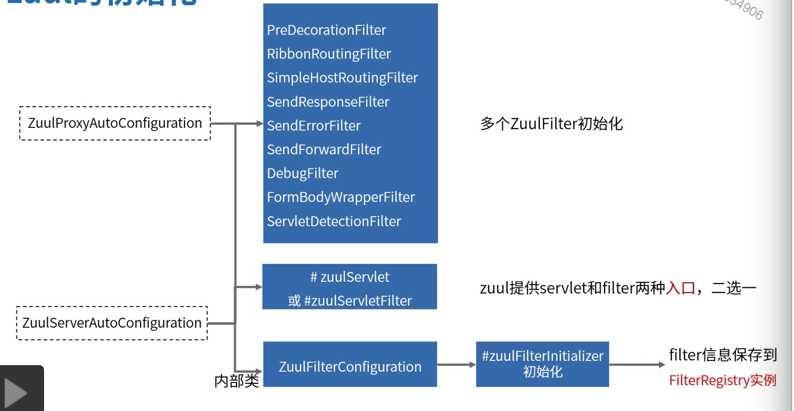
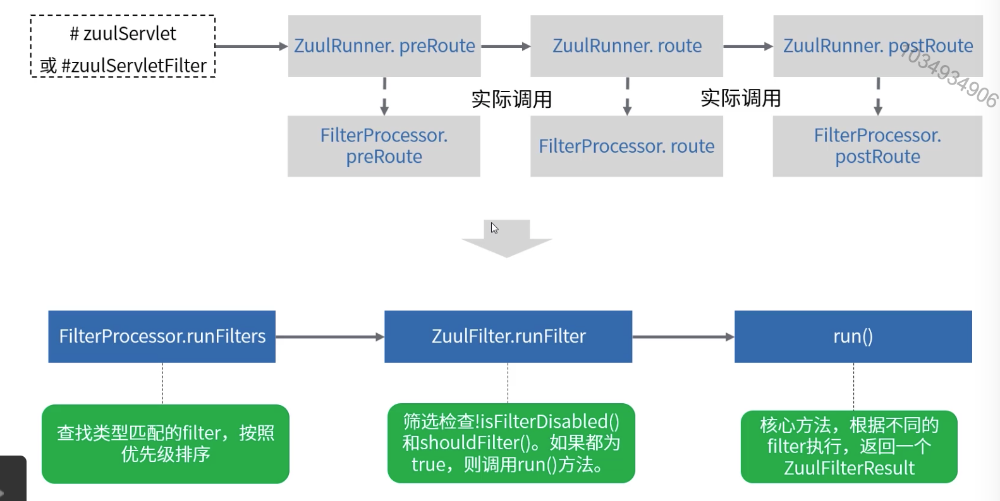
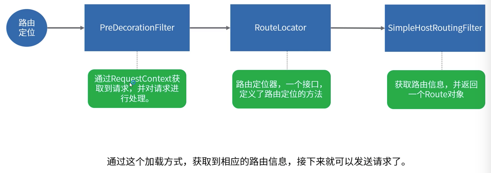
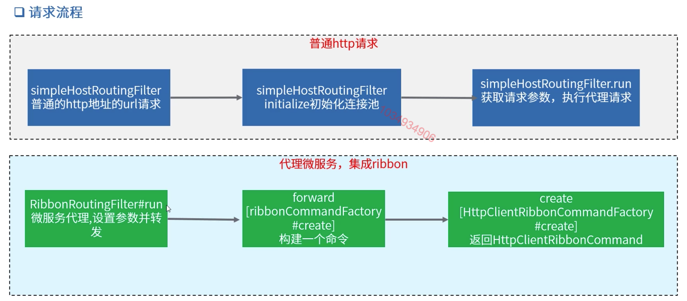

[TOC]

# 微服务网管zuul

### 为什么要用网关

1. 外部客户端无法发现服务。客户端种类多，并没有集成服务注册发现机制。

2. 服务地址无法访问。微服务实例众多，从安全性及ip资源的角度考虑，不会对公网开放。

3. 安全认证复杂。客户端直调服务实例，出于安全角度，每个服务都需要实现权限认证等功能。

   所有的外部请求先通过这个微服务网关，客户端只需要跟网关交互，然后由网关进行各个微服务的调用。

### 网关服务特性

### 服务网关zuul

1. zuul是什么？
   * zuul是netflix开源的一个API Gateway服务器，本质上是一个web应用。
   * zuul是可以提供动态路由，监控，弹性，安全等边缘服务的框架。
   * zuul相当于是服务和所有web请求的大门。
2. zuul能做什么？
   * 认证和安全-识别每个需要认证的资源，拒绝不符合要求的请求。
   * 性能监测-追踪并统计数据，提供精确的运行时状态数据。
   * 动态路由-根据需要将请求动态路由到后端集群。
   * 静态资源处理-直接负载均衡，预先为每种类型的请求分配容量，当请求超过容量时自动丢弃。
   * 在网关返回某些响应。

### zuul集成示例

1. 引入相关依赖。

   

2. 开启zuul网关代理功能。

   

   支持服务注册与发现机制的集成，开发这也可通过在配置文件中定义个性化路由。

### zuul核心

#### zuul的执行流程

### zuul的初始化

### zuul的filter执行流程

### zuul的路由定位流程

### zuul的请求执行流程

