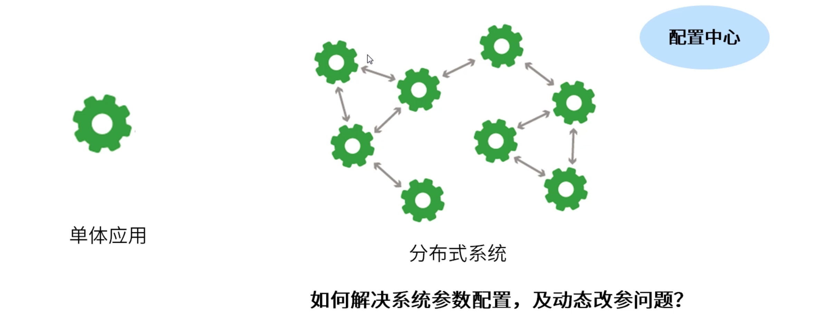
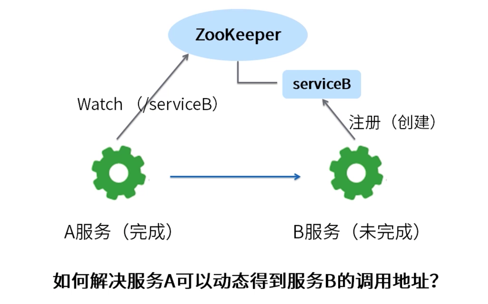
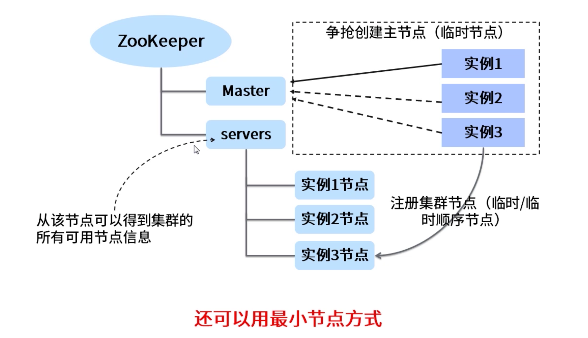
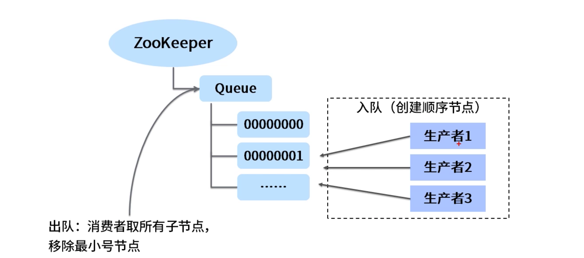
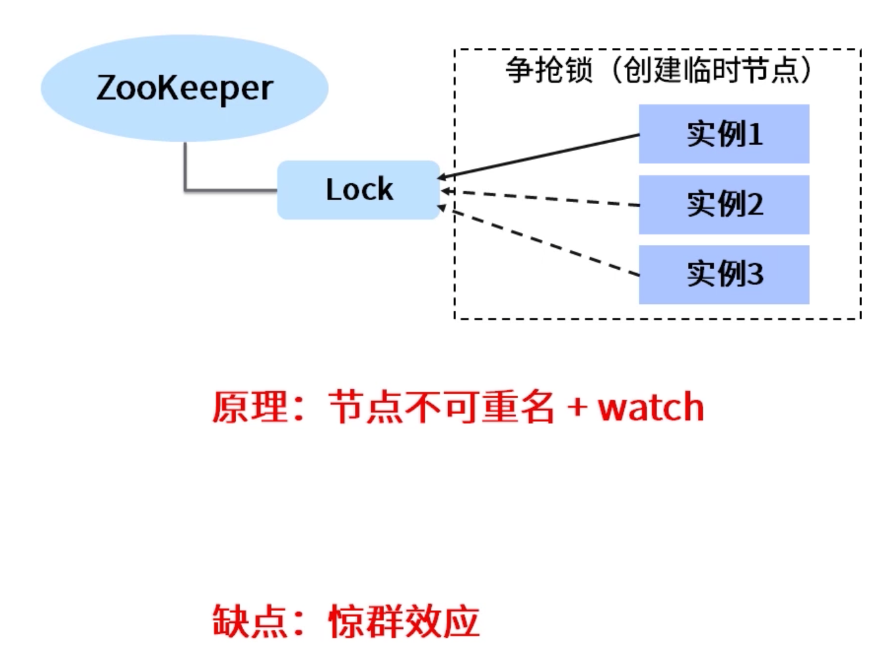
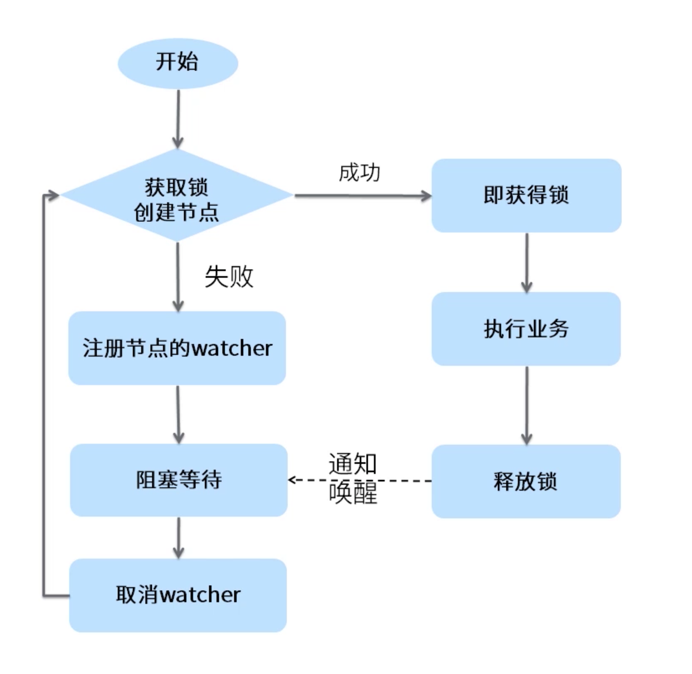
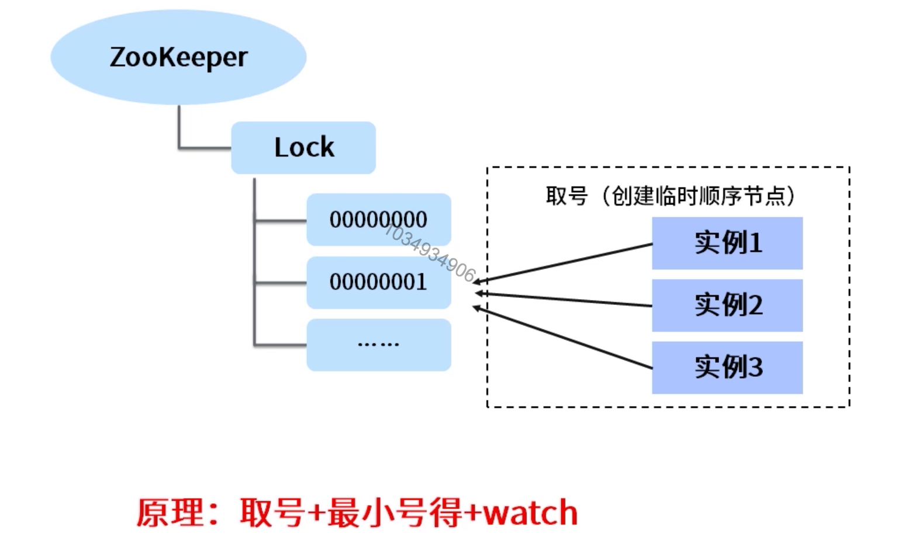
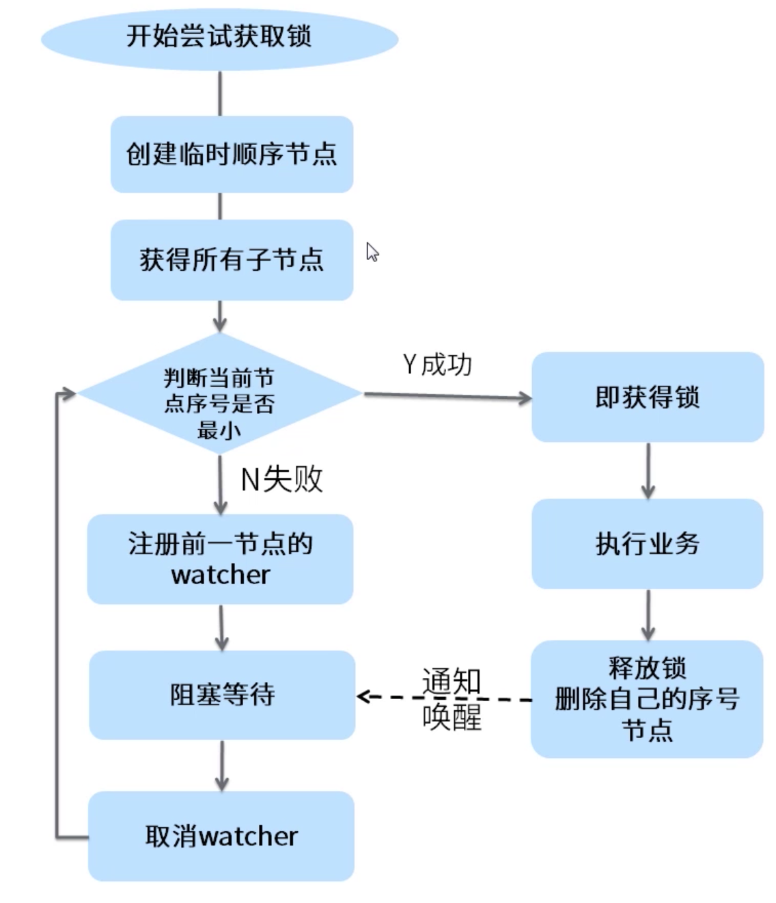

[TOC]

#  ZooKeeper典型应用场景

#### ZooKeeper实现配置中心

1. 何为配置中心。

   
   
2. 用ZooKeeper实现配置中心。
  
  * znode能存储数据。
  * watch能够监听数据的变化。
  
  可以把原来的一个配置项或者一个配置文件作为一个znode来构成一个配置中心。

#### ZooKeeper实现命名服务

1. 何为命名服务。

   

#### ZooKeeper实现master选举

   1. 何为Master选举。

      

   2. ZooKeeper如何实现Master选举。

      

#### ZooKeeper实现分布式队列

   1. ZooKeeper实现分布式队列。

      

#### ZooKeeper实现分布式锁

   1. ZooKeeper实现分布式锁方式一：

      

      

      2. ZooKeeper实现分布式锁方式二：

         

         

         

