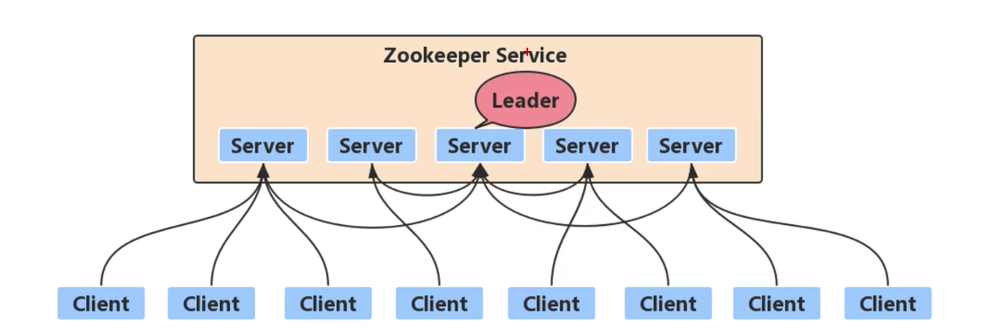
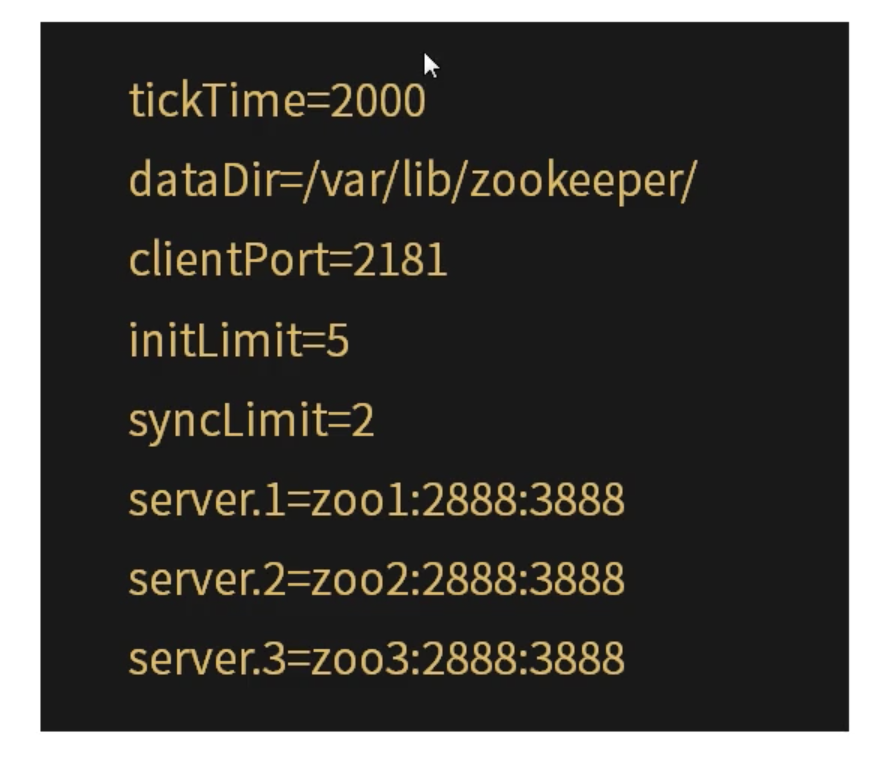
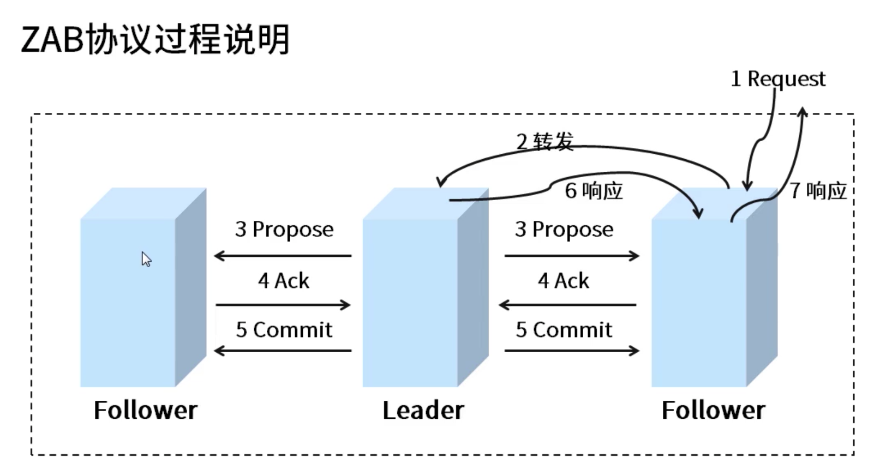

[TOC]

# ZooKeeper集群

- 可靠的ZooKeeper服务。
- 只要集群中的大多数都准备好了，就可以使用这项服务。
- 容错集群设置至少需要三个服务器，强烈建议使用奇数个服务器。
- 建议每个服务运行在单独的机器上。

### ZooKeeper集群搭建

1. initLimit。

   集群中的follower服务器与leader服务器之间完成初始化连接同步连接时能容忍最多心跳数。如果zk集群环境数量确实很大，同步数据的时间会变长，因此这种情况下可以适当调大该参数。

2. syncLimit。

   集群中的follower与leader服务器之间请求和应答之间能容忍的最多心跳数。

3. 集群节点。

   server.id=host:port:port

   id: 通过在各自的dataDir目录下创建一个名为myid的文件夹为每台机器赋予一个服务器id。

   两个端口号：第一个跟随者用来连接到领导者，第二个用来选举领导者。

4. 创建myid文件。

   一行只包含机器id的文本。id在集群中必须是唯一的，其值应该在1到255之间。如服务器1的id为"1"。

5. 集群中的所有节点都可以提供服务，客户端连接时，连接串中可以指定多个或全部集群节点的连接地址。当一个节点不通时，客户端将自动切花另外一个节点。

   "10.168.1.23:2181，10.168.1.24:2182，10.168.1.25:2181"

### ZAB协议

1. ZAB协议过程说明(原子广播协议)。

   

   * 所有事物请求转发给leader。
   * leader分配全局单调递增事务id(Zxid)，广播事务提议。
   * Follower处理提议，做出反馈。
   * leader收到过半数反馈，广播commit。
   * leader做出响应。

2. 崩溃恢复模式。

   Leader服务器出现崩溃，或者说由于网络原因导致Leader服务器失去了与过半Follower的联系，那么就会进入崩溃恢复模式。

   * ZAB协议规定如果一个事务Proposal在一台机器上被处理成功，那么应该在所有的机器上都被处理成功，哪怕机器出现故障崩溃。
   * ZAB协议确保那些已经在Leader服务器上提交的事物最终被所有服务器上都提交。
   * ZAB协议确保丢弃那些只在Leader服务器上被提出的事物。

   ZAB协议需要设计的选举算法应该满足：确保提交已经被Leader提交的事务Proposal，同时丢弃已经被跳过的事务Proposal。

   * 如果让Leader选举算法能够保证新选举出来的Leader服务器拥有集群中所有机器最高ZXID的事务Proposal，那么就可以保证这个新选举出来的Leader一定具有所有已经提交的提案。
   * 如果让具有最高编号事务Proposal的机器来成为Leader，就可以省去Leader服务器检查Proposal的提交个丢弃工作这一步骤。

3. 数据同步。

   Leader选举出来后，需完成Followers与Leader的数据同步，当半数的Followers完成同步，则可以开始提供服务。同步过程如下：

   * Leader服务器为每一个Follwoer服务器都准备一个队列，并将那些没有被各Follower服务器同步的事物以Proposal消息的形式发送给Follower服务器，并在每一个Proposal消息后面紧接着再发送一个Commit消息，以表示已经被提交。
   * Follower服务器将所有尚未同步的事务Proposal都从该Leader服务器上同步过来并成功应用到本地数据库中后，Leader服务器就会将该Follower服务器中加入到真正的可用Follower列表中，并开始之后的其它流程。
   
4. 丢弃事务Proposal处理。

   在ZAB协议的事务编号ZXID设计中，ZXID是一个64位的数字。

   * 低32位是一个简单的单调递增的计数器，针对客户端的每一个事务请求，Leader服务器在产生一个新的事务Proposal的时候，都会对该计数器进行加1操作。
   * 高32位代表了Leader周期纪元的编号，每当选举产生一个新的Leader服务器，就会将这个Leader服务器上取出其本地日志中最大事务Proposal的ZXID，并从该ZXID中解析出来对应的积怨值，然后对其进行加1操作，之后就会以此编号作为新的纪元，并将32位置为0来生成新的ZXID。

   基于这样的策略，当一个包含了上一个Leader周期中尚未提交过的事务Proposal的服务器启动加入到集群中，发现此时集群中已经存在Leader，将自身以Follower角色连接上Leader服务器之后，Leader服务器会根据自己服务器上最后被提交的Proposal和Follower服务器的Proposal进行对比，发现follower中有上一个leader周期的事务Proposal时，Leader会要求Follower进行一个回退操作，回退到一个确实已经被集群中过半提交的最新的事务Proposal。

### ZooKeeper集群Leader选举

1. 对选举算法的要求。
   * 选出的Leader节点上要持有最高的zxid。
   * 过半数节点同意。
2. 内置实现的选举算法。
   * LeaderElection。
   * FastLeaderElection。
   * AuthFastLeaderElection。

#### ZooKeeper集群Leader选举机制概念

1. 服务器id myid。
2. 事务id，服务器中存放的最大Zxid。
3. 逻辑时钟，发起的投票轮数计数。
4. 选举状态：
   * Looking，竞选状态。
   * Following，随从状态，同步leader状态，参与投票。
   * Observing，观察状态，同步leader状态，不参与投票。
   * Leading，领导者状态。

#### ZooKeeper集群Leader选举算法

1. 每个服务实例均发起选举自己为领导者的投票(自己的投给自己)。
2. 其它服务实例收到投票邀请时，比较发起者的数据事务ID是否比自己最新的事务ID大，大则投给它一票，小则不投票给它，相等则比较发起者的服务器ID，大则投票给它。
3. 发起者收到大家的投票反馈后，看投票数(含自己的)是否大于集群的半数，大于则胜出，担任领导者，未超过半数且领导这未选出，则再次发起投票。

胜出条件：投票赞成数大于半数则胜出。

#### ZooKeeper集群Leader选举流程示例说明

有5台服务器，每台服务器均没有数据，它们的编号是1，2，3，4，5按编号依次启动，它们的选举过程如下：

* 服务器1启动，给自己投票，然后发投票信息，由于其它机器还没有启动所以它收不到反馈信息，服务器1的状态一直属于Looking。
* 服务器2启动，给自己投票，同时与之前启动的服务器1交换结果，由于服务器2的编号大所以服务器2胜出，但此时投票数没有大于半数，所以两个服务器的状体啊依然是Looking。
* 服务器3启动，给自己投票，同时与之前启动的服务器1，2交换信息，由于服务器3的编号最大所以服务器3胜出，此时投票数正好大于半数，所以服务器3成为领导者，服务器1，2成为小弟。
* 服务器4启动，给自己投票，同时与之前的服务器1，2，3交换信息，尽管服务器4编号大，但之前服务器3已经胜出，所以服务器4只能成为小弟。
* 服务器5启动，后面的逻辑同服务器4。