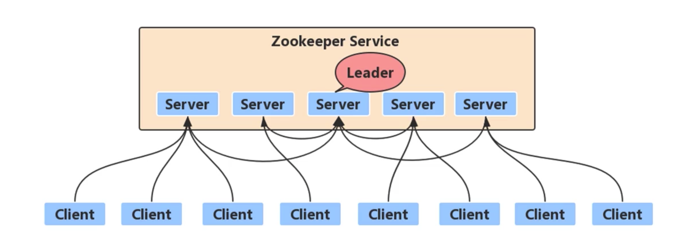
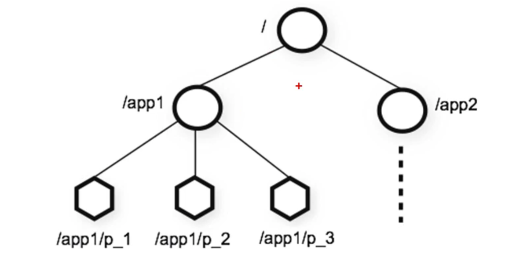
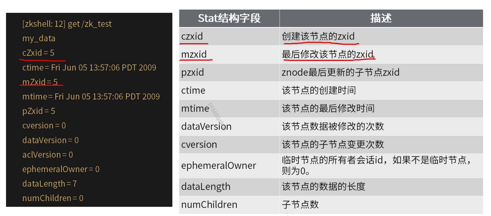
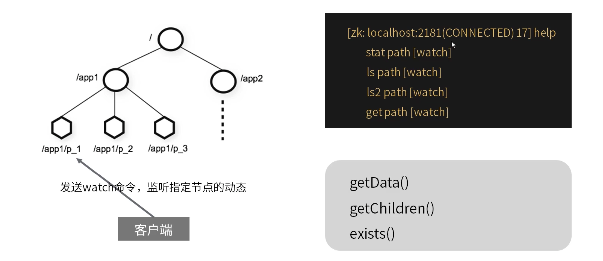

[TOC]

# zk核心概念

### session

* 一个客户端连接一个会话，由zk分配唯一会话id。
* 客户端以特定的时间间隔发送心跳以保持回话有效，tickTime。
* 超过会话超时时间未收到客户端的心跳，则判定客户端死了，默认为2倍的tickTime。
* 会话中的请求按FIFO顺序执行。

### 数据模型

1. 层次名称空间。

   * 类似于unix文件系统，以/为根。
   * 区别：节点可以包含与之关联的数据以及子节点。
   * 节点的路径总是表示为规范的，绝对的，斜杠分隔的路径。

2. znode

   * 名称唯一，命名规范。
   * 节点类型：持久，顺序，临时，临时顺序。
   * 节点数据构成。

   

   #### 命名规范

   节点名称除了下列限制外，可以使用任何unicode字符。

   * null字符，(u\0000)不能作为路径名的一部分。

   * 以下字符不能使用，因为它们不能很好地显示，或者以令人迷惑的方式呈现：

     \u0001-\u0019和\u007F-\u009F。

   * 不允许使用以下字符：\ud800-uf8fff，\uFFF0-uFFFF。

   * "."字符可以用作另一个名称的一部分，但是"."和".."不能单独用于指示路径上的节点，因为ZooKeeper不使用相对路径。下列内容无效："a/b/./c"或"c/a/b/../"。

   * "zookeeper"是保留节点名。

   #### 节点类型

   * 持久节点：create /app1 666

   * 临时节点：create -e/app2 888

   * 顺序节点：create -s /app1/cp 888 cp0000000000

     ​		           create -s /app1/ aa 0000000001

     10位10进制序号，每个父节点一个计数器，计数器是带符号int到2147483647之后将溢出(导致名称"<path>-2147483648")

   * 临时顺序节点：create -e -s /app1/ 888

   #### 数据构成

   * 节点数据：存储的协调数据，状体信息，配置，位置信息等。
   * 节点元数据，stat结构。
   * 数据量上限：1M。

   ##### 元数据stat结构

   
   
### ZooKeeper中的时间

#### 多种方式跟踪时间

1. Zxid ZooKeeper中的每次更改操作都对应一个唯一的事物id，称为Zxid，它是一个全局有序的戳记，如果zxid1小于zxid2，则zxid1发生在zxid2之前。
2. Version numbers版本号，对节点的每次更改都会导致该节点的版本号之一增加。
3. Ticks当使用多服务器ZooKeeper时，服务器使用"滴答"来定义事件的时间，如状态上传，会话超时，对等点之间的连接超时等。滴答时间仅通过最小会话时间(抵达时间的2倍)间接公开；如果客户端请求的会话超时小雨最小会话超时，服务器将告诉客户端会话超时实际上是最小会话超时。
4. Real timeZooKeeper除了在znode创建和修改时将时间戳放入stat结构之外，根本不使用Real time或时钟时间。

### Watch监听机制

客户端可以在znodes上设置watch，监听znode的变化。

1. 两类watch。
   * data watch监听数据变更。
   * child watch监听子节点变化。
2. 触发watch事件。
   * Create event:Enabled with a call to exists。
   * Delete event:Enabled with a call to exists,getData,and getChildren。
   * Changed event:Enabled with a call to exists and getData。
   * Child event:Enabled with a call to getChildren。
3. watch重要特性。
   * 一次触发：watch触发后即被删除，要持续监控变化，则需要持续设置watch。
   * 有序性：客户端先得到watch通知，后才会看到变化结果。
4. watch注意事项。
   * watch时一次性触发器，如果您获得了一个watch事件，并且希望得到关于未来更改的通知，则必须设置另一个watch。
   * 因为watch是一次性触发器，并且在获取事件和发送获取watch的新请求之间存在延迟，所以不能可靠地得到节点发生的每次更改。
   * 一个watch对象只会被特定的通知触发一次。如果一个watch对象同时注册了exists，getData，当节点被删除时，删除事件对exists，getData都有效，但只会调用watch一次。
### ZooKeeper特性

1. 顺序一致性：保证客户端操作是按顺序生效的。
2. 原子性：更新成功或失败，没有部分结果。
3. 单个系统影像：无论连接到哪个服务器，客户端都将看到相同的内容。
4. 可靠性：数据的变更不会丢失，除非被客户端覆盖修改。
5. 及时性：保证系统的客户端当时读取到的数据是最新的。

   