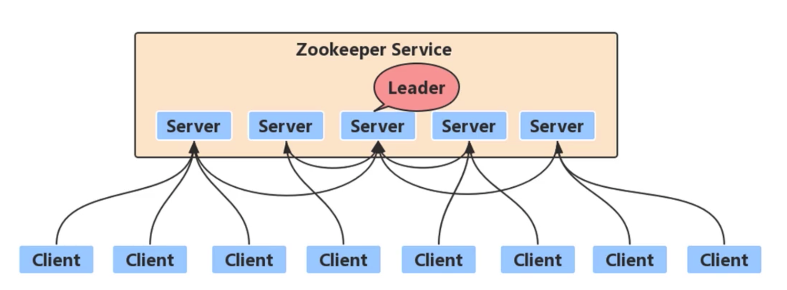
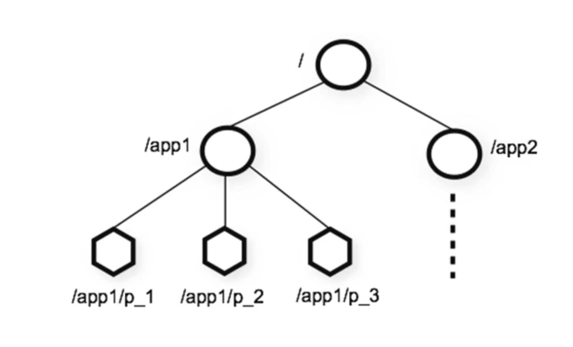
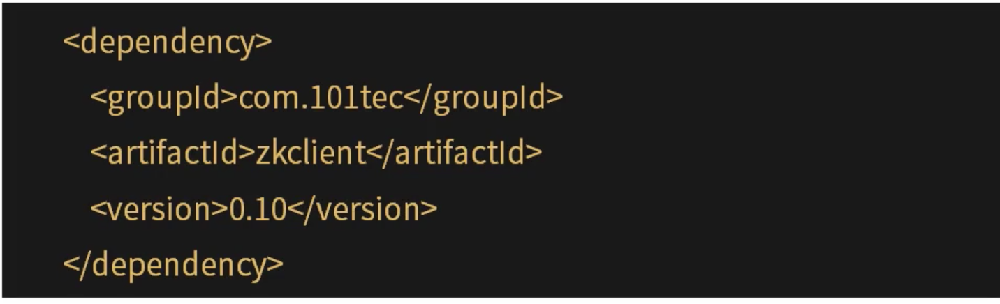

[TOC]

# Zookeeper入门

### 什么是ZooKeeper

1. 简介：Apache ZooKeeper是一种用于分布式应用程序的高性能协调服务，提供一种集中式信息存储服务。

2. 特点：数据存在内存中，类似文件系统的树形结构，高吞吐量和低迟延，集群高可靠。

3. 作用：基于ZooKeeper可以实现分布式统一配置中心，服务注册中心，分布式锁等功能。

   

   

4. 什么是分布式协调服务。

   单机系统因处理能上限，可用性，变成分布式系统。原来在单机进程中完成的一件事的多个步骤，变为再多个计算机中完成，这时就需要协调各个计算节点做事的顺序。原来在单系统中资源竞争通过锁进行同步控制。现在变成了多个计算机进程间的资源竞争，也需要分布式协调。我们可以把每个分布式系统中需要的协调管理的公共基础部分抽取出来作为一个基础公共服务供大家使用，这就是分布式协调服务。

### 单机版安装

1. 下载：https://archive.apache.org/dist/zookeeper/zookeeper-3.4.13/zookeeper-3.4.13.tar.gz
2. 解压后的conf目录，增加配置文件zoo.cfg。
3. 启动服务端bin/zkServer.sh start。
4. 测试，客户端连接：bin/zkCli.sh -server 127.0.0.1:2181

### CLI操作指令

|     指令     |                描述                 |
| :----------: | :---------------------------------: |
|      ls      |             获取子节点              |
|    create    | 在zookeeper中的某个位置创建一个节点 |
|    delete    |              删除节点               |
|    exists    |          测试节点是否存在           |
|   get data   |         从指定节点读取数据          |
|   set data   |         将数据存入指定节点          |
| get children |     查询指定节点下的所有子节点      |
|     sync     |          等待数据进行同步           |

### Java API

|     方法     |             描述              |
| :----------: | :---------------------------: |
|   connect    |      连接到ZooKeeper集合      |
|    create    |           创建znode           |
|    exists    |   检查znode是否存在及其信息   |
|   get data   |     从特定的znode获取数据     |
|   set data   |     在特定的znode设置数据     |
| get children | 获取特定的znode中的所有子节点 |
|    delete    |  删除特定的znode及其所有子项  |
|    close     |           关闭连接            |

### 第三方客户端

1. zKclient

   

2. curator