[TOC]

# Compose集成式应用组合

### Compose简介

1. Compose项目是Docker官方的开源项目，负责实现对Docker容器集群的快速编排。其代码目前在https://github.com/docker/compose上开源。

2. Compose定位是，定义和运行多个Docker容器的应用，其前身是开源项目Fig。

3. 使用一个Dockerfile模版文件，可以让用户很方便的定义一个单独的应用容器。然而，在日常工作中，经常碰到需要多个容器相互配合来完成某项任务的情况。例如要实现一个Web项目，除了Web服务容器本身，往往还需要在加上后端的数据库服务容器，甚至还包括负载均衡容器等。

4. Compose恰好满足了这样的需求。它允许用户通过一个单独的docker-compose.yml模版文件来定义一组相关联的应用容器为一个项目。

5. Compose中有两个重要的概念：

   * 服务：一个应用的容器，实际上可以包括若干运行相同镜像的容器实例。
   * 项目：有一组关联的应用容器组成的一个完整业务单元。

   一个项目可以由多个服务容器关联而成，Compose面向项目进行管理。

6. Compose的默认管理对象是项目，通过子命令对项目中的一组容器进行便捷地声明周期管理。

7. Compose项目由Python编写，实际上调用了Docker服务提供的API来对容器进行管理。

### 安装和卸载

Compose可以通过Python的包管理工具pip进行安装，也可以直接下载编译好的二进制文件使用，甚至能够直接在Docker容器中运行。

Docker for Mac，Docker for Windows自带docker-compose二进制文件，安装Docker之后可以直接使用。

```java
docker-compose --version
```

Linux系统需要单独使用二进制或者pip方式进行安装。

从官方GitHub Release处直接下载编译好的二进制文件即可。

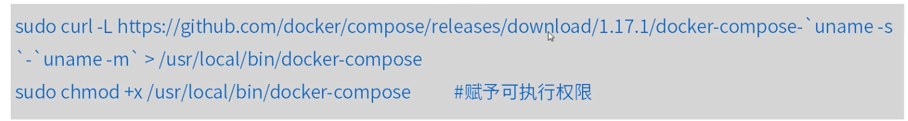

如果计算机架构是ARM，建议使用pip安装。

```java
sudo pip install -U docker-compose
```

下面我们通过dubbo-admin(依赖zookeeper)来使用compose。compose使用的最常见的场景就是web网站，一般的web网站都会依赖第三方提供的服务(比如：DB和cache)。

### Compose构建dubbo-admin服务

1. 获取源码。

   ```java
   git clone -b master https://github.com/apache/incubator-dubbo-ops.git
   ```

2. 修改admin中的application配置，把zookeeper地址改为zookeeper://zookeeper:2181。

3. 使用maven进行编译打包。

   ```java
   mvn clean package -Dmaven.test.skip=true
   ```

4. 在dubbo-admin目录下编写Dockerfile文件，内容为：

   ```java
   FROM openjdk:8-jdk-alpine
   MAINTAINER zhuchengwei<925023914@163.com>
   VOLUME /tmp
   # ADD，拷贝文件并且重命名
   ADD ./target/dubbo-adimin-0.0.1-SNAPSHOT.jar app.jar
   # ENTRYPOINT，为了缩短Tomcat的启动时间，添加java.security.egd的系统属性指向/dev/urandom作为ENTRYPOINT
   ENTRYPOINT ["java","-Djava.security.egd=file:/dev/.urandom","-jar","/app.jar"]
   ```

5. 使用docker build -t Dubbo-admin:1.0命令进行构建。

6. 在项目根目录下编写docker-compose.yml文件，这个是Compose使用的主模版文件。

   ```yaml
   version: '3.4'
   services:
   	zk_server:
       image: zookeeper:3.4
       ports:
         - 2181:2181
   	dubbo-admin:
       image: dubbo-admin:1.0
       links:
        - zk_server:zookeeper
       ports:
        - 7001:7001
   ```

7. 在docker-compose.yml文件所在目录执行：

   docker-compose up

8. 在浏览器中访问http://服务器ip:7001进行验证，用户名密码为:root/root guest/guest。

### Compose命令说明

命令对象与格式。

执行docker-compose [COMMAND] —help或者docker-compose help [COMMAND]可以查看具体某个命令的使用格式。

docker-compose的命令的基本使用格式是：

```java
docker-compose [-f=<arg>][options][COMMAND][ARGS]
```

命令选项。

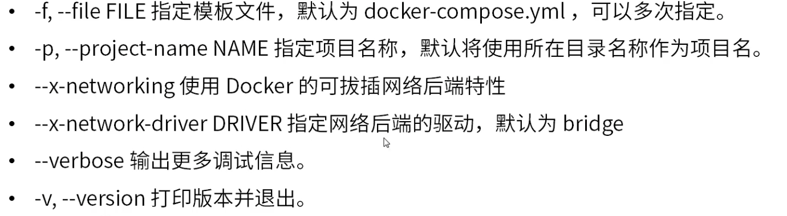

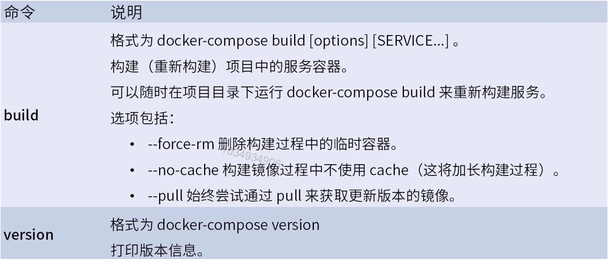

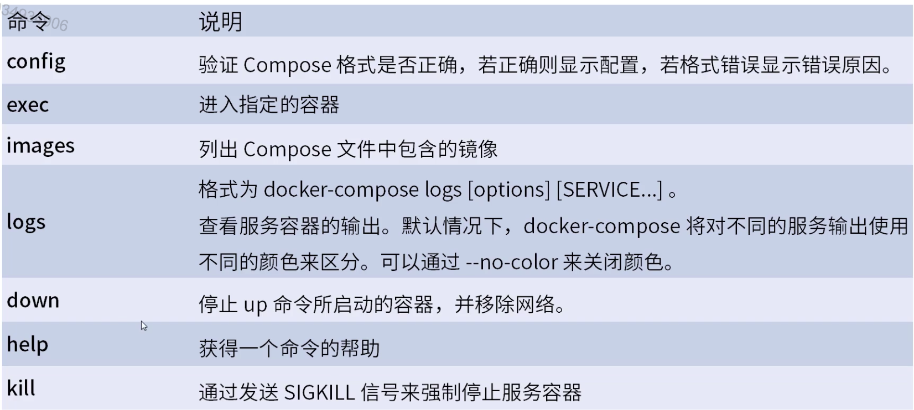

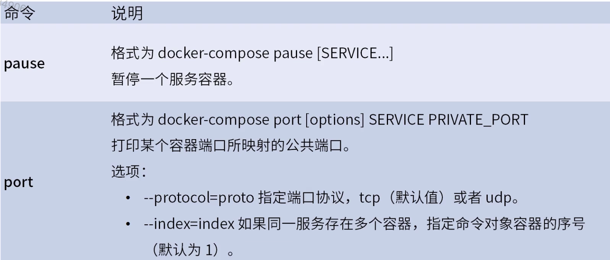

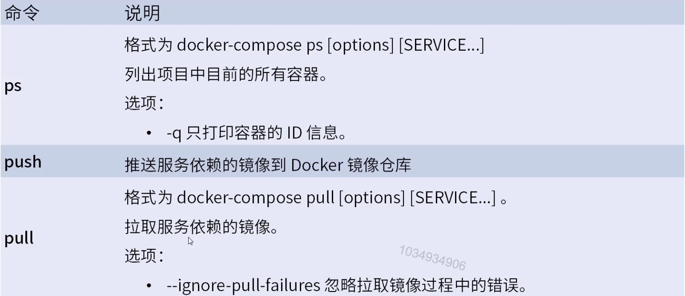

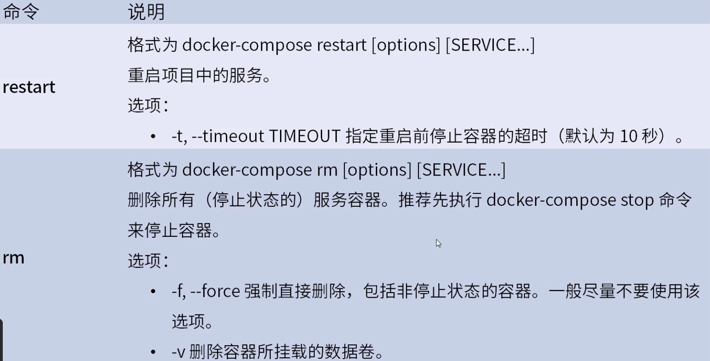

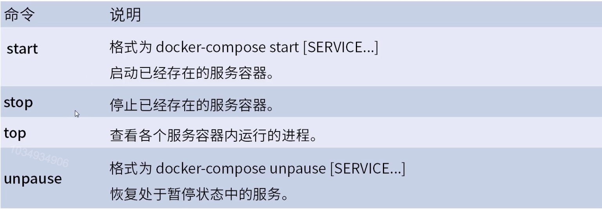

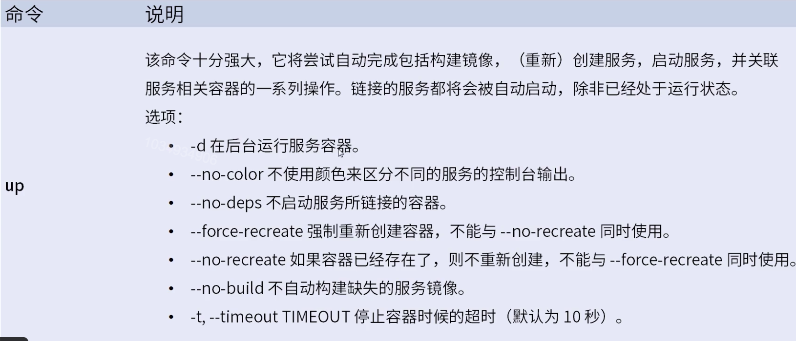

### Compose模版文件

模版文件是使用Compose的核心，涉及到的指令关键字也比较多。默认的模版文件名称为docker-compose.yml，格式为YAML格式。

注意每个服务都必须通过image指令指定镜像或build指令(需要Dockerfile)等来自动构建生成镜像。

如果使用build指令，在Dockerfile中设置的选项(例如：CMD，EXPOSE，VOLUME，ENV等)将会被自动获取，无需在docker-compose.yml中再次设置。

### Compose命令说明

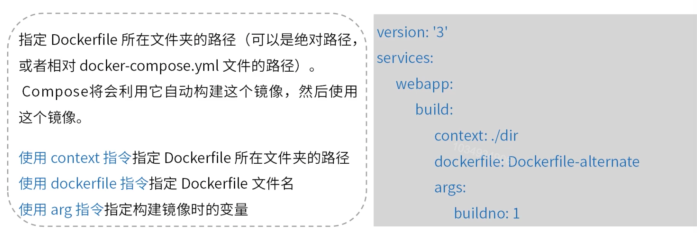

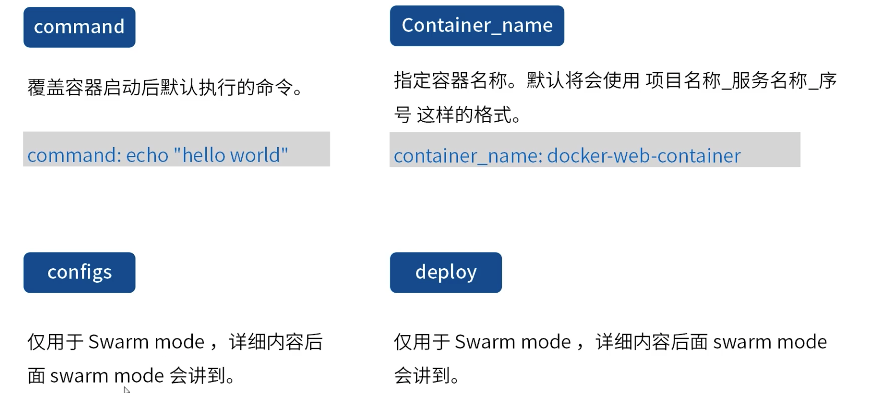

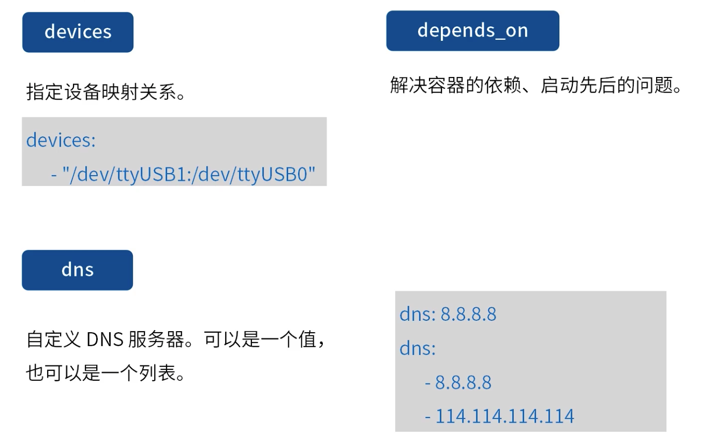

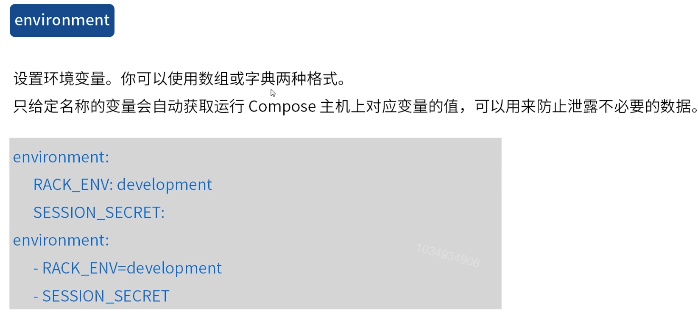

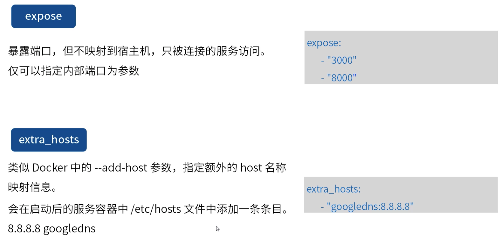

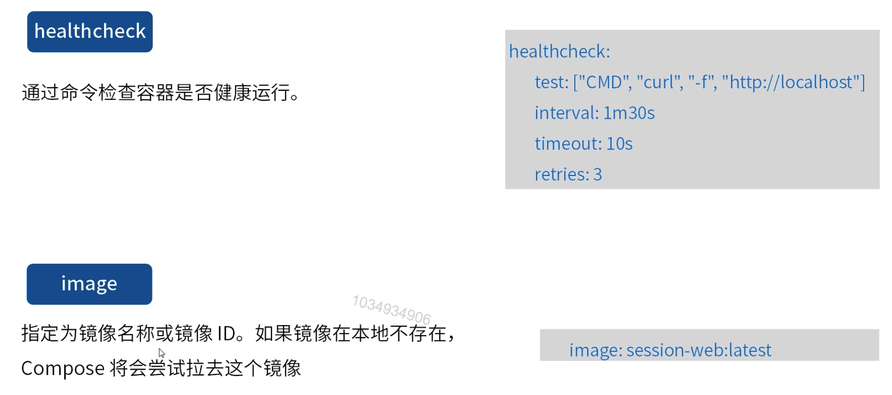

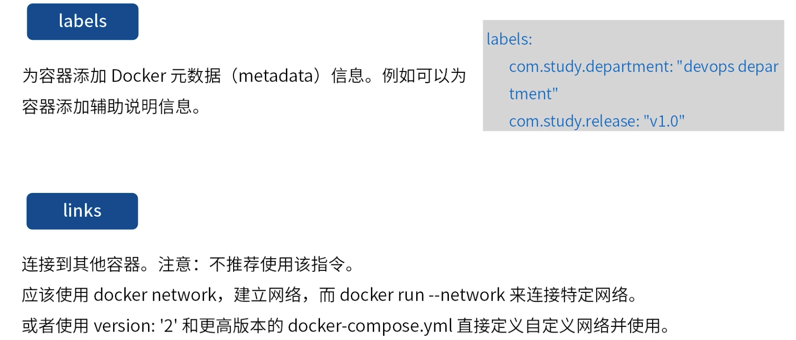

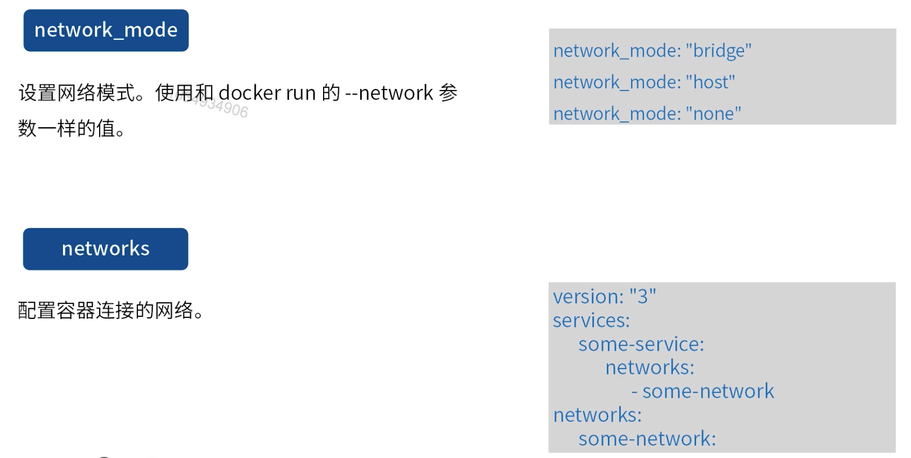

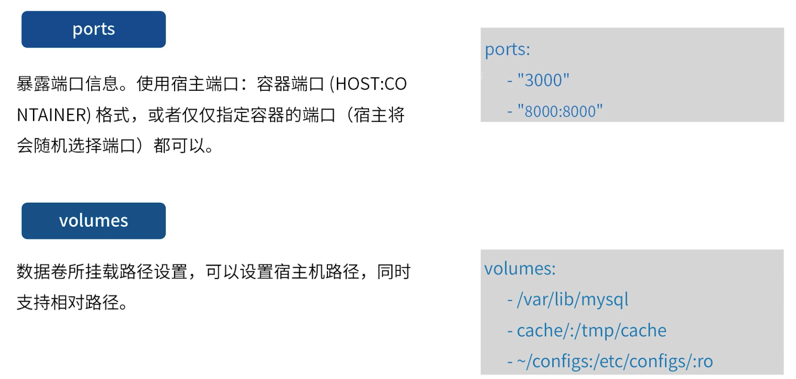

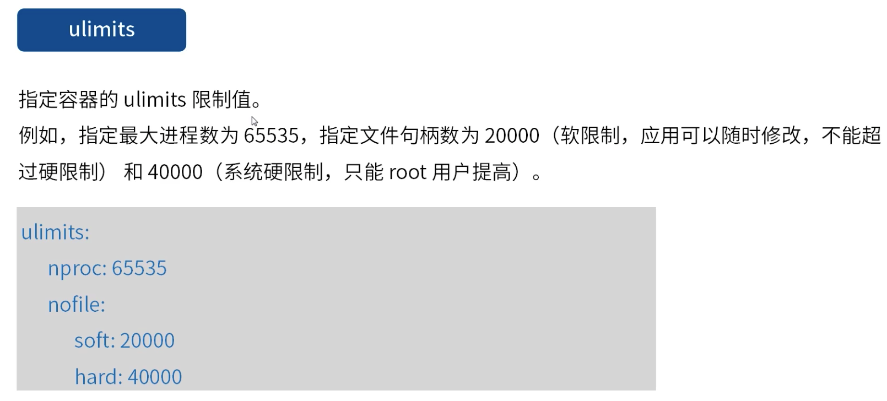

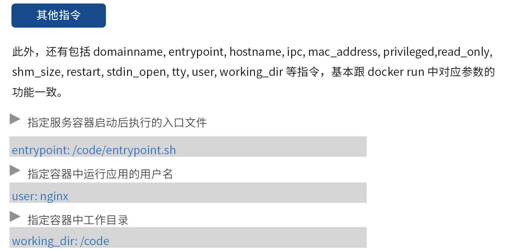

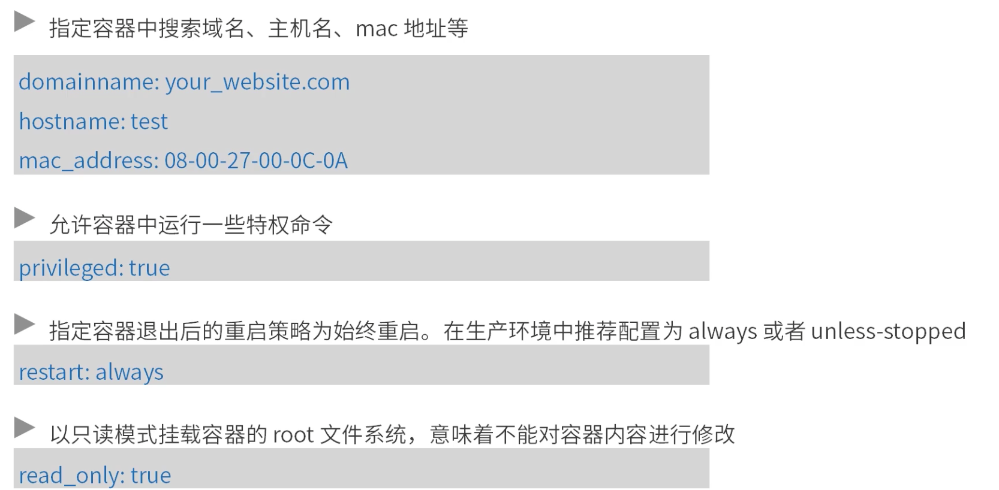

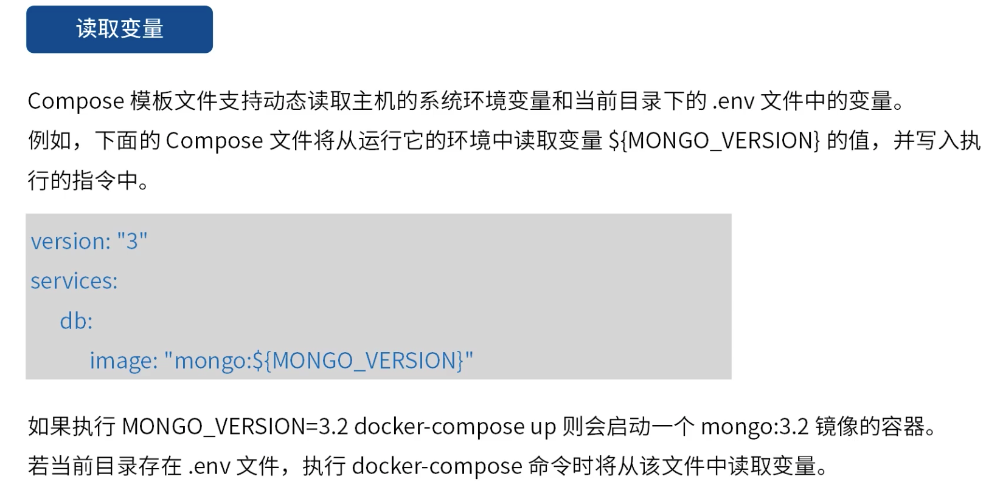

