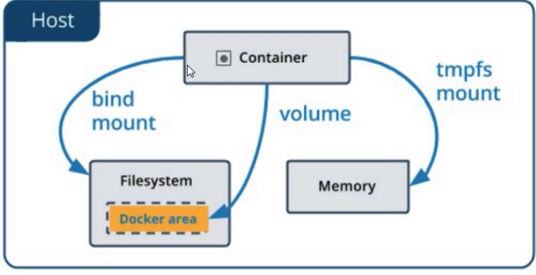

[TOC]

# 数据挂载

### Docker 数据管理

1. 在容器中管理数据主要有两种方式。

   * 数据卷。
   * 挂载主机目录。

   

### 数据卷

1. 数据卷是一个可供一个或多个容器使用的特殊目录，它绕过UFS，可以提供很多有用的特性：

   * 数据卷可以在容器之间共享和重用。
   * 对数据卷的修改会立马生效。
   * 对数据卷的更新，不会影响镜像。
   * 数据卷默认会一值存在，即使容器被删除。

   数据卷的使用，类似与Linux下对目录或文件进行mount，镜像中的被指定为挂载点的目录中的文件会隐藏掉，能显示看的是挂载的数据卷。

2. Docker提供了两种挂载方式，-v和-mount，这两种方式该如何选择呢。Docker新用户应该选择- -mount参数，经验丰富的Docker使用者对-v或者- -volume已经和熟悉了，但是推荐使用- -mount参数。

3. 创建一个数据卷。

   ```java
   docker volume create my-volume
   ```

4. 查看所有的数据卷。

   ```java
   docker volume ls
   ```

5. 查看指定数据卷的信息。

   ```java
   docker volume inspect my-volume
   ```

   ```java
   zhudeMacBook-Pro:seniorjava zhu$ docker volume create test
   test
   zhudeMacBook-Pro:seniorjava zhu$ docker volume ls
   DRIVER              VOLUME NAME
   local               d923c579192704a62180f18386477103af3533b0a3868818ebec5b1b9caac481
   local               test
   zhudeMacBook-Pro:seniorjava zhu$ docker volume inspect test
   [
       {
           "CreatedAt": "2019-08-10T02:12:03Z",
           "Driver": "local",
           "Labels": {},
           "Mountpoint": "/var/lib/docker/volumes/test/_data",
           "Name": "test",
           "Options": {},
           "Scope": "local"
       }
   ]
   zhudeMacBook-Pro:seniorjava zhu$ 
   ```

6. 启动一个挂载数据卷的容器。

   在用docker run命令的时候，使用- -mount标记来将数据卷挂载到容器里。在一次docker run中可以挂载多个数据卷。

7. 创建一个名为session-web的容器，并加载一个数据卷到容器的/webapp目录。

   ```java
   docker run --name session-web -d -p 8888:8080 --mount source=my-volume,target=/webapp session-web:latest
   # -v my-volume:/webapp
   ```

8. 删除数据卷。

   ```java
   docker volume rm my-volume
   ```

   数据卷是被设计用来持久化数据的，它的生命周期独立于容器，Docker不会在容器被删除后自动删除数据卷，并且也不存在垃圾回收这样的机制来处理没有任何容器引用的数据卷。如果需要在删除容器的同时移除数据卷。可以在删除容器的时候使用docker rm -v这个命令。

9. 无主的数据卷可能会占据很多空间，要清理使用以下命令。

   ```java
   docker volume prune
   ```

### 挂载主机目录

1. 使用- -mount标记可以指定挂载一个本地主机的目录到容器中去。

   ```java
   docker run --name session-web -d -p 8888:8080 --mount type=bind,source=/src/webapp,target=/opt/webapp session-web:latest
   # -v my-volume:/webapp
   ```

   上面的命令加载主机/src/webapp目录到容器的/opt/webapp目录。这个功能在进行测试的时候十分方便，比如用户可以放置一些程序到本地目录中，来查看容器是否正常工作。

   本地目录的路径必须是绝对路径。以前使用-v参数如果本地目录不存在Docker会自动为你创建一个文件夹。现在使用- -mount参数时如果本地目录不存在，Docker会报错。Docker挂载主机目录的默认权限时读写，用户也可以通过readonly指定为只读。

2. —mount标记也可以从主机挂载单个文件到容器中。

   ```java
   docker run --rm -it --mount type=bind,source=$HOME/.bash_hostory,target=/root/.bash_history ubuntu:17.0 bash
   # -v $HOME/.bash_hoistory:/root/.bash_history
   ```

   这样就可以记录在容器中输入过的命令了。