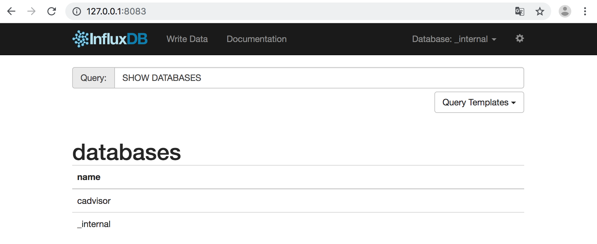
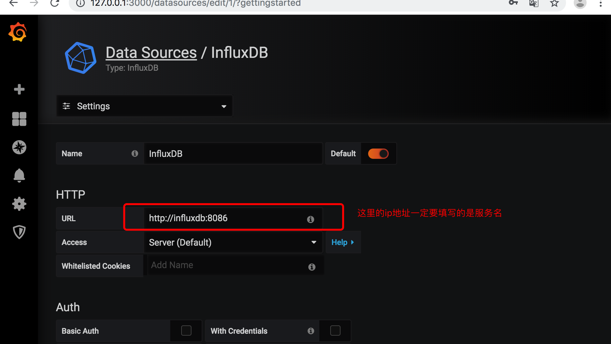
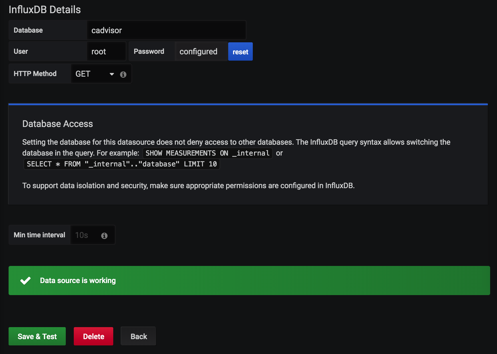
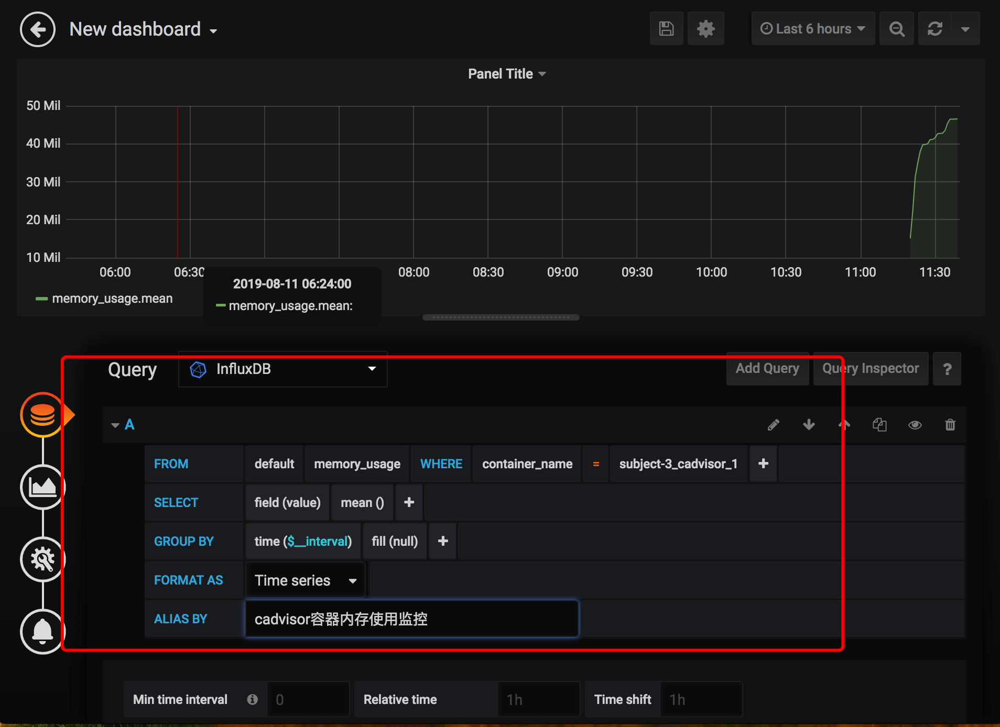
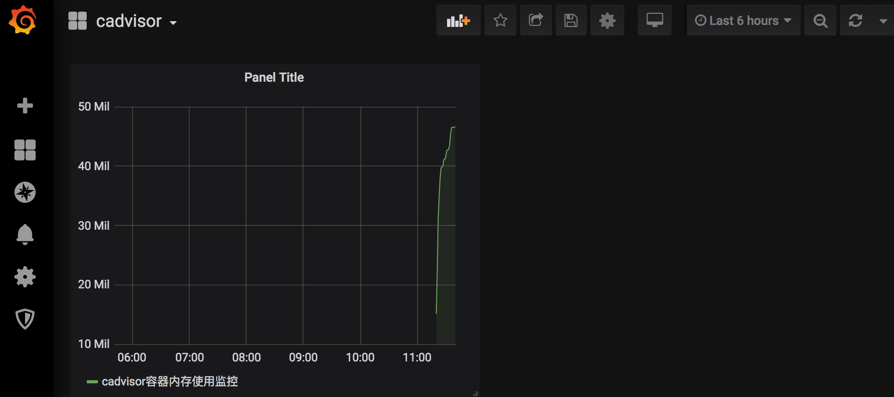
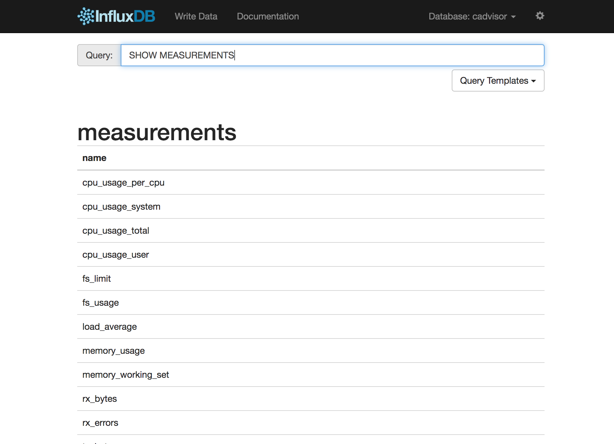
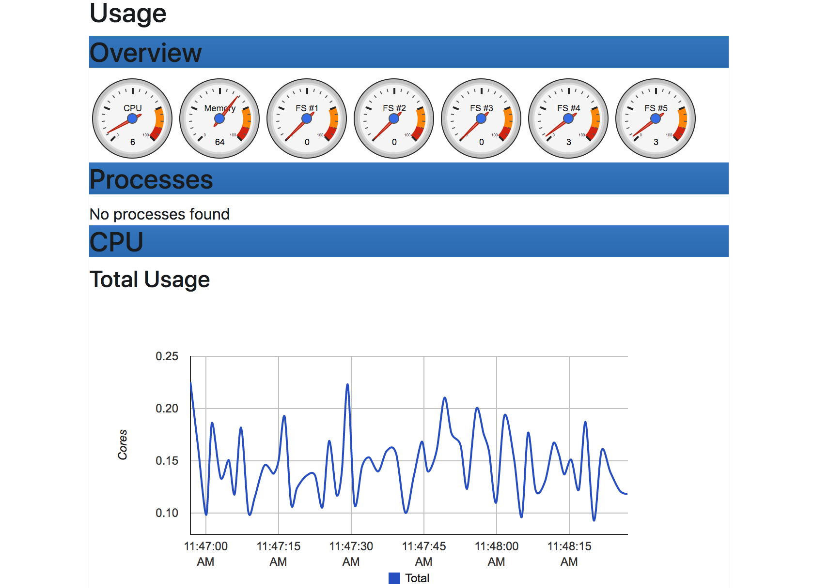
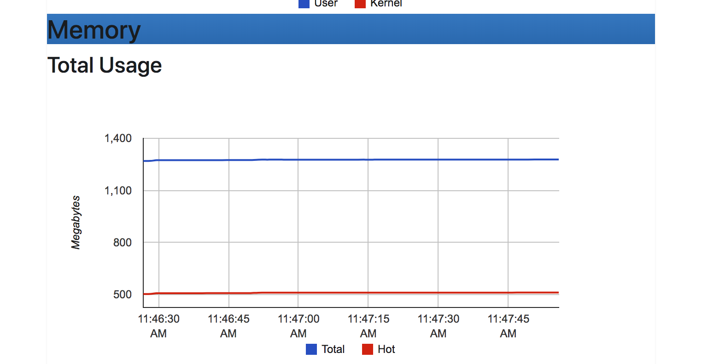

[TOC]

# 容器监控

### 概述

使用docker compose组合应用并利用scale快速对容器进行扩容。由于docker compose启动的服务都在同一台宿主机上，对于一个宿主机上运行多个容器应用时，容器的运行情况如：CPU使用率，内存使用率，网络状态，磁盘空间等一系列随时间变化的时序数据信息，都是需要需了解的，因此监控是必须的。

### 容器监控方案选择

1. 对于容器的监控方案可谓多种多样，本身自带命令docker stats命令，Scout，Data Dog，Sysdig Cloud，Sensu Monitoring Framework，CAdvisor等。

2. 通过docker stats命令可以很方便的看到当前宿主机上所有容器的CPU，内存以及网络流量等数据。但是docker stats命令的缺点就是统计的只是当前宿主机的所有容器，而获取的监控数据是实时的，没有地方存储，也没有告警功能。

   
   
3. 而Scout，Sysdig Cloud，Data Dog虽然都提供了较完善的服务，但是它们都是托管的服务而且都收费，Sensu Monitoring Framework集成度较高，也免费，但是部署过于复杂。综合考虑，我们选择了CAdvisor做容器监控工具。

4. CAdvisor谷歌出品，有点是开源，监控指标齐全，部署方便，而且由官方的docker镜像。缺点时集成度不高，默认只在本地保存2分钟数据。不过可以加上InfluxDB存储数据，对接Grafana展示图表，比较便利地搭建好容器监控系统，数据收集和图表展示效果良好，对系统性能几乎没有什么影响。

### CAdvisor

1. CAdvisor是一个容器资源监控工具，包括容器的内存，网络IO，磁盘IO等监控，同时提供了一个web页面用于查看容器的实时运行状态。CAdvisor默认存储2分钟的数据，而且只是针对单物理机。不过，CAdvisor提供了很多数据集成接口，支持InfluxDB，Redis，Kafka，Elasticsearch等集成，可以加上对应配置将监控数据发往这些数据库存储起来。
2. CAdvisor功能主要有两点：
   * 展示Host和容器两个层次的监控数据。
   * 展示历史变化数据。

### InfluxDB


1. InfluxDB是用Go语言开发的一个开源分布式时序，事件和指标数据库，无需外部依赖。
2. CAdvisor默认只在本机保存最新两分钟的数据，为了持久化存储数据和统一收集展示监控数据，需要将数据存储到InfluxDB中。InfluxDB是一个时序数据库，专门用于存储时序相关数据，很适合存储CAdvisor的数据。而且，CAdvisor本身已经提供了InfluxDB的集成方法，在启动容器时指定配置即可。
3. 主要功能：
   * 基于时间序列，支持与时间有关的相关函数，如最大，最小，求和等。
   * 可度量性：你可以实时对大量数据进行计算。
   * 基于事件：它支持任意的事件数据。
4. 主要特点：
   * 无结构，无模式。
   * 可以是任意数量的列。
   * 可拓展的。
   * 支持min，max，sum，count，mean，median等一系列函数，方便统计。
   * 原生的HTTP支持，内置HTTP API。
   * 强大的类SQL语法。
   * 自带管理界面，方便使用。

### Granfana

1. Granfana是一个开源的数据监控分析可视化平台，支持多种数据源配置(InfluxDB，MySQL，Elasticsearch，OpenTSDB，Graphite等)和丰富的插件及模版功能，支持图片权限控制和报警。
2. 主要特性：
   * 灵活丰富的图形化选项。
   * 可以混合多种风格。
   * 支持白天和夜间模式。
   * 多个数据源。

### CAdvisor+InfluxDB+Grafana


CAdvisor：负责收集容器的随时间变化的数据。

InfluxDB：负责存储时序数据。

Grafana：负责分析和展示时序数据。

### 安装部署

#### 部署InfluxDB服务

1. 部署InfluxDB服务。

   ```java
   docker run -d --name influxdb -p 8086:8086 -v /data/influxdb:/var/lib/influxdb --hostname=influxdb influxdb
   ```

   说明：

   * —name：启动容器分配名字influxdb。
   * -p：映射端口，8083端口为influxdb管理端口，8086端口是influxdb的数据端口。
   * -v：挂载数据 -d：后台运行此容器。
   * Influxdb：通过这个容器来运行的，默认会在docker官方仓库pull下来。

2. 浏览器访问influxdb管理端，http://ip:8083。

3. 创建test数据库与root用户，这个用于后期配置granfana。

   ```java
   docker exec -it influxdb influx
   
   CREATE DATABASE "test"
   CREATE USER "root" WITH PASSWORD "root" WITH ALL PRIVILEGES
   ```

#### 部署CAdvisor服务

1. 谷歌的cadvisor可以用于手机Docker容器的时序信息，包括容器运行过程中的资源使用情况和性能数据。

   ```java
   docker run --volume=/:/rootfs:ro --volume=/var/run:/var/run:ro --volume=/sys:/sys:ro --volume=/var/lib/docker:/:/var/lib/docker:ro --volume=/dev/disk/:/dev/disk:ro --volume=/cgroup:/cgroup:ro --publish=8080:8080 --detach=true --privilege=true --name=cadvisor google/cadvisor:latest -storage_driver=influxdb -storage_driver_host=influxdb:8086 -storage_driver_db=test -storae_driver_user=root -storage_driver_password=root
   ```

2. 说明。

   * -d：后台运行此容器。
   * —nam：启动容器分配名字advisor。
   * -p：映射端口8080。
   * —mount：把宿主机的相对目录绑定到容器中，这些目录都是cadvisor需要采集的目录文件和监控内容。
   * -storage_driver：需要指定cadvisor的存储驱动，数据库主机，数据库名。

3. 使用http://ip:8080访问。

#### 部署Grafana服务

1. grafana是一款开源的时序数据分析工具，而且界面专业易用。

   ```java
   docker run -d -p 3000:3000 -v /data/grafana:/var/lib/grafana --link=influxdb:influxdb --name grafana grafana/grafana
   ```

   注意：如果使用-v把数据挂载出来会出现容器启动失败，错误为mkdir:cannot create directory '/var/lib/grafana/plugins':Permission denied，此时可以使用docker run —entrypoint "id" grafana/grafana得到pid，pid，groups，默认是472。接着使用chown -R 472:472 /data/grafana修改目录权限就可以启动成功了。

2. 通过http://ip:3000端口访问，默认用户名密码为admin/admin。

### docker-compose快速部署

1. 准备yaml文件。

```yaml
version: '3.1'

volumes:
  grafana_data: {}

services:
 influxdb:
  image: tutum/influxdb:0.9
  #image: tutum/influxdb
  #image: influxdb
  restart: always
  #user: 
  environment:
    - PRE_CREATE_DB=cadvisor
  ports:
    - "8083:8083"
    - "8086:8086"
  expose:
    - "8090"
    - "8099"
  volumes:
    - /learnRes/influxdb:/data

 cadvisor:
  #image: google/cadvisor:v0.29.0
  image: google/cadvisor
  links:
    - influxdb:influxsrv
  command: -storage_driver=influxdb -storage_driver_db=cadvisor -storage_driver_host=influxsrv:8086
  restart: always
  ports:
    - "8080:8080"
  volumes:
    - /:/rootfs:ro
    - /var/run:/var/run:rw
    - /sys:/sys:ro
    - /var/lib/docker/:/var/lib/docker:ro

 grafana:
  #image: grafana/grafana:2.6.0
  user: "104"
  image: grafana/grafana
  user: "104"
  #user: "472"
  restart: always
  links:
    - influxdb:influxsrv
  ports:
    - "3000:3000"
  volumes:
    - grafana_data:/var/lib/grafana
  environment:
    - HTTP_USER=admin
    - HTTP_PASS=admin
    - INFLUXDB_HOST=influxsrv
    - INFLUXDB_PORT=8086
    - INFLUXDB_NAME=cadvisor
    - INFLUXDB_USER=root
    - INFLUXDB_PASS=root
```

2. 启动服务。

```java
docker-compose run
Restored session: 2019年 8月11日 星期日 08时23分29秒 CST
# 查看三个服务启动成功。
zhudeMacBook-Pro:~ zhu$ docker ps -a
CONTAINER ID        IMAGE                COMMAND                  CREATED              STATUS                      PORTS                                                                NAMES
2ac8b5b7d19e        google/cadvisor      "/usr/bin/cadvisor -…"   About a minute ago   Up About a minute           0.0.0.0:8080->8080/tcp                                               subject-3_cadvisor_1
4a728d7656a9        grafana/grafana      "/run.sh"                About a minute ago   Up About a minute           0.0.0.0:3000->3000/tcp                                               subject-3_grafana_1
5fcdfdb45e18        tutum/influxdb:0.9   "/run.sh"                About a minute ago   Up About a minute           0.0.0.0:8083->8083/tcp, 8090/tcp, 0.0.0.0:8086->8086/tcp, 8099/tcp   subject-3_influxdb_1
4085a293ac9e        registry             "/entrypoint.sh /etc…"   26 hours ago         Up 3 hours                  0.0.0.0:5000->5000/tcp                                               registry
936cad6f0fc6        f32a97de94e1         "/entrypoint.sh /etc…"   26 hours ago         Exited (2) 26 hours ago                                                                          crazy_nightingale
f0598e3b9db2        nginx:v4             "nginx -g 'daemon of…"   2 days ago           Exited (255) 26 hours ago   0.0.0.0:80->80/tcp                                                   mynginxv4
9e08fc85de49        ubuntu:16.04         "/bin/bash"              3 days ago           Exited (255) 26 hours ago                                                                        epic_turing
zhudeMacBook-Pro:~ zhu$
```

3. 访问grafana。

   
   
4. 配置数据库。

   * 在influxdb上查看数据库。

     

   * 创建influx数据源。

     

     

5. 创建仪表盘。

   

6. 保存仪表盘后。

   

7. 可供监控的指标。

   

8. cadvisor查看监控信息。

   

   

   

   

   