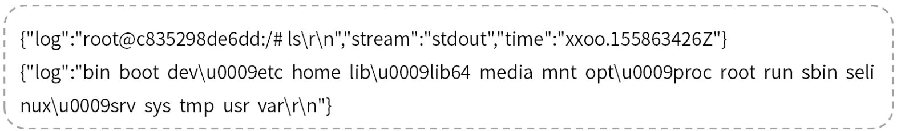
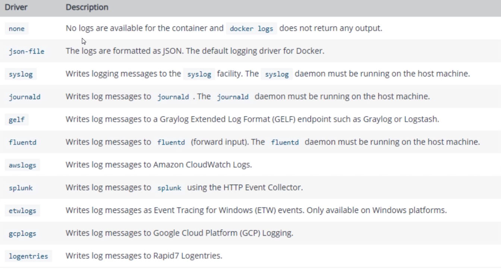
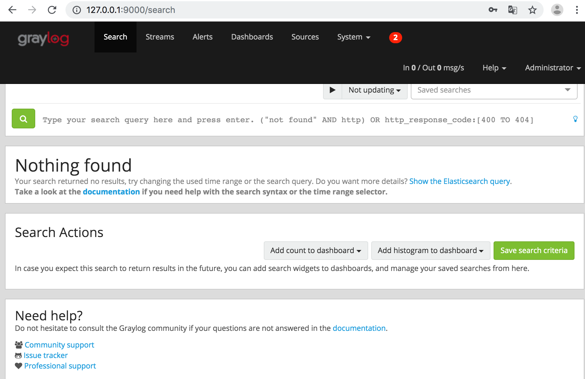
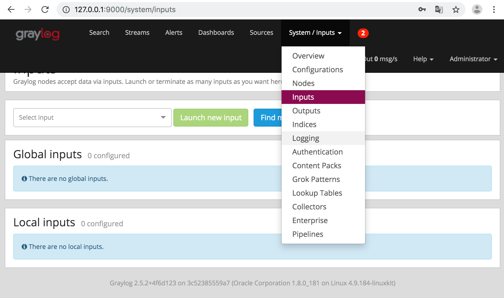
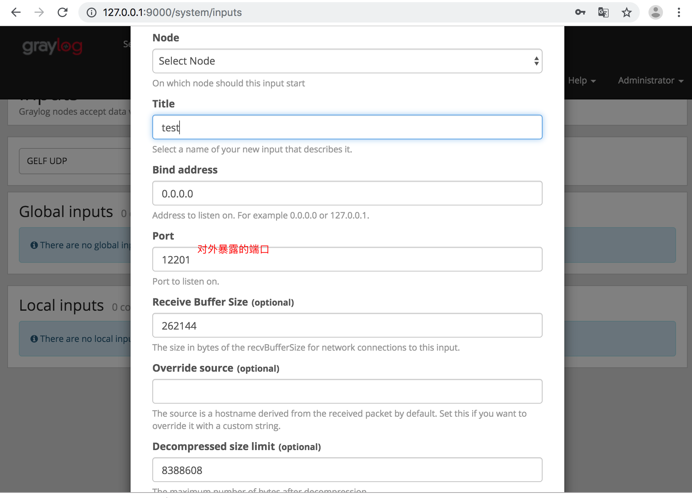
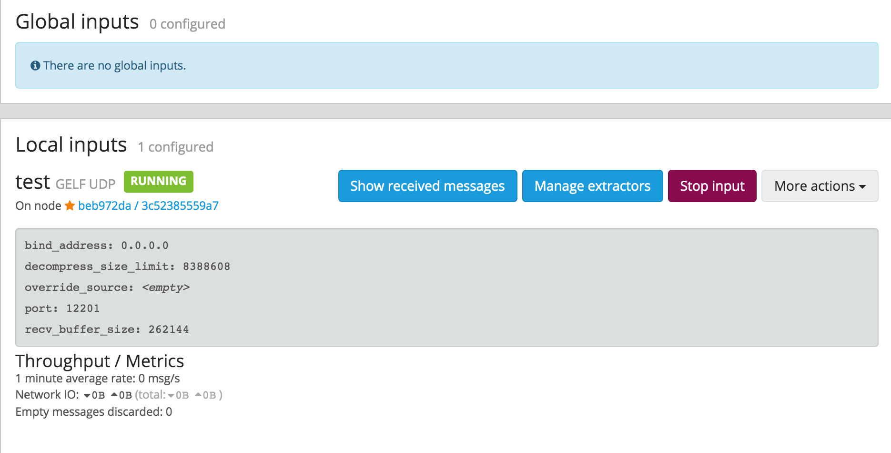

[TOC]

# 日志监控

### Docker日志

Docker默认收集应用程序的标准输出存储到一个json.log文件中，文件的格式类似下面这种：



以一行一个作为一条JSON数据存储。Docker的这种日志存储方式是可以配置的，具体参数可以在执行run启动容器的时候通过log-driver进行配置。

### Docker Logging Driver



Docker默认使用son-file driver作为log driver，而gelf则是我们需要使用log driver。

当容器多了，或者是采用类似swarm集群部署Docker的时候，各种日志分散存在各个json.log文件中，当查找问题或者进行相关统计的时候，分散的日志对我们来说是非常不友好的。我们需要一个能够集中管理Docker日志的工具。

### Graylog部署

1. graylog官方提供了Dockerfile供我们快速的在Docker上部署日志系统，在这个Docker Hub的地址中，也提供了docker-compose.yml来快速部署整个graylog栈，包含了mongoldb，ElasticSearch，而不需要分别单独进行部署。

2. 创建一个目录用来部署graylog，/learnRes/Java/seniorjava/subject-3/graylog。

3. 初始化目录和配置文件。

   ```java
   # 创建数据目录，基于上述根目录
   mkdir -p data
   # 创建配置文件目录
   mkdir config
   # 下载官方配置文件
   wget https://raw.githubusercontent.com/Graylog2/graylog-docker/2.5/config/graylog.conf
   # 日志配置文件
   wget https://raw.githubusercontent.com/Graylog2/graylog-docker/2.5/config/log4j2.xml
   ```

4. 修改下载完成的graylog.conf中的root_timezone为中国时区。

   root_timezone = Asia/Shanghai

5. 新建docker-compose.yaml来供docker-compose快速启动完整服务。

   ```yaml
   version: '2'
   services:
     # MongoDB: https://hub.docker.com/_/mongo/
     mongodb:
       image: mongo:3
       volumes:
         - mongo_data:/data/db
     # Elasticsearch: https://www.elastic.co/guide/en/elasticsearch/reference/6.x/docker.html
     elasticsearch:
       image: elasticsearch:6.5.1
       volumes:
         - es_data:/usr/share/elasticsearch/data
       environment:
         - http.host=0.0.0.0
         - transport.host=localhost
         - network.host=0.0.0.0
         # Disable X-Pack security: https://www.elastic.co/guide/en/elasticsearch/reference/6.x/security-settings.html#general-security-settings
         - xpack.security.enabled=false
         - xpack.watcher.enabled=false
         - xpack.monitoring.enabled=false
         - xpack.security.audit.enabled=false
         - xpack.ml.enabled=false
         - xpack.graph.enabled=false
         - "ES_JAVA_OPTS=-Xms256m -Xmx256m"
       ulimits:
         memlock:
           soft: -1
           hard: -1
       mem_limit: 256M
     # Graylog: https://hub.docker.com/r/graylog/graylog/
     graylog:
       image: graylog/graylog:2.5
       volumes:
         - graylog_journal:/usr/share/graylog/data/journal
         - ./config:/usr/share/graylog/data/config
       environment:
         # CHANGE ME!
         - GRAYLOG_PASSWORD_SECRET=somepasswordpepper
         # Password: admin
         - GRAYLOG_ROOT_PASSWORD_SHA2=8c6976e5b5410415bde908bd4dee15dfb167a9c873fc4bb8a81f6f2ab448a918
         # 这个地址需要配置成你要访问的地址，比如你的容器部署在192.168.1.2，你需要配置成http://192.168.1.2:9000/api，否则访问会报错
         - GRAYLOG_WEB_ENDPOINT_URI=http://127.0.0.1:9000/api
       links:
         - mongodb:mongo
         - elasticsearch
       depends_on:
         - mongodb
         - elasticsearch
       ports:
         # Graylog web interface and REST API
         # web界面端口
         - 9000:9000
         # gelf收集日志的端口，如果需要添加graylog收集器，可以新增暴露出来的端口
         # Syslog TCP
         - 514:514
         # Syslog UDP
         - 514:514/udp
         # GELF TCP
         - 12201:12201
         # GELF UDP
         - 12201:12201/udp
   # Volumes for persisting data, see https://docs.docker.com/engine/admin/volumes/volumes/
   volumes:
     mongo_data:
       driver: local
     es_data:
       driver: local
     graylog_journal:
       driver: local
   ```

   

6. 启动整个服务。

   docker-compose up

   如果没有问题，可以看到graylog webserver started的终端输出消息。访问http://ip:9000会看到graylog的web界面，用户名admin，密码admind等录后台。

   

   ### Graylog系统配置

   1. input配置。

      graylog的日志收集通过定义input对象来完成，在graylogweb管理界面进入input对象配置，选择GELF UDP协议新建一个输入器。

      

      

      成功定义。

      

   2. docker配置。

      如果docker通过命令行启动，可以在run命令中加上如下参数：

      ```java
      docker run --log-driver=gelf --log-opt gelf-address=udp://{graylog服务器地址}:12201 --log-opt tag=<当前容器服务标签，用来供graylog查询的时候进行分类><IMAGE><运行命令>
      
      ```

      ```shell
      docker run -d --log-driver=gelf --log-opt gelf-address=udp://localhost:12201 --log-opt tag="{{.ImageName}}/{{.Name}}/{{.ID}}" busybox sh -c 'while true
      do echo "Hello, this is A"
      sleep 10
      done'
      ```

      如果通过docker-compose命令，则可以在docker-compose.yaml中加入相关配置，用nginx容器为例。

      ```yaml
      version: '2'
      services:
       nginx:
        image: nginx:latest
        ports:
          - "80:80"
        logging:
          driver: "gelf"
          options:
            gelf-address: "udp://127.0.0.1:12201"
            tag: front-nginx
      ```

      