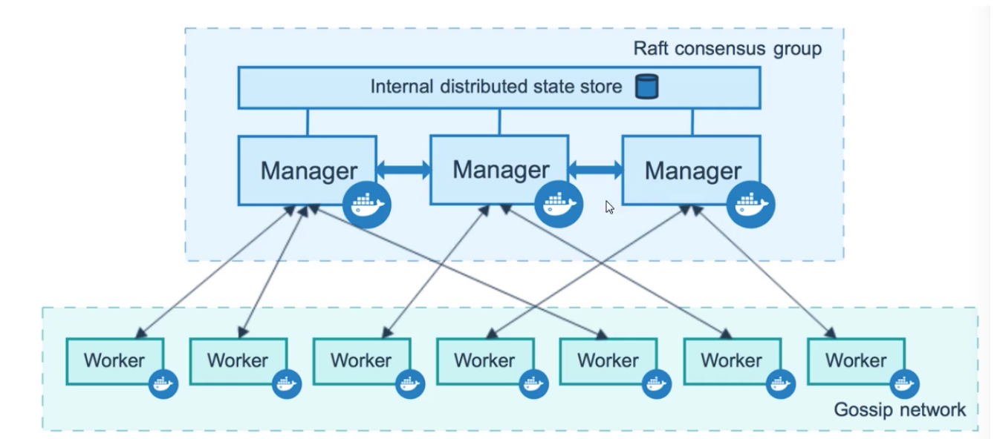
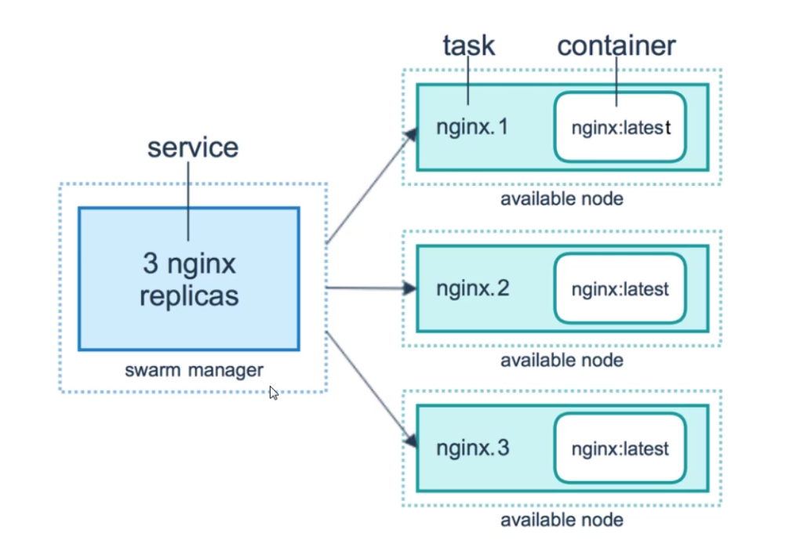
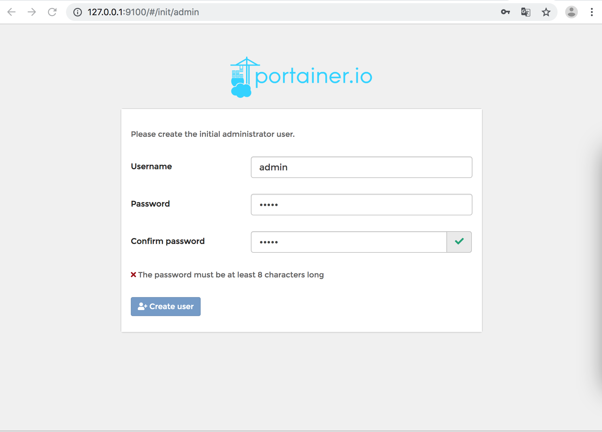

[TOC]

# 资源管理

### Docker Swarm

Docker Swarm是Docker官方三剑客项目之一，提供Docker容器集群服务，是Docker官方对容器云生态进行支持的核心方案。

使用它，用户可以将多个Docker主机封装为单个大型虚拟Docker主机，快速打造一套容器云平台。

注意：Docker 1.12.0+ Swarm mode已经内嵌入Docker引擎，成为了docker的子命令docker swarm，绝大多数用户已经开始使用Swarm mode，Docker引擎API已经删除Docker Swarm。

### 基本概念

Swarm是使用SwarmKit构建的Docker引擎内置(原生)的集群管理和编排工具。

1. 节点。

   运行Docker的主机可以主动初始化一个Swarm集群或者加入一个已存在的Swarm集群，这样这个运行Docker的主机就成为一个Swarm集群的节点。节点分为管理节点和工作节点。管理节点用于Swarm集群的管理，docker swarm命令基本只能在管理节点执行。工作节点是任务执行节点，管理节点将服务下发至工作节点执行。

   

2. 服务和任务。

   任务是Swarm中的最小的调度单位，目前来说就是一个单一的容器。

   服务是指一组任务的集合，服务定义了任务的属性。

   服务有两种模式：

   * replicated services：按照一定规则在各个工作节点上运行指定个数的任务。
   * global services：每个工作节点上运行一个任务。
   * 两种模式通过docker service create的- -model参数指定。

3. 容器，任务，服务的关系。

   

### 创建Swarm集群

了解Swarm集群由管理节点和工作节点组成后，我们来创建一个包含一个管理节点和两个工作节点的最小Swarm集群。

1. 初始化集群。

   使用docker swarm init在本机初始化一个Swarm集群。

   ```java
   docker swarm init --advertise-addr 192.168.1.3
   ```

   如果你的Docker主机有多个网卡，拥有多个IP，必须使用—advertise-addr指定IP。执行docker swarm init命令的节点自动成为管理节点。

2. 增加工作节点。

   在另外两台服务器上执行上一步创建管理节点时输出的加入swarm集群的命令。

   ```java
   docker swarm join --token SWMTKN-1-4tpahrr906vef7dx1oxo3bc985z71neqm2af9a2ggrzeiwqsb8-94g8isglqmkcj8vbjd84ojcm4 192.168.1.3:2377
   ```

3. 查看集群。

   在管理节点上使用docker node ls查看集群。

   ```java
   docker node ls
   ```

4. 新建服务。

   使用docker service命令来管理Swarm集群中的服务，该命令只能在管理节点上运行。

   在创建好的Swarm集群中运行一个名为nginx服务。

   ```java
   docker service create --replicate 3 -p 80:80 --name nginx nginx:latest
   ```

   现在在浏览器输入任意节点IP，即可看到nginx默认页面。

5. 删除服务

   使用docker service rm来从Swarm集群移除某个服务。

   ```java
   docker service rm nginx
   ```

### 资源管理

使用了swarm后没有提供统一入口查看节点的资源使用情况。这个时候我们希望有一个图形化管理工具帮助我们管理swarm集群，portainer就是这样一个工具。

Portainer是Docker的图形化管理工具，提供状态显示面板，应用模版快速部署，容器镜像网络数据卷的基本操作，包括上传镜像，创建容器等操作，事件日志显示，容器控制台操作，Swarm集群和服务等集中管理和操作，登陆用户管理和控制等功能。功能十分全面，基本能满足中小型单位对容器管理的全部需求。

1. Portainer集群运行。

   下载portainer镜像

   ```java
   docker search portainer
   docker pull portainer/portainer
   ```

   安装portainer

   ```java
   docker run -d -p 9100:9000 --name portainer --restart=always -v /var/run/docker.sock:/var/run/docker.sock portainer/portainer
   ```

2. portainer配置。

   

   