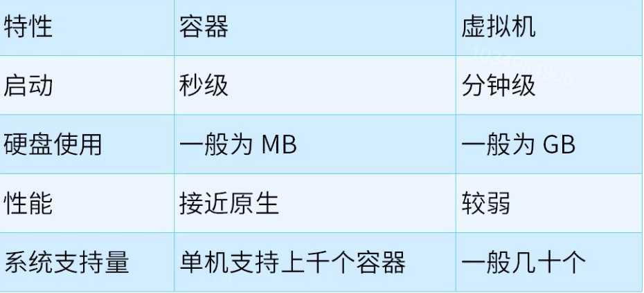
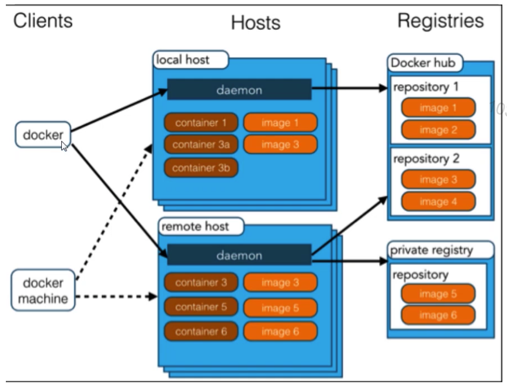
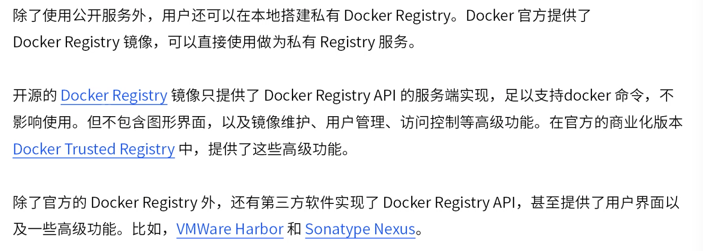

[TOC]

# Docker基础概念

### Docker是什么

1. Docker最初是dotCloud公司创始人Solomon Hykes在法国期间发起的一个公司内部项目，它是基于dotCloud公司多年云服务技术的一次革新，并于2013年3月以Apache 2.0授权协议开源，主要项目代码在GitHub上维护。Docker项目后来还加入了Linux基金会，并成立推动开放容器联盟(OCI)。

2. Docker使用Google公司推出的Go语言进行开发实现，基于Linux内核的group，namespace，以及AUFS类的Union FS等技术，对进程进行封装隔离，属于操作系统层面的虚拟化技术。由于隔离的进程独立于宿主和其它隔离的进程，因此也称其为容器。
3. Docker在容器的基础上，进行了进一步的封装，从文件系统，网络互联到进程隔离等等，极大地简化了容器的创建和维护。使得Docker技术比虚拟机技术更为轻便，快捷。

### Docker和传统虚拟机

1. 传统虚拟机技术是虚拟出一套硬件后，在其上运行一个完整操作系统，在该系统上在运行所需应用进程。
2. 而容器内的应用进程直接运行于宿主的内核，容器内没有自己的内核，而且也没有进行硬件虚拟。因此容器要比传统虚拟机更为轻便。

### 为什么要使用Docker

1. Docker的优势。

   * 更高效的利用系统资源。
   * 更快速的启动时间。
   * 一致的运行环境。
   * 持续交付和部署。
   * 更轻松的迁移。
   * 更轻松的维护和扩展。

2. 对比传统虚拟机总结。

   

### Docker架构

Docker使用客户端-服务器(C/S)架构模式，使用远程API来管理和创建Docker容器。

### Docker基本概念

1. 镜像。

   * 操作系统分为内核和用户空间。对于Linux而言，内核启动后，会挂载root文件系统为其提供用户空间支持。而Docker镜像，就相当于是一个root文件系统。比如官方镜像centos:7.6就包含了完整的一套centos7.6最小系统的root文件系统。
   * Docker镜像是一个特殊的文件系统，除了提供容器运行时所需的程序，库，资源，配置等文件外，还包含了一些为运行时准备的一些配置参数(如匿名卷，环境变量，用户等)。镜像不包含任何动态数据，其内容在构建之后也不会被改变。
   * 因为镜像包含操作系统完整的root文件系统，其体积往往是庞大的，因此在Docker设计时将其设计为分层存储的架构。镜像只是一个虚拟的概念，其实际体现并非由一个文件组成，而是由一组文件系统组成，或者说，由多层文件系统联合组成。
   * 镜像构建时，会一层一层构建，前一层是后一层的基础。每一层构建完就不会再发生改变，后一层上的任何改变只发生在自己这一层。在构建镜像的时候，需要额外小心，每一层尽量只包含该层需要添加的东西，任何额外的东西该在该层构建结束前清理掉。
   * 分层存储的特征还使得镜像的复用，定制变的更为容易。甚至可以用之前构建好的镜像作为基础层，然后进一步添加新的层，以定制自己所需的内容，构建新的镜像。

2. 容器。

   * 镜像和容器的关系，就像Java中类和实例一样，镜像是静态的定义，容器是镜像运行时的实体。容器可以被创建，启动，停止，删除，暂停等。
   * 镜像时分层存储，容器也是如此。每一个容器运行时，是以镜像为基础层，在其上创建一个当前容器的存储层，我们可以称这个为容器运行时读写而准备的存储层为容器存储层。
   * 容器存储层的生存周期和容器一样，容器消亡时，容器存储层也随之消亡。因此，任何保存于容器存储层的信息都会随容器删除而丢失。
   * Docker最佳实践要求，容器不应该向其存储层内写入任何数据，容器存储层要保持无状态化。所有的文件写入操作，都应该使用Volume数据卷，或者绑定宿主目录，在这些位置的读写会跳过容器存储层，直接对宿主(或网络存储)发生读写，其性能和稳定性更高。数据卷的生存周期独立于容器，容器消亡，数据卷也不会消亡。因此，使用数据卷后，容器删除或者重新运行之后，数据不会丢失。

3. 仓库。

   * 镜像构建完成后，可以很容易的在当前宿主机上运行，但是，如果需要在其它服务器上使用这个镜像，我们就需要一个集中存储，分发镜像的服务，Docker Registry就是这样一个服务。

   * 一个Docker Registry中可以包含多个仓库，每个仓库可以包含多个标签，每个标签对应一个镜像。

   * 通常，一个仓库会包含同一个软件不同版本的镜像，而标签就对应于该软件的各个版本。我们可以通过<仓库名>:<标签名>的格式来指定具体是这个软件的哪个版本的镜像。如果不给出标签，将以latest作为默认标签。

   * 以centos镜像为例，centos是镜像的名字，其内含有不同的版本标签，如，6.9，7.5。可以通过centos:6.9，或者centos:7.5来具体指定所需哪个版本的镜像。如果忽略了标签，比如centos，那将视为centos:latest。

   * 仓库名经常以两段路径形式出现，比如study/nginx，前者往往意味着Docker Registry多用户环境下的用户名，后者则往往是对应的软件名。但并非绝对，取决于所使用的具体Docker Registry的软件或服务。

   * Docker Registry公开仓库。

     

   * 私有Docker Registry。

     

     