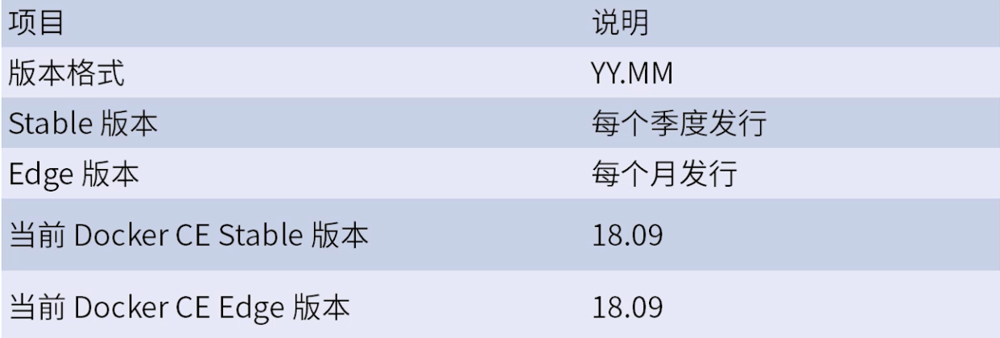
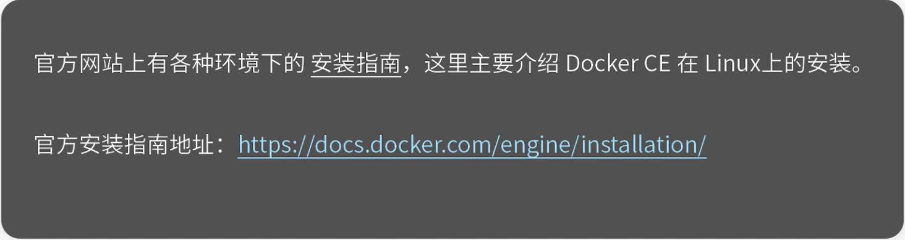
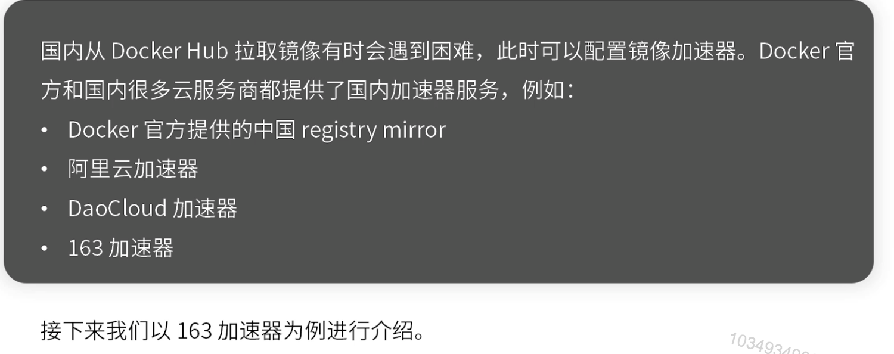
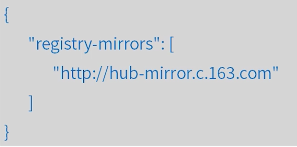
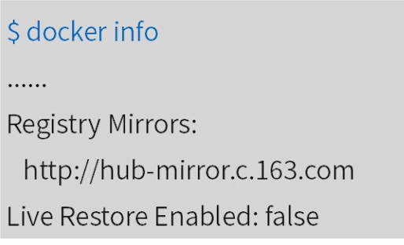
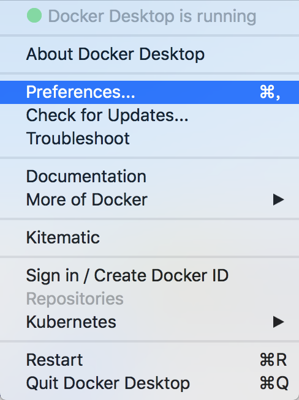
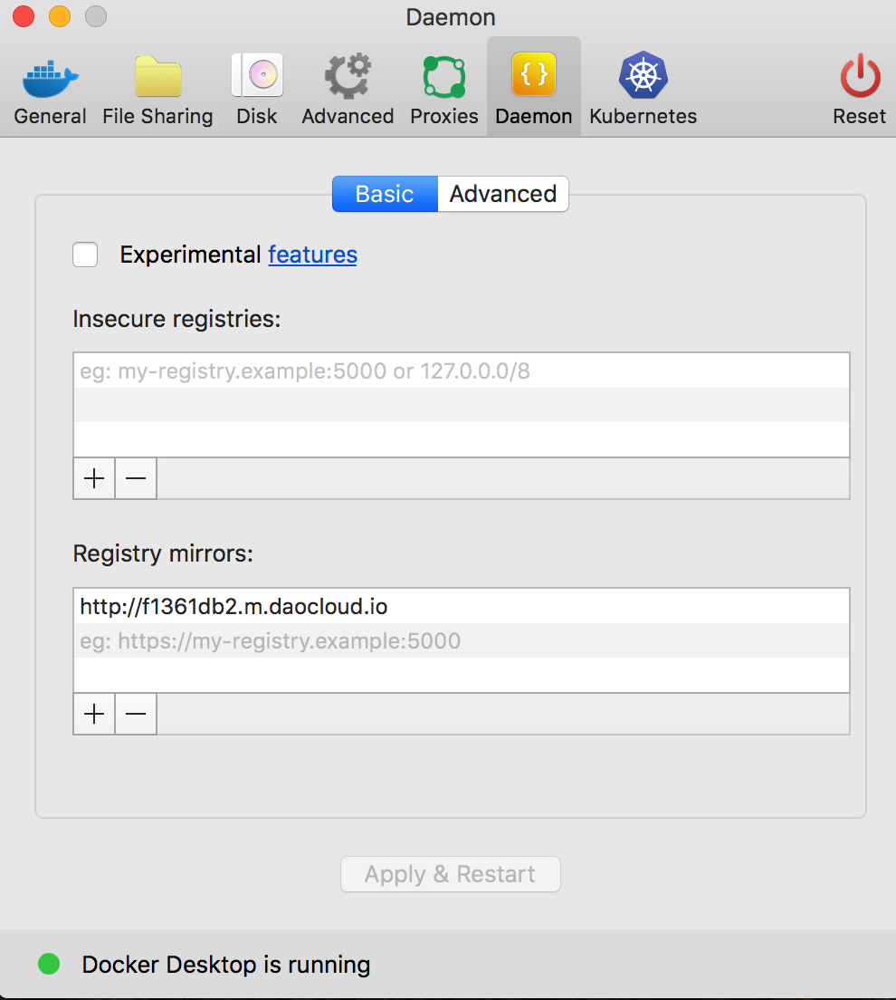
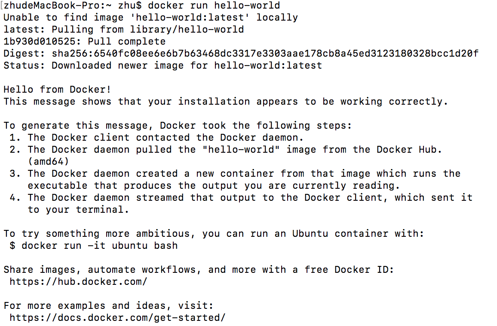

[TOC]

# docker安装

### Docker版本命名

Docker在1.13版本之后，从2017年的3月1日开始，版本命名规则变为如下：



同时Docker划分为CE和EE。CE即社区版(免费，支持周期三个月)，EE即企业版，强调安全，付费使用。

### Docker安装



### CentOS安装Docker

1. 系统要求。

   Docker CE支持64位版本CentOS 7，并且要求内核版本不低于3.10。

2. 卸载旧版本。

   旧版本的Docker称为docker或者docker-engine，使用以下命令卸载旧版本：

   sudo yum remove docker docker-common docker-selinux docker-engine

3. 使用yum安装。

   sudo yum install docker-ce

   注意：如果安装的是centos7 minimal版本，之心安装提示"没有可用软件包"这个时候需要安装必要的软件依赖及更新增加docker-ce yum源。

   ```java
   sudo yum install -y yum-utils device-mapper-persistent-data lvm2
   ```

   ```java
   yum-config-manager --add-repo https://download.docker.com/linux/centos/docker-ce.repo
   ```

4. 使用脚本安装。

   在测试或开发环境中Docker官方为了简化安装流程，提供了一套便捷的安装脚本，CentOS系统上可以使用这套脚本安装。

   curl -fsSL https://get.docker.com -o get-docker.sh

   sudo sh get-docker.sh —mirror Aliyun

   执行这个命令后，脚本就会自动地将一切准备工作做好，并且把Docker CE的Edge版本安装在系统中。

5. 启动Docker CE。

   sudo systemctl enable docker

   sudo systemctl start docker

6. 建立docker用户组。

   默认情况下，docker命令会使用Unix socket与Docker引擎通讯。而只有root用户和docker组的用户才可以访问Docker引擎的Unix socket。一般Linux系统上不会直接使用root用户进行操作。因此，需要将使用docker的用户加入docker用户组。

   sudo groupadd docker

   sudo user mod -aG docker $USER #将当前用户加入docker组

7. 测试Docker是否安装正确。

   docker run hello-world

### CentOS卸载Docker

1. 删除docker安装包。

   sudo remove docker-ce

2. 删除docker镜像。

   sudo rm -rf /var/lib/docker

### 镜像加速器



1. 对于使用systemd的系统，请在/etc/docker/daemon.json中写入如下内容(如果不存在请新建)。

   

2. 重新启动服务生效。

   sudo systemctl daemon-reload

   sudo systemctl restart docker

3. 检查加速器是否生效。

   配置加速器之后，如果拉取镜像仍然十分缓慢，请手动检查加速器配置是否生效，在命令行执行docker info，如果从结果中看到了如下内容，说明配置成功。

   

### mac安装

1. 在网址[http://mirrors.aliyun.com/docker-toolbox/mac/docker-for-mac/](http://mirrors.aliyun.com/docker-toolbox/mac/docker-for-mac/)上下载docker.dmg。

2. 因为国内下载镜像慢，配置镜像加速。

   

   

3. 运行hello-world

   

   