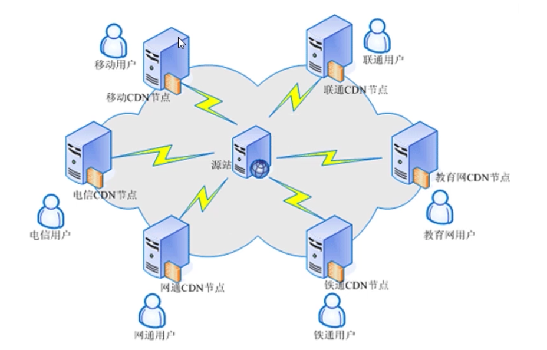
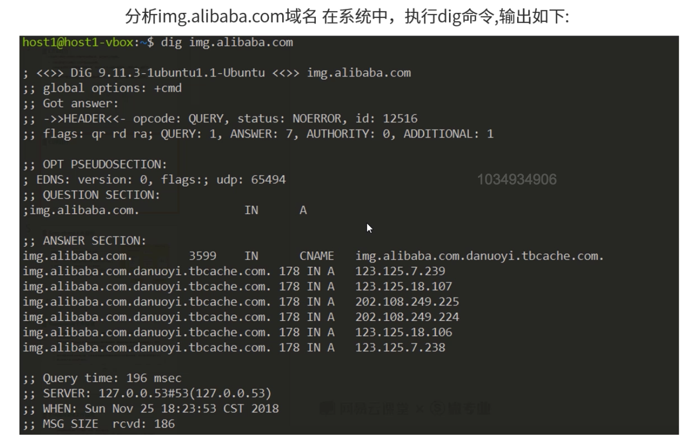
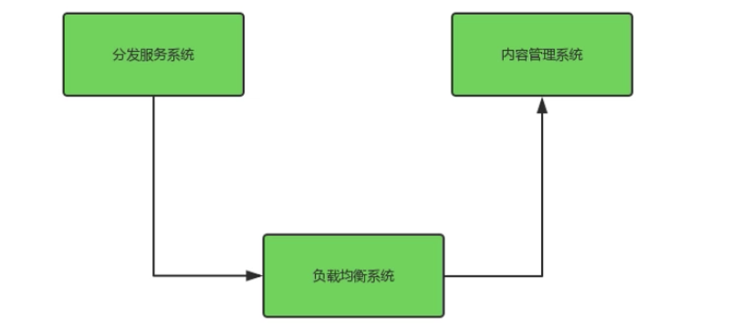
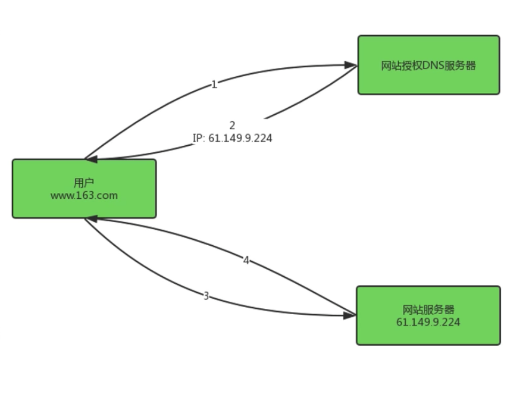
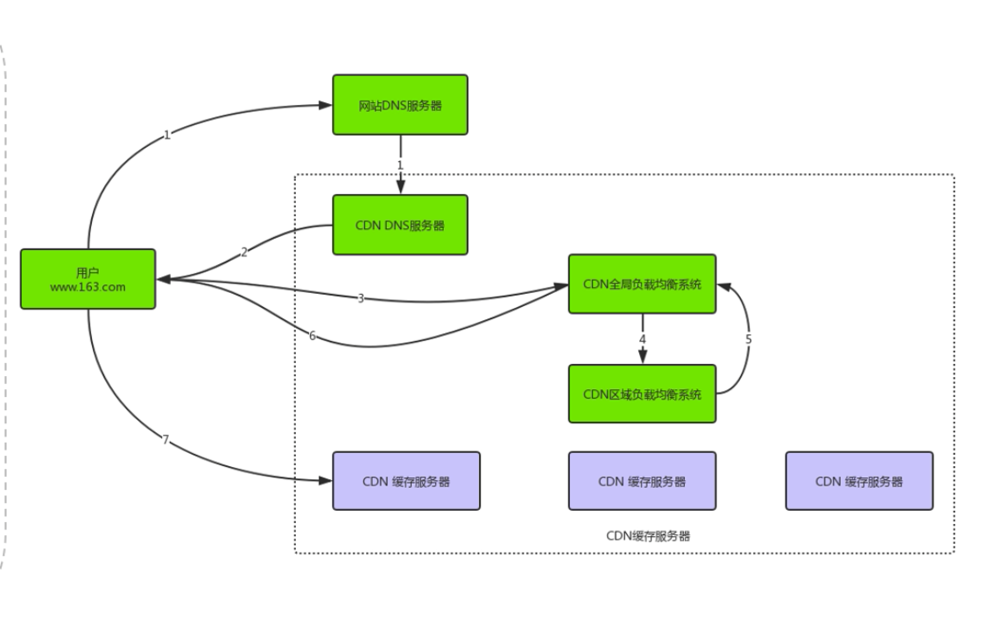

# 使用CDN实现应用的缓存和加速

### CDN简介

1. CDN的全称是Content Delivery Network，即内容分发网络。

   * CDN是构建在网络之上的内容分发网络。
   * CDN使用户就近获取所需内容，降低网络拥塞，提高用户访问响应速度和命中率。
   * CDN依靠部署在各地的边缘服务器，包括中心平台的负载均衡，内容分发，调度等功能模块。

   

   

2. 

### CDN主要特点

1. 本地Cache加速，提高企业站点(尤其含有大量图片和静态也看站点)的访问速度，并大大提高以上性质站点的稳定性。
2. 镜像服务，消除了不同运营商之间互联的瓶颈造成的影响，实现了跨运营商的网络加速，保证不同网络中的用户都能的到良好的访问质量。
3. 远程加速，远程访问用户根据DNS负载均衡技术智能自动选择Cache服务器，选择最快的Cache服务器，加快远程访问的速度。
4. 带宽优化，自动生成服务器的远程Mirror cache服务器，远程用户访问时从cache服务器上读取数据，减少远程访问的带宽，分担网络流量，减轻原站点WEB服务器负载等功能。
5. 集群抗攻击，广泛分布的CDN节点上节点之间的智能冗余机制，可以有效地预防黑客入侵以及降低各种D.D.o.S攻击对网站的影响，同时保证较好的服务质量。

### CND服务模式

内容分发网络是一个经策略部署的整体系统，包括以下3个要件：

1. 分发服务系统，最基本的工作单元就是Cache设备，cache(边缘cache)负责直接响应最终用户的访问请求，把缓存在本地的内容快速地提供给用户。同时cache还负责与源站点进行内容同步，把更新的内容以及本地没有的内容从源站点获取并保存在本地。Cache设备的数量，规模，总服务能力是衡量一个CDN系统服务能力的最基本的指标。

2. 负载均衡系统，主要功能是负责对所有发起服务请求的用户进行访问调度，确定提供给用户的最终实际访问地址。两级调度体系分为全局负载均衡和本地负载均衡。GSLB主要根据用户就近性原则，通过对每个服务节点进行"最优"判断，确定向用户提供服务的cache的物理位置。SLB主要负责节点内部的设备负载均衡。

3. 运行管理系统，分为运营管理和网络管理子系统，负责处理业务层面的与外界系统交互所必须的收集，整理，交付工作，包含客户管理，产品管理，计费管理，统计分析等功能。

   

### CDN工作流程

1. 常规Web请求处理流程

   * 用户在自己的浏览器中输入要访问的网站域名。
   * 浏览器向本地DNS服务器请求对该域名的解析。
   * 本地DNS服务器中如果缓存有这个域名的解析结果，则直接响应用户的解析请求。
   * 本地DNS服务器中如果没有关于这个域名的解析结果的缓存，则以递归方式向整个DNS系统请求解析，获得应答后将结果反馈给浏览器。
   * 浏览器得到域名解析结果，就是该域名相应的服务设备的IP地址。
   * 浏览器向服务器请求内容。
   * 服务器将用户请求内容传送给浏览器。

   

2. 引入CDN后Web请求处理流程。

   * 当用户点击网站页面的内容URL，经过本地DNS系统解析，DNS系统会最终将域名的解析交给CNAME指向的CDN专用DNS服务器。
   * CDN的DNS服务器将CDN的全局负载均衡设备IP地址返回用户。
   * 用户向CDN的全局负载均衡设备发起内容URL访问请求。
   * CDN全局负载均衡设备根据用户IP地址，及用户请求内容URIL，选择一台用户所属区域负载均衡设备，让用户向这台设备发起请求。
   * 区域负载均衡设备会为用户选择一台合适的缓存服务器提供服务。
   * 用户向缓存服务器发起请求，缓存服务器响应用户请求，将用户所需内容传送到用户终端。
   * 如果这台缓存服务器上并没有用户想要的内容，那么这台服务器就要向它的上一级缓存服务器请求内容，直至追溯到网站的源服务器将内容拉到本地。

   

### CDN关键技术

1. 缓存算法。

   * 缓存代理软件：Squid。
   * 缓存算法决定命中率，源服务器压力，FTP节点存储能力。

2. 分发能力。

   * 分发能力取决于IDC(互联网数据中心)能力和IDC策略性分布。

3. 负载均衡。

   * 负载均衡软件：Nginx。
   * 负载均衡决定最佳路由，响应时间，可用性，服务质量。

4. 基于DNS。

   DNS服务器软件：BIND。

   * 基于DNS的负载均衡以CNAME实现域名中转，智取最优节点服务。
   * 缓存点有客户端浏览器缓存，本地DNS服务器缓存。
   * 缓存内容有DNS地址缓存，客户请求内容缓存，动态内容缓存。

5. 支持协议。

   * 支持如静动态加速(图片加速，https带证书加速)，下载加速，流媒体加速，企业应用加速，手机应用加速。